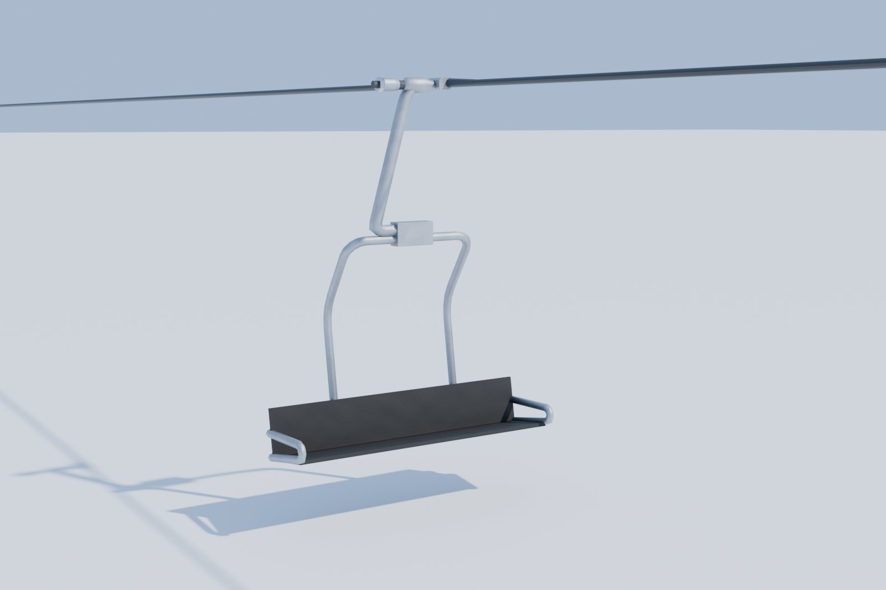
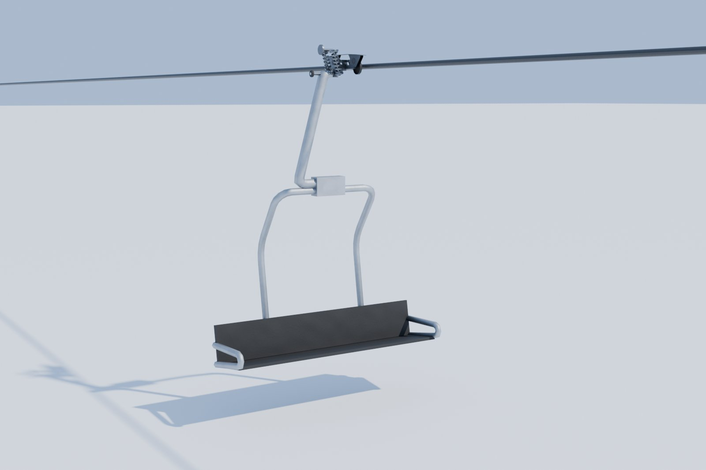
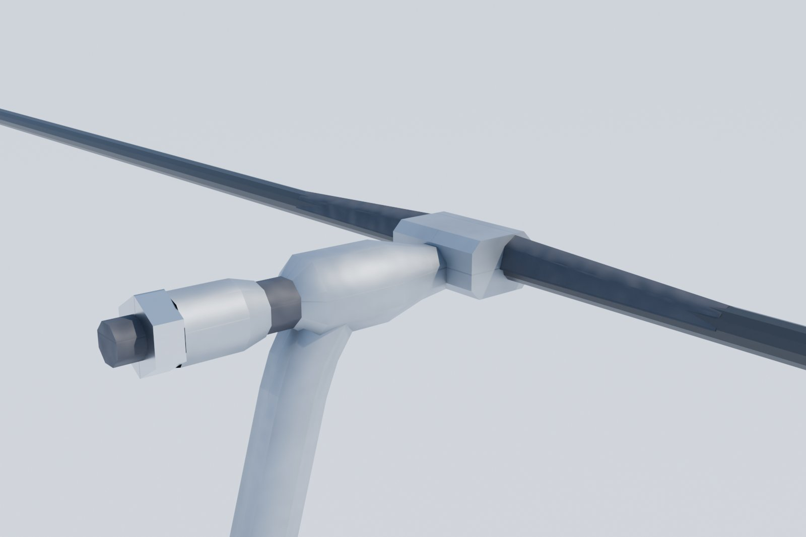
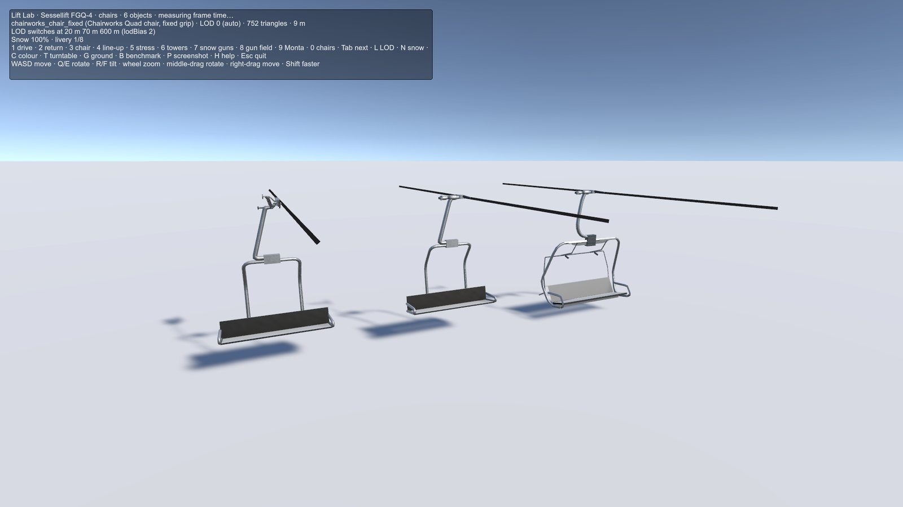

# Chairworks quad chair and the fixed grip

**Audience:** the project owner and coding agents. **Status:** models approved by the owner; in Unity in this PR
(Gate 3). **Date:** 2026-09-29. **Decisions:** LP2 (amended) and LP21-LP23 in
[phase0-decisions.md](phase0-decisions.md). Built with the [lift asset pipeline](../../tools/assets/lifts/README.md).

**What it is:** a second quad chair, from our fictional American maker code-named **Chairworks**, after the owner's
own 3D reference model (measured locally, never named); and one fixed grip that every fixed-grip chair shares, the
Sessellift chair's included.

## The chair

| Asset | Triangles (LOD0/1/2) | What it is |
|---|---|---|
| **Detachable grip** (`chairworks_chair_detach`) | 1,596 / 248 / 56 | The body with the detachable grip, part by part: the jaw block; the carriage (arched top plate, webs, axle bar) with its running wheels; two coil springs; the lever; the arm and the roller. The hanger narrows into the arm through a cast reducer |
| **Fixed grip** (`chairworks_chair_fixed`) | 752 / 186 / 56 | The same body with the fixed grip |

- **One body** (LP21): the hanger's dogleg into a clamp on the top bar; two inboard side frames between seats 1|2
  and 3|4, bent tube with 300 mm knees behind the backrest and 120 mm corners at the top bar; a looped seat
  frame; a bench tilted up to the front and a low backrest.
- **Tubes as the Sessellift chair's:** hanger Ø80, frame Ø60, seat rails Ø52.
- **No safety bar for now** (LP23): see [The safety bar](#the-safety-bar) below.

## The fixed grip (LP22)

One design for every fixed-grip chair (`fixed_grip.json`, `parts.fixed_grip`), after the owner's drawings and
in-service photos: the jaw block on the rope with long tapered tails, dark blades arched over the top half of the
rope, a cast arm and housing in the hanger's silver, then a dark collar, the spring, the nut and a dark bolt end.
The hanger flows out of the housing through a socket that shares the tube's first ring, so there is no seam.
The Sessellift chair carries it too (984 / 246 / 60 triangles).

**Budget (LP2, amended):** up close a chair may use 1,600 triangles (it was 800), so the grips can be modelled.
LOD1 and LOD2 stay 250 and 60, and they are what most chairs on a line draw.

## The safety bar

The owner asked for the Sessellift chair's safety bar on the fixed-grip chair. The Sessellift chair rests its
bar behind the seat, inside side frames at the chair's ends. The owner wanted it "modeled up like the Sessellift
model but in front of the hanger assembly". Three independent agents, reviewed adversarially, found no compact way
to do that on this chair:
- The rope is under 1 m above the top bar.
- At support towers the sheaves reach about 430 mm below the rope.
- A bar that closes over riders reaches about 1.85 m from its hinge to its footrest.

So every raised pose in front sticks out forward, 0.9 to 2 m. The owner's red line matched the bar's closed pose
instead. The owner chose no bar for now (LP23). The options for later: modelled down in front; up with the footrest
forward on new brackets; or behind the seat, tucked in.

## In Unity

- **Import:** `demo.bat` 22 imports both Chairworks chairs; the Sessellift chair's prefab updates with its new grip.
- **Lift Lab** (`demo.bat` 23), key 0: the Sessellift chair and both Chairworks chairs side by side on the rope.

## Performance

The Lift Lab benchmark, the median of three release runs at 1920 × 1080 on the reference PC (an NVIDIA GeForce
RTX 3060 Ti, PC quality, lodBias 2):

| Scene | p50 | p95 | p99 | Batches | SetPass | Triangles |
|---|---|---|---|---|---|---|
| Empty (snow plane, sky) | 0.57 ms | 0.73 ms | 0.79 ms | 8 | 8 | 2,085 |
| **Chairs** (key 0: the three chairs up close) | 0.65 ms | **0.84 ms** | 0.96 ms | 17 | 13 | 4,130 |
| Stress (20 lifts with towers, about 500 Sessellift chairs with the new grip) | 0.84 ms | 1.09 ms | 1.39 ms | 705 | 27 | 228,920 |

The stress scene's chairs all carry the new grip; it stays at 1.09 ms p95, against the 20 ms frame budget.

## Review record

| Round | Owner direction | Result |
|---|---|---|
| 1 | Recreate the chair after the reference, with either grip | Gate 1 recreation with both grips |
| 2 | The fixed grip from the photos: the long jaw tails; flow into the carrier arm; no inboard knob; blades over the top half of the rope; a natural joint; "reference the photos again" | The shared fixed grip. "Chair grips approved" |
| 3 | Tube sizes to match the Sessellift chair | Hanger 80, frame 60, seat rails 52 |
| 4 | The Sessellift safety bar on the fixed-grip chair; a bend radius behind the backrest | The bar resting behind the seat ("the wrong place"); 250 mm knees |
| 5 | Marked-up frame bends; the bar in front of the hanger | Knees 500 ("far too big"), 375, then 300 (the owner's pick); 120 mm corners; the bar raised in front ("think harder") |
| 6 | Adversarial agents to place the bar | No compact raised pose in front; the owner chose no bar for now |
| 7 | "All approved, move all to next gate" | Into Unity (this PR) |

## Retrospective

- **Check a borrowed part against its new host.** The Sessellift bar's resting pose depends on that chair's frame.
  Before placing it on another chair, check it against the riders, the rope and the tower sheaves; that would have
  saved two rounds.
- **Show taste choices side by side.** The knee radius took four rounds, one value at a time. Three values in one
  image would have taken one.
- **Adversarial agents converge fast on geometry.** Three proposers with different lenses (real mechanisms, the
  owner's red line, fresh eyes) reached the same constraint independently. That made the decision the owner's to
  take, rather than another guess.
