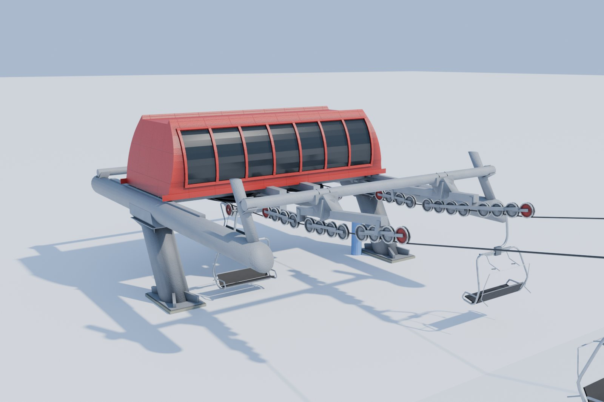
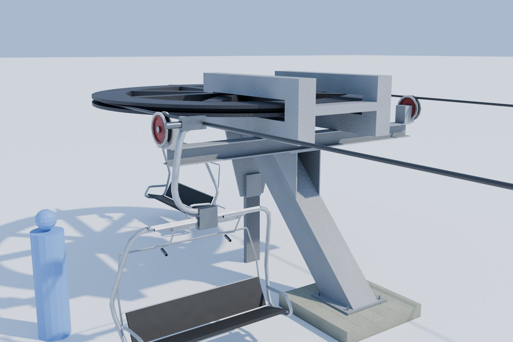
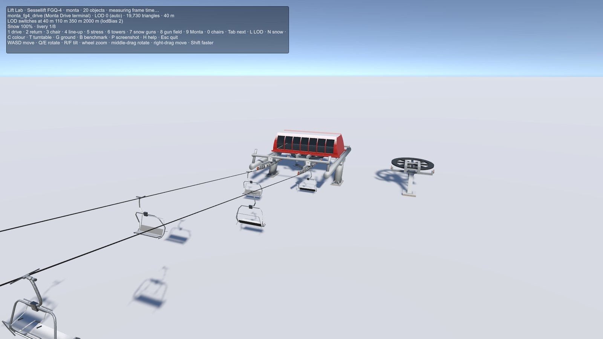

# Monta FG4 terminals

**Audience:** the project owner and coding agents. **Status:** models approved by the owner (Gates 1 and 2); in
Unity in this PR (Gate 3). **Date:** 2026-09-29. **Decisions:** LP20 in [phase0-decisions.md](phase0-decisions.md).
Built with the [lift asset pipeline](../../tools/assets/lifts/README.md).

**What it is:** a second terminal pair, from our fictional French maker code-named **Monta**: a fixed-grip lift
whose drive is at the bottom. The owner's own 3D reference model of a whole lift gave the layout and dimensions.
The model stays local and unnamed; we measured it and built our own. The lift carries the Sessellift quad chair.

## The terminals

| Asset | Triangles (LOD0/1/2/3) | What it is |
|---|---|---|
| **Drive terminal** (`monta_fg4_drive`) | 19,730 / 9,514 / 2,074 / 418 | The bottom (loading) station: twin tubular booms, a ribbed rounded hood with a window band over the bullwheel, inclined legs on two piers, and our sheave trains. The rope leaves climbing over a hold-down row |
| **Return terminal** (`monta_fg4_return`) | 3,640 / 1,824 / 948 / 364 | The top station: an exposed bullwheel on an H-section column and a diagonal strut, with a cross arm and deflection sheaves |

- **Bottom drive:** the drive loads (`chair_load`) and the return unloads (`chair_unload`). Loaded chairs still
  ride up the right rope.
- **Origin:** on the bullwheel's axle at grade, +Z toward the line. The Sessellift terminals' origin is on their
  pier instead.
- **Rope:** the line gauge is 4,895 mm. Both terminals were lowered to the Sessellift chair's rope height,
  3,039 mm, by cutting their diagonal members at the same angles (the drive's leaning legs, the return's strut and
  column). The lift carries that chair unchanged.
- **Footings:** 2.5 m below grade (LP7). This gate carried the return's two pads down to match; nothing changed
  above grade.
- **Livery:** the drive's hood takes the player's colour (LP5); its glass is tinted over a dark lining (LP8).

## In Unity

- **Import:** `demo.bat` 22 builds the Monta with everything else and imports it. The spec's `catalog` names the
  maker and each terminal, so the Lab shows "Monta Drive terminal".
- **Lift Lab** (`demo.bat` 23), key 9: the Monta at work. Its drive is the bottom station, with the rope climbing
  out up the line and Sessellift chairs on it; the return stands beside it.
- **Tests:** the lift tests check each terminal against its own maker's spec (for the Monta, a 4,895 mm gauge and
  a 3,039 mm rope), and accept a bullwheel on the origin.

## Performance

The Lift Lab benchmark, the median of three release runs at 1920 × 1080 on the reference PC (an NVIDIA GeForce
RTX 3060 Ti, PC quality, lodBias 2):

| Scene | p50 | p95 | p99 | Batches | SetPass | Triangles |
|---|---|---|---|---|---|---|
| Empty (snow plane, sky) | 0.57 ms | 0.73 ms | 0.79 ms | 8 | 8 | 2,085 |
| **Monta** (key 9: both terminals, 100 m of line with chairs) | 0.71 ms | **0.93 ms** | 1.02 ms | 106 | 15 | 43,243 |

The Monta costs 0.20 ms at p95 over the empty scene, against the 20 ms frame budget.

## Review record

| Round | Owner direction | Result |
|---|---|---|
| Gate 1 | Recreate both terminals from the reference model | Blockouts, then the terminals measured part by part. Approved ("continue please, work looks great") |
| Gate 2 | Detail and photos | The hood's window band after the owner's photos of these terminals; photos at the lift's own rope |
| - | One chair everywhere | Both terminals lowered to the Sessellift chair's rope; the Monta's own chair withdrawn |
| Gate 3 | "All approved, move all to next gate" | Into Unity (this PR); the return's footings carried down to LP7 |

## Retrospective

- **Decide the origin per maker up front.** The reference's origin (the wheel's axle) came through into the asset,
  while the tests assumed the Sessellift's (the pier). The tests now allow both. A new maker should state its
  origin convention at Gate 1.
- **Lower a terminal by cutting its diagonals.** Cutting the leaning members at their own angles kept the look
  and matched the chair's rope. Scaling the terminal would have changed every part.
