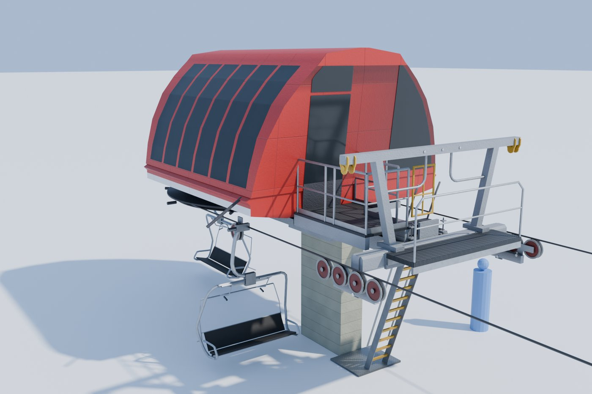
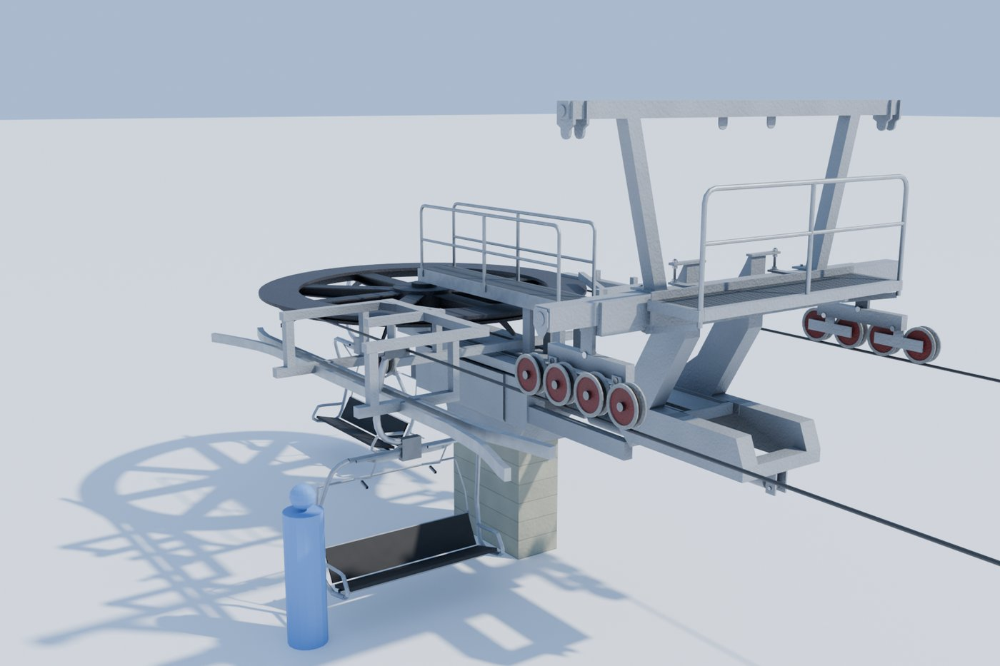
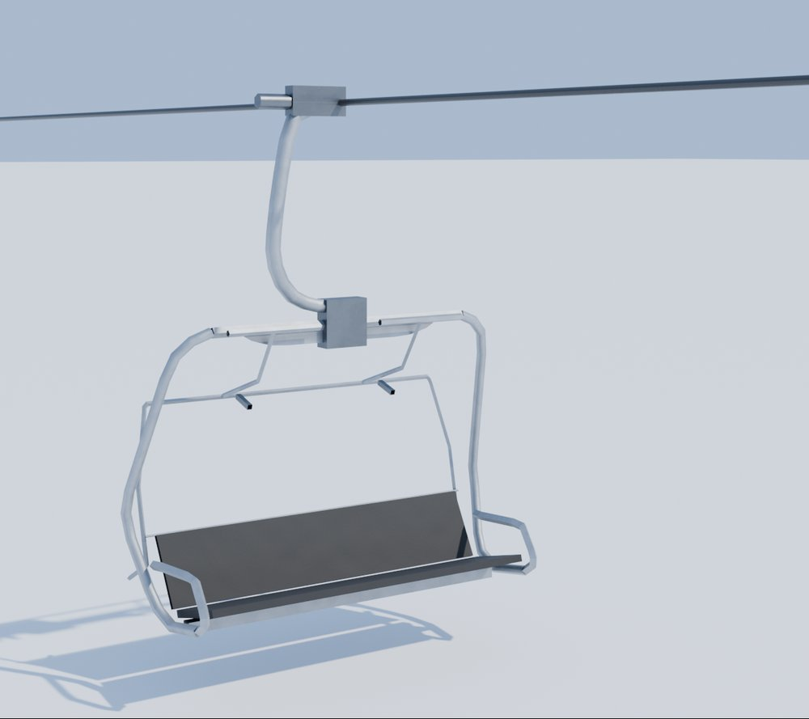
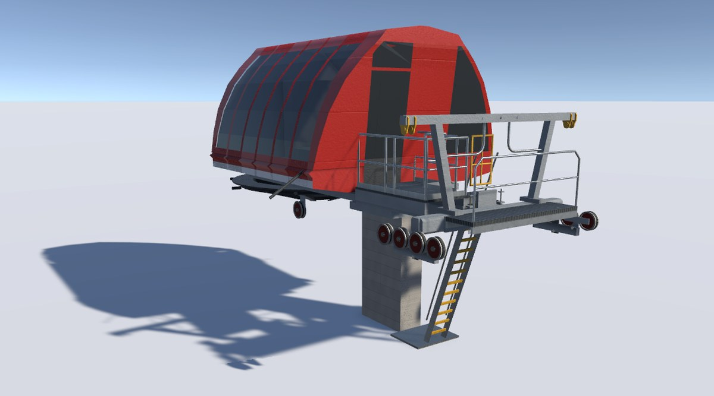
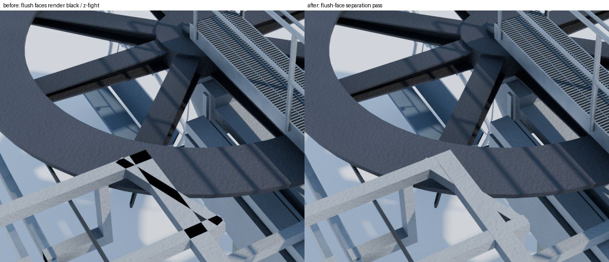

# Lift asset pilot · Sessellift FGQ-4

**Audience:** the project owner and coding agents. **Status:** Gates 1 and 2 approved; Gate 3 (this PR) is for
your review. **Date:** 2026-09-28. **Decisions:** LP1-LP10 in [phase0-decisions.md](phase0-decisions.md).

**Question:** can Claude author game-ready 3D assets for Mountain Planner: accurate to engineering drawings, within
a performance budget, and good-looking enough for you to approve?

**Answer: yes, for hard-surface machinery.** In one working day, Claude built a drive terminal, a return terminal
and a quad chair from engineering drawings and photos. It used Blender scripts only, with no hand modelling. You
approved every model before it was imported. Each asset is within its triangle budget (the terminals use under
60% of LOD0), and a stress scene of 40 terminals and 500 chairs costs about 0.3 ms per frame
(1.07 ms p95 at 1080p).

## What was built

The **Sessellift FGQ-4** is a fixed-grip quad chairlift from a fictional German maker (LP3). The model is our own
design, drawn to scale from engineering drawings, which stay local and are never named.

| Asset | What it is | Triangles (LOD0/1/2/3) |
|---|---|---|
| **Drive terminal** | The top station: a horizontal bullwheel under a tinted-glass hood on a square column, with the entry tower, catwalks, ladder and sheave train | 13,914 / 6,794 / 1,788 / 254 |
| **Return terminal** | The bottom station: an exposed bullwheel on a hydraulic tension carriage atop a square mast, with the lifting frame, catwalks, guide sheaves and chair guides | 12,944 / 5,884 / 1,612 / 292 |
| **Quad chair** | Grip, hanger, frame, bench and backrest with black vinyl padding, restraint bar | 768 / 236 / 60 |

Budgets (LP2): terminals 24,000 / 10,000 / 2,500 / 500; chair 800 / 250 / 60.

**Scope (LP1).** In: the machinery, mast and column, hood, the bullwheel and every sheave (on their real axles,
LP4), catwalks, railings, ladders, the lifting frame, the tension carriage, and pedestals and footings 2.5 m below
grade (LP7). Out: the conveyor and its vault, huts, gates, fences, ramps, the bullwheel chair-guide ring, and the
load and unload interfaces.

**Key dimensions (ours):** rope at 3,039 mm above the load level; line gauge and bullwheel pitch diameter
4,120 mm; rope Ø36 mm; snow allowance 305 mm; 4-sheave entry trains at 450 mm pitch (LP9).

## How it's built

`tools/assets/lifts/` ([README](../../tools/assets/lifts/README.md)) holds the whole pipeline. It uses no
paid tools.

1. **Spec.** `sessellift_fgq4.json` holds every dimension in millimetres, in the lift frame: origin at the mast
   centreline at grade, u toward the other terminal, v right, w up. Values were measured from the drawings at
   about 400 dpi, calibrated per view against two stated dimensions.
2. **Build.** `build_lifts.py` runs headless Blender 5.2 and takes about 10 s. Each asset module assembles
   parts from `liftkit`: boxes, beams, prisms, lathes, sheaves, sheave trains, railings and ladders. It builds
   all LODs, bakes ambient occlusion, separates flush faces, and exports one FBX per asset. The build fails on
   any budget, pivot or socket error, and the same spec always gives the same mesh hashes.
3. **Surface.** One 512 px palette gives albedo, metallic and smoothness per material class. One 1024 px
   detail atlas gives paint, galvanising, grating, checker plate, concrete formwork, hood panels, rubber and
   seat vinyl, box-mapped in metres. There is no per-asset unwrapping.
4. **Unity.** `LiftImport` copies the output, builds LODGroup prefabs and checks every pivot and socket to 1 mm.
   `LiftStructure.shader` is hand-written URP with the SRP Batcher, SSAO, LOD cross-fade, snow (LP6) and hood
   livery (LP5).
5. **Review.**
   - An objective **fit check** measures how much of the model's line art lies within 15 mm of the drawing,
     view by view.
   - **Adversarial review agents** audit parts against the drawings.
   - **Cycles photos** show each asset on snow, with chairs on the rope and a 1.8 m figure for scale.
   - The **Lift Lab** (`demo.bat` 23) shows the assets in the game engine.

| View | Model line art within 15 mm of the drawing | within 45 mm |
|---|---|---|
| Drive terminal, side | 81% | 92% |
| Drive terminal, end | 76% | 84% |
| Drive terminal, plan | 76% | 88% |
| Return terminal, side | 86% | 91% |
| Return terminal, end | 94% | 97% |
| Return terminal, plan | 89% | 96% |
| Quad chair, front (10 / 30 mm) | 89% | 98% |
| Quad chair, side (10 / 30 mm) | 88% | 100% |

The fit counts every visible model line, including parts the drawings leave out (the photo-sourced entry
trains, LP9), which lowers the drive terminal's end and plan scores. Drawing-only content such as text and
dimension lines doesn't count.

## Performance

The Lift Lab benchmark (`B`, or `-benchmark`) flies a fixed 30 s camera path after a 5 s warm-up: an orbit, a
pass along a line, then a view from 1.5 km. It records every frame. The results below are the median of three
runs of a release build at 1920 × 1080 on the reference PC (an NVIDIA GeForce RTX 3060 Ti), PC quality with lodBias 2.

| Scene | p50 | p95 | p99 | Batches | SetPass | Triangles |
|---|---|---|---|---|---|---|
| Empty (snow plane, sky) | 0.58 ms | 0.79 ms | 0.98 ms | 8 | 8 | 2,085 |
| **Stress** (40 terminals, 500 chairs) | 0.76 ms | **1.07 ms** | 1.26 ms | 389 | 24 | 116,823 |

The **stress** scene has 20 lifts (40 terminals 150 m apart, in 8 hood colours) and 500 chairs at 13.8 m
spacing. Its p95 is 1.07 ms against the 20 ms frame budget, and the lifts cost 0.3 ms over the
empty scene, against the 2 ms soft target. A Development build measured **0 B of garbage per frame** on average while benchmarking; one frame
in the stress run allocated 2.1 KB. A GPU-instanced chair path for full lines is future work (Phase 3).

## Review record

**Gate 1, blockout: approved 2026-09-28** (5 review rounds).
- Adversarial agents and the fit check rebuilt the return terminal to the drawings. The worst view, the side,
  went from 40% to 86% of line art within 15 mm.
- Both lifting-frame heads were rebuilt after an adversarial review ("they look a little wonky").
- You chose photo-sourced entry sheave trains on both terminals (LP9). You left out the guide ring and the
  load and unload interfaces.
- The hood end windows now match the side glass in tint, and their band tops and bottoms line up.
- A dark interior lining stops the sky showing through the hood glass (LP8).

**Gate 2, textures and materials: approved 2026-09-28** (2 rounds).
- Added the detail atlas and colour pass: hood red matched to your photo, red sheaves with light rims, toned
  galvanising.
- Retuned the AO so tight corners stop going black.
- Black vinyl seats, at your request.
- Found and fixed two rendering bugs:
  - Materials were dark in game (a texture default sampled 0.21 in linear colour space).
  - Black patches in renders came from flush parts. About 1,400 overlapping coplanar faces would also have
    z-fought in Unity; the build now separates them.

**Gate 3, Unity and PR: this PR.** Added the benchmark, `demo.bat` 22 (rebuild and import) and 23 (Lift Lab),
these docs and the decisions.

## Retrospective

**Time.** About 9 hours of wall-clock time in one day, including your review time (from commit times):

| Step | Time |
|---|---|
| Reference survey, calibration, pipeline and blockout | ~1 h |
| Gate 1 review loop: fit, adversarial reviews, your rounds | ~4 h 50 min |
| Gate 2: textures, materials, colour, bug fixes | ~2 h 15 min |
| Gate 3: import, benchmark, demos, docs, PR | ~1 h |

**Corrections by kind.**

| Kind | Examples | Found by |
|---|---|---|
| Drawing fidelity | The return terminal rebuilt, both lifting-frame heads, carriage and rail details | Fit check, adversarial agents |
| Missing from the drawings | Entry sheave trains, guide ring, conveyor interfaces | You (from photos and preference) |
| Look and consistency | End-window tint and alignment, see-through hood, seat colour | You |
| Pipeline and rendering | Face orientation on concave outlines, dark default texture, AO self-occlusion, flush-face z-fighting, benchmark frame cap | Claude (renders, ray picks, scans) |

**What needed human judgement:**
- anything the drawings don't show (and which photo to trust for it);
- what "looks wonky";
- colour and material choices;
- scope calls (what to leave out).

Claude could measure the drawings, but it could not decide by itself that a correct-to-drawing part still
looked wrong.

**What worked:**
- **Numbers before pictures.** A spec in millimetres, a fit score and enforced budgets turned "does it look
  right?" into measurable gaps, and adversarial agents found the biggest ones.
- **Photos for review.** Photo-style renders on snow caught what orthographic views hide: colour, occlusion,
  glass and flush-face artefacts.
- **Approval before import** (LP10) kept Unity in step with what you had actually seen.

**What can be reused.**
- `liftkit`, the detail atlas, the AO bake, the flush-face pass, `LiftImport`, the shader and the Lift Lab carry
  over directly to line towers, other Sessellift models, and Monta and Chairworks lifts.
- A new lift is mostly a new spec and asset module.
- The local fit-check and overlay tools carry over to any new drawing set.

**Verdict: continue.** For drawing-based machinery, Claude authoring with you as art director works. The next
assets should be line towers and a second maker. Organic and sculpted assets are untested, and trees already
have their own pipeline.
