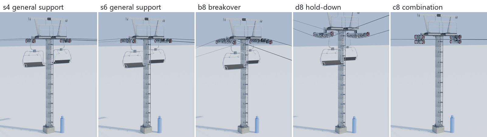
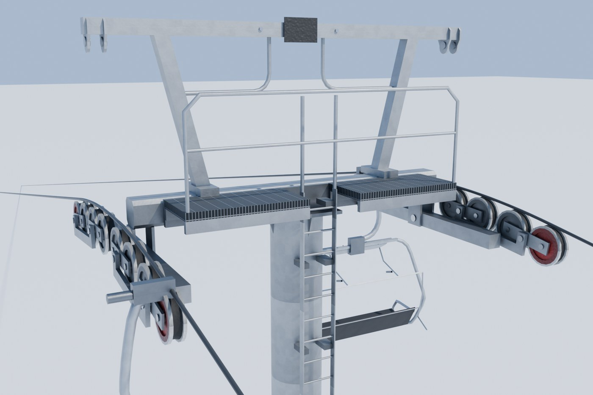
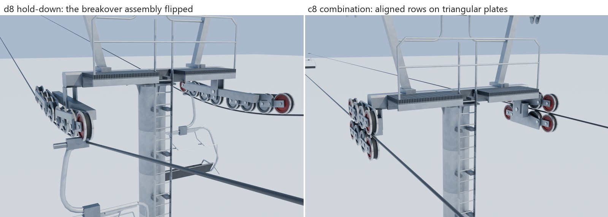
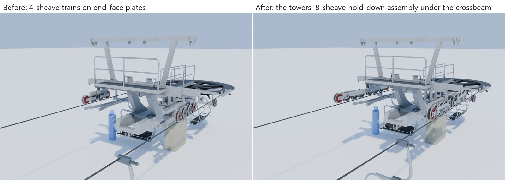
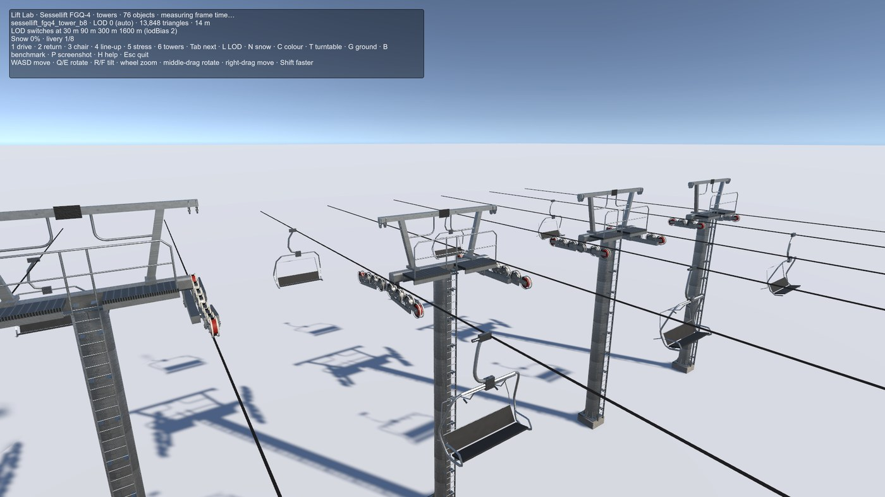

# Line towers · Sessellift FGQ-4

**Audience:** the project owner and coding agents. **Status:** approved by the owner (review rounds below); in
this PR. **Date:** 2026-09-29. **Decisions:** LP11-LP15 in [phase0-decisions.md](phase0-decisions.md). Follows
the [lift asset pilot](lift-pilot-sessellift-fgq4.md).

**What it is:** a kit of line towers for the Sessellift FGQ-4. The game can build any tower along a lift line
from three pieces, and choose one of five head types by what the rope does at that tower. The sheave assemblies
were rebuilt from the owner's own 3D reference model of a quad chairlift. The model stays local and unnamed; we
measured its mechanism and made our own design. The head is the drive terminal's approved entry head.

## The kit

| Piece | Triangles (LOD0/1/2/3) | What it is |
|---|---|---|
| **Base** | 314 / 278 / 58 / 36 | Footing 2.5 m below grade, a 0.91 m square pier, a base plate with anchor nuts and gussets |
| **Mast section** | 144 / 88 / 40 / 12 | 1 m of the Ø610 mast with its ladder; rungs keep a 250 mm pitch across sections |
| **Head** | see below | A cap on the mast top carrying the drive's entry head: crossbeam, portal with lifting lugs and J-handrails, platform (kept inside the ropes, with a ladder hatch), a black number plate, and a sheave assembly on each rope |

The game stacks sections to reach the tower's height in 1 m steps; the Lift Lab's towers mode (`demo.bat` 23,
key 6) does the same, setting the base a little higher or lower to take up the remainder.

## Head types

| Type | Sheaves per rope | Arc | Triangles (LOD0/1/2/3) |
|---|---|---|---|
| **s4** general support | 4 | nearly flat (40 m) | 7,512 / 2,384 / 484 / 96 |
| **s6** general support | 6 | nearly flat | 10,720 / 3,248 / 620 / 96 |
| **b8** breakover | 8 | the reference arc (10.4 m) | 13,848 / 4,064 / 732 / 96 |
| **d8** hold-down | 8 | the same assembly flipped | 13,848 / 4,064 / 732 / 96 |
| **c8** combination | 4 hold-down over 4 support, aligned | flat | 13,792 / 4,008 / 732 / 120 |

**Sheave assemblies**, after the reference model:
- Ø432 sheaves in pairs on rockers: twin plates, one on each face, straight through both axles.
- Two rockers on a train yoke: twin bridge-shaped plates, legs down to the rocker pins.
- A cross tube from each yoke to a 163 mm square equaliser inboard of the sheaves.
- Our breakover assembly lands within 6 mm of the reference's sheave centres, which lie on one 10.4 m circle.
- Hold-down is the same assembly flipped upside down, the owner's observation.
- The combination is open on the outboard side so grips pass. On the tower side, each row's train frame is a
  triangular plate, and the two meet a central pivot block.

**Connection (LP13):** every assembly hangs from below the crossarm end. Two lug plates carry its pin 320 mm
under the crossarm, the connection the owner approved first on the return terminal's integrated tower. The rope's
height at the head therefore depends on the type. Measured from the crossarm's underside:
- support heads (s4, s6) carry it 0.05 m above, as the rope passes the drive's entry head;
- the breakover head carries it 0.11 m above;
- the hold-down head carries it 0.75 m below (the return, whose assembly is flat, 0.69 m);
- the combination carries it 0.32 m below, at its pin.

The head records that height in its rope sockets, so the game sets the mast height from the rope's height at
the tower.

**Finish (LP14):**
- Towers are galvanised throughout.
- In every sheave row only the first and last sheave are red (lightning grounding); the rest are galvanised.
- The terminals' trains follow the same rule.

## The return terminal's integrated tower

The owner asked for the base terminal's integrated tower to be treated as a hold-down tower. Each rope now
carries the towers' 8-sheave hold-down assembly on a flat arc (the rope is level through the station). It hangs
under the lifting frame's crossbeam end on the same lug plates. This replaces the 4-sheave trains of the pilot
(LP9 → LP13). The return is now 19,864 / 7,028 / 1,836 / 316 triangles, within the terminal budget.

## Budgets and performance

**Budgets (LP15):** head ≤16,000 / 5,000 / 1,000 / 200 triangles, switching at 15, 45, 150 and 800 m (doubled
on PC). A lift has many towers but only the nearest one or two are ever at full detail. Sheaves spin only at
LOD0; from LOD1 a head is a single mesh.

**Performance:** the pilot's Lift Lab benchmark, the median of three release runs at 1920 × 1080 on the
reference PC (an NVIDIA GeForce RTX 3060 Ti). The stress scene now has two towers in each of its 20 lift lines,
40 towers in all, with the five head types in turn.

| Scene | p50 | p95 | p99 | Batches | SetPass | Triangles |
|---|---|---|---|---|---|---|
| Empty (snow plane, sky) | 0.58 ms | 0.79 ms | 0.96 ms | 8 | 8 | 2,085 |
| Stress in the pilot (40 terminals, 500 chairs) | 0.76 ms | 1.07 ms | 1.26 ms | 389 | 24 | 116,823 |
| **Stress with towers** (plus 40 towers) | 0.84 ms | **1.30 ms** | 2.06 ms | 691 | 27 | 229,695 |

- The towers, with the return's larger trains, add about 0.2 ms at p95. All the lifts together cost 0.5 ms
  over the empty scene, against the 2 ms soft target and the 20 ms frame budget. The three runs' p95 ranged
  from 1.17 to 1.65 ms.
- Batches rise from 389 to 691. Each tower is drawn as a base, its mast sections and a head, and a head at LOD0
  draws each sheave separately. When the game places towers along a line, it can merge each tower's static
  pieces (future work, with the instanced chair path in Phase 3).
- A Development build measured 0 B of garbage per frame on average. One frame in the stress run allocated
  2.1 KB, as in the pilot.

## Review record

The owner reviewed each round. Each row is a round and what came of it:

| Round | Owner direction | Result |
|---|---|---|
| 1 | Build towers from the reference model, modular, with support, hold-down and combination heads | First kit; heads were our own crossarm design |
| 2 | Match the head to the drive station's; match the sheave trains to the reference | Head shared with the drive terminal; assemblies rebuilt from the reference, within 6 mm |
| 3 | Tower types and rules: 8 sheaves on hold-downs and breakovers, 4-6 on general support; aligned combinations with triangular supports; galvanised; red first/last | Five head types; colour rule on towers and terminals; budgets proposed |
| 4 | Attach trains directly to the crossarm; don't change the head; no platforms along the sheaves | Extra baskets and brackets removed; assemblies pinned at the crossarm ends |
| 5 | The base terminal's integrated tower is a hold-down tower; sheaves hang below the crossarm | Return rebuilt; approved as "accurate and correct" |
| 6 | Apply that connection to every tower head type | All types hang from lug plates 320 mm under the crossarm; approved with "red sheaves 1 and 8 only" |

## Retrospective

- **The reference model saved the day.** Photos showed what a combination or hold-down looks like. The owner's
  3D model gave exact dimensions and the mechanism. Reading it (local Collada parsing, colour-coded part
  renders, fitting a circle to the sheave centres) was quicker than guessing from photos.
- **Owner knowledge set the rules.** It covered sheave counts per type, red end sheaves for grounding, aligned
  combinations, and where assemblies attach. None of it is in the reference geometry. Each round was short
  because the owner answered with a rule or a photo, not a description.
- **Over-reach cost a round.** Round 3 added maintenance baskets and changed the crossbeam from photos of other
  lifts; the owner rolled that back ("do not change the heads"). Keeping to the stated scope, and asking before
  adding, would have saved it.
- **Reuse:** the kit's pieces (`line_assembly`, `combo_assembly`, the shared head, the tower photo scene)
  carry over to other Sessellift models. A detachable or six-seat lift is mostly a new spec.
