# Task 09 phase 2: New England tree species

**Audience:** the project owner. **Status:** decided 2026-09-30 (below); step 1, the sorting, decided 2026-09-30 (NE5); steps 2 and 3, the models and the switch-on, done 2026-10-01 ([result](#result-the-switch-on-2026-10-01)), and Sugarloaf checked in the game. **Date:** 2026-09-30. **Builds on:** the [species-model priority report](phase1-species-priority.md) (task 09) and its survey of every US ski area.

## Decided (owner, 2026-09-30)

| ID | Decision |
|---|---|
| NE1 | **All nine missing species are in scope**: the three waves below are one task, **task 09 phase 2** |
| NE2 | **The test mountain is Sugarloaf, Maine** (5 km): spruce-fir and fir krummholz on top, northern hardwoods below, and S1M lidar |
| NE3 | **A new model only where it looks different.** A species that looks largely like one we already have shares that model instead of getting its own. Diversity alone isn't a reason for a model |
| NE4 | It runs in its own thread, as tree work does (higher reasoning), after task 09 |
| NE5 | **The sorting (step 1):** six species share a model: balsam fir and northern white-cedar → subalpine fir, red spruce → Engelmann spruce, eastern hemlock → western hemlock, white ash → sugar maple, and sweet birch → the new black cherry. Three get their own: **eastern white pine, northern red oak and black cherry** ([below](#step-1-result-the-sorting)) |
| NE6 | **Evergreen tops** (2026-10-01): every conifer that ended in an upright, snowless "fin" gets a normal pointed top that narrows gradually ([plan](phase2-evergreen-tops.md)). No curved or rounded tops; both hemlocks keep theirs |
| NE7 | **One Git LFS import** for everything approved in phase 2: the New England models and the corrected existing trees |
| NE8 | **The plantation look** in dense conifer stands: change it for realism, with more height spread and natural clumping (the owner left the call to my recommendation, 2026-10-01). It belongs to forest placement, so it goes through the Master Planner |
| NE9 | **Winter crowns at half density** (2026-10-01, after seeing Sugarloaf in the game): the full twig haze hid the evergreens and, from above, the snow. Half the twigs let both show through, and the crowns stay crowns, not bare sticks ([comparison](phase2-final-review.md#4-after-the-import-half-density-crowns-ne9)) |

## Result: the switch-on (2026-10-01)

Three new models (eastern white pine, northern red oak, black cherry) and the six shared species are switched on in the species map, and the trees approved in phase 2 went into Unity in one import (NE7): the 3 new models plus 12 existing ones rebuilt for the pointed tops (NE6) and the winter crowns, **92 MB** of Git LFS. Mountain hemlock, western hemlock and krummholz kept their files byte for byte. The terrain cache is now v9, so downloaded sites regrow their forests with the new species.

**Species fidelity, measured** (the survey re-run from its cache with the new species map; the share of forest biomass drawn as its real species or an approved shared model):

| | Average NE area | 22 biggest NE resorts | All US |
|---|---|---|---|
| Before phase 2 | 49% | 66% | 47% |
| After phase 2 | **91%** | **97%** | **67%** |

That's about +10 flora points (F1) at the average New England ski area and +5 across the US. By resort: Sugarloaf 56% → 96%, Sunday River 64% → 96%, Wildcat 53% → 97%, Loon 67% → 97%, Stowe 70% → 97%, Jay Peak 74% → 97%, Killington 75% → 97%. The lower, southern hills gain most but stay lowest, because of the oaks and pines still drawn as look-alikes: Gunstock 30% → 87%, King Pine 33% → 92%. The new US-wide ranking is in the [species-model priority report](phase1-species-priority.md#the-ranking-after-phase-2).

**Sugarloaf in the game** (NE2; the game's own benchmark views, before on the current main build, after on this one, with the half-density crowns of NE9):

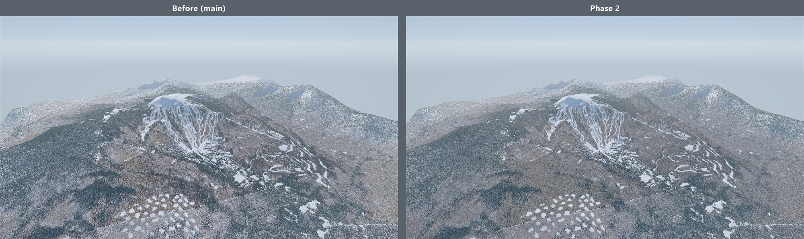

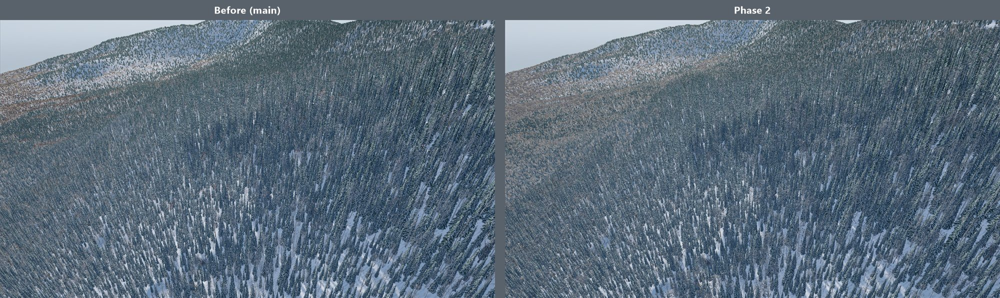

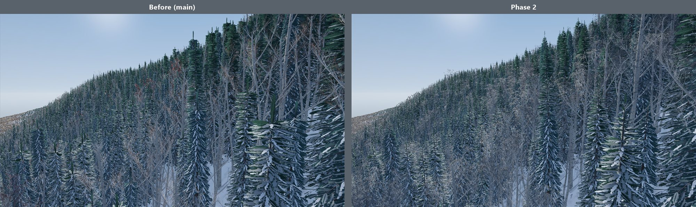

Reference PC (RTX 3060 Ti), 1080p, shadows 150 m, breeze. Frame p95 in ms, the median of 8 runs before and 5 after (runs vary by about ±0.3 ms):

| View | Before (main) | Phase 2 |
|---|---|---|
| overview | 8.7 | 9.0 |
| forest from 250 m | 11.5 | 11.4 |
| inside the forest | 17.8 | 18.0 |
| ring forest | 12.0 | 11.9 |
| summit | 5.2 | 5.3 |
| **worst view** | **17.8** | **18.0** |
| trees | 2,953,354 | 2,953,354 |
| forest draws a pass | 240 | 312 |
| draw calls a frame (Unity) | 920-1,110 | 1,160-1,350 |
| dedicated VRAM | 1.07 GB | 1.10-1.16 GB |

Within the budgets (p95 ≤20 ms, VRAM ≤7 GB). The in-forest view, Sugarloaf's worst, went from 17.8 to 18.0 ms (the prediction was +0.5 ms); the other views moved by 0.3 ms or less, within the runs' spread. The three new models add 72 forest draws a pass (240 → 312). With the full twig crowns first imported, the numbers were the same within 0.3 ms.

## Where New England stands

The survey found **93 New England ski areas** with forest: Vermont 29, New Hampshire 29, Maine 19, Massachusetts 11, Connecticut 4 and Rhode Island 1. Of those, 22 are the big destination resorts: Sugarloaf, Sunday River, Saddleback, Killington, Stowe, Sugarbush, Jay Peak, Loon, Cannon, Bretton Woods, Wildcat, Attitash, Black Mountain and the rest.

- **Already drawn as their real species:** red maple, sugar maple, yellow birch, American beech and paper birch. These are the Jackson, NH hardwoods kept from the first tree review (T8), plus quaking aspen. They make up **49%** of forest biomass at the average New England ski area and **66%** at the big resorts.
- **What's missing** (share of forest biomass at the average New England ski area; ski areas where it's at least 3%):

| Species | Share | Areas ≥3% | Where | Drawn today as |
|---|---|---|---|---|
| Northern red oak | 8.9% | 59 of 93 | Lower and southern hills (Gunstock 22%, King Pine 22%) | sugar maple |
| Eastern white pine | 8.4% | 63 | Lower slopes, southern NH and ME | lodgepole pine |
| Eastern hemlock | 7.9% | 78 | Valleys, ravines, everywhere | mountain hemlock (western hemlock after task 09) |
| White ash | 4.5% | 75 | Northern hardwood stands | quaking aspen |
| Red spruce | 4.3% | 43 | Upper slopes of the big mountains (Wildcat 17%, Waterville 16%) | Engelmann spruce |
| Balsam fir | 3.5% | 34 | The top of the big mountains (Wildcat 23%, Sugarloaf 21%) | subalpine fir |
| Sweet birch | 2.0% | 27 | Southern New England | paper birch |
| Black cherry | 1.7% | 10 | Massachusetts, southern Vermont | quaking aspen |
| Northern white-cedar | 0.7% | 5 | Maine swamps and limestone | mountain hemlock |

Elevation sorts these neatly. Oak, white pine and hemlock grow low and to the south. The northern hardwoods we already have fill the middle slopes. Red spruce and balsam fir cap the big mountains, down to fir krummholz at Sugarloaf's, Saddleback's and Wildcat's summits.

## The plan: look first, then model

**Step 1: decide which species need a model of their own (NE3).** Render each candidate's nearest existing model beside a description of the real tree in winter, the season the game shows (field-guide traits: silhouette, branching, bark, needle or bare-twig colour). Then sort each species into one of two groups:
- **Shares a model:** it looks largely alike at game distances. The species map then counts it as drawn as itself, so F1 credits it.
- **Needs its own model:** it doesn't.

You approve the sorting from the side-by-side renders. A first guess:

| Species | Nearest model we have | First guess | Why |
|---|---|---|---|
| Balsam fir | subalpine fir | **share** | Both are narrow, dark firs with flat sprays and smooth, blistered grey bark; balsam is a little broader |
| Red spruce | Engelmann spruce | **share**, maybe with its own palette | The same dense spruce cone; red spruce is shorter and yellower green |
| Eastern hemlock | western hemlock (task 09) | **share** | The same drooping leader and feathery sprays; eastern is smaller and broader |
| Sweet birch | yellow birch | **probably share** | The same birch form; its bark is darker |
| Black cherry | none close | own model, or share with yellow birch | Dark, flaky bark; an irregular crown. Close up it's distinctive, at a distance less so |
| White ash | none close | **own model** | Stout opposite twigs and a sparse, coarse winter crown; diamond-ridged bark |
| Northern red oak | none close | **own model** | A broad, rounded crown on heavy limbs, ridged bark; young trees keep dry leaves |
| Eastern white pine | none close | **own model** | New England's signature tree: tiered horizontal limbs and soft, long needles in tufts |
| Northern white-cedar | none close | **own model**, or share with western hemlock | Flat scale-leaf fans, narrow cone; small share (0.7%), so a share may do |

If the first guess holds, that's **four or five new models instead of nine**: oak, white pine, ash, white-cedar, and maybe black cherry.

**Step 2: build the models that are needed** with the free Blender pipeline:
- 3 variants each, within budget;
- your photo review before any import;
- only the new models imported, so existing tree files stay byte-identical.

**Step 3: switch them on.**
- In the species map, give each species its own model or its approved shared one.
- Re-run the survey report (`demo.bat` 28, from the cache).
- Download Sugarloaf and fly it.

**What all nine species bring** (if each were drawn as itself; the sorting decides how many models it takes):

| | Species | Average NE area | Big NE resorts | All US |
|---|---|---|---|---|
| Today (after task 09) | | 49% | 66% | 47% |
| Spruce-fir and hemlock | red spruce, balsam fir, eastern hemlock | 65% | 88% | 52% |
| Lower hills | northern red oak, eastern white pine, white ash | 87% | 95% | 63% |
| The rest | sweet birch, black cherry, northern white-cedar | **91%** | **97%** | **67%** |

*Species fidelity: the share of forest biomass drawn as its real species (or an approved shared model, NE3). Each 10% is 2.5 flora points (F1). Sugarloaf goes from 56% to about 96%.*

**What each new model needs from the Blender pipeline** (if it's needed):
- **Northern red oak:** a new oak leaf style (lobed, bristle-tipped; summer and red-brown autumn), a broad, rounded crown on a few heavy limbs, and ridged bark with flat-topped stripes. Young oaks hold dry leaves through winter like beech, through the existing "kept leaves" season flag.
- **Eastern white pine:** a new soft, long-needle tuft style (needles in fives). The form is the hard part: tiered horizontal branches, an irregular crown when old, often swept to one side by the wind.
- **White ash:** a new compound-leaf style, opposite branching with stout twigs, and diamond-patterned bark.
- **Black cherry:** dark, flaky bark and an irregular, open crown.
- **Northern white-cedar:** a new flat scale-fan foliage style and a narrow conical crown.
- **Shared species:** they need no build. If you'd like a shared species tinted differently, that's a later option: per-species colour in the shader, not a new model.

**Cost:**
- **Time:** about a day per new model plus your reviews; the sorting itself is a day.
- **Git LFS:** about 7 MB per new model, so 30–40 MB. GitHub's free allowance is 10 GiB of LFS storage and 10 GiB of downloads a month; the repository uses about 0.25 GiB. Actual: the one import (NE7), with the 12 rebuilt trees, added 92 MB.
- **Performance:** a site draws only the species it has (task 09), so these cost nothing at Jackson Hole or Crystal Mountain. Measured at Sugarloaf: its worst view 17.8 → 18.0 ms ([above](#result-the-switch-on-2026-10-01)).

## Step 1 result: the sorting

Each species was rendered (Cycles, winter) beside the model it would share. Next to that is a **sketch** of the real tree: the nearest model re-tuned in memory to the field-guide traits (crown width and height, branching, bark colour, needle tint), still with our existing textures. Groves are seen from about 200 m, the game's usual range; lineups are close up, with a 1.8 m skier. If the sketch and the shared model look alike at game range, the species shares.

The sketches can only re-tune what the builder already does. They can't show new structure: oak's crooked heavy limbs, white pine's wind-swept plumes, or cedar's scale fans. Where that structure is the point, the call is a judgement, as noted.

| Species | Decision (NE5) | What the renders showed |
|---|---|---|
| Balsam fir | **shares subalpine fir** | The same narrow spire at range; balsam is a little broader and less blue. 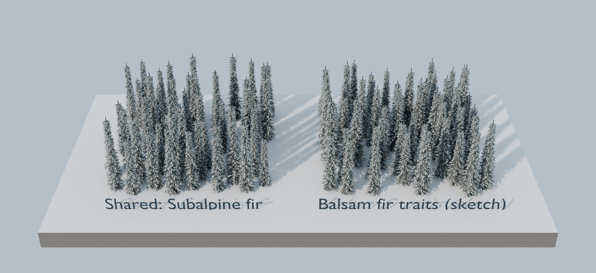 |
| Red spruce | **shares Engelmann spruce** | The same dense cone; red spruce's yellower green could be a per-species tint later. 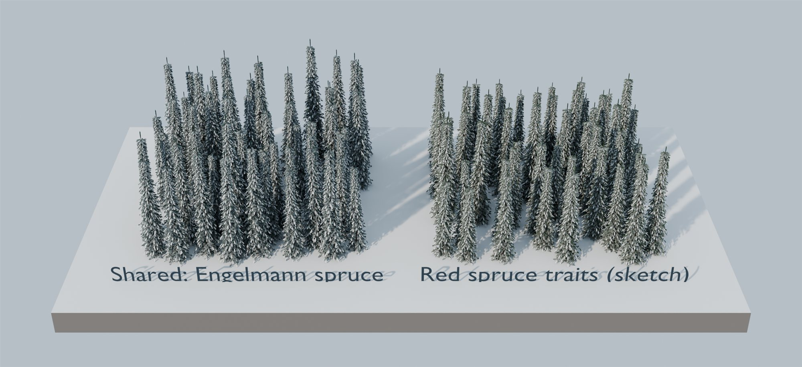 |
| Eastern hemlock | **shares western hemlock** | The same nodding leader and drooping sprays; eastern is broader and fuller to the ground. 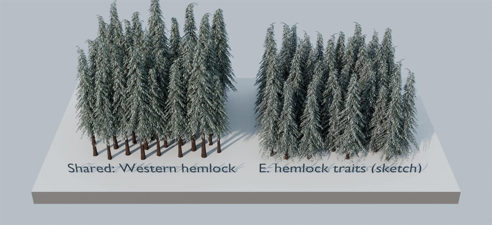 |
| Northern white-cedar | **shares subalpine fir** | Its narrow, dense cone with no drooping top reads as subalpine fir, not western hemlock. 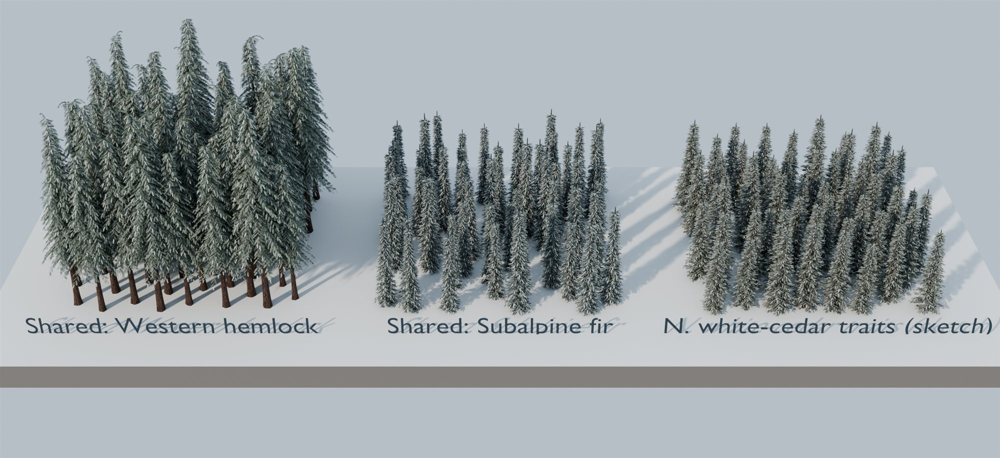 |
| White ash | **shares sugar maple** (first guess: own model) | Both branch in opposite pairs, with grey ridged bark and an oval crown; in winter they're almost indistinguishable. Aspen, today's look-alike, is wrong: white bark, narrow crown. 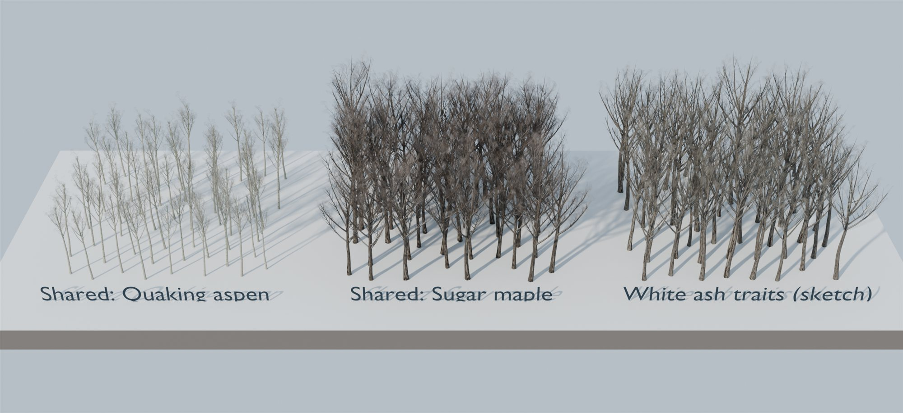 |
| Sweet birch | **shares black cherry** (first guess: yellow birch) | In a bare winter forest, bark colour is what reads. Yellow birch's gold is wrong for sweet birch's near-black bark, which matches cherry's. 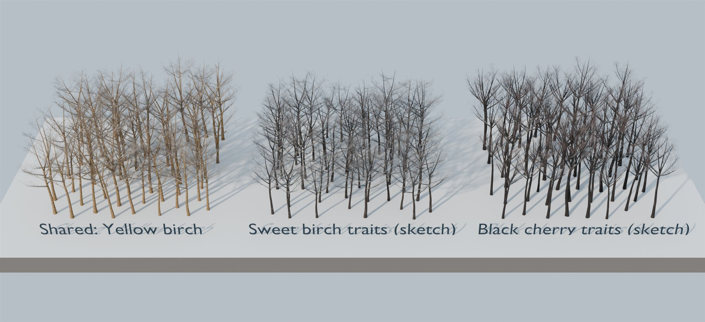 |
| Black cherry | **own model** | Dark, flaky bark, a long clear trunk and an irregular crown; it also stands in for sweet birch |
| Eastern white pine | **own model** | Nothing we have is close: tall, with few, long, horizontal limbs in tiers, and soft blue-green tufts. Lodgepole pine is narrow and short-limbed. 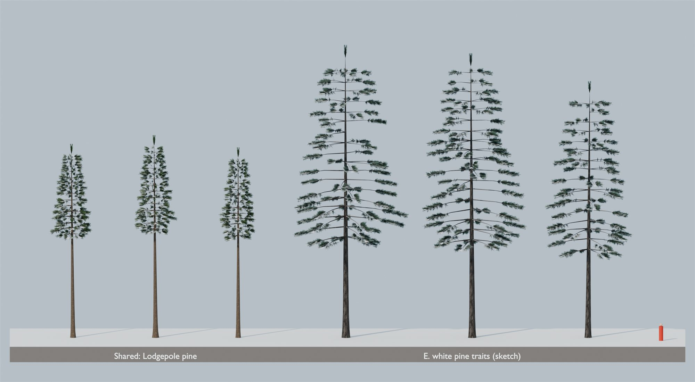 |
| Northern red oak | **own model** (a judgement call) | A parameter sketch looks close to sugar maple in winter, but it can't show the heavy, crooked limbs, the broad crown, or the brown leaves young oaks keep. Red oak is the largest missing species in the US, and one oak model can later stand in for white, black, bur and chestnut oak (about 1.5 more flora points per area). 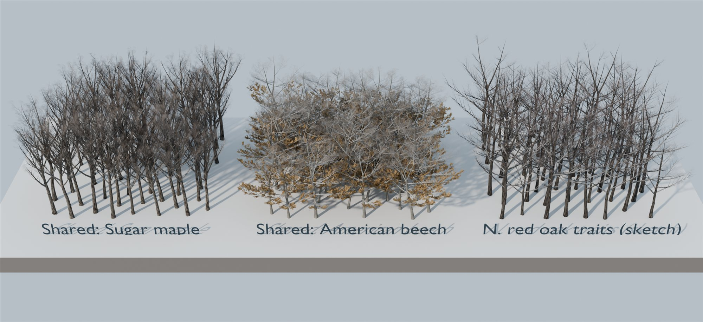 |

Close-ups: `images/phase2-ne-<species>-near.jpg`.

**Winter traits** (summarised from public field guides; photos of each at Go Botany, `gobotany.nativeplanttrust.org/species/<genus>/<species>/`):

| Species | Mature height | Winter silhouette | Branching | Bark | Colour in winter |
|---|---|---|---|---|---|
| Balsam fir | 12–20 m | Narrow, regular spire; krummholz on summits | Whorled, near-horizontal | Smooth grey with resin blisters | Dark green |
| Red spruce | 18–25 m | Narrow, dense cone | Whorled; tips droop then turn up | Thin reddish-brown flakes | Yellowish green |
| Eastern hemlock | 18–30 m | Broad cone, drooping leader; old trees irregular | Long, horizontal, feathery flat sprays | Cinnamon to grey-brown, deeply furrowed | Dark green |
| Northern white-cedar | 10–15 m | Narrow, dense cone with a rounded top; often leaning | Short, flat scale-leaf fans | Grey-brown fibrous strips | Yellow-green, bronzing |
| White ash | 20–25 m | Clear trunk, open rounded crown | Opposite; few, stout twigs | Grey, a net of diamond ridges | Bare |
| Sweet birch | 15–20 m | Rounded to irregular | Alternate, fine twigs | Near-black, smooth with lenticels; dark plates when old | Bare, dark |
| Black cherry | 18–25 m | Long clear trunk, narrow irregular crown | Few ascending limbs | Dark, small upturned plates | Bare, dark |
| Eastern white pine | 25–35 m | Young a regular cone; old irregular, flat-topped, wind-swept | Few long horizontal limbs in tiers | Dark grey, deeply furrowed | Soft blue-green tufts (needles in fives) |
| Northern red oak | 20–30 m | Rounded crown; broad when open-grown | Few heavy, crooked limbs | Dark grey with long flat-topped ridges | Bare; young trees keep brown leaves |

So phase 2 builds **three models instead of four or five**, about 25 MB of Git LFS, and every one of the nine species counts as drawn as itself (F1).

## Also worth doing for New England

1. **Better look-alikes now, for free:**
   - eastern hemlock → western hemlock;
   - red spruce → Engelmann spruce, and balsam fir → subalpine fir (both already);
   - oaks → American beech rather than sugar maple: similar bark, and young oaks keep their dry leaves too;
   - ash, cherry and basswood → yellow birch rather than aspen.

   I'll make the hemlock and fir switches in task 09. The broadleaf ones are a quick follow-up if you like them.
2. **The test mountain is Sugarloaf (NE2):** a 5 km download (Sugarloaf, Maine; about 45.04° N, 70.31° W), the region's demo as Crystal Mountain is the Cascades'. Benchmark it like the other two: frame p95, VRAM and draw calls.
3. **Calibrate the forest for the region:** tree density and height still use Jackson Hole's factors (D4). New England's closed hardwood canopy differs. A lidar truth set from New Hampshire's public 3DEP point clouds, made the way Jackson Hole's was, would fit the Northeast's own factors. That's the "per-region calibration" still on the list.
4. **Seasons:** New England is the place players will want autumn colour. All the hardwoods already carry summer and autumn leaves; the season inputs in the tree shader are a separate task (TR4, T9). Oak, ash and cherry would ship with their autumn textures.

## Still open (in phase 2)

- **Look-alikes for species outside the nine**, such as basswood, other oaks and other ashes: they could follow the new models by genus, agreed with the task 09 forest thread, which owns the look-alike ranges (oaks → northern red oak, ashes → sugar maple, cherries → black cherry).
