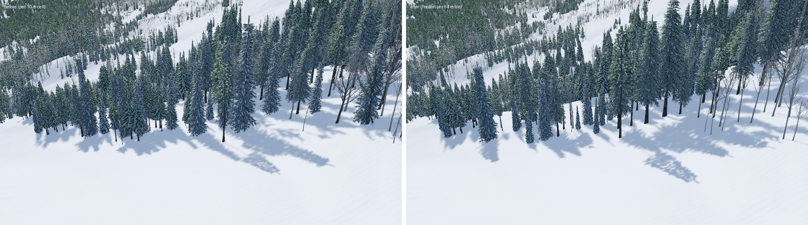
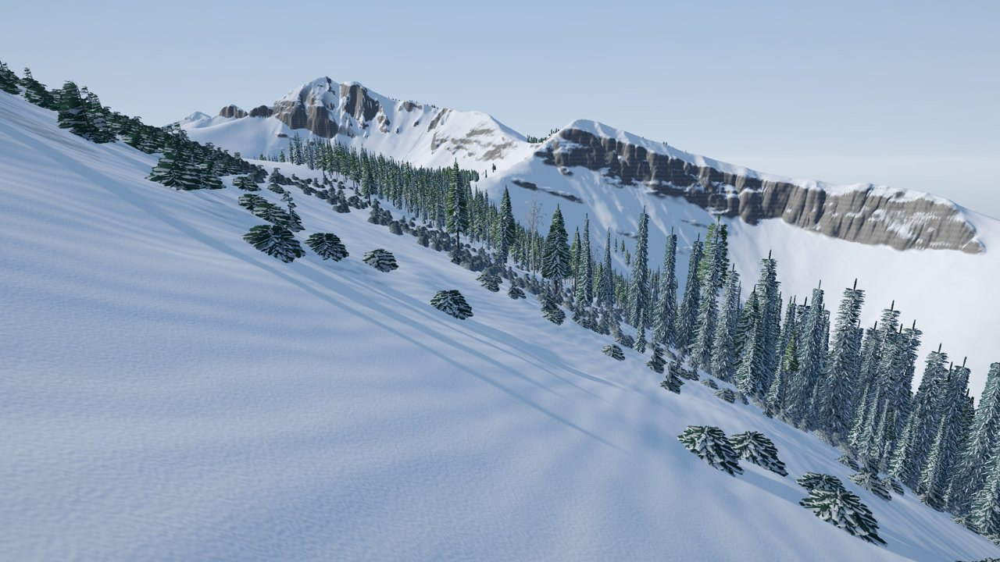
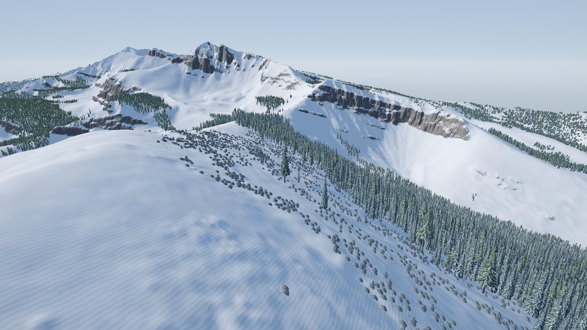
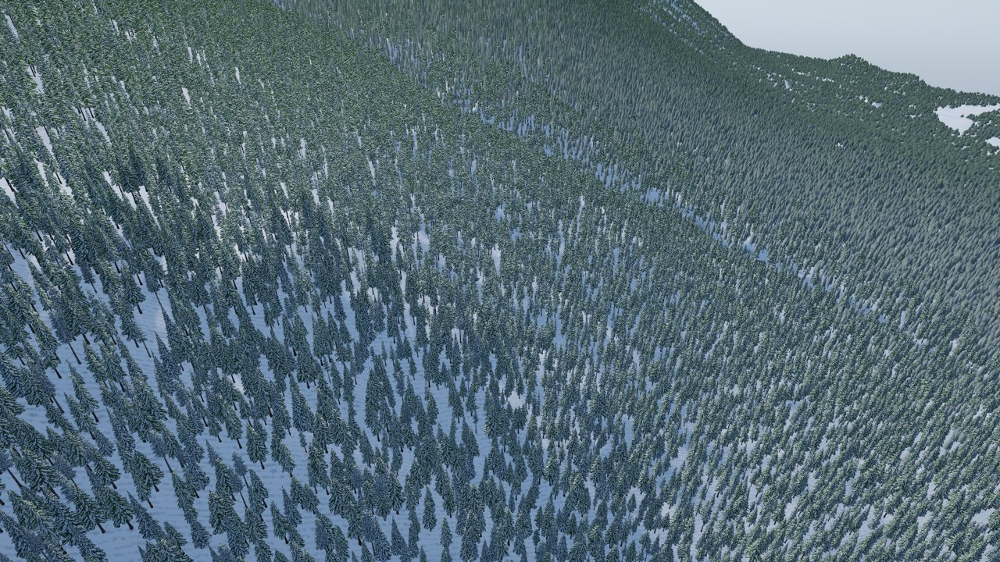
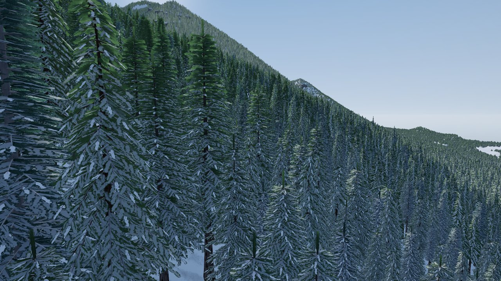
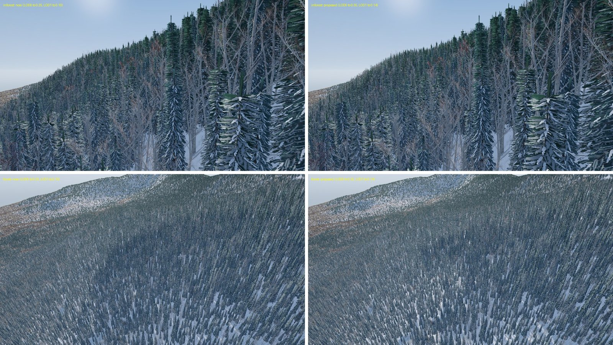

# Phase 1 · Task 09: Forest at scale

**Audience:** the project owner. **Status:** 🟨 for your review (the PR). **Date:** 2026-10-01. **Part of:** task 09 ([0.7](phase0-0.7-phase1-plan.md), T7). The new tree models have their own page: [phase1-09-trees-review.md](phase1-09-trees-review.md) (approved). The species report is [phase1-species-priority.md](phase1-species-priority.md), and New England is planned in [new-england-species-plan.md](new-england-species-plan.md) (task 09 phase 2).

**Result:** every 5 km mountain we have is forested with its own species, grown the same way every time, and smooth on the reference PC. Even Sugarloaf, with nearly 3 million trees, stays under the 20 ms frame budget.

## Try it

1. Close the Unity editor. `demo.bat` → **18** rebuilds the game, then **17** flies Jackson Hole. The first open of each mountain rebuilds its cache once (about 20 s); after that it opens in about 5 s.
2. Fly west of the tram to the top of Rendezvous Mountain: **krummholz** at the treeline, low wind-shaped mats and cushions and flagged trees, their flags pointing away from the wind.
3. `demo.bat` → **24** downloads Crystal Mountain 5 km (about 3 minutes), then **25** flies it: Pacific silver fir, western hemlock and noble fir among the mountain hemlocks and Douglas-firs.
4. `demo.bat` → **26** benchmarks Crystal Mountain; **21** benchmarks Jackson Hole.
5. `demo.bat` → **27** reports every mountain you have: trees, species, treeline and where the krummholz grows.
6. `demo.bat` → **28** re-runs the species survey and report. It replays from the cache in about a minute.

## What changed

| | Before | Now |
|---|---|---|
| **Placement** | Each 10 m square placed its own trees and kept them apart only within the square, so trunks could touch across its edges | Poisson-disc placement per 64 m tile: every tree keeps its crown's distance from every other, everywhere. Same density and height rules (D4) |
| **Speed** | 1.3 s for the 2 km test site (one thread) | 7 ms with Burst in the game; the downloader and CI run the same code as plain C#, and a test proves both give identical bytes |
| **Determinism** | Re-running one tile matched | Golden hashes pin the 2 km test site's trees; identical across runs |
| **Species** | 11 models; Crystal drawn with stand-ins | 15 models: Pacific silver fir, western hemlock, noble fir and krummholz added. Grand, red and white firs, cedars and eastern hemlock now draw as the nearer new models |
| **Krummholz** | none | Each site's treeline from its own canopy map; trees turn into krummholz in the 150 m below it. Jackson Hole 3,056 m, Crystal 1,938 m, Sugarloaf 1,176 m |
| **Drawing** | Every species drawn at every site; the switch to simpler LODs at 0.25 / 0.10 of screen height | Only the species a site has (Jackson Hole 240 → 168 draws a pass with four more models); LODs switch sooner (0.35 / 0.14, your option A); wide, low krummholz culled by its real size |

The same Jackson Hole stand before and after the new placement:

Krummholz at Jackson Hole's treeline, and the band from farther out:

Crystal Mountain with its own species, from 250 m and from inside the forest:

Sugarloaf (task 09 phase 2's test mountain), with the LOD change you chose: now on the left, sooner on the right.

## Performance

Reference PC (RTX 3060 Ti), 1080p, shadows 150 m, breeze. Frame p95 in ms, GPU mean in brackets.

| View | Jackson Hole, before (main) | Jackson Hole, now | Crystal Mountain | Sugarloaf |
|---|---|---|---|---|
| overview | 4.6 (3.9) | 4.8 (3.8) | 5.8 (4.7) | 8.9 (7.6) |
| forest from 250 m | 8.5 (7.9) | 5.8 (5.4) | 6.7 (6.1) | 11.9 (11.2) |
| inside the forest | 9.0 (7.8) | 7.1 (5.9) | 13.4 (12.8) | 18.4 (17.6) |
| ring forest | 13.9 (12.6) | 8.3 (7.4) | 9.0 (7.6) | 13.4 (11.6) |
| summit / cliffs | 6.2 (2.7) | 5.8 (2.6) | 5.3 (3.0) | 6.0 (5.0) |
| **worst view** | 13.9 | **8.3** | **13.4** | **18.4** |
| trees | 810,249 | 811,704 | 1,722,547 | 2,953,354 |
| forest draws a pass | 240 | 168 | 231 | 240 |
| draw calls a frame (Unity) | — | 690-1,670 | 970-1,500 | 920-1,110 |
| dedicated VRAM | — | 1.09 GB | 1.08 GB | 1.10 GB |

Budgets (0.3 §8): p95 ≤20 ms and VRAM ≤7 GB at High. All three fit. Jackson Hole's other views: corbet 3.9, valley 4.2, slope 4.5 ms. Sugarloaf's in-forest view was 24.6 ms before the LOD change.

## Tests

- .NET (CI) 167/167. New: Poisson spacing across cells and tiles, golden tree hashes, treeline and krummholz sizing, slopes.
- EditMode 326 passed, 0 failed. The 37 skips are by-design exclusions in the lift tests. New: Burst and plain C# grow identical forests, krummholz heights match the imported models.
- PlayMode 4/4. Repository checks pass.

## Flagged for later

- **Seasons** in the tree shader.
- **Per-region calibration:** density and height still use Jackson Hole's factors.
- **An Auto tree-detail setting** with the graphics settings menu (F4).
- **Krummholz** stands upright; it isn't tilted to the slope (mats skip steep ground instead).
