# Phase 1 · Task 09 trees: Crystal Mountain's species and krummholz

**Audience:** the project owner. **Status:** 🟨 for your review. [The adversarial audit](phase1-trees-audit.md) found five problems. Its fixes are applied and re-measured; this page shows the fixed models. Nothing has been imported into Unity; that waits for your approval. **Date:** 2026-09-30. **Part of:** task 09, forest at scale ([0.7](phase0-0.7-phase1-plan.md)); the look is set in [0.5 §3](phase0-0.5-art-direction.md). This builds on [the trees' first look](phase1-trees-first-look.md) and [the tree realism review](phase1-trees-review.md).

Four new models, built by the same free Blender script ([`tools/assets/trees/`](../../tools/assets/trees/README.md)). Each has 3 variants and LOD0-2, and each is within the enforced budgets:
- **Pacific silver fir**, Crystal Mountain's most common tree (30% of its biomass). Subalpine fir stands in for it today.
- **Western hemlock**, on Crystal's lower slopes (11%). Mountain hemlock stands in for it today.
- **Noble fir** (6% at Crystal). Subalpine fir stands in for it today.
- **Krummholz**, the wind-shaped growth just below the treeline at Jackson Hole and Crystal, in three shapes: a mat, a flag tree and a cushion.

These are **Blender renders, not the game**. In Unity the tree shader adds wind, crown shading, per-tree colour jitter, impostors and the real snow material.

**The eleven existing trees are unchanged.** I rebuilt them with the new code, and every mesh (positions, faces, UVs, wind colours, materials) and every texture is bit-identical to the build from `main`: 150 of 150 hashes match. After you approve, the import touches only the new models, so every committed tree file stays byte-identical.

## What I'd like from you

Approve the four models as they are, or tell me what to change. After your approval I'll do four things:
1. Import only the new models into Unity.
2. Run the tests.
3. Commit on `feature/p1-09-trees`.
4. Hand the branch to the task 09 thread.

The import adds about 30 MB to Git LFS: 7 MB of FBX, 4 MB of textures and about 17 MB of impostor atlases. That leaves the total near 215 MB of GitHub's free 10 GiB of LFS storage.

## Each new tree beside the tree it replaces

In each image the left tree is today's stand-in, scaled to the new tree's height, as the game scales it now. The three variants of the new tree follow it. The images have no snow, so the colours are easier to judge.

### Pacific silver fir (FIA 11)

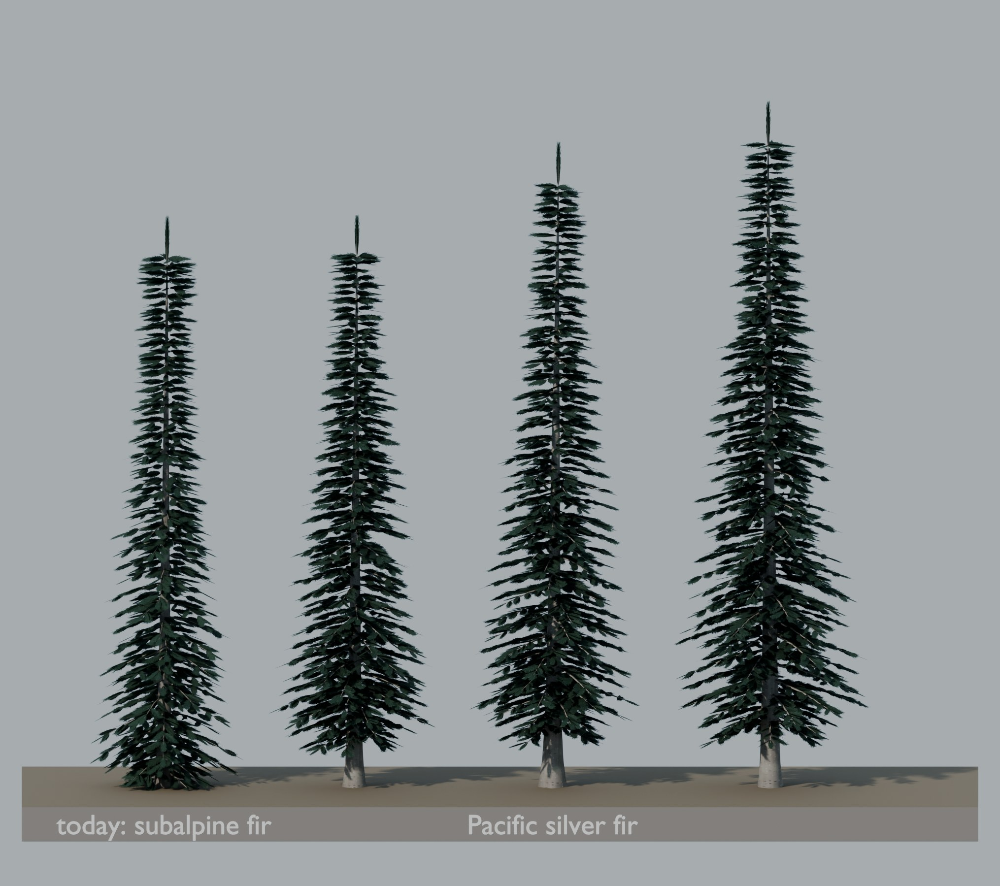

| Trait asked for | How it's built | Result |
|---|---|---|
| Dense, symmetric, narrow spire | 5-6 branches per whorl plus internodal branches, large sprays, a conical crown (exponent 1.0), a straight trunk | ✓ as dense as subalpine fir from the side (crown coverage 0.27-0.29 against 0.29), a little broader at the base |
| Long crown | Crown starts at 10% of the height | ✓ |
| Flat sprays | New `silverfir` frond: two-ranked side needles, plus needles combed forward over the top of each twig | ✓ |
| Dark glossy green on top | Darkest palette of the conifers (`#1B372B`-`#2A4839`) | ✓ At a distance, in the game's shading, it reads as dark as subalpine fir (L\* 24.7 against 23.8). The gloss is only suggested by the colour: neither the Blender preview nor the game's tree shader has a per-species shine. |
| Silvery underneath | A faint silvery sheen: a share of the side needles, more toward each spray's edge, is pale silver-green, in a single spray texture. (A two-half atlas broke the game's snow; see the audit.) | Partly: a sheen at the spray edges, not true undersides. Those need the forest shader to tint back faces, which is logged for its owner. |
| Smooth grey bark with resin blisters | The `fir` bark style in a lighter ash grey (`#A3A19B`) | ✓ |

### Western hemlock (FIA 263)

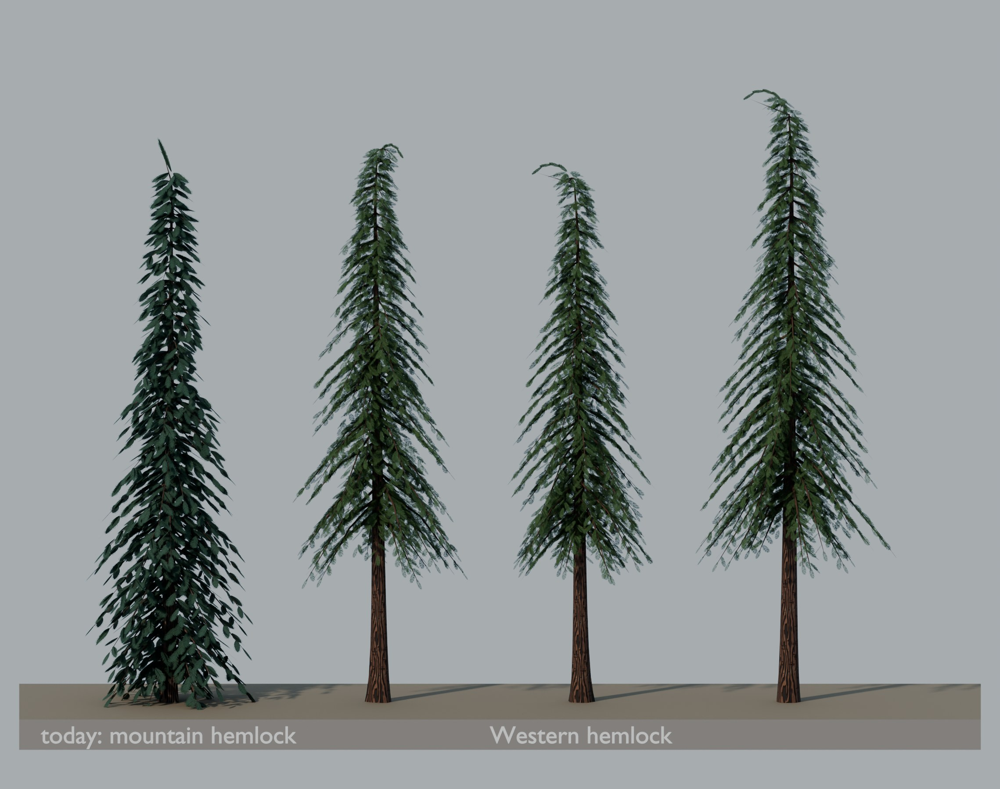

| Trait asked for | How it's built | Result |
|---|---|---|
| Tall | 28-36 m | ✓ |
| Strongly drooping leader | The top 13% of the trunk bends over by up to 94° (mountain hemlock: the top 8%, up to 60°). The leader's sprays follow the curve in four steps. | ✓ It reads from far off. On v2 (the tallest) it hooks right over; say if that's too much. |
| Feathery, lacy sprays | New `lacy` frond: no solid foliage body, and each side twig carries three twiglets with short needles, so light shows through the spray | ✓ |
| Drooping branch tips | Branches droop (0.55) and sprays hang from them | ✓ |
| Yellower green than mountain hemlock | `#2D4829`-`#42613A` against mountain hemlock's blue-green `#2A4639`-`#406250` | ✓ |
| Reddish-brown furrowed bark | The `furrowed` bark style in reddish-brown (`#5E4336`) | ✓ |
| Longer clear bole | Crown starts at 32% of the height (mountain hemlock: 8%) | ✓ |

### Noble fir (FIA 22)

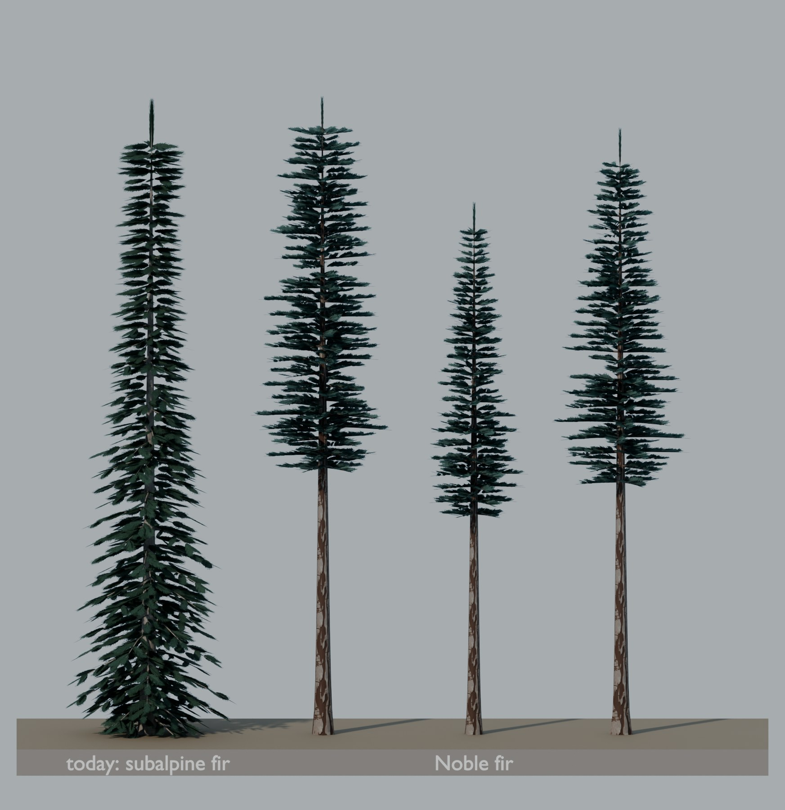

| Trait asked for | How it's built | Result |
|---|---|---|
| Very tall, long clear bole | 32-40 m; the crown starts at 42% of the height | ✓ the tallest tree in the library |
| Narrow crown that rounds off on old trees | Narrow crown (radius 10% of height). The taller the variant, the more domed its crown and the shorter its spire. | ✓ narrow. The rounded top is modest: v0 (the tallest) is blunter than v1. |
| Short, stiff, upswept branches | Short, stiff branches at right angles to the trunk (0-8°), as the references describe, with upturned sprays (about 12°) and needles. You chose this over upswept branches in the audit. | ✓ It now holds snow: winter L\* 53.7, like lodgepole pine's 52.1, the other long-boled conifer. Upswept branches had shown the camera their snowless undersides. |
| Blue-green, upturned needles | New `noble` frond: dense needles that curve toward the tip ("hockey-stick") and crowd the top of the twig; blue-green `#35514D`-`#4D6B66` | ✓ |
| Grey bark turning reddish-brown and plated | New `plated` bark style: grey plates split by reddish-brown furrows | ✓ It's the one new bark style; no existing style had plates over reddish furrows. |

## The three new conifers in winter

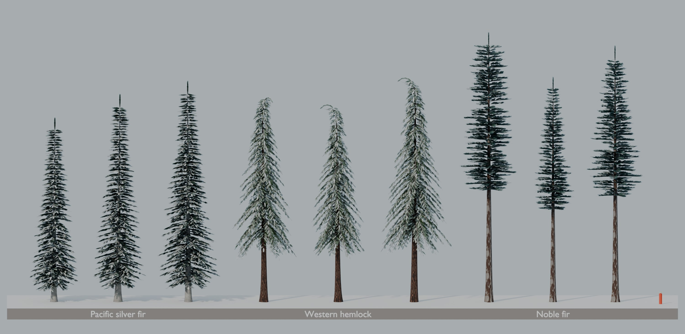

## A Crystal Mountain grove

Sixty trees in Crystal's mix by biomass:

| Species | Share |
|---|---|
| Pacific silver fir | 30 |
| Mountain hemlock | 19 |
| Douglas-fir | 12 |
| Western hemlock | 11 |
| Subalpine fir | 7 |
| Noble fir | 6 |
| Engelmann spruce | 3 |

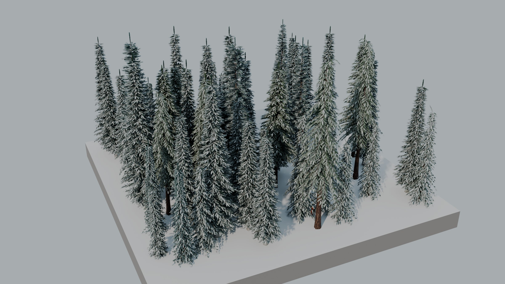

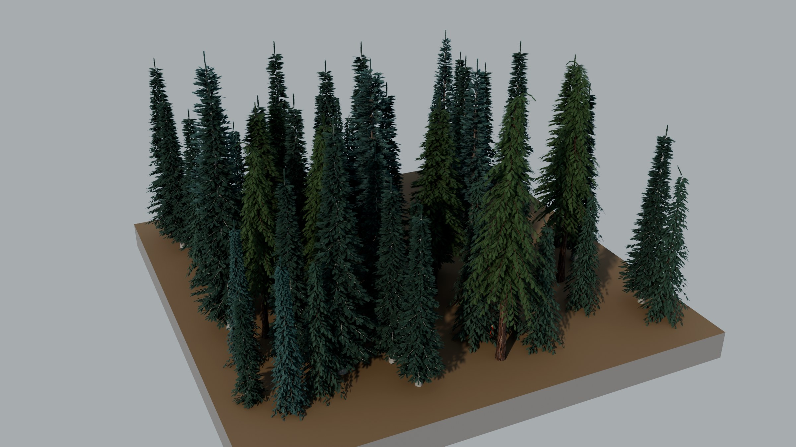

## Close-ups

**From eye level:** silver fir's grey blistered trunk, western hemlock's reddish furrowed bark and lacy sprays, and noble fir's plated trunk and long clear bole.

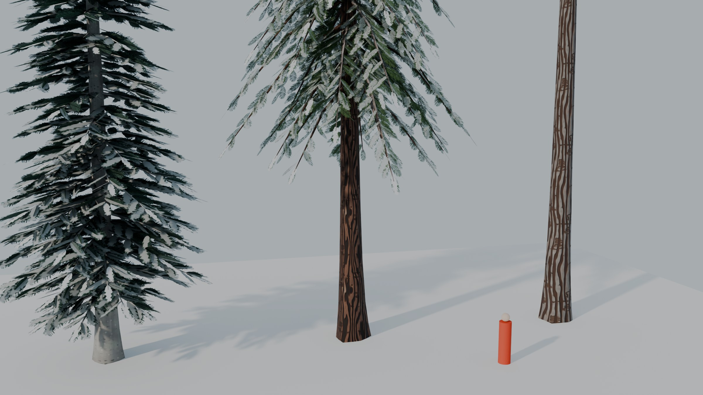

**The lower crown from below**, lit from behind the camera: Pacific silver fir, western hemlock, noble fir. The silver fir's sheen is the paler needles at the spray edges, and it is deliberately subtle.

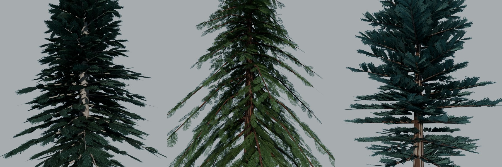

**Textures.** Each row is one model: Pacific silver fir, western hemlock, noble fir, krummholz. The columns are the spray card, the LOD1-2 branch cluster, the bark and the bark normal map. Every spray card is one frond along the card's middle, as the game's snow pattern expects.

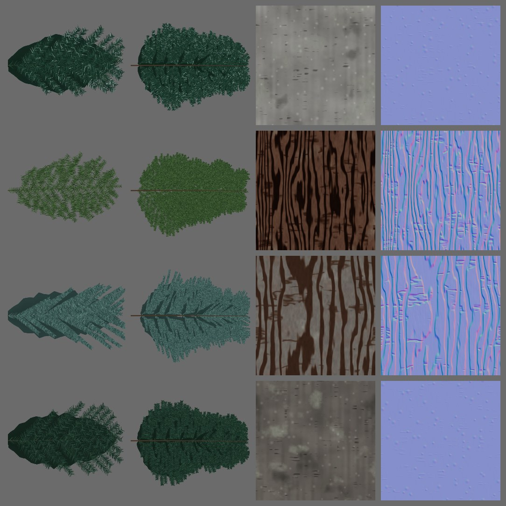

## Levels of detail

Shown left to right, three LODs each: Pacific silver fir, western hemlock, noble fir, and the krummholz flag tree at 4× scale.

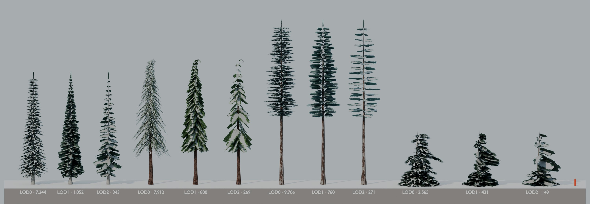

**LOD1-2 are branch-cluster cards**, as on every conifer since the realism review. The Unity import measures each LOD against LOD0 and corrects its brightness and snow ([the fidelity report](phase1-trees-review.md)), as it does for the existing trees.

**The audit measured the crown each LOD keeps, framed as that report frames it.** Seen from the side, LOD1 shows these multiples of LOD0's crown:
- silver fir and western hemlock: 0.95-1.17×;
- noble fir: 0.98-1.29×.

Both are within the range of the trees already in the game; Douglas-fir is 1.23-1.30×. From 22° up they are all within 0.76-1.02×.

## Krummholz

**What it is:**
- A growth form, not a species, so it has **no FIA code**. The placement code puts it just below the treeline.
- Its three variants are three shapes.
- It uses subalpine-fir needles in a darker palette (`#1C3328`-`#2C4839`) with a weathered fir bark (`#76716A`).

| Variant | Shape | Native height | How it's built |
|---|---|---|---|
| v0 | **Mat** | 0.87 m | A low teardrop. The flat top is at the snow surface and slopes down to a tail about 2.5 m downwind. The upwind face is short and steep, with dead stubs. |
| v1 | **Flag tree** | 3.22 m | A dense skirt 0.75 m tall at the foot. Above it, a bare, wind-blasted stretch just over the snow. Then branches only on the downwind side, bare stubs on the upwind side and a dead spike at the top. |
| v2 | **Cushion** | 1.52 m | A rounded dome, longer downwind than upwind. |

**From the side,** with downwind turned to the right. The skier is 1.8 m tall.

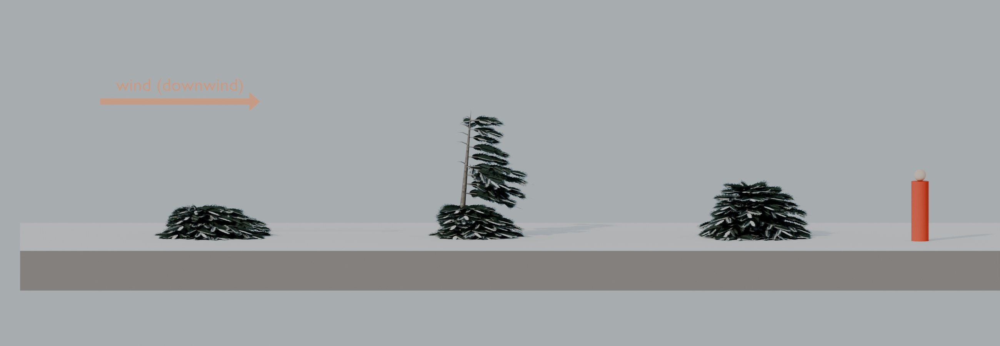

**From above, in the prefab's own frame** (no rotation). The foliage reaches toward the arrow: that is Blender −Y, which becomes the prefab's local +Z.

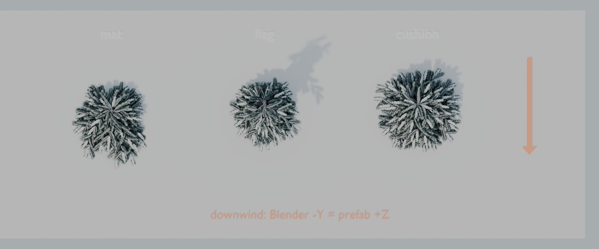

**A treeline:** stunted subalpine firs and Engelmann spruces lower down, then flag trees, cushions and, highest, mats, all flagged the same way.

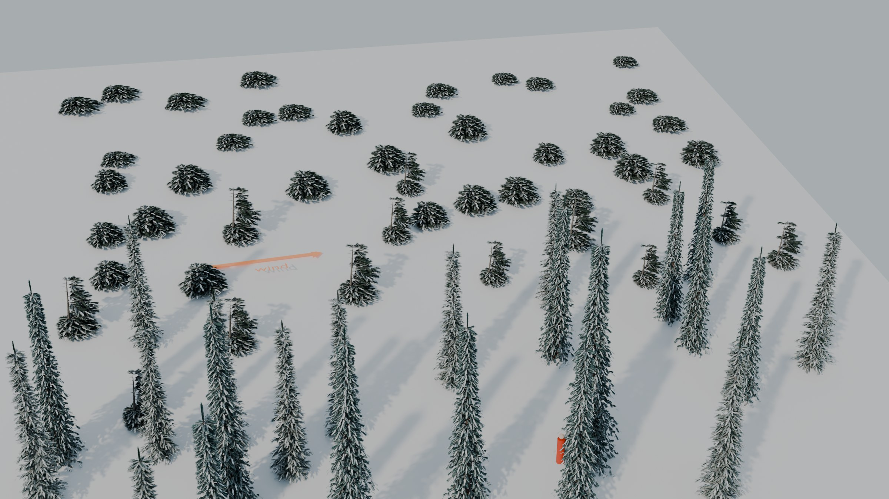

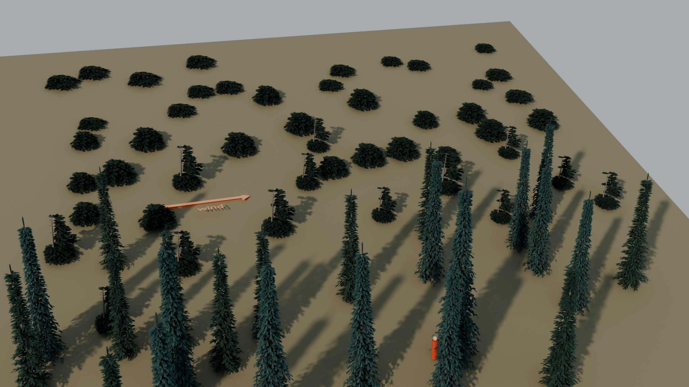

### Orientation and handedness

**The contract:** after import, the flag and the mat extend toward the prefab's local **+Z** (downwind). The placement code turns +Z to face ENE, away from the game's WSW wind.

**How it's met:**
- **The model:** krummholz is built reaching toward Blender **−Y**.
- **The export mapping:** the trees export with the same FBX settings as the lifts (`axis_forward -Z`, `axis_up Y`, `bake_space_transform`). The lift pipeline measured in Unity that these turn Blender (x, y, z) into Unity (−x, z, −y) ([`liftkit/frame.py`](../../tools/assets/lifts/liftkit/frame.py)). So Blender −Y lands on Unity **+Z**.
- **Handedness:** that mapping has **determinant −1**. That is the correct conversion from right-handed Blender to left-handed Unity: the model keeps its handedness and isn't mirrored.
- **Why a mirror wouldn't hurt anyway:** the downwind direction sits on the one axis the mapping doesn't flip. A mirror across the wind axis (x) would leave "downwind" unchanged, because each form is symmetric about that axis.
- **A test at import:** after the import, `TreeImport` will check that each krummholz's LOD0 foliage centroid has z > 0 in the prefab, and it will fail the import if it doesn't. I'll report the measured centroids with the import.

**Wind:** krummholz is stiff, so its trunk-sway and branch-flex wind weights are scaled down: 0.25 on the mat, 0.6 on the flag tree and 0.35 on the cushion. The shader moves branch tips by a fixed distance, which would otherwise make a mat flap.

**Placement, agreed with the task 09 thread:**
- Krummholz stays within ±15% of its own size.
- The shape follows exposure: mostly mats and cushions at the top of the band, flag trees lower down.
- Cells steeper than 13° grow cushions instead of mats, because a long mat floats or sinks on a steep slope.
- Krummholz now switches LOD and culls by its sideways reach, not by its height alone.

## Numbers

Triangles per LOD (budget: LOD0 ≤10,000, LOD1 ≤2,500, LOD2 ≤500). "Card m²" is the area of alpha-tested cards on LOD0, a proxy for overdraw. "Native height" is the top of LOD0, the prefab's height at scale 1.

| Model | Variant | Native height | LOD0 | LOD1 | LOD2 | Card m² (LOD0) |
|---|---|---|---|---|---|---|
| Pacific silver fir | v0 | 26.6 m | 7,244 | 1,052 | 343 | 1,516 |
| | v1 | 30.0 m | 7,828 | 1,088 | 367 | 1,667 |
| | v2 | 31.9 m | 9,816 | 1,196 | 401 | 2,227 |
| Western hemlock | v0 | 29.7 m | 7,912 | 800 | 269 | 1,598 |
| | v1 | 28.6 m | 6,864 | 746 | 269 | 1,363 |
| | v2 | 32.4 m | 8,946 | 814 | 295 | 1,855 |
| Noble fir | v0 | 38.8 m | 9,706 | 760 | 271 | 2,088 |
| | v1 | 32.4 m | 5,542 | 690 | 257 | 1,028 |
| | v2 | 37.0 m | 7,758 | 704 | 257 | 1,613 |
| Krummholz | v0 mat | 0.87 m | 1,668 | 209 | 89 | 91 |
| | v1 flag | 3.22 m | 2,565 | 431 | 149 | 128 |
| | v2 cushion | 1.52 m | 2,788 | 389 | 145 | 155 |

- **Card area follows height and crown.** Per m² of height squared:
  - silver fir 1.85-2.19 and western hemlock 1.67-1.81, like Douglas-fir (2.0-2.2) and mountain hemlock (1.85-2.1);
  - noble fir 0.98-1.39, with its long bare trunk.
- **Native heights.** A drooping leader ends below the nominal height (western hemlock), and a spire ends 0.4 m above it.
- **Budgets:** the build enforces them and all twelve variants pass. Silver fir v2 was over on the first build (12.2k). Its whorls are now further apart and its sprays larger, so it is dense and within budget.

## Not changed

These belong to the task 09 thread:
- `LookAlike` and `TreeLibrary`;
- placement, the krummholz placement rule and the species survey;
- the benchmarks.

My only change to `SpeciesMap.cs` will be appending the four ids to `Models` and adding FIA 11, 263 and 22 to `Exact`, at import time.

## Try it

- **Rebuild the four models, with no renders:** from the repo root, run
  `blender -b --factory-startup --python tools/assets/trees/build_trees.py -- --out tools/assets/trees/out --species pacific_silver_fir,western_hemlock,noble_fir,krummholz`
  (about 10 s).
- **Render this review:** add the look-alikes and the shots:
  `--species subalpine_fir,engelmann_spruce,douglas_fir,mountain_hemlock,pacific_silver_fir,western_hemlock,noble_fir,krummholz --render <absolute dir> --shots compare,new,crystal,closeup,lods,krummholz,textures`
  (about 6 minutes).
