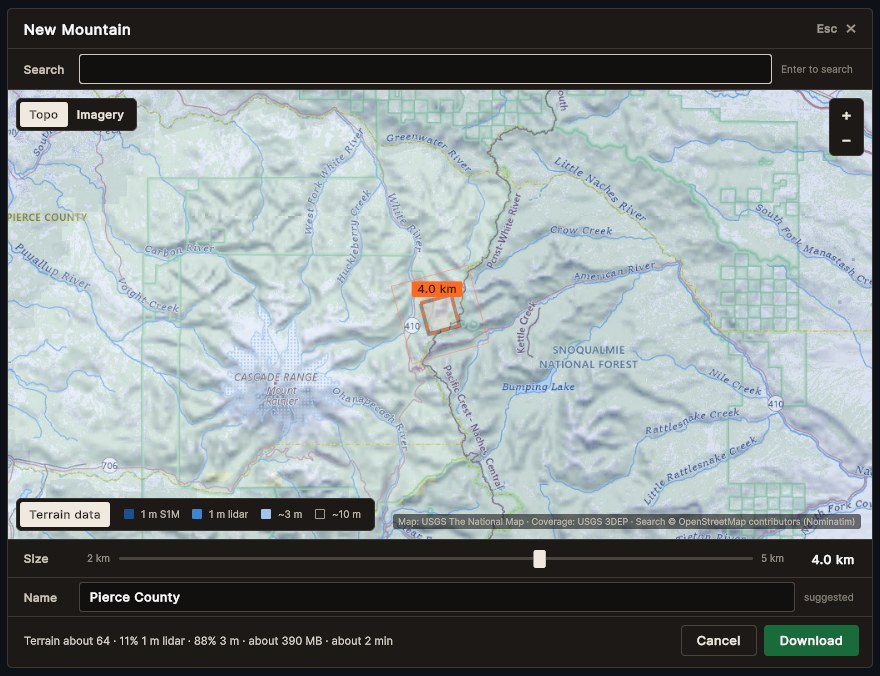

# Phase 1 task 13: site picker review

**Audience:** the project owner. **Date:** 2026-10-02. **Branch:** `feature/p1-13-site-picker`. **Spec:** [0.7 row 13](phase0-0.7-phase1-plan.md), [0.4 S3](phase0-0.4-ui-ux.md), [0.3 §6.1](phase0-0.3-technical-architecture.md#61-site-picker-t19).

The picker runs on its own in the Picker Lab (demo.bat 33). Choosing Download hands the site to the existing downloader. Task 14 will put it in the game's flow (title → picker → download → card).

## What it looks like

| | |
|---|---|
|  | **Search, then Enter.** One result, so the map flies there, centres the square on it and suggests its name. The estimate line reads underneath. |
|  | **Imagery, with the data overlay.** Dark blue squares are published S1M tiles (10 km, 1 m); mid blue is other 1 m lidar; light blue is about 3 m; unshaded is about 10 m. The thin outer line is the 3 km surroundings that download too. |
|  | **Zoomed out.** The square is tilted: it is exact in the package's Albers grid, which turns about 15° from true north at Crystal (about 9° at Jackson Hole). What you see is what downloads. |
|  | **No network.** The map becomes this panel, search and Download switch off, and Retry tries again. |

## Acceptance

| Check | Result |
|---|---|
| Square corners exact in EPSG:6350 | `PickerSquareTests`: exactly the centre ± half the size, and a drawn corner reads back within 1 mm |
| Rate limit | `NominatimTests.RequestsAreAtLeastOneSecondApart`: five calls fired at once go out ≥ 1 s apart, on a fake clock; a name lookup overtaken by a newer click is never sent |
| Offline panel without a network | PlayMode `WithoutANetworkTheOfflinePanelShows`, then Retry brings the map back |
| Engine-free tests | 215 / 215 |
| Unity EditMode, PlayMode | 390 passed, 0 failed (37 already-ignored tests skipped); 10 / 10 |
| Repository checks | Pass |

## Behaviour

- **Search** runs only on Enter (no search-as-you-type), US places only, at most one request a second shared with the name lookups, with the game's User-Agent and the attribution on the map.
- **Click** centres the square; **drag** pans; **wheel** or **+ / −** zoom. With the map focused, the **arrows** nudge the square 100 m (Shift: 1 km). With the slider focused, they step 0.1 km (Shift: 1 km). **Esc** closes the results, then the picker.
- **Name:** a chosen search result's name, or after a click one reverse lookup (a named natural or recreation feature, else the nearest village or town, else the county). A name you type is never replaced; clear the field to get suggestions again.
- **Estimate line:** expected terrain score, source mix, size and time. Size and time are fitted to our three measured downloads (within 20%). It reads "at least" in amber when the coverage couldn't be checked.

## Known limits (your call)

1. **The score estimate is optimistic where 3DEP has both 1/9 and 1/3 arc-second data.** At Crystal Mountain the index footprints say about 90% is ~3 m, so it estimates 63. The real download got 24% 3 m and 60% 10 m, and scored 48. The size and time are right. Options: keep it as "about", weight the ~3 m share down, or sample the 3DEP service's own source raster (one more request per placement). I recommend the last option as a small follow-up.
2. **Names in remote places fall back to the county** (for example "Pierce County"). Searching by name avoids this.
3. **Fonts:** the picker uses Unity's default font until Overpass and Overpass Mono are added (waiting for your OK to download them).
4. **The satellite imagery checkbox (G7) is left out** until imagery downloads exist; the hand-off already carries the flag.
5. **Tiles that are still loading show blank**, not a blurred parent tile.

## Try it

1. `demo.bat`, choose **33** (builds the Picker Lab the first time, about a minute; close the Unity editor first).
2. Type `Jackson Hole` and press Enter. Pick the result, or click the map to move the square.
3. Drag the size slider, edit the name, and watch the estimate line update.
4. Press **Download**. The window closes and the downloader fetches the site into your library (choose **16** to list it).
5. Choose **34** to see the offline panel.
