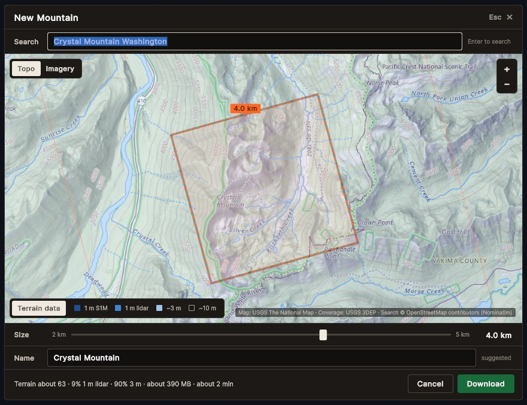
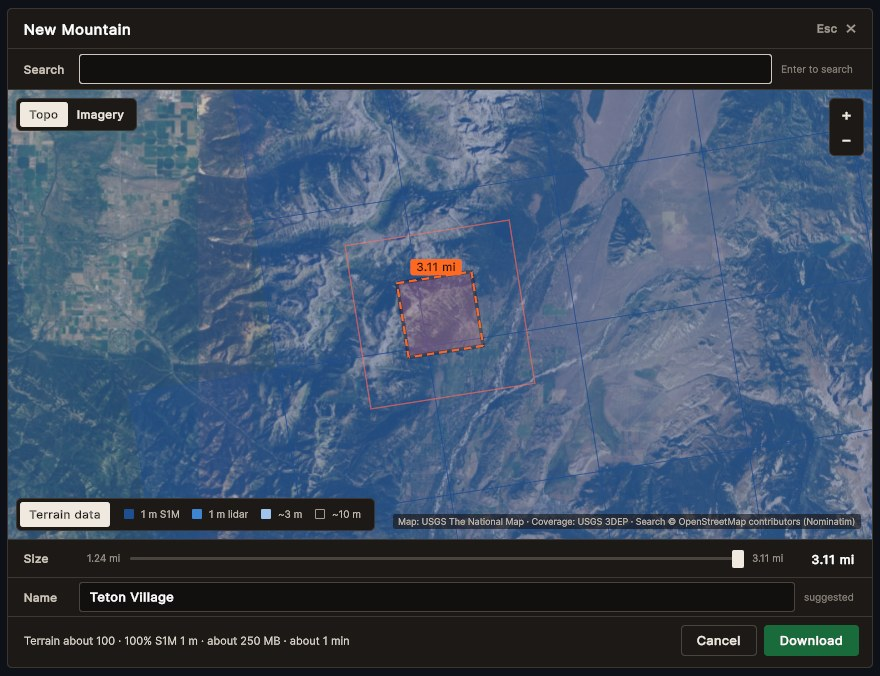
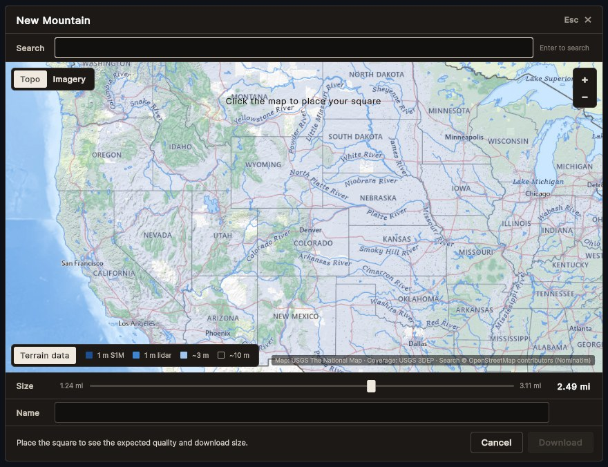
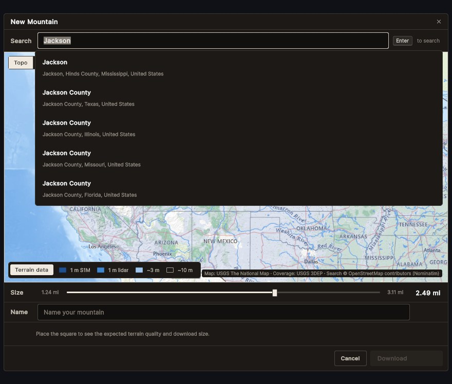
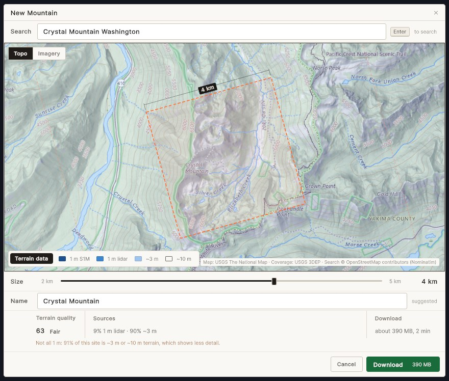
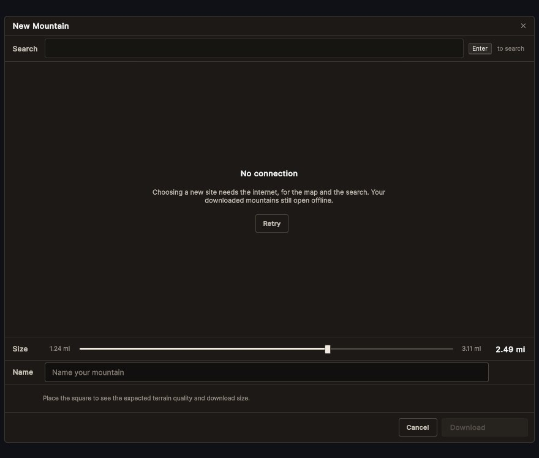

# Phase 1 task 13: site picker review

**Audience:** the project owner. **Date:** 2026-10-02. **Branch:** `feature/p1-13-site-picker`. **Spec:** [0.7 row 13](phase0-0.7-phase1-plan.md), [0.4 S3](phase0-0.4-ui-ux.md), [0.3 §6.1](phase0-0.3-technical-architecture.md#61-site-picker-t19). **Look:** the accepted Trailhead direction ([game-ui-direction.md](game-ui-direction.md) UI-6 and §5) and the HUD mockup's parts ([prototypes/ui-layout.html](prototypes/ui-layout.html)).

The picker runs on its own in the Picker Lab (demo.bat 35). Choosing Download hands the site to the existing downloader. Task 14 will put it in the game's flow (title → picker → download → card).

## What it looks like

| | |
|---|---|
|  | **Search, then Enter.** One result, so the map flies there, centres the square on it and suggests its name. The plan is drawn as the mockup draws plans: orange dashes and a dimension line with its figure on a graphite label. The square is tilted: it is exact in the package's Albers grid, which turns about 15° from true north here. Under the name: the terrain quality as a number and a word, the sources (in feet, with the game's units) and the download, then the amber warning the spec asks for when a site is not all 1 m. Download carries its size. Words are Overpass, figures Overpass Mono. |
|  | **Imagery, with the data overlay.** Dark blue squares are published S1M tiles (10 km, 1 m); mid blue is other 1 m lidar; light blue is about 3 m; unshaded is about 10 m. The fine dashes are the 3 km surroundings that download too. |
|  | **Opening.** The contiguous US on USGS topo; a strip says how to place the square; sizes read in the game's units (miles by default). |
|  | **Several results** float over the map. Down moves into them from the search field; Enter or a click flies there and places the square. |
|  | **Light theme (sign white), metric units.** The same window in the mockup's light set. |
|  | **No network.** The map becomes this panel, search and Download switch off, and Retry tries again. |

## Acceptance

| Check | Result |
|---|---|
| Square corners exact in EPSG:6350 | `PickerSquareTests`: exactly the centre ± half the size, and a drawn corner reads back within 1 mm |
| Rate limit | `NominatimTests.RequestsAreAtLeastOneSecondApart`: five calls fired at once go out ≥ 1 s apart, on a fake clock; a name lookup overtaken by a newer click is never sent |
| Offline panel without a network | PlayMode `WithoutANetworkTheOfflinePanelShows`, then Retry brings the map back |
| Engine-free tests | 251 / 251 |
| Unity EditMode, PlayMode | 451 passed, 0 failed (37 already-ignored tests skipped); 15 / 15 |
| Repository checks | Pass |

## Behaviour

- **Search** runs only on Enter (no search-as-you-type), US places only, at most one request a second shared with the name lookups, with the game's User-Agent and the attribution on the map. If search fails, it says so under the field; only the map decides the picker is offline.
- **The map:** click to centre the square, drag to pan, and the wheel, + / − or Page Up / Page Down to zoom (no camera buttons, UI-10). With the map focused: Enter places the square at the centre, the arrows nudge it 100 m (Shift: 1 km) or pan before there is one, and Home goes back to the square.
- **Size:** the slider steps 0.1 km (Shift+arrows: 1 km); it reads in miles or kilometres with the game's units (U), while the square stays exact in metres.
- **Name:** a chosen search result's name, or after a click one reverse lookup (a named natural or recreation feature, else the nearest village or town, else the county). A name you type is never replaced; clear the field to get suggestions again. Nudging the square or reconnecting keeps the name (the movies caught a reconnect turning "Crystal Mountain" into "Pierce County"). Until there is a name, a note says Download needs one.
- **Estimate:** terrain quality (number and word, on the HUD badge's bands), the sources, and the download size and time. It is found the way the downloader will score the site: S1M where published tiles cover the 1 km sectors, and elsewhere the 3DEP service's own choice at each sector's centre, in one request. Crystal Mountain 5 km comes out at 48, its measured score. Size and time are fitted to our three measured downloads (within 20%). A site that is not all 1 m gets an amber warning in words; so does an estimate that couldn't be checked.
- **Units:** sizes, the slider and the data resolutions all follow the game's units: 1 m reads 3 ft, about 3 m about 10 ft, about 10 m about 33 ft.
- **The window** is modal: focus stays inside it, Esc backs out one step (the results, then the picker), and focus goes back where it was when it closes. It fades in over 150 ms.

## UI rules check (2026-10-02)

The picker was checked against the accepted direction (UI-6 to UI-11, §5 Look and weight, §9), the mockup's parts, 0.4's principles and accessibility rules, the key map, and the "no AI slop" tells. Fixed on this branch:

| Rule | What was wrong | Now |
|---|---|---|
| Plans are surveyor's orange, "used for nothing else" (§5) | The map's and the slider's focus turned orange | Focus is a light hairline ring, as on the mockup's field; a test keeps orange out of the picker's styles |
| One filled button per window, the commit (§5) | Retry was a second green button | Retry is a ghost; Download is the one commit, carrying its size as the mockup's commits carry their cost; a test counts them |
| Solid means built, dashed orange means planned (§5) | The 3 km ring was a solid orange line; the square had a dark halo; its size sat on an orange tag | Everything planned is dashed (7 on, 4 off; the ring finer); the size is a dimension line with a graphite label, as in the mockup |
| Dark and light themes (UI-6, 0.4 §1) | Dark only | The mockup's sign-white set too (`SetTheme`, `-theme light`); a test checks both themes define every token |
| No camera buttons (UI-10); zoom with the wheel, + − and Page Up / Down, Home resets (key map) | + / − buttons on the map; no Page keys or Home | Buttons removed; the keys work on the focused map |
| Modal window: focus trap, restores focus (0.4 §5) | Neither | Both |
| Every control by keyboard, with a visible focus ring (0.4 §7) | Buttons had no focus ring; the square could only be placed by mouse or search; results came last in the Tab order | Rings everywhere; Enter on the map places the square; Down moves into the results |
| Honest data, errors say what to do (0.4 §1, S11) | A search or naming hiccup took the whole picker "offline"; a failed search said "No places found" | A failed search says so under the field and the map keeps working |
| Warn before a site that is not all 1 m (0.3 §4.2) | Missing | An amber line in words |
| The mockup's parts and sizes | A 48 px head with a 17 px title, an "Esc ✕" text button, a plain slider, square swatches, a translucent attribution | The mockup's 38 px head and ✕, its field, segmented switch, filled slider, 22 × 12 swatches, key cap, strip and figure-with-label |
| Panels near-solid (§5) | The 96% panel let about 13% of the map through: Unity blends UI in linear space | Solid panels |
| Units switch every figure (UI-11) | Done earlier through `DisplayUnits` | Unchanged |

Since then (owner, 2026-10-03):
- **Fonts:** Overpass for words and Overpass Mono for figures, with real Regular and Bold faces, baked into static font assets (their own commit, for the HUD and task 14 to share). The middle dot (·) is left out of them, so it comes from the panel's default font, as in the mockup.
- **Units:** the data resolutions follow the units too (3 ft, ~10 ft, ~33 ft in imperial).
- **Kept as they are:** the overlay's blue ramp, and no imagery checkbox until imagery downloads exist.

Still open:
- **Light theme text reads lighter** than the dark theme's: dark text on light panels in Unity's linear-space text blending. The real bold face helps; the rest belongs to the shared text settings (UI thread).

## Known limits

1. **Names in remote places fall back to the county** (for example "Pierce County"). Searching by name avoids this.
2. **The satellite imagery checkbox (G7) is left out** until imagery downloads exist (owner, 2026-10-03); the hand-off already carries the flag.
3. **Tiles that are still loading show blank**, not a blurred parent tile. A tile that fails to load tries again after 2 s.
4. **The overlay's 1 m and ~3 m footprints come from the 3DEP index map**, which can promise more than the elevation service delivers (Crystal Mountain's footprints look ~3 m where the service has ~10 m). The estimate asks the service itself, so the figures under the map are the ones to trust.

## Movies

Four scripted review movies drive the real picker (typed text, real key events, a drawn pointer, captions and the keys on screen): search and the keyboard, placing and sizing, themes and units, and offline and errors. They aren't committed (Git LFS budget); to make them again, close the Unity editor, then:

```
Builds\PickerLab\PickerLab.exe -benchres 1600x900 -tour search -record test-results\picker-movies\1-search
Unity.exe -batchmode -projectPath . -executeMethod MountainPlanner.Editor.PickerLabSetup.EncodeMovies -movies test-results\picker-movies -quit
```

The tours are `search`, `place`, `themes` and `offline`; the encoder uses Unity's own H.264 encoder, so nothing else needs installing.

## Try it

1. `demo.bat`, choose **35** (builds the Picker Lab the first time, about a minute; close the Unity editor first).
2. Type `Jackson Hole` and press Enter. Pick the result, or click the map to move the square.
3. Drag the size slider, edit the name, and watch the estimate update.
4. Press **Download**. The window closes and the downloader fetches the site into your library (choose **16** to list it).
5. Choose **36** to see the offline panel.
