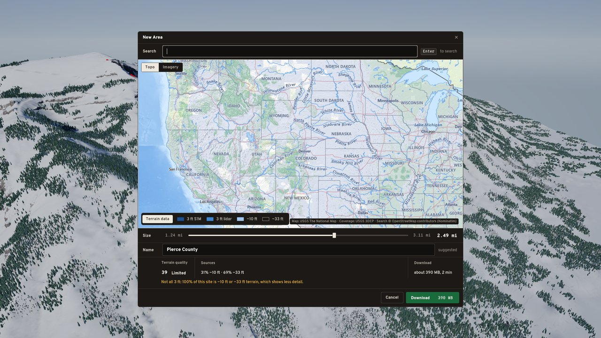
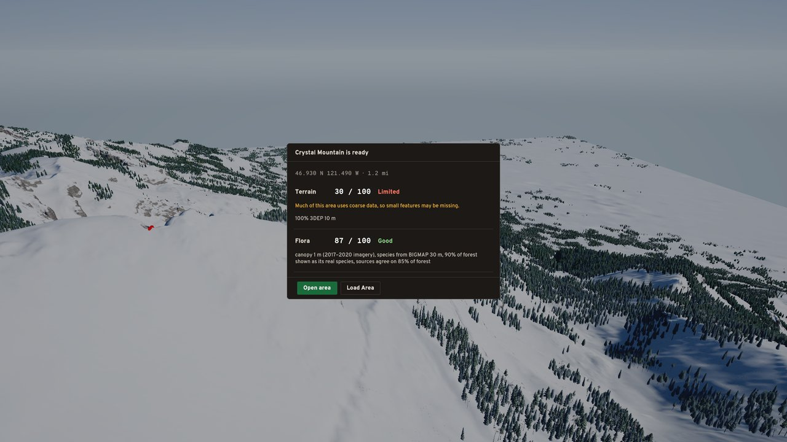
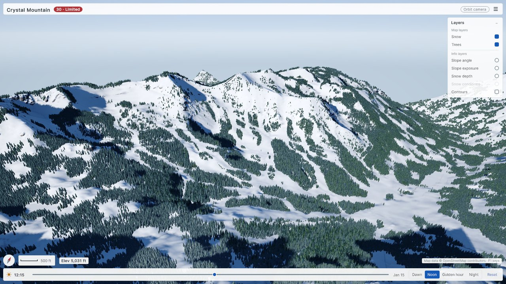

# Phase 1 · 16 Exit review: the mountain vertical slice

**Audience:** the project owner. **Date:** 2026-10-05. **Status:** for your review (gate ⛳). **Branch:**
`docs/p1-16-exit-review`, from main at de417a4. **Spec:** [0.7 row 16](phase0-0.7-phase1-plan.md#3-tasks), against the
exit criteria in [0.6 §2](phase0-0.6-milestones.md#2-phase-1-mountain-vertical-slice). **Next:** the detailed Phase 2
plan, [phase1-16-phase2-plan.md](phase1-16-phase2-plan.md).

**Result:**
- **Six of the seven criteria are met.** Criterion 7 is met by this review and the Phase 2 plan.
- **One part of criterion 3 is carried forward:** a real-data check of the join between the 1 m lidar and the backup
  terrain (decision E1).
- **Phase 1 took 11 days** against an estimate of 12–14 weeks, and it delivered a good deal more than it planned.

## 1. Exit criteria

The checks were re-run today, on main at de417a4, using the release game built from it.

| # | Criterion (0.6 §2) | Evidence | Re-checked today | Verdict |
|---|---|---|---|---|
| 1 | The picker downloads a new 2–5 km site from live providers, including a fallback area, and shows an honest quality score | Picker #58; download, card and library #59; T18 score tests (`AcquisitionTests`); `SitePickerTests.TheEstimateMatchesMeasuredDownloads` | Release game, scripted flow (`-flowcapture`) on a fresh library: a **live download of Crystal Mountain 2 km** (all 3DEP 10 m fallback) went from the picker to the quality card, which showed **Terrain 30 Limited** ("100% 3DEP 10 m", with the coarse-data warning) and **Flora 87 Good**. It then opened in 2.30 s, with all 293,135 trees by 2.65 s (screenshots below) | **Met** |
| 2 | A downloaded mountain opens in ≤10 s with the network disabled | `TerrainInUnityTests.TheDemoMountainOpensWithinTenSeconds` and `AppFlowTests.TheLibraryOpensAMountainWithTheNetworkOff`, both with the network off; `-offline` (demo.bat 39) | Release game, `-offline`, Jackson Hole 5 km from its cache: **everything in 6.24 s**. That is terrain 5.52 s, ground cover 6.13 s, and all 622,823 trees 6.24 s (a warm-up run took 6.91 s) | **Met** |
| 3 | The style-tile review passes: no blocky cover, no tile seams, no data seams | Style tile approved 2026-09-29 (#36, #40); soft cover #34; crackless tiles (`NeighbouringTilesShareIdenticalEdges`, `TheTestTerrainOpensOfflineAsCracklessTerrainMatchingItsSource`); forest seam at the core edge fixed in #61; fallback blend ≤0.2 m (`SeamsHaveNoStepAboveTwentyCentimetres`, synthetic data) | Not re-run (your choice) | **Met, except data seams on real data:** no downloaded area yet straddles 1 m lidar and the backup terrain. **E1** carries the check to Phase 2 task 12 |
| 4 | Reference PC (RTX 3060 Ti): frame p95 ≤20 ms at 1080p High on the Jackson Hole demo | [Benchmark report](phase1-benchmark-report.md) and [docs/perf](../perf/), commit 19d5e37 | Not re-run: #62 is the baseline, and nothing has rendered differently since | **Met:** 7.8 ms |
| 5 | Minimum-spec stand-in: about 55 FPS (p95 ≤18 ms) at 1080p Medium, VRAM within 6 GB | As above | As above | **Met:** 4.7 ms (about 210 FPS) and 1.3 GB of graphics memory. Real RTX 2060 hardware is Phase 2 task 11 |
| 6 | Golden tests are stable across repeated runs; engine-free tests run in CI | The CI job `dotnet-tests` (`.github/workflows/repo-checks.yml`), green on main; golden tests for ground cover and forest; the Burst-versus-C# forest test | `dotnet test` three times with LFS checked out: **266/266 passed each time, 0 skipped** (the goldens included). Unity batchmode: **EditMode 489 passed, 0 failed, 37 skipped** (all 37 are lift-asset cases that don't apply, such as "snow guns carry no rope"), including both goldens and `BurstAndPlainCSharpGrowTheSameForest`; **PlayMode 17/17 passed**, including `TheDemoMountainOpensWithinTenSeconds` and `TheLibraryOpensAMountainWithTheNetworkOff` | **Met.** CI skips the two goldens, because it fetches only the small LFS files, so they run locally before every cover or forest PR (**E2**) |
| 7 | Velocity versus estimate is recorded; the Phase 2 detailed plan is written | §2 below; [phase1-16-phase2-plan.md](phase1-16-phase2-plan.md) | — | **Met** on approval |

Repository checks passed (45 Markdown files, `.meta` integrity OK).

| The picker (estimate 39 Limited for this view) | The quality card after the live download | The area, opened |
|---|---|---|
|  |  |  |

The scripted capture leaves the picker's map zoomed out to the whole West, because it places the site without flying
the map there. That is cosmetic, and only in the capture.

## 2. Velocity

The plan ([0.7](phase0-0.7-phase1-plan.md)) was approved on 2026-09-25, and the last task (#62) merged on 2026-10-05.
**Phase 1 took 11 calendar days, against 12–14 weeks estimated, about 14 weeks of task time.** That is about 9× faster
than planned.

Merge dates are local time (Pacific). Branch work usually began a day or so before; many PRs were opened only just before merging, so the open-to-merge span isn't a measure of effort.

| # | Task | Est. | PRs | Merged |
|---|---|---|---|---|
| 01 ⛳ | Data spike (+ species-sampling fix) | 1.5 wk | #24, #29 | 09-26, 09-27 |
| 02 | Assembly migration | 0.5 wk | #25 | 09-26 |
| 03 | Georeferencing and grids | 0.5 wk | #27 | 09-26 |
| 04 | Acquisition pipeline and CLI | 1.5 wk | #30, #31 | 09-27 |
| 05 | Package, cache and library | 1 wk | #32 | 09-27 |
| 06 | Terrain in Unity | 1 wk | #33 | 09-27 |
| 07 | Ground cover | 1 wk | #34 | 09-28 |
| 08 ⛳ | Style tile and tree pipeline | 1.5 wk | #26, #35, #36, #40 | 09-27 → 09-29 |
| 09 | Forest at scale | 1.5 wk | #42 | 10-01 |
| 10 + 11 | Snow, lakes, edge; lighting and camera | 1.5 wk | #28, #45 | 09-26, 10-01 |
| 12 | Map layers | 0.25 wk | #48 | 10-02 |
| 13 | Site picker | 1 wk | #58 | 10-03 |
| 14 | Download UI, quality card, menu, library | 1 wk | #59 | 10-03 |
| 15 | Benchmark and budgets | 0.5 wk | #62 | 10-05 |
| 16 ⛳ | Phase 1 exit | 0.5 wk | this PR | — |

**Work added beyond the plan**, about 20 PRs:

| Area | PRs |
|---|---|
| Lift assets: Sessellift FGQ-4 pilot, towers, SLE snow guns, Monta FG4, Chairworks chairs (iteration 2 art, built early) | #37, #38, #39, #41 |
| Game UI direction: the Trailhead HUD layout, key map, layer mockup | #43, #46, #57 |
| New England species (Sugarloaf), and forest structure in dense stands (NE8) | #44, #47 |
| Info layers (slope, exposure, snow depth, contours) with the natural snowpack; imperial units and contour labels | #49, #50 |
| CC0 photo ground textures; snow-rendering design doc | #51, #52 |
| Beauty pass: the Bluebird grade, terrain AO, grass depth and forest-floor edges | #53, #54, #55 |
| Roads from OpenStreetMap | #56 |
| Polish: New Area naming, Exit to title, click-through; the forest seam at the core edge | #60, #61 |

**What went well:**
- Running tasks in parallel threads, with the coordinator sequencing reviews.
- The early style-tile gate, which settled the look before it was scaled up.
- Recorded fixtures and the engine-free test suite: 266 tests, running without Unity.
- Every budget held with large margins.

**What cost time:**
- **Cache churn.** Content changes bumped the terrain cache from v8 to v12. Players built on different versions deleted
  each other's caches (Phase 2 task 04 fixes this).
- **Shared GPU.** A shared-GPU clash skewed one benchmark, so the GPU now goes through a lock folder.
- **Blender previews** hid game-side problems (snow pattern, LOD pops, culling), so models are now audited against the
  game's rules first.
- **Regional forest calibration** was tried and dropped. It needs crown cover re-fitted first.

**For Phase 2's estimate:** the same ratio applies to build work, but not to steps that wait on people or hardware
(testers, a second PC, an RTX 2060). The Phase 2 plan therefore gives task-weeks plus a padded calendar forecast
(**E4**).

## 3. Decisions for this gate

| ID | Decision |
|---|---|
| E1 | **Data seams on real data move to Phase 2.** The fallback blend is tested on synthetic data (≤0.2 m step), and no downloaded area yet mixes S1M with the 3DEP fallback. Phase 2 task 12 downloads one that does and captures the join. Criterion 3 is accepted on that basis |
| E2 | **Golden tests stay local-only.** CI doesn't fetch the large LFS fixtures. A PR that changes cover or forest runs the full `dotnet test` locally with LFS checked out (266 tests, none skipped) and says so |
| E3 | **Phase 2 scope** is 0.6 §3, plus the ship-quality backlog: the Trailhead HUD build, light-theme text and solid panels, cache versions no longer deleting each other, Auto tree detail, the grey far impostors and the forest-floor discs. NAIP imagery is last and cut first. Seasons, the next species, regional calibration, the back-face tint and the broadleaf height spread are "Later" |
| E4 | **Estimates** are task-weeks per task, comparable with 0.7, plus a calendar forecast at Phase 1's ratio, padded for hardware, testers and reviews |
| E5 | **The milestone** (after you approve this PR): tag its merge commit `unity-m1`, and fast-forward `archive/unity` to it |
| E6 | **Ultrawide support is in Phase 2** (the owner plays on one): 21:9 and 32:9 layouts (task 01), the HUD (02), resolution and field of view that keep the vertical FOV (05), and a 3440×1440 benchmark (11), with 1080p staying the budget of record |
