# Phase 1 · Style tile review, part 2

**Audience:** the project owner. **Status:** for your review. **Date:** 2026-09-29. **Part of:** task 08 ⛳, the style tile ([0.7](phase0-0.7-phase1-plan.md), [0.5 §7](phase0-0.5-art-direction.md#7-the-style-tile-the-first-art-milestone-in-phase-1)). It follows part 1 (terrain shader, ground textures, cliff shells) and [the tree realism review](phase1-trees-review.md), both in PR #36.

**Result:** the rest of the style tile is in. Trees move in the wind, frozen lakes show under the snow, the map sits on a diorama base, and four lighting presets set the mood, with light distance haze and the first real HUD. Every piece was measured: together they add **0.04-0.85 ms GPU**, and the slowest frame (p95) in any benchmark view is 13.2 ms, within the 20 ms budget.

## Try it

1. `demo.bat` → **18** (rebuild the game; close the Unity editor first), then **17** to fly.
2. **B** cycles the wind: calm, breeze (the default), strong. Zoom in to a forest to see trunks sway, branches bob and needles flutter.
3. Fly south of Teton Village to the ponds. **N** switches the snow off: the lakes turn to dark ice.
4. Zoom out, or fly past the edge of the map: the diorama base.
5. **L** cycles the light: dawn, noon (the default), golden hour, night. **M** toggles the haze.
6. The HUD: click the layer rows, the compass (north up), the preset buttons. **Esc** opens the menu (theme switch, Quit), **H** hides all UI, **F1** shows every key.
7. `demo.bat` → **21** runs the benchmark (needs the 5 km Jackson Hole download, 12).

## Wind in the trees

Trunks lean downwind and sway (0.3 Hz), branches bob (1.2 Hz) and needles flutter (6 Hz), from the weights the Blender build already bakes into vertex colour. Each tree has its own phase, and gusts roll across the forest (crests 60 m apart). The wind is applied where trees are placed, so shadows sway with their trees. Only the two nearest levels of detail carry it, and it fades out from 250 to 450 m, where even strong sway is under a pixel.

Branches in strong wind, a quarter of a second apart:

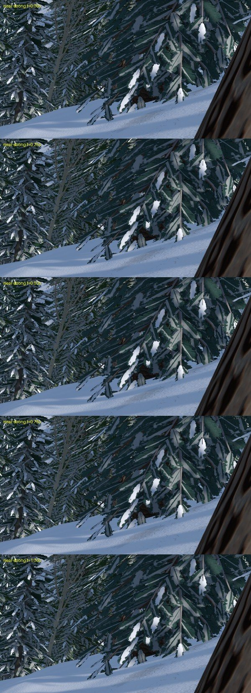

*Measured:* the first version cost up to 1 ms because every mesh LOD carried the wind code, even far trees that never move; limited to LOD0-1 (and off in calm) it costs 0.2-0.4 ms in the forest views and 0.9 ms in the ring-forest view.

## Frozen lakes

Lakes were invisible with the snow on: snow took each texel's whole weight, so the terrain shader's lake shading never ran. Now snow lies on the land only, and where there is water the shader draws flat, wind-packed snow with about a metre of blue-grey ice at the waterline and pressure cracks along the shore. Streams stay faint snow-filled channels. With the snow off the lakes are clear dark ice.

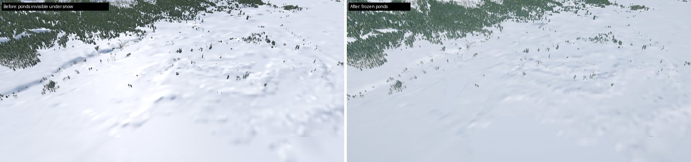

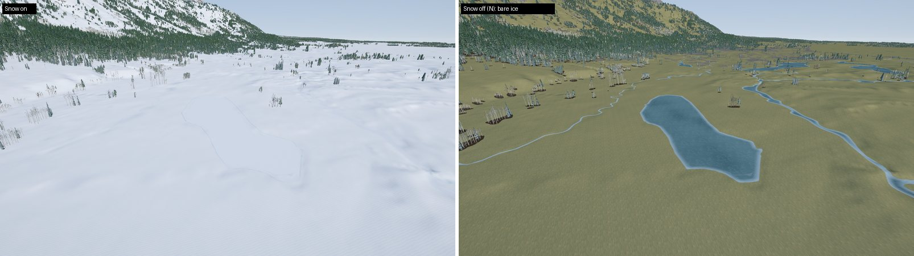

Tried and dropped: wind-scoured patches of bare ice, which read as grey smudges.

## Diorama base (A1)

Where the downloaded data ends, walls of stylized rock strata run from the terrain's edge down to a thin charcoal plinth: the model-railway section cut. The wall tops follow the terrain every 2 m, capped in snow; on the mountain side the wall is over a kilometre tall.

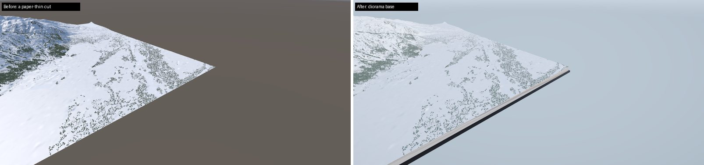

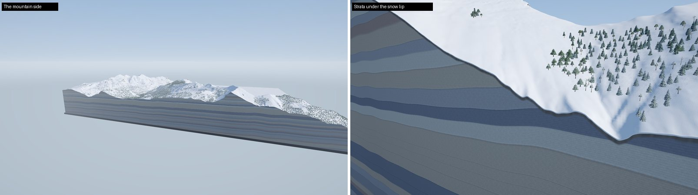

## Lighting presets

Dawn, noon (the default), golden hour and night, each with a sun or moon from its mid-January position over Jackson Hole (the noon sun is now in the south; it came from the north-northwest before), a gradient sky with stars at night, sky light for every shadow, and colour grading. Bloom only at golden hour. Below the horizon the sky is a soft backdrop, so the diorama floats in a clean space.

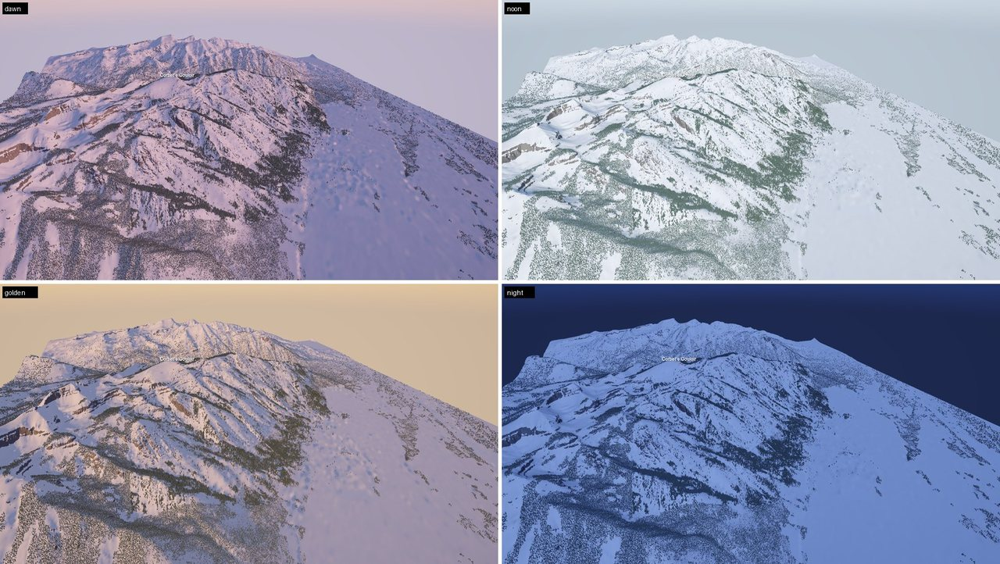

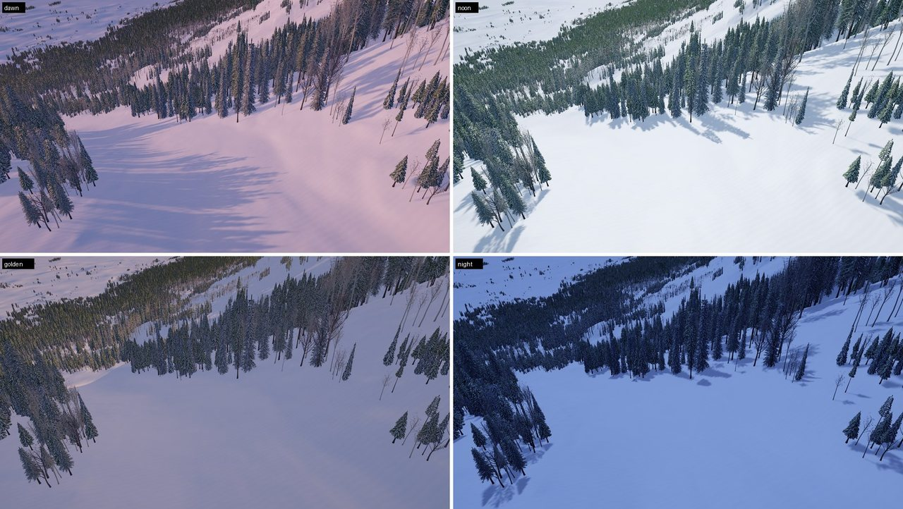

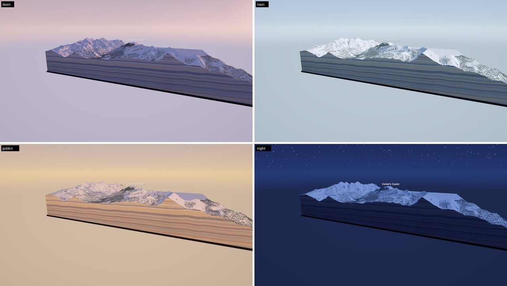

*A performance trap, found and fixed:* switching post-processing on first cost **2.2x the GPU time** in every view. The camera still asked for a depth texture and an opaque texture (project-template defaults nothing uses), and with post-processing and MSAA on, URP drew the whole scene a second time to make them. The camera now asks for neither, and the presets with grading cost at most 0.1 ms.

## Distance haze

Very light aerial perspective: nothing within 3 km, easing in to 35% by 18 km, toward the preset's horizon colour, in all five surface shaders alike. **M** toggles it.

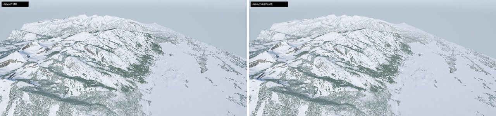

## HUD mock (S6)

The mountain view's HUD in UI Toolkit, in both themes from the 0.4 tokens: name and quality badge, menu, layers, compass, scale bar, elevation under the pointer, and a time bar with the presets. The font is Inter, Unity 6's default. The OpenStreetMap credit stays on screen.

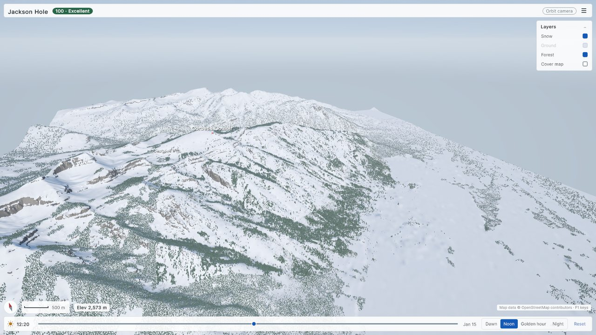

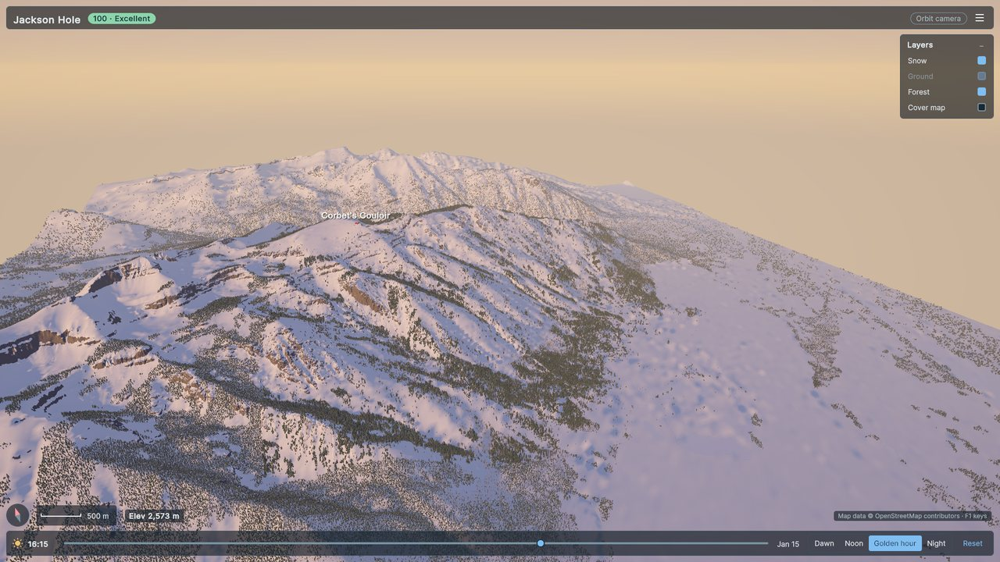

Still mock: Ground and Imagery rows (task 12), the time and date scrubbers (task 11), Settings (S8), and a free-fly camera mode.

## Performance audit

Jackson Hole 5 km (810,249 trees), 1080p, RTX 3060 Ti, shadows 150 m, one warm-up run before each measured run. GPU mean in ms with frame p95 in brackets; *main* is `108b343` (before this work), *style tile* is this branch with the HUD hidden and the wind in a breeze.

| View | main GPU (p95 frame) | style tile GPU (p95 frame) | Change | with HUD |
|---|---|---|---|---|
| overview | 3.88 (8.1) | 3.92 (4.6) | +0.04 | 4.03 |
| corbet | 3.21 (7.3) | 3.26 (4.0) | +0.05 | 3.29 |
| valley | 4.74 (7.8) | 4.89 (5.5) | +0.15 | 5.11 |
| slope | 5.90 (9.1) | 6.14 (6.7) | +0.24 | 6.24 |
| forest | 7.46 (9.6) | 7.70 (8.3) | +0.24 | 7.81 |
| inforest | 7.24 (9.4) | 7.70 (8.6) | +0.46 | 7.82 |
| cliffs | 2.69 (7.5) | 2.76 (5.8) | +0.07 | 2.78 |
| ringforest | 11.47 (13.2) | 12.32 (13.2) | +0.85 | 12.49 |

Almost all of the change is the wind (see above). Lakes, the diorama base, the presets, grading and haze are each within about 0.1-0.2 ms, around run-to-run noise (±0.2 ms). *main*'s frame p95 was measured on a busier machine; the GPU means are the comparison. Visible trees per LOD are identical in every view.

New review flags: `-wind`, `-light`, `-nohaze`, `-nopost`, `-nohud`, `-withhud`, `-theme dark`, `-clip <prefix>` (3 s at a fixed 24 fps).

## Tests

EditMode 193/193 (new: wind, splat composition with water under snow, diorama geometry, lighting presets), PlayMode 4/4, engine-free tests 163/163, repository checks. The golden hashes are unchanged: no cache or package format changed.

## Flagged for later

- The camera can fly outside the diorama (task 11: camera bounds).
- The snow ground shows periodic ripples; needle-litter marks near trunks look like scratches; the camera can't get closer than 20 m.
- Noon could have bluer, darker shadows if you'd like more contrast; the preset values are one table (`LightingPreset.All`).
