# Phase 1 · Task 09 trees: adversarial audit

**Audience:** the project owner. **Status:** 🟨 for your review. You approved all five fixes. They are applied in Blender and re-measured ([After the fixes](#after-the-fixes)); nothing has been imported yet. **Date:** 2026-09-30. **Audits:** the four new models in [the task 09 trees review](phase1-09-trees-review.md), against the eleven trees already in the game.

You asked for *"an adversarial audit of the trees for quality and compared to other trees in game"*.

**Verdict:**
- **Not ready to import as built.** Two of the four models fail in the game's winter, which is the only season iteration 1 shows.
  - **Pacific silver fir** carries almost no snow, and it is Crystal Mountain's most common tree.
  - **Noble fir** carries little snow from the game's camera angles.
- **Krummholz is placed in ways that hurt it.** The game's LOD and culling rule hides it at overview distances, and long mats float or sink on slopes.
- **Western hemlock passes every test.**
- **All of these fixes are cheap.** The plan is at the end.

## How the audit worked

The review renders couldn't catch most of this, because the Blender preview isn't the game. So the audit measures each model the way the game uses it. The tool is [`audit_trees.py`](../../tools/assets/trees/audit_trees.py); a full run takes about 2.5 minutes.

What it measures:
- **The game's rules, read from its code.**
  - LOD and culling: `ForestCull.compute` with a 60° field of view and `lodBias` 2.
  - Snow: `SnowPattern` in `TreeCommon.hlsl`.
  - Wind: `WindOffset` in `TreeInstanced.shader`.
  - Crown shading: `TreeShading.cs`, ported line by line.
  - Lighting: the wrapped sun and sky of `TreeLight`.
- **LOD fidelity:** each LOD's crown coverage relative to LOD0, framed exactly as `TreeImport` frames it.
- **Plus:** colour at a distance, silhouettes at equal height, slopes, texture coverage, and geometry and data sanity.

**Is the method right?** For the existing trees I compared its numbers with Unity's own report (`Art/Trees/fidelity.json`). The fifteen existing conifer variants match to within ±0.01-0.03; the deciduous trees, whose winter twigs are hair-thin, to within 0.11. The native heights match Unity's too: subalpine fir v0 is 17.30 m in Blender and 17.2956 m in Unity. So the new trees' numbers can be trusted, and the heights already sent to the forest thread are correct.

## Findings

### High

**H1. Pacific silver fir carries almost no snow in the game.**
- **Cause:** the game's snow pattern (`SnowPattern`, in the forest shader and in the impostor bake) assumes every spray card shows the whole texture, with the branch line at its centre (v = 0.5). Silver fir's two-half atlas puts each frond's axis at v = 0.25 or 0.75, so snow lands only on a sliver along one edge.
- **Measured:** in the game's shading, winter silver fir reads at **L\* 39.8**, against 52-62 for every other conifer.
- **Where it shows:** within ~200 m (LOD0) and beyond ~1.1 km, where the impostors are baked from LOD0.
- **The LOD1-2 cluster cards are correct,** so snow pops at both switches. The import's snow calibration would also pull LOD1-2 snow down toward LOD0's.
- **The review renders didn't show it.** They use Blender's preview material, which snows the whole card.

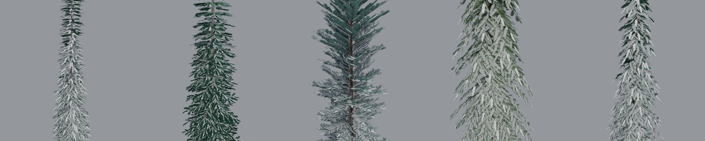

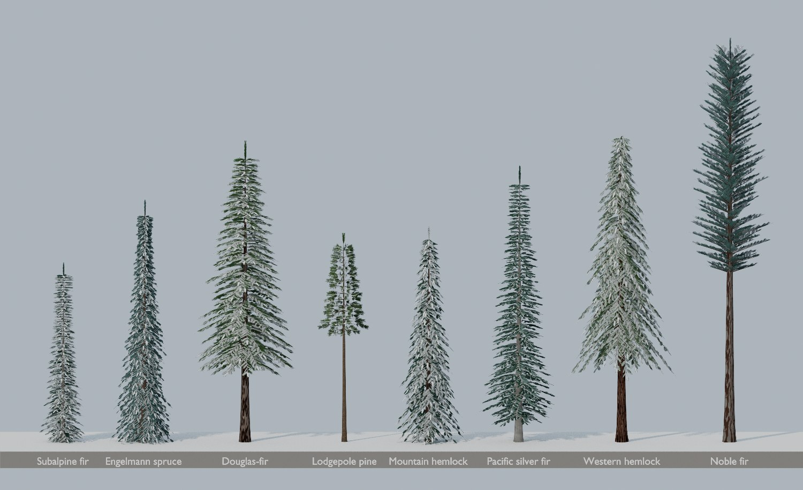

**H2. Noble fir carries little snow from the game's camera angles, and its branches are wrong for the species.**
- **Snow:** its branches rise 18-40° and its sprays tilt up further. A camera lower than that tilt (the game's views are mostly 20-45°) sees the cards' snowless undersides.
- **Measured:** winter **L\* 46.5**, against 52-62. In the 250 m stand below, the noble firs are the dark, bare trees at the back right.
- **References disagree with "upswept":** noble fir's first-order branches leave the trunk at right angles. They are short, stiff and horizontal, and only the twig ends and the needles turn up ([conifers.org](https://conifers.org/pi/Abies_procera.php), [OSU Landscape Plants](https://landscapeplants.oregonstate.edu/plants/abies-procera)). "Upswept" describes the needles and twigs, not the branches.

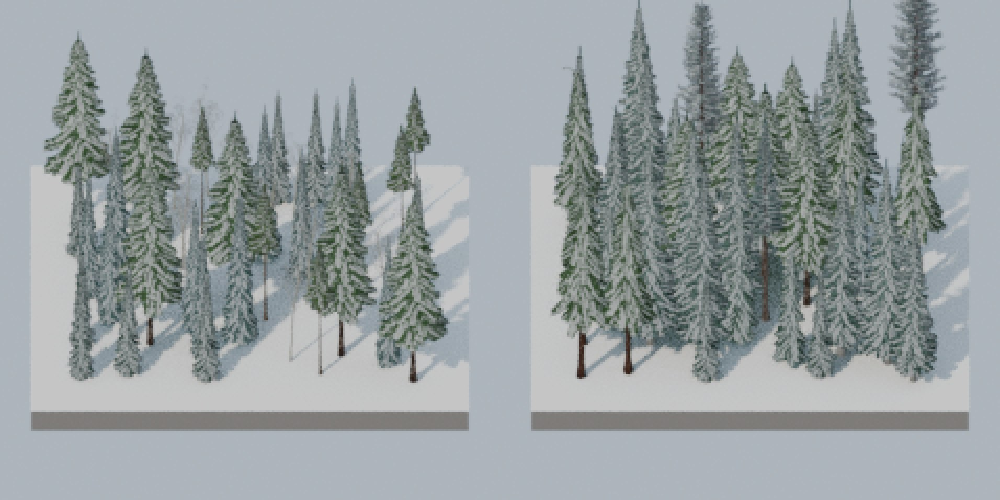

**H3. The game hides krummholz at overview distances.** This is the forest thread's renderer, not the models.
- **The rule:** `ForestCull` picks LOD and culls by tree height alone (height × 1.73 / distance against 0.25 / 0.10 / 0.05 / 0.003).

| Model | LOD0 until | Impostor from | Culled beyond |
|---|---|---|---|
| Trees, for comparison | 100-270 m | 0.5-1.3 km | 8.5-22 km |
| Mat (0.8 m) | 5.5 m | 28 m | **460 m** |
| Cushion | | | **875 m** |
| Flag tree | | | **1.86 km** |

- **Result:** at the usual overview distances of 1-3 km, the treeline band would show only a few flag trees.
- **It also pops at screen edges:** the culling sphere (radius 0.6 × height, about mid-height) doesn't contain the mat, whose foliage reaches 6.8 times that radius.
- **The model can't fix this:** raising its height would break height scaling.
- **The renderer can:** give `ForestCull` a per-prototype size, the larger of height and footprint, and a bounding radius taken from the prefab.

### Medium

**M1. Krummholz mats float or sink on slopes.** The game sets a tree's foot on the terrain and doesn't tilt it.
- **Mat with downwind pointing downhill:** at 25° it floats **1.5 m** at its tail (2.2 m at 35°; 0.6 m on flat ground).
- **Mat with downwind pointing uphill:** **64%** of its foliage is buried at 25° (76% at 35°).
- **Cushion and flag tree:** they cope better, with 7-38% buried.
- **The fix is on both sides:**
  - Placement (forest thread): mats only on gentle slopes, or krummholz tilted to the slope.
  - Model (mine): a shorter mat, 2.2-2.4 m instead of 3 m, to cut the error by about a third.

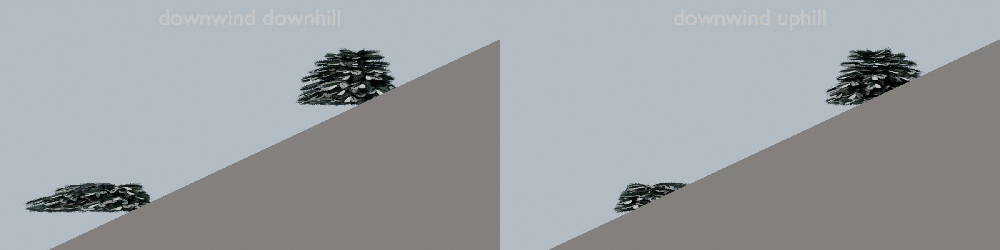

**M2. Silver fir's LOD1 thickens 36-42% from the side,** and its LOD2 by 9-20%. That is worse than the worst tree already in the game: Douglas-fir thickens 23-30%.
- **Root cause:** silver fir's LOD0 is the sparsest crown of all the conifers. From the side it covers 0.22-0.24 of its frame, against 0.29 for subalpine fir and 0.35 for spruce. Its card area per height² is 1.22-1.44, against 1.67-2.2.
- **How it happened:** squeezing it under the triangle budget thinned it, which also contradicts the "dense" trait.
- **The fix:** fewer, larger sprays (the same triangles, more cover) and narrower cluster cards.

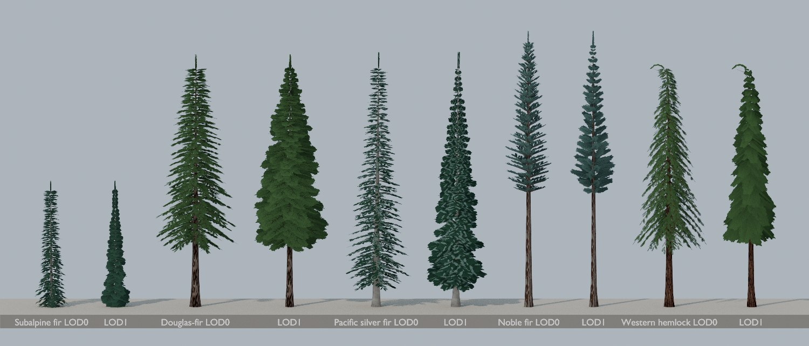

**M3. Silver fir's "silvery underneath" fails where it matters and costs darkness where it doesn't.**
- **Share of visible foliage that shows the pale underside half:**

  | View | Underside share |
  |---|---|
  | From below | **17%** |
  | From the side | 31% |
  | From 20° | 19% |
  | From 45° | 7% |
  | From 70° | 3% |

- **From below,** you mostly see the backs of the flat sprays, which show the dark top texture.
- **At a distance,** its crown reads lighter than subalpine fir's (L\* 25.9 against 23.8), although its top texture is darker (22.4 against 26.6). So "dark glossy green" is lost.
- **At LOD1,** its cluster cards show pale chevrons that read as frost.
- **My review doc overstated this trait.**
- **What would work:** real undersides need the forest shader to tint back faces. The shader already knows which face it is drawing (`SV_IsFrontFace`), but that file belongs to another thread.

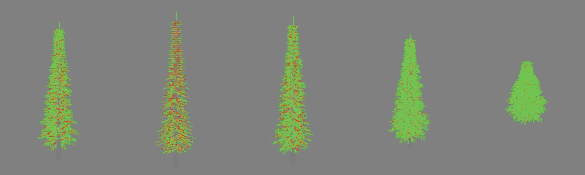

**M4. Krummholz branches would flap in the wind.**
- The trunk-sway weight is scaled for its stiffness (R ≤ 0.18), but the branch-flex weight (G) isn't.
- The shader's branch bob is a fixed 12 cm at branch tips, which is 15% of a 0.8 m mat's height.
- **The fix:** scale G as well (my code).

**M5. The preview renders can't show the game's snow.** The Blender preview material snows the whole up-facing card and ignores `SnowPattern`. That is why the review package showed silver fir and noble fir snowy. **The fix:** port the pattern into the preview material, as the audit tool does.

**M6. Process: species.json must not be committed on its own.**
- **Now:** the working tree fails `TheSpeciesMapMatchesTheTreeLibrary`, 1 of 163 engine-free tests. species.json lists 15 models and `SpeciesMap` lists 11.
- **The trap:** a `SpeciesMap` entry without prefabs would index past the prototype set at runtime.
- **The rule:** the commit must carry species.json, `SpeciesMap`, the test line and the imported prefabs together. That was already the plan; this records why.

### Low, and what passed

- **Western hemlock passes everything:**
  - LOD1 0.95-1.03 and LOD2 0.73-0.86, in line with mountain hemlock;
  - full winter snow (L\* 57);
  - colour within the conifer range (L\* 28.0, chroma 20.7, like Douglas-fir);
  - a silhouette distinct from mountain hemlock's (overlap 0.51);
  - a lacy spray (alpha coverage 0.26, the most open of the firs and hemlocks).
- **Silhouettes are distinct.** Compared at the same height, silver fir and subalpine fir overlap 0.56. Subalpine fir and Engelmann spruce, two species the game already tells apart, overlap 0.68. Noble fir and subalpine fir overlap 0.36.
- **Colour range (no snow, game shading).** The new conifers sit inside the existing conifer range (L\* 23.8-28.0): silver fir 25.9, noble fir 26.9 (the least saturated, bluish) and western hemlock 28.0. Krummholz is the darkest model at L\* 21.2. That is 2.6 below the range, as its darker palette asked for, and it is acceptable against snow at the treeline.

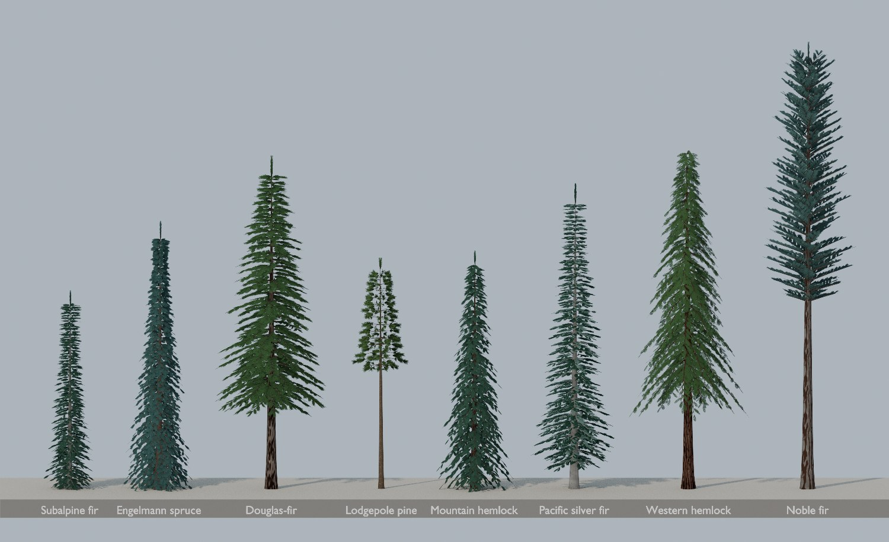

- **Krummholz crown shading is fine.** `TreeShading` measures every crown round the trunk axis, which I suspected would darken the mat's upwind side. Mean foliage occlusion is 0.69-0.71 against 0.70-0.74 for the trees, so there is no problem.

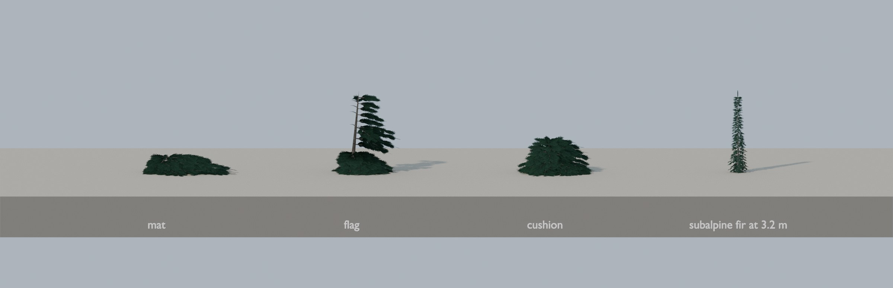

- **Sanity checks pass:** no degenerate faces or NaNs; wind channels in range; flutter is 0 on bark; UVs and snow capacity are within 0-1. Below-ground foliage is 0-0.25% of card area, while the existing conifers already have 0.3-1.6% (spruce reaches 1.2 m down).
- **Noble fir's spray texture** is a crisper herringbone than the other fronds: a small style outlier.
- **Botany:**
  - Pacific silver fir matches: a dense conical crown, needles combed forward over the twig, grey blistered bark ([Virginia Tech dendrology](https://dendro.cnre.vt.edu/dendrology/syllabus/factsheet.cfm?ID=182)).
  - Western hemlock matches: a drooping lead shoot, dark reddish-brown furrowed bark, delicate foliage ([Wikipedia](https://en.wikipedia.org/wiki/Tsuga_heterophylla)).
  - Krummholz matches: flag trees lower, flag-mats and mats upslope ([Wikipedia](https://en.wikipedia.org/wiki/Krummholz)). That is the forest thread's band order.
  - Noble fir fails on its branches (H2).

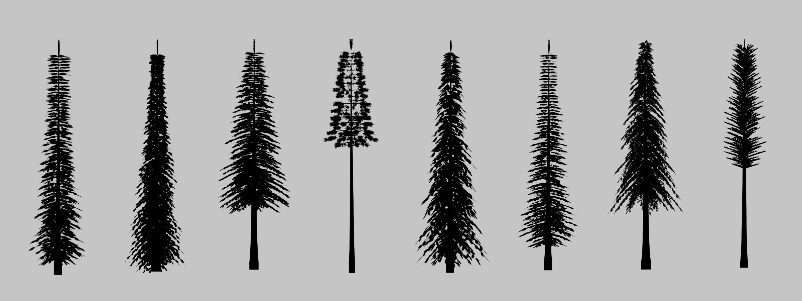

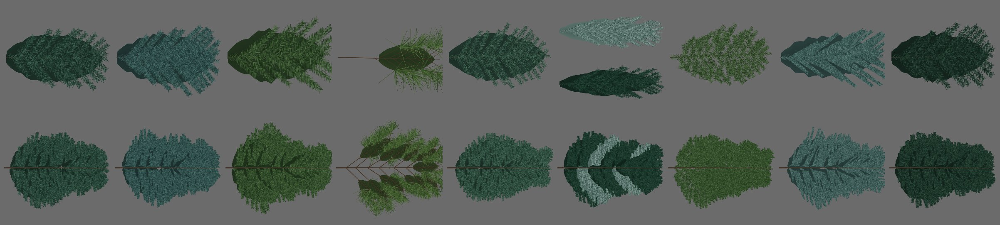

## Proposed fixes

**In my files (Blender only; no Unity until you approve):**

| # | Fixes | Change |
|---|---|---|
| 1 | H1, M2, M3 | **Silver fir:** drop the two-half atlas, which fixes the snow. Keep a subtle silvery sheen in the single spray texture. Use fewer, larger sprays for a denser LOD0 and LOD1 within 15% of it. |
| 2 | H2 | **Noble fir:** stiff, horizontal branches (0-8°), with upturned sprays and needles. Its winter snow should then match the other firs. |
| 3 | M4, M1 | **Krummholz:** scale branch flex as well as trunk sway. Shorten the mat to 2.2-2.4 m. |
| 4 | M5 | **Previews:** draw the game's snow pattern in the review renders, so they show the snow the game will. |
| 5 | | **Check and correct:** re-run the audit and re-render the review package. Correct the review doc's claims, in particular the silver underside and "dense". |

**For other threads (I'd message them):**
- **Forest thread:**
  - a krummholz LOD and cull size, plus bounds (H3);
  - a slope rule for mats (M1).
- **Shader owner, via the Master Planner:** a back-face tint in `TreeInstanced`, so firs can show true silvery undersides later (M3).

## After the fixes

**Your decisions:**
- apply all five fixes;
- give noble fir horizontal branches with the tips turned up, following the references;
- give silver fir a subtle silver sheen instead of the two-half atlas.

The table re-measures every finding with the same tool. The eleven existing trees are still bit-identical: all 150 meshes and textures match `main`.

| Finding | Before | After |
|---|---|---|
| H1 Silver fir's winter snow (L\*; other conifers 52-62) | 39.8 | **60.7** |
| H1 Cards showing only half a texture | 23% of silver fir's card area | **0** on every model |
| H2 Noble fir's winter snow, from 35° | 46.5 | **53.7** (lodgepole pine, the other long-boled conifer: 52.1) |
| H2 Noble fir's branches | rising 18-40° | **0-8°, stiff**, with sprays tipped up about 12° |
| H3 Krummholz culling (forest thread) | mat culled beyond 460 m | sized by sideways reach: mat LOD0 to about 21 m, culled at about 1.7 km |
| M1 Mat on a 25° slope, downwind downhill: largest gap | 1.5 m | **1.26 m** (2.3 m reach). The forest thread grows cushions instead of mats on cells steeper than 13°: at 15° the gap is 0.86 m (0.65 m on flat ground). |
| M2 Silver fir LOD1 / LOD0 crown, from the side | 1.36-1.42 | **1.11-1.17** (from 22°: 0.92-0.98) |
| M2 Silver fir LOD0 crown coverage, from the side | 0.22-0.24 | **0.27-0.29** (subalpine fir 0.29) |
| M3 Silver fir's colour at a distance (L\*; subalpine fir 23.8) | 25.9, lifted by the pale halves | **24.7**: dark green, with a faint sheen at the spray edges |
| M4 Krummholz branch flex (G), largest | 1.0 | **0.25** on the mat (0.6 flag, 0.35 cushion) |
| M5 Preview snow | whole cards | the game's `SnowPattern` and facing, in every review render |
| M6 Commit | | species.json, `SpeciesMap`, the test and the prefabs go in one commit at import |

**Other numbers after the fixes:**
- **Noble fir's LOD1 / LOD0 from the side:** 0.98-1.29, the same as Douglas-fir already in the game (1.23-1.30). From 22° up it is 0.76-1.02.
- **Silhouettes stay distinct:** silver fir and subalpine fir now overlap 0.60. The game already tells subalpine fir and Engelmann spruce apart at 0.68.
- **Card area per height²:** silver fir 1.85-2.19 and noble fir 0.98-1.39, inside the conifers' range (lodgepole 1.2-1.4, Douglas-fir 2.0-2.2).
- **Budgets:** every triangle budget still passes.
- **Native heights:** they are unchanged except the mat, now 0.87 m (was 0.80 m). The forest thread hard-coded 0.80 and has been told.

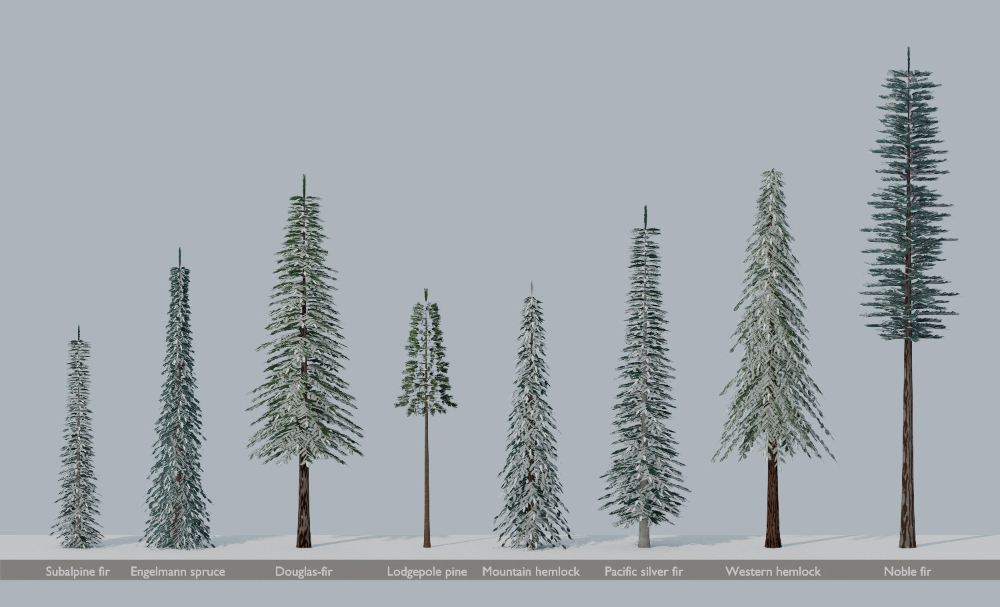

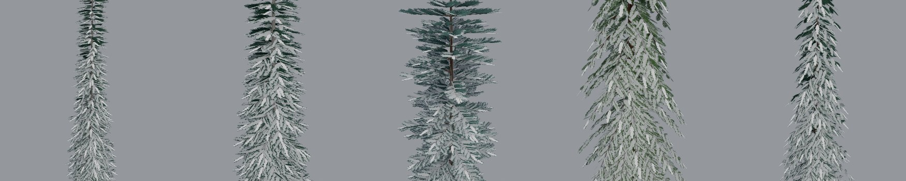

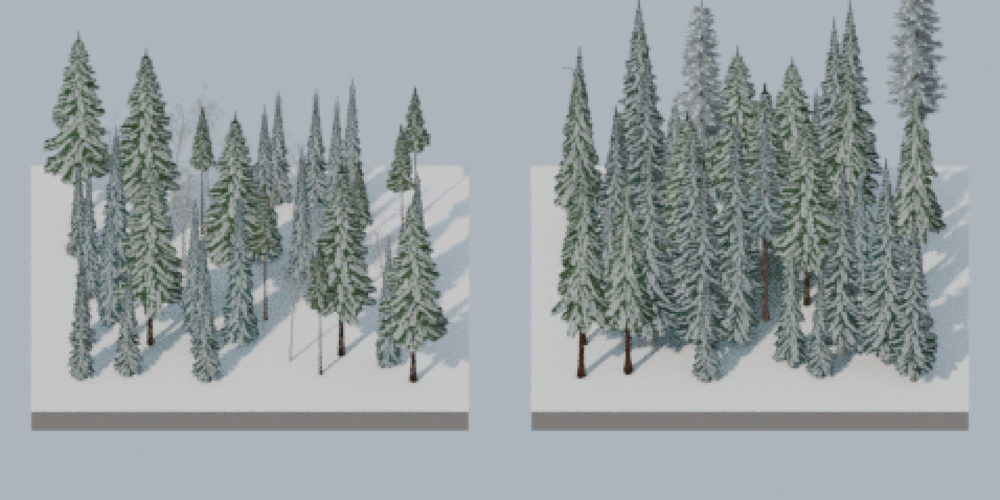

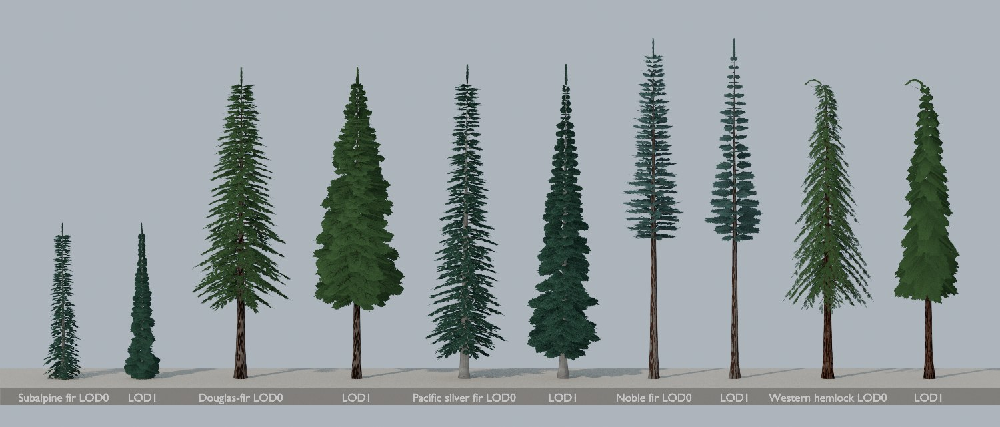

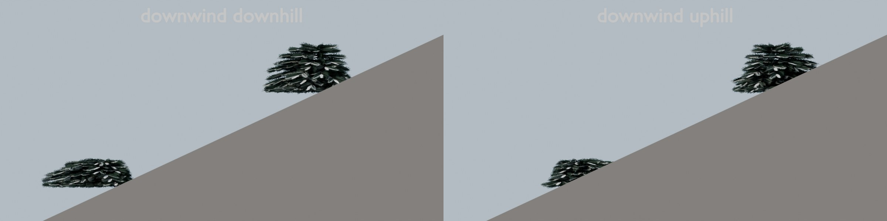

**Still open, outside my files:** a back-face tint in the forest shader for true silvery undersides (`TreeInstanced`, via the Master Planner).

## Run the audit yourself

`blender -b --factory-startup --python tools/assets/trees/audit_trees.py -- --out <absolute folder>` writes `audit.json` and the sheets into that folder, in about 2.5 minutes. `--species` and `--sheets` select a subset.
