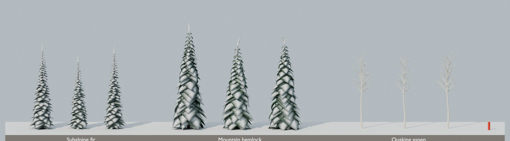
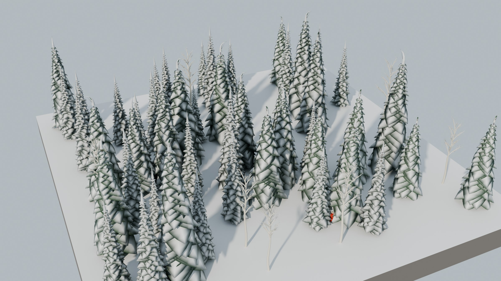
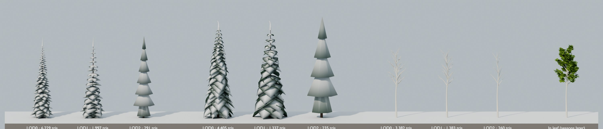
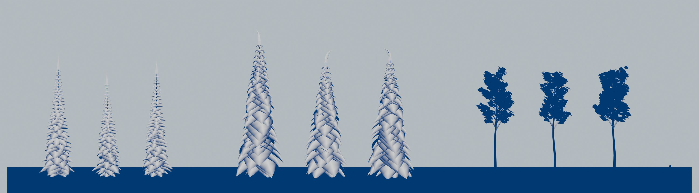
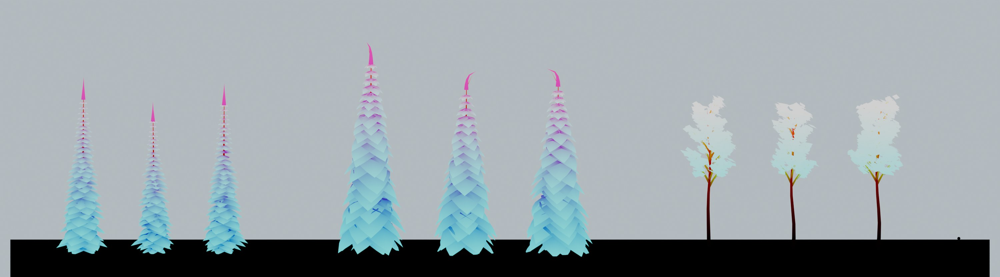

# Phase 1 · Trees, first look

**Audience:** the project owner. **Status:** ready for owner review. **Date:** 2026-09-26. **Part of:** task 08, the style tile ([0.7](phase0-0.7-phase1-plan.md)); the look is set in [0.5 §3](phase0-0.5-art-direction.md).

These are the three style-tile species: **subalpine fir** (Jackson Hole), **mountain hemlock** (Crystal Mountain) and **quaking aspen**, bare for winter. There are three variants of each, with full snow load. They're built by a Blender script ([`tools/assets/trees/`](../../tools/assets/trees/README.md)), not modelled by hand, so every species added later costs a parameter block rather than an artist's day.

These are **Blender renders, not the game**. In Unity the tree shader will add wind, the palette jitter per tree and the proper snow material; the shapes and data are what's being reviewed here.

## Lineup
Every variant at full detail (LOD0). The red figure is a 1.8 m skier.

## A grove, from a game-like camera

## Levels of detail
Distant trees switch to simpler meshes; beyond about 300 m an impostor takes over (baked in Unity later). On the right is the aspen **in leaf**: leaves are separate geometry, so seasons can be added later without new models (TR4).

## Data for the tree shader

**Snow mask.** White means full snow load and blue means none. Snow sits on the ridges of each branch mass; the flanks and undersides stay green.

**Wind weights.** Red is trunk sway, green is branch flex, and blue is needle and leaf flutter.

## Questions for you

Write your answer after each **Comment:**; "OK" accepts the recommendation.

**T1 · The look.** Is this the right direction for "real species, stylized" (TR1)?
- Tiered, faceted branch masses.
- Heavy snow load.
- Narrow spire for the fir.
- Broader, droopier hemlock with a nodding top.
- White-barked aspen.

Is anything too white, too busy or not recognizable? These are all cheap parameter changes.
**Comment:**

**T2 · Tree It.** The script makes these without Tree It, because Tree It can't be run unattended (it also crashed once on this PC today). **Recommendation:** keep the script as the main path, and use Tree It only if a species needs hand-shaping.
**Comment:**

**T3 · FBX instead of glTF.** 0.5 said to export glTF, but Unity imports glTF only through an extra package. FBX imports natively with LODs, vertex colours and both UV sets. **Recommendation:** use FBX.
**Comment:**

**T4 · Blender 5.2 LTS** is installed, rather than the 4.x LTS in the plan. It's the current LTS and works. **Recommendation:** pin 5.2 LTS.
**Comment:**

**T5 · Aspen bark.** The palette's deciduous bark is brown (`#5A4A3F`), but aspens are pale. **Recommendation:** add an aspen bark colour, `#D3D0C2`, to the palette.
**Comment:**

## Next
After your comments:
1. Tune the look.
2. Import the trees into Unity with the tree shader (wind, snow load, season hook) in the style tile.
3. Build the remaining Phase 1 species (task 09): Engelmann spruce, whitebark pine, limber pine, western hemlock, noble fir, Alaska yellow-cedar and krummholz.
