# Phase 1 · Trees, first look

**Audience:** the project owner. **Status:** round 3 answered 2026-09-27; the look, seasons plan and budgets are approved. **Date:** 2026-09-27. **Part of:** task 08, the style tile ([0.7](phase0-0.7-phase1-plan.md)); the look is set in [0.5 §3](phase0-0.5-art-direction.md).

**Later:** the [tree realism review](phase1-trees-review.md) (2026-09-28) reworked the LODs, needle textures, trunks and bark, and the snow on branches, and added impostors.

These trees are built by a Blender script ([`tools/assets/trees/`](../../tools/assets/trees/README.md)), not modelled by hand, so each new species costs a parameter block rather than an artist's day. These are **Blender renders, not the game**. In Unity the tree shader adds wind, per-tree colour jitter and the real snow material.

## Round 1 (2026-09-26): your answers
- **T1 (look):** *"While they look good, I want them to look a tad more realistic. But this is an excellent start. Can I also see some deciduous trees that might be found around Jackson NH?"* This is addressed below.
- **T2 (Tree It):** *"Did we demo Tree It at all? Should we? Right now I am liking Blender pending getting them more realistic similar to the Tree It demo."* Answered below (R2).
- **T3 FBX, T4 Blender 5.2 LTS, T5 aspen bark colour:** OK.

## Round 2 (2026-09-27): your answers
- **R1:** *"Branch density of individual evergreens looks low, but in the grove view looks much better. Do we have a plan for how trees will go from winter to spring to summer to autumn variants?"* Density is fixed in round 3, and the season plan is below.
- **R2:** don't demo Tree It for now. **R3** (start at medium snow load): OK. **R4** (keep the New England hardwoods): OK.
- **Also asked:** audit for performance. That's in the performance section below; round 3 adds build-time budgets.

## Round 3: what changed
- **Denser conifers from the side.** Needle sprays were mostly horizontal cards, which nearly vanish edge-on at eye level. Every conifer now has tilted second sprays, and firs, hemlocks and Douglas-fir add shorter internodal branches between whorls, as real ones grow. Compare the new lineup with round 2.
- **Performance budgets are enforced at build time** (below). Branch tubes were most of the cost, and they're now slimmer where the sprays hide them.
- **Seasons run from one model** (below). The five-stage render shows it.

## Round 2: what changed
**How realistic game trees are made.** Tree It, SpeedTree and most games build trees from a real branching skeleton with bark textures, dressed with **alpha-textured cards**: needle sprays, leaf clusters and fine twig silhouettes. Round 1 used solid shapes instead. The script now uses the card technique and generates every texture itself, so it stays free and repeatable:
- needle sprays in five styles (fir, spruce, hemlock, Douglas-fir, pine tufts);
- leaf clusters (maple, birch, beech, aspen) in summer and autumn colours;
- bare-twig silhouettes for winter;
- six bark types, including birch with black marks, Douglas-fir furrows and yellow-birch curls.

**Seasons now work.** Deciduous trees swap leaves (summer and autumn) and drop them for winter, leaving a fine twig crown. **American beech keeps its dry tan leaves through winter**, as it does in New Hampshire.

**The species come from the corrected BIGMAP data** (spike report §8; PR #29). Your Jackson, NH question uncovered a bug that had skewed the species lists.
- **Rockies and Cascades conifers:** subalpine fir, Engelmann spruce, Douglas-fir, lodgepole pine and mountain hemlock.
- **Jackson, NH hardwoods:** red maple (19% of biomass there), yellow birch (14%), sugar maple (9%), American beech (8%) and paper birch (4%), plus quaking aspen (19% at Jackson Hole).

## Conifers, winter
Two variants of each. The red figure is a 1.8 m skier.

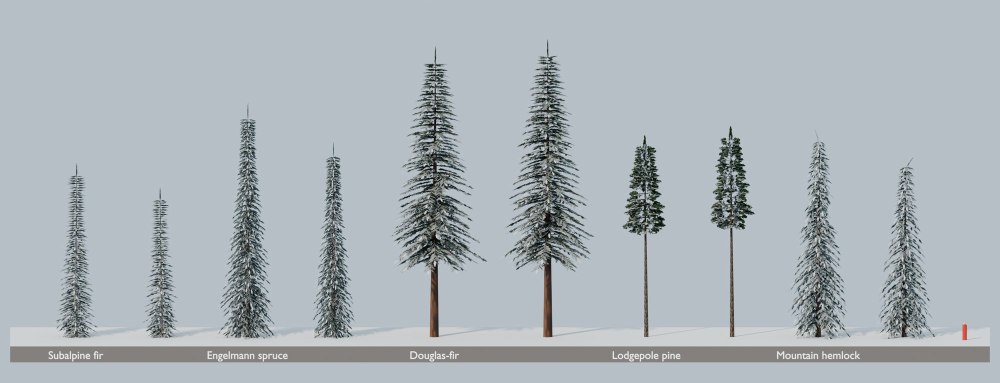

**Close up**, to judge needles and bark:

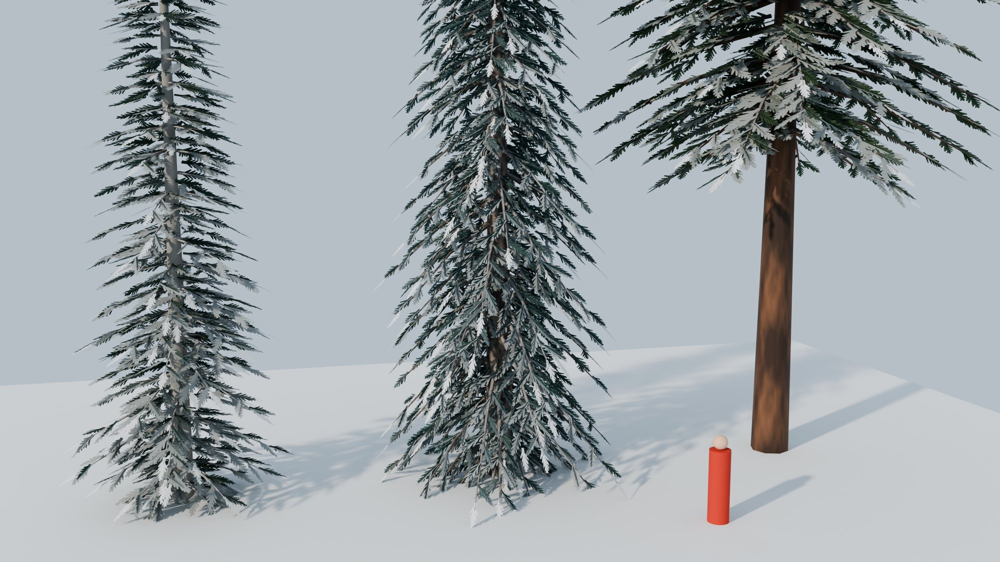

## Jackson, NH hardwoods (and aspen)
**Autumn:**

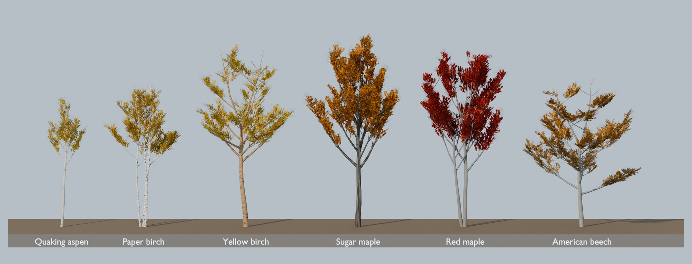

**Winter**, bare. Note the beech's retained leaves:

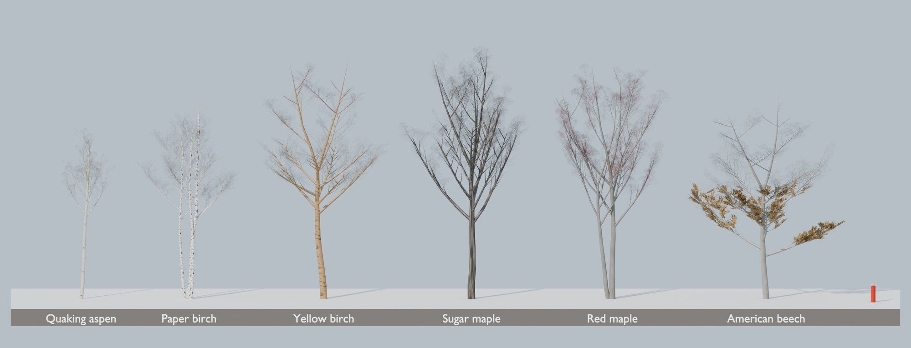

**Seasons:** sugar maple and paper birch through five stages: winter, spring leaf-out, summer, peak autumn and late-autumn leaf drop. It's the same model at every stage; only the season inputs change.

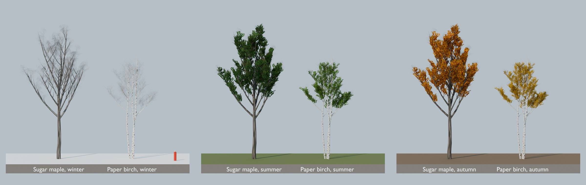

## Groves, from a game-like camera
**Jackson Hole mix** (by biomass): Douglas-fir, Engelmann spruce, aspen, subalpine fir and lodgepole pine.

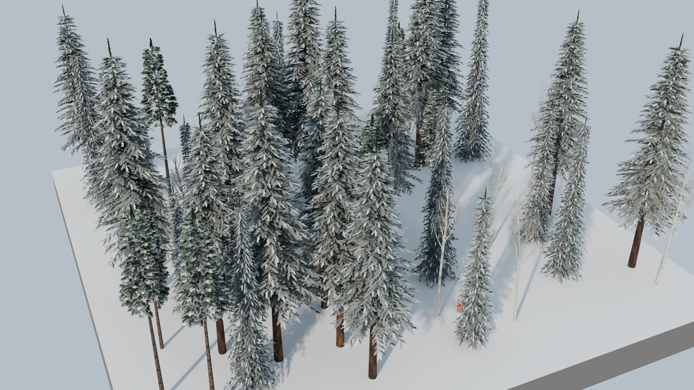

**Jackson, NH mix**, in autumn and in winter:

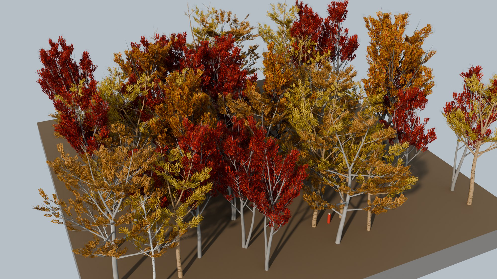

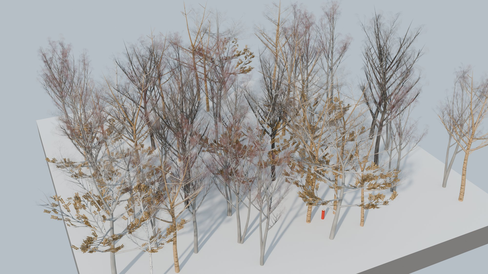

## Levels of detail and shader data
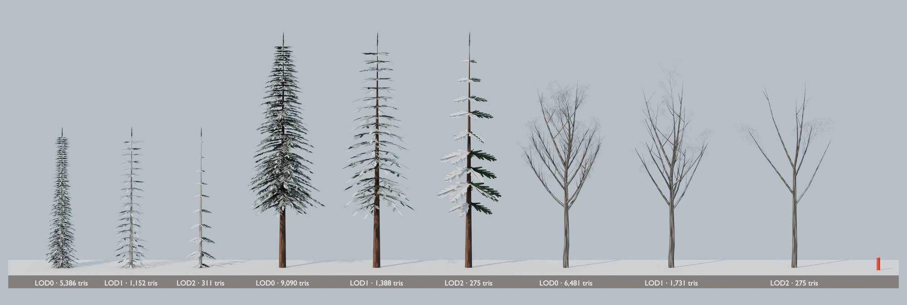

Snow mask (white = full load) and wind weights (red = trunk sway, green = branch flex, blue = flutter):

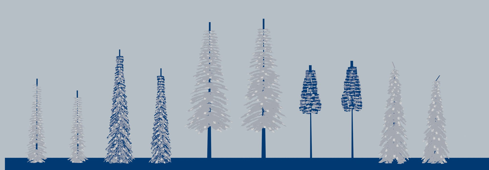
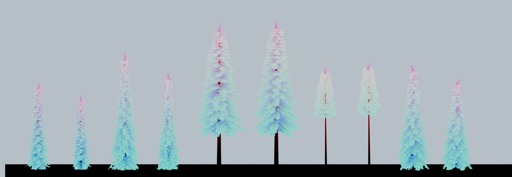

## Performance (round 3)

A 5 km site holds about 650,000 trees, so trees are the game's largest performance risk. **Every tree build now enforces a budget per tree and fails if any variant goes over**, like a failing test:

| Level | Used for (planned) | Budget | This build |
|---|---|---|---|
| LOD0 | 0–30 m | ≤ 10,000 triangles | 2.3k–9.7k |
| LOD1 | 30–80 m | ≤ 2,500 | 0.7k–2.4k |
| LOD2 | 80–150 m | ≤ 500 | 190–470 |
| Impostor | beyond 150 m | 2 | baked in Unity (task 09) |

The build also reports **alpha-card area per tree**, a proxy for GPU overdraw, which is often the real cost of foliage. The full audit plan is in [0.3 §8.1](phase0-0.3-technical-architecture.md). In short:
- asset budgets now;
- GPU time per 1,000 trees at each LOD, plus shadow cost and draw calls, measured in Unity in the style tile (task 08);
- the whole forest on the benchmark path in task 09 and task 15;
- a real RTX 2060-class machine in Phase 2.

Every PR that touches rendering states before-and-after numbers.

## Seasons: the plan

**One model per tree for the whole year; the shader moves it through the seasons.** There are no separate winter, spring, summer or autumn models, so there's no extra memory and no popping between models.

1. **Each tree carries the data now** (round 3):
   - every leaf card has its own random value (UV2.x) and its height in the crown (UV2.y);
   - every leaf is flagged as dropping, kept through winter (beech) or permanent (UV1.y).
2. **The tree shader has four season inputs** (TR4):
   - **leaves present**: leaf-out in spring, leaf drop in autumn, card by card in random order, so a crown fills in and thins out gradually;
   - **colour turn**: summer to autumn texture, staggered per card, so each tree turns patchily;
   - **spring tint**: new leaves are lighter and yellower;
   - **snow load**.
3. **A phenology table per species gives the dates:**
   - bud break, full leaf, first colour, peak colour and leaf drop, as days of the year;
   - shifted by the site's latitude and each tree's elevation. The classic rule is about 4 days later per 1° of latitude or per 120 m of elevation, so a mountain greens up from the valley upward and turns colour from the top down;
   - a small random offset per tree, so hillsides change gradually.

   The dates can be calibrated from public USA National Phenology Network data.
4. **The date comes from the clock:**
   - **Iteration 1:** the view-time scrubber (`ManualViewClock`) drives it, with winter fixed as the default (TR4).
   - **The future simulation:** the weather engine drives snow load, and a warm or cold year shifts the phenology.
5. **Conifers** change subtly: a slight winter bronzing and lighter new growth in spring.
6. **Distant trees:** impostors get a baked atlas for each season look (bare winter, summer, autumn), blended by the same inputs.

**Still to add in the style tile:** each leaf card's pivot, so spring leaves can also grow from small to full size, not only appear.

## Questions for you (round 3)

Write your answer after each **Comment:**; "OK" accepts the recommendation.

**R5 · Density.** Do the individual conifers look full enough now, compared with round 2?
**Comment:** They look great. Thank you.

**R6 · Seasons plan.** One model per tree, driven by the four season inputs and a phenology table per species (above). **Recommendation:** adopt it. The data is already in the trees, and the shader inputs are built in the style tile.
**Comment:** OK.

**R7 · Tree budgets.** LOD0 ≤10,000, LOD1 ≤2,500 and LOD2 ≤500 triangles, enforced at build time, with the Unity measurements in task 08 confirming or tightening them. **Recommendation:** adopt these as the starting budgets.
**Comment:** OK.

### Round 2 questions (answered)

**R1 · Realism.** Answered above.

**R2 · Tree It: should we demo it?** We haven't. It has only a point-and-click interface, so I can't run it unattended, and it crashed once here.
- The Blender pipeline now uses the same technique Tree It does (branches plus textured cards).
- **Recommendation:** try Tree It yourself for 15 minutes on one species, and export it as FBX. I'll put it through the same finishing steps (LODs, wind and snow data) and render it beside ours, so you can compare them directly. If Tree It clearly wins for some species, we use it for those. Or skip this if round 2 already looks right to you.

**Comment:** Let's not demo Tree It for now.

**R3 · Snow on conifers.** The previews show a heavy load, which is typical after a Jackson Hole storm. In the game the snow load is a single shader input, so it can follow the weather later. **Recommendation:** start the game at a medium load, and judge it in the style tile.
**Comment:** OK.

**R4 · New England trees in the library.** Phase 1 only needs the Jackson Hole and Crystal species. **Recommendation:** keep the five Jackson, NH hardwoods in the library now, because they're done. They're ready for any New England mountain a player downloads, such as Black Mountain, Wildcat or Attitash near Jackson, NH.
**Comment:** OK.

## Next
After your comments:
1. Tune the look.
2. Import into Unity with the tree shader (wind, snow load, season hook) in the style tile.
3. Build the remaining Phase 1 species (task 09): Pacific silver fir, western hemlock, noble fir and krummholz.
