# Phase 1 · Tree realism review

**Audience:** the project owner. **Status:** for your review. **Date:** 2026-09-28. **Part of:** task 08b, the style tile ([0.7](phase0-0.7-phase1-plan.md)); builds on [the trees' first look](phase1-trees-first-look.md).

You asked for *"an adversarial review of all tree models with the following goals: make the trees look more realistic while maintaining performance. I want the trees to look great up close and far but meet similar performance to now."*

**Result:** the trees look better at every distance and the forest is **10-45% cheaper on the GPU** in every benchmark view. The worst view (the ring forest) went from 20.9 ms, over the 20 ms budget, to 11.8 ms.

## How the review worked

Impressions aren't evidence, so the review started with tools, then measured every change against them:
- **Benchmark** (`-benchmark`, demo.bat 21). The game flies 8 fixed views of Jackson Hole and records GPU and frame times, visible trees per LOD, tree triangles and a screenshot of each view.
- **Lineup** (`-lineup`, demo.bat 20). Every species on flat snow, captured at each LOD forced from three angles, with close-ups and trunks. It also captures a mixed stand from 300 m to 3.2 km at natural LOD.
- **LOD fidelity report** (`Art/Trees/fidelity.json`, written on every tree import). For each tree it records how much crown each LOD shows and how bright and snowy it looks, relative to LOD0, from three camera heights.

## What was wrong, and what changed

| # | Finding | Fix |
|---|---|---|
| 1 | **Mid-distance trees were skeletons.** LOD1 and LOD2 kept only 8-49% of the full tree's foliage (lodgepole LOD2: 8%), so stands looked like herringbone frames from 30-150 m. | **Conifer LOD1 and LOD2 use branch-cluster cards:** a whole branch of fronds on one card, two per branch on LOD1 and one on LOD2, rolled so the crown stays full from the side. Deciduous LOD1 uses one larger leaf card per twig, and LOD2 crossed twig cards. Conifer LOD1 now shows 75-128% of the full tree's crown (mean 94%), and LOD2 59-108% (mean 80%). |
| 2 | **Far trees were crossed cards.** They showed black crowns, no snow and a bright stripe edge-on, and from 1.6-3.2 km forests turned into salt-and-pepper noise. | **Impostors.** Each tree variant is photographed at import from 64 directions over the upper hemisphere, storing colour, surface direction, shading and snow. Far away, it is drawn as one camera-facing quad (2 triangles) that blends the four nearest views and is lit by the real sun. |
| 3 | **Crowns were lit card by card:** flat, speckled and bright inside. | **Crowns are lit as volumes.** On import, foliage normals lean toward the crown's outer surface, and occlusion darkens the inside and lower crown. Every LOD uses the full tree's crown, so they all shade alike. Each tree also gets a few percent of brightness and warmth from its index, so stands stop looking cloned. |
| 4 | **Trees brightened, darkened or lost snow when they switched LOD**, and snow and width changed in steps with distance. | **Calibration.** The fidelity report measures each LOD's brightness and snow against the full tree, and the importer corrects them (brightness within ±25%). Distance effects are continuous: from 150 m to 1.6 km trees keep 35% of their snow and grow 8% wider. |
| 5 | **Needle sprays were round-capped "sausages"** covering about 40% of each card. | **Frond textures per species:** a tapering foliage body, side twigs and hundreds of needles, styled for fir, hemlock, Douglas-fir, spruce and pine. |
| 6 | **Up close, trunks were orange, 8-sided pipes.** The bark was blurred colour noise, there was no root flare, and on steep slopes the cut end showed on the downhill side. | **Bark with relief.** Eight bark styles are generated as height fields: ridged Douglas-fir, furrowed hemlock and maple, scaly spruce and lodgepole, smooth fir and beech with resin blisters and lichen, birch, aspen and yellow birch. Each gives an albedo with shaded furrows and a **normal map**, so the sun rakes across ridges. Trunks have 12 sides up close, a **root flare with 3-5 buttress lobes**, and reach 1 m underground. Douglas-fir is grey-brown now, not orange. |
| 7 | **Snowy sprays turned completely white**, so snow-loaded crowns read as white feathers. | **Snow lies along each branch.** It is heaviest toward the trunk and has ragged, clumpy edges, and the needle tips and fringes stay green. It covers about 60-80% of a fully loaded spray instead of all of it. It is lit as an upward-facing surface, so it reads bright, and impostors bake the same pattern. |
| 8 | **Shadows stopped 50 m from the camera**, so stands beyond that looked pasted onto the snow. | **Shadows now reach 150 m.** Trees shade each other and throw shadows on the snow, for at most +0.3 ms (the sweep is below). |

Per-tree triangle budgets are still enforced by the build: LOD0 is now 2.4k-9.9k triangles (limit 10k), LOD1 0.47k-2.3k (2.5k) and LOD2 197-489 (500).

## Before and after

The **forest at 250 m**: fuller, greener stands with snow on the branches, trees that shade each other, and shadows on the snow.

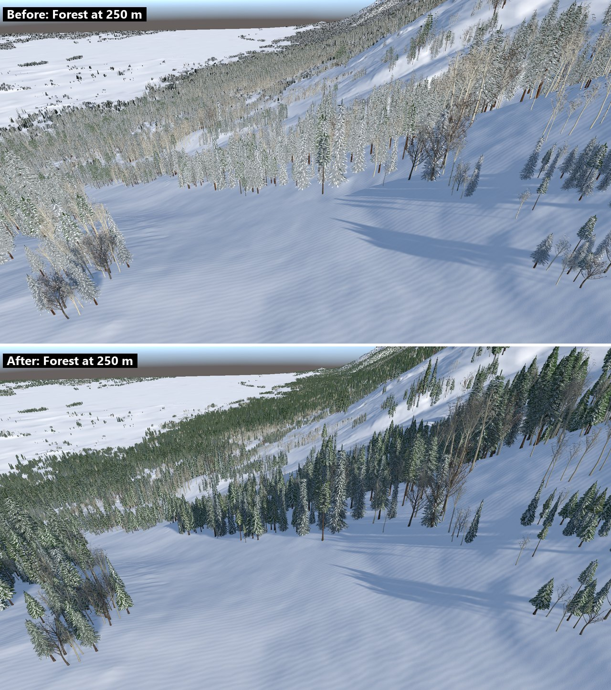

**Inside the forest:** bark with ridges and furrows, root flares, and snow along the branches.

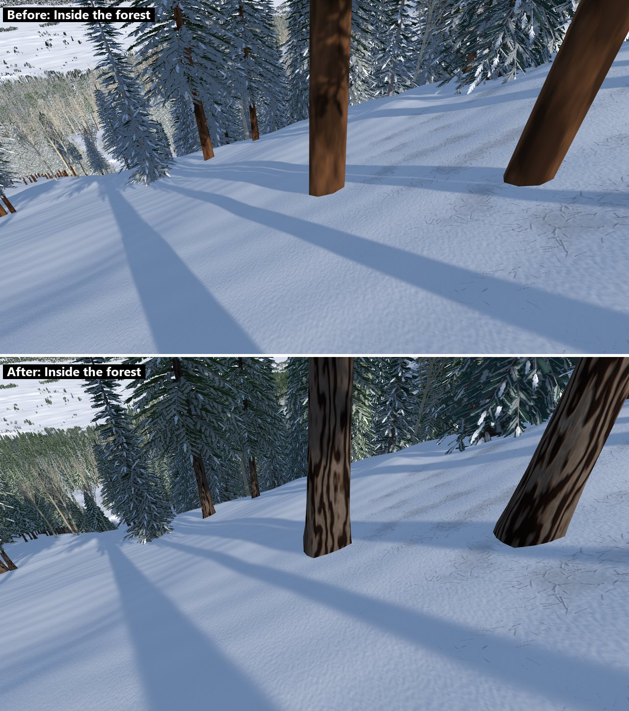

**Far away:** the ring forest and the valley. This used to be the most expensive view.

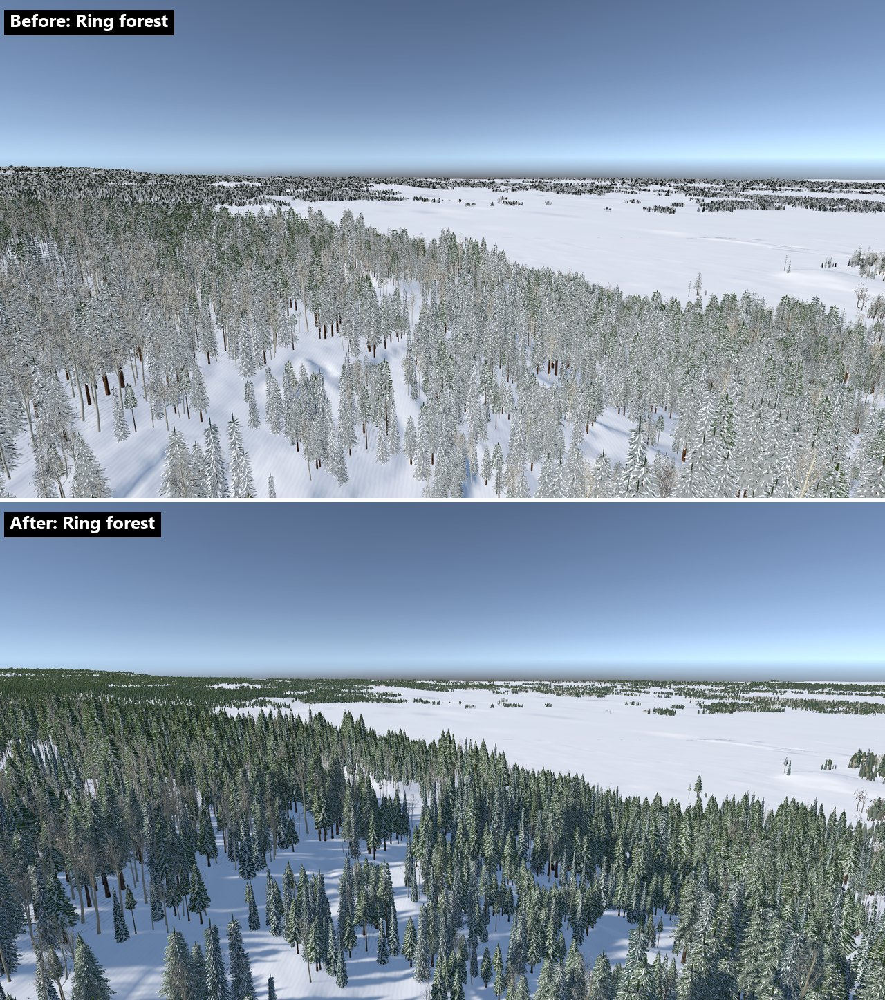

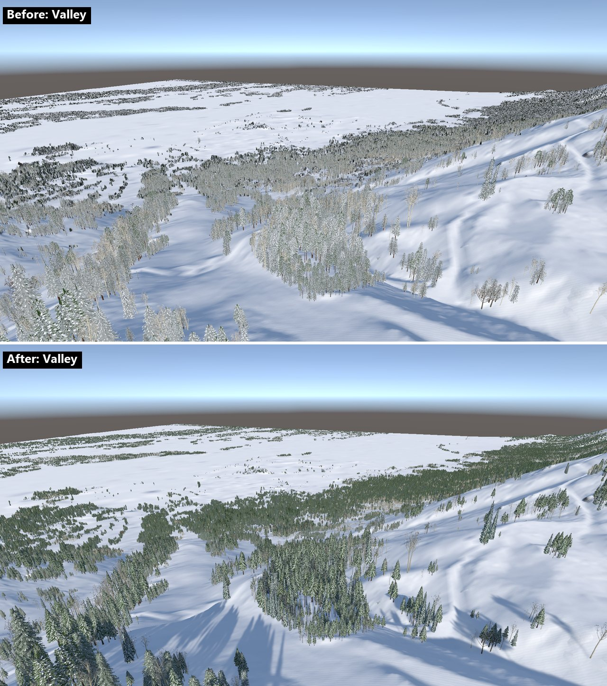

**The same stand from 300 m to 3.2 km.** It now keeps its colour and density at every distance, instead of drifting from frosted to dark.

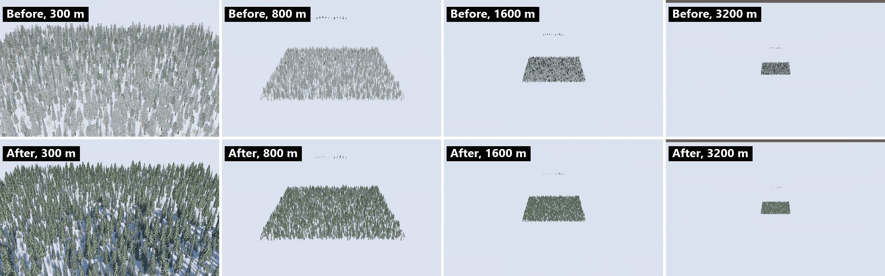

**Every LOD, forced, from the side.** LOD3 is the impostor, seen here much closer than the game ever draws it.

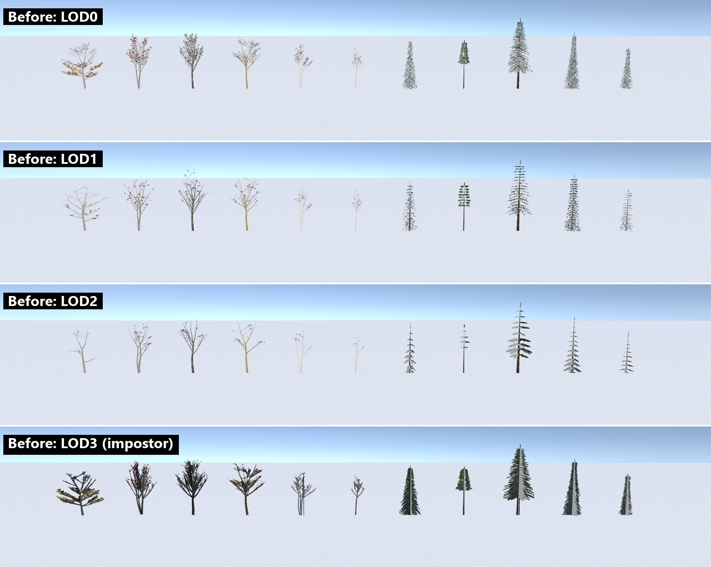

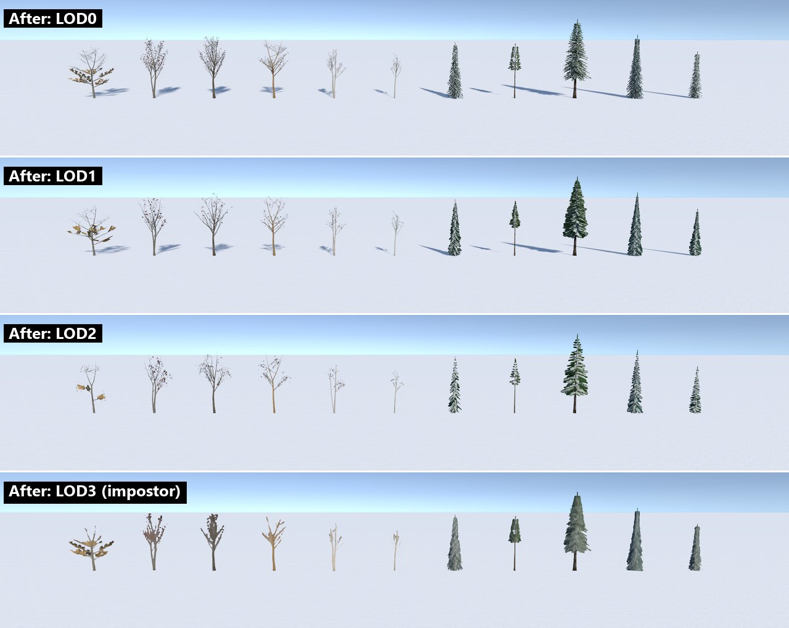

**Snow on the branches** (mountain hemlock) and **the 150 m shadows:**

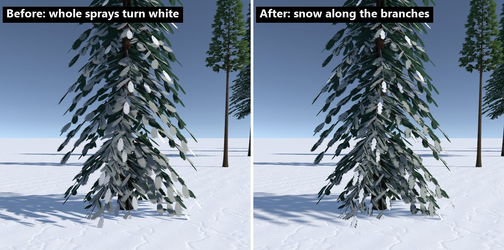

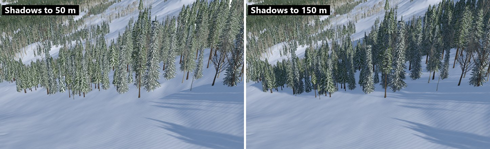

**Bark:** the textures before, then the new textures with each one's normal map and lit on a trunk (third column).

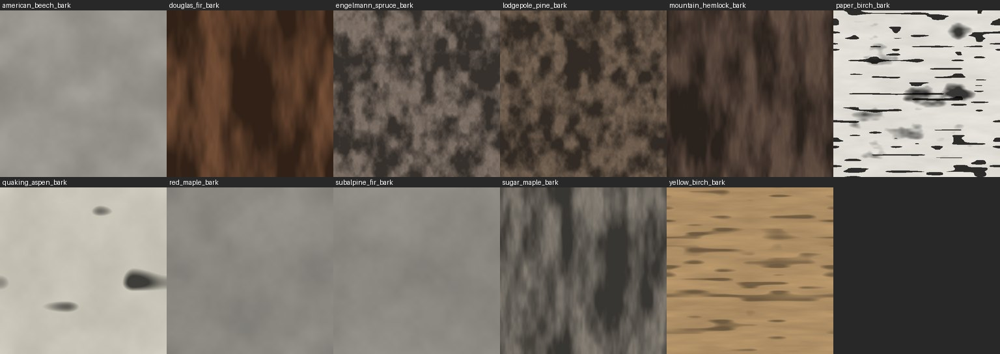

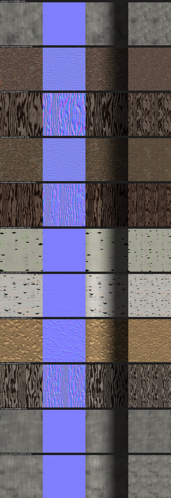

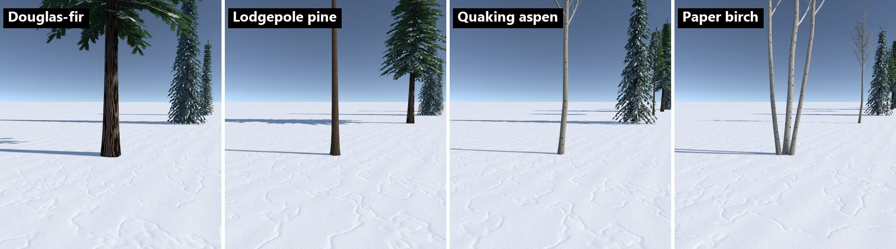

## Performance

Jackson Hole 5 km (810,249 trees), 1080p, reference PC (RTX 3060 Ti). Figures are means over 300 frames after 90 settling frames, from warm runs. "Before" is the game at the start of the review (commit `adb74e1`).

| View | GPU ms before | GPU ms after | Change | Frame p95 ms, before → after | Tree triangles, before → after |
|---|---|---|---|---|---|
| Overview | 4.29 | 3.86 | −10% | 6.4 → 4.6 | 2.2 M → 1.1 M |
| Corbet's Couloir | 4.45 | 3.23 | −27% | 6.4 → 4.6 | 3.6 M → 0.7 M |
| Valley | 8.91 | 4.86 | −45% | 10.2 → 5.5 | 9.9 M → 2.1 M |
| Slope | 9.29 | 5.98 | −36% | 10.6 → 6.4 | 7.5 M → 2.0 M |
| Forest (250 m) | 12.70 | 7.49 | −41% | 13.9 → 8.1 | 12.5 M → 3.5 M |
| Inside the forest | 11.06 | 7.38 | −33% | 12.4 → 8.8 | 10.8 M → 3.7 M |
| Cliffs | 4.25 | 2.75 | −35% | 5.9 → 6.0 | 4.1 M → 0.9 M |
| Ring forest | 20.92 | 11.78 | −44% | 21.6 → 12.5 | 16.8 M → 6.1 M |

Where the savings came from:
- **Impostors**, which let the full-geometry LODs switch out sooner (screen-height thresholds 0.25 / 0.10 / 0.05, impostor to 0.003).
- **Fuller but cheaper mid-distance LODs** (branch clusters instead of many small sprays).

What costs a little more:
- **The trunk and bark upgrade:** 0 to +0.4 ms, 1-2% more triangles.
- **The 150 m shadows:** up to +0.3 ms.

The branch-snow pattern cost nothing measurable.

Shadow distance sweep (GPU ms), before choosing 150 m:

| View | 50 m | 100 m | 150 m | 200 m |
|---|---|---|---|---|
| Forest (250 m) | 7.33 | 7.25 | 7.40 | 7.79 |
| Inside the forest | 7.11 | 7.22 | 7.31 | 7.56 |
| Ring forest | 11.40 | 11.44 | 11.70 | 11.97 |

Run-to-run noise is about ±0.2 ms. Every view is well inside the 20 ms p95 budget ([0.3 §8](phase0-0.3-technical-architecture.md#8-performance-budgets-and-hardware-t13)).

## Try it

1. **demo.bat 19** rebuilds the trees in Blender and imports them (optional: the imported trees are committed).
2. **demo.bat 18** rebuilds the game (close the Unity editor first).
3. **demo.bat 17** plays it. Fly into a forest (C flies to Corbet's Couloir, then zoom in). Press **T** to toggle tree snow.
4. **demo.bat 20** captures the lineup into `test-results\lineup`.
5. **demo.bat 21** runs the benchmark into `test-results\benchmark` and needs the 5 km Jackson Hole download (12).

## Not changed, and next

- **Wind** in the tree shader is next in the style tile, with frozen lakes, lighting presets and the HUD mock.
- **Seasons, krummholz at treeline, and per-region calibration** are still to do (tasks 08-09).
- **Lodgepole pine is greener and sparser than its neighbours.** That is deliberate: real lodgepole needles are yellow-green, in open tufts.
- **The sun comes from the north-northwest.** That's a lighting setting, so it is flagged for task 11 (lighting and camera).
- **The camera stops 20 m from what it orbits**, so the lineup's trunk shots aren't true close-ups. Inside a forest, the benchmark's view gets closer.
- **Heavy fresh-snow loading** (whole crowns white) is no longer the default look. When weather arrives, the snow-load input can widen the snow band on each branch.
