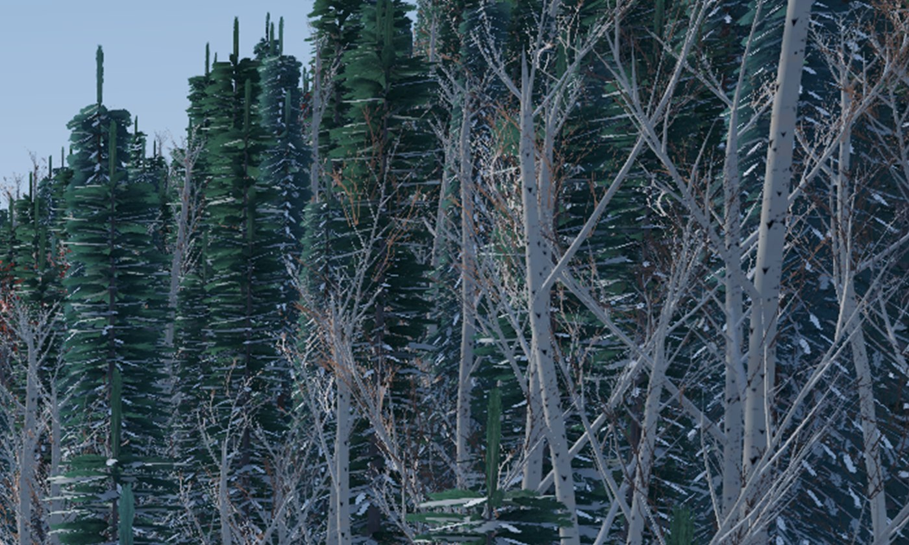
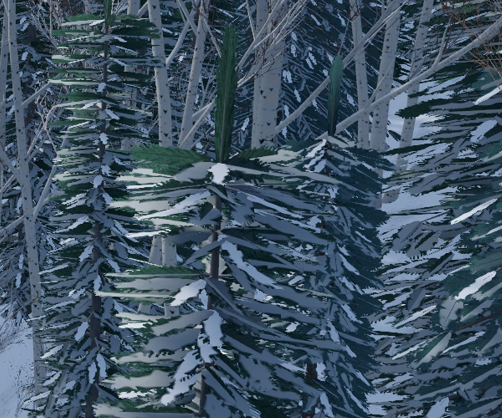
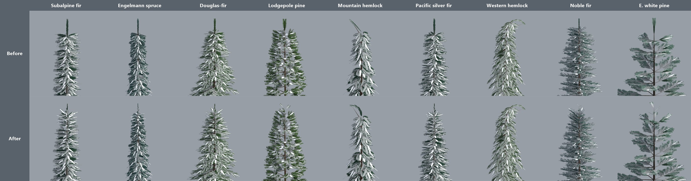

# The evergreens' spiky tops: audit and plan

**Audience:** the project owner. **Status:** 🟨 plan for your approval. A working prototype is in Blender; nothing has changed in the game. **Date:** 2026-10-01. **Part of:** task 09 phase 2; the wider audit of all the trees follows in its own page.

You asked: *"Why are the tops of the evergreens so straight up and spiky?"* and *"Audit all evergreens for this behavior please and make a plan to correct."*

## Why

Every conifer ends with the same few lines of the tree script (`build_conifer`):
- **The whorls stop short.** No branches grow in the top 0.8 m or 5% of the tree, whichever is more.
- **That gap is filled by an upright "leader":** three crossed spray cards (two on the far LOD) standing straight up, 1.5-2.4 m tall, 0.4 m past the top of the trunk. Its purpose, in the script's own comment, was *"so the top is never bare"*.
- **Upright cards hold no snow.** The game puts snow only on surfaces that face the sky. So on a snow-loaded crown the leader stays dark green: a flat fin, 1-2 m proud of the crown.
- **It's in every LOD and baked into the impostors.** Even the far forest's skyline carries it, at a pixel or two.

In the game it reads as a dark green feather stuck on top of each tree (Sugarloaf's in-forest view, in the game's own render):

## The audit: every evergreen

Measured on the built models (all three variants), with the real tree's top from public field guides:

| Evergreen | In the game | Fin above the rest of the crown, LOD0 (far LOD) | Snow on the top 1.5 m (rest of the crown: 0.3-0.4) | The real top | Verdict |
|---|---|---|---|---|---|
| Subalpine fir | yes | 1.0-1.2 m (0.9-1.2) | 0.28-0.34 | a sharp, narrow spire, needled to the tip | ✗ fin |
| Engelmann spruce | yes | 1.2-1.5 m (1.4-1.5) | 0.04-0.15 | a narrow, dense spire | ✗ fin |
| Douglas-fir | yes | 1.6 m (1.4-1.8) | 0.00 | pointed, needled leader | ✗ fin |
| Lodgepole pine | yes | 1.0 m (1.0-1.6) | 0.22-0.26 | a short, rounded top of upturned shoots | ✗ fin |
| Pacific silver fir | yes | 1.7-1.9 m (1.9-2.4) | 0.00 | a symmetric spire | ✗ fin |
| Noble fir | yes | 1.5-2.0 m (1.8-2.1) | 0.00-0.08 | old trees (ours are 32-39 m): a rounded, domed top | ✗ fin |
| Eastern white pine | not yet (in review) | 1.2-1.7 m (2.0-2.2) | 0.00-0.25 | mature: broad, irregular, often flat | ✗ fin |
| Mountain hemlock | yes | none: a thin, straight, nodding hook | 0.36-0.40 | a drooping, nodding leader | ~ passable |
| Western hemlock | yes | none: a curved, drooping leader | 0.40-0.41 | a drooping leader | ✓ |
| Krummholz | yes | the flag tree's bare dead spike is deliberate: a wind-killed leader | | | ✓ by design |

**Seven of the ten evergreens carry the fin**, including the new white pine. Western hemlock was built with its own curved leader in task 09, which is why it looks right.

## The plan

**1. Two new tops in the tree script,** chosen per species in `species.json` (`"top"`):
- **Spire** (subalpine fir, Engelmann spruce, Douglas-fir, Pacific silver fir): the top whorls sweep up and their shoots shorten toward the tip. The last stretch becomes a short leader needled all round, like a bottlebrush: six small sprays spiralling up the trunk at 50-80°, so they hold snow and taper to a point, ending in a small bud. No upright cards.
- **Rounded** (lodgepole pine, noble fir, eastern white pine): no leader. The top whorls sweep up 35-45°, and a ring of upturned sprays rounds off the top.
- **Mountain hemlock** (optional): western hemlock's curved leader instead of the straight nodding hook.
- **Unchanged:** western hemlock, krummholz and every broadleaf.

**2. Already prototyped and measured** (Blender, the audit tool's game shading):

| Measure | Before | After (prototype) |
|---|---|---|
| Fin above the crown, LOD0 | 1.0-2.0 m on seven trees | **none** on the rounded tops; a narrow needled bud **0.3-0.56 m** on the spires |
| Snow on the top 1.5 m | 0.00-0.34 | **0.34-0.52** |
| Crown colour, winter snow, LOD1 and LOD2 coverage | | all within ±0.02 of before |
| LOD0 triangles | | +4 to +14 per tree; every tree within budget |
| Every other tree | | bit-identical (203 of 203 hashes) with the new tops switched off |

One thing still to tune: on the far LOD the spires' tip stands 0.6-1.3 m above their cluster cards. It's narrow, but I'd shorten it to match the near LODs.

**3. Your photo review** of the corrected evergreens before anything goes into Unity, as usual: the tops above, silhouettes and the conifer lineup.

**4. One import for everything.** Re-import the six changed conifers (plus mountain hemlock if you want it) with the three New England models, so Git LFS grows once. From the current files: subalpine fir 8.2 MB, Engelmann spruce 9.7, Douglas-fir 8.8, lodgepole pine 6.5, Pacific silver fir 8.9 and noble fir 7.9, so **50 MB** (59 MB with mountain hemlock). With the new models that's about 75-85 MB, against roughly 250 MB used of the free 1 GB. `TreeImport -treeModels` keeps every other tree's files byte for byte.

**5. Check it in the game:** the lineup and Sugarloaf's in-forest view, before and after, and the benchmark. Expect no change in cost: about 10 triangles more per tree.

**What else moves:**
- **Prefab heights:** the leader no longer overshoots the trunk, so they drop by up to 0.4 m. Placed trees keep their real heights, because the forest scales each tree by its model's own height.
- **Forest thread:** I'll tell them, since their culling uses each model's reach.
- **Untouched:** the forest's golden hashes and the krummholz.

**Time:** about half a day, then your review.

## Decisions for you

1. **Approve the plan:** spire tops for subalpine fir, Engelmann spruce, Douglas-fir and Pacific silver fir; rounded tops for lodgepole pine, noble fir and eastern white pine.
2. **Mountain hemlock:** give it western hemlock's curved leader (+8.7 MB), or leave its nodding hook as it is?
