# Task 09 phase 2: everything that changes, for your approval before the import

**Audience:** the project owner. **Status:** 🟨 for your final approval. Everything here is built and measured in Blender; nothing has gone into Unity yet. **Date:** 2026-10-01. **Part of:** [task 09 phase 2](new-england-species-plan.md). It brings together [the New England models](phase2-ne-trees-review.md), [the evergreen tops](phase2-evergreen-tops.md) (NE6) and the winter hardwood crowns from [the tree audit](phase2-trees-audit.md) (H2, M1, M3).

These are **Blender renders, not the game**. The stand images use the audit tool's emulation of the game's shading, which matches Unity within ±0.03. Once you approve, I import and check everything in the game itself.

## What I'd like from you

Approve the photos on this page. Then I'll:
1. **Import**, in one batch (NE7): 15 models with `TreeImport -treeModels`. Mountain hemlock, western hemlock and krummholz keep their files byte for byte. About **105-110 MB** of Git LFS, out of GitHub's free 10 GiB (about 0.25 GiB used today).
2. **Switch on** the species map: the three new models and the six shared species (NE5). Bump the terrain cache version so downloaded sites regrow their forests.
3. **Run every test:** repo checks, the engine-free tests, and Unity EditMode and PlayMode.
4. **Re-run the species survey** and update both plan docs with the new fidelity.
5. **Benchmark Sugarloaf in the game** and take screenshots, then open the PR.

## What changes

| Models | Change | LOD0 triangles | Predicted GPU change for a forest made only of this model (Sugarloaf in-forest) |
|---|---|---|---|
| Subalpine fir, Engelmann spruce, Douglas-fir, lodgepole pine, Pacific silver fir, noble fir | **Pointed tops** that narrow gradually (approved, NE6) | +10 per tree | +0.0 to +0.2 ms |
| Quaking aspen, paper birch, yellow birch, sugar maple, red maple, American beech | **Winter crowns:** a fine-twig haze instead of bare limbs | mostly lower (fewer, larger summer-leaf cards) | +0.6 to +1.5 ms; **beech −3.2 ms** |
| Eastern white pine, northern red oak, black cherry | **New**, with the pointed top or the winter crown | 3,109-7,173 | white pine ~12 ms, black cherry ~12, red oak ~20 in total |
| Mountain hemlock, western hemlock, krummholz | unchanged | | |

Every model is within its triangle budgets. With every new option switched off, the script rebuilds today's trees bit-identically (203 of 203 hashes), so the changes are exactly the ones listed.

## 1. Evergreen tops (approved design)

The same trees before and after; only the top differs.

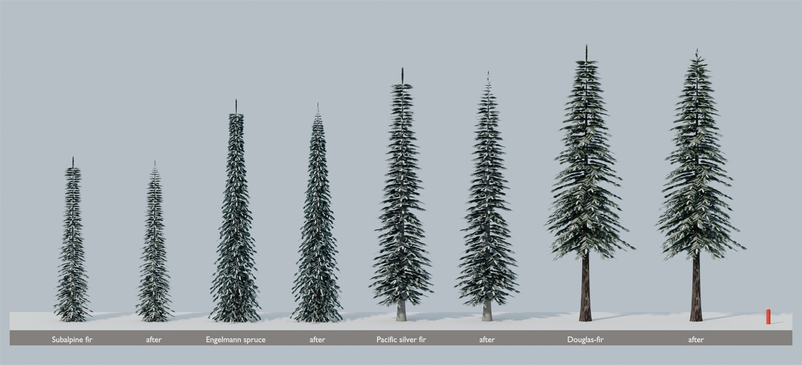

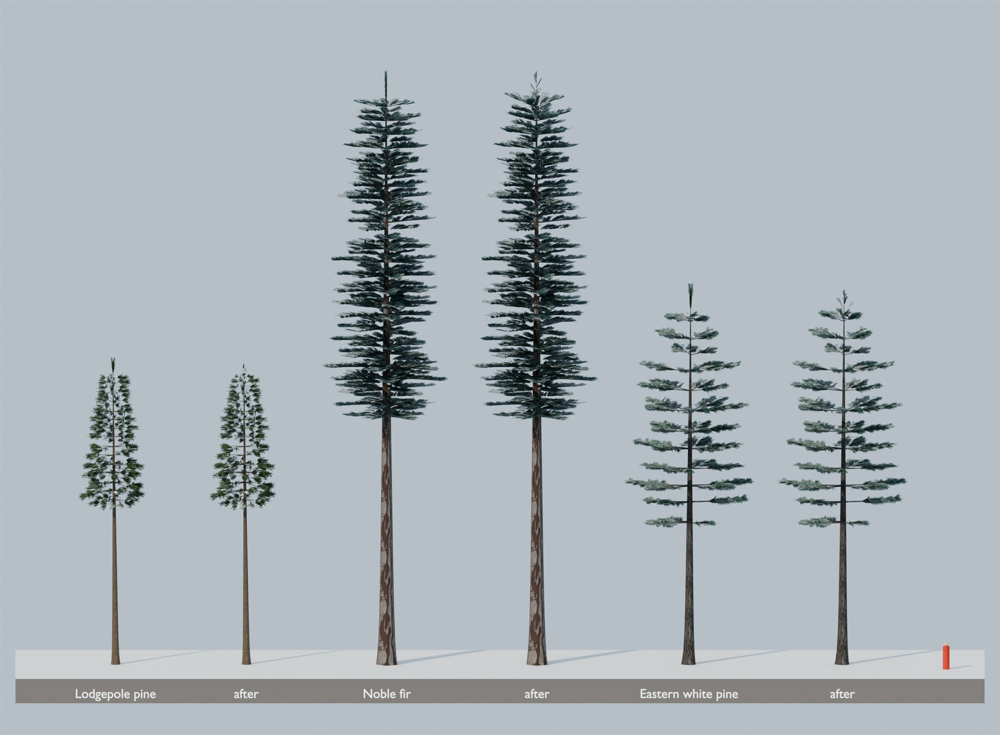

## 2. Winter hardwood crowns

**What changed** (all broadleaves, opt-in per species in `species.json` as `winterCrown`):
- **A denser twig texture:** more and finer forking twigs, each tip ending in a fringe of twiglets. The colour is muted halfway toward a cool grey-brown, so a crown reads as a soft winter haze. Red maple keeps a hint of red.
- **Larger twig cards** carry it. The leaders end inside the crown, with a small tuft of twigs at their tips instead of a bare spike (audit M3).
- **One larger summer-leaf card per twig instead of two:** the same summer cover with fewer cards. Leaf cards are still drawn in winter, only hidden, so this pays for the twigs.
- **Beech is lighter:** fewer limbs and side branches, and half its lower leaves kept through winter instead of 70% (audit M1).

**Close up** (Cycles, winter):

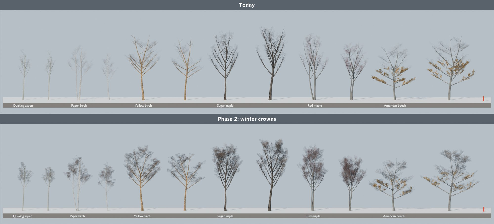

**A New England stand in the game's shading** (Sugarloaf's lower and middle slopes; today's library on the left, phase 2 on the right; each tree at the LOD the game picks):

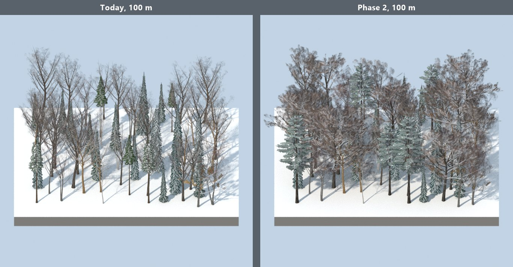

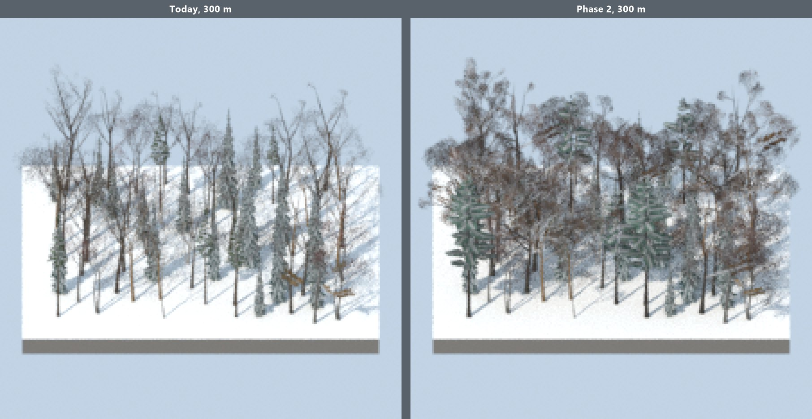

| Broadleaf | Twig texture cover (was 5-7%) | Crown cover from the side | LOD1 / LOD0 | LOD0 triangles | Predicted in-forest change |
|---|---|---|---|---|---|
| Quaking aspen | 16.4% | 0.058 → 0.097 | 1.09 | 4,810-6,358 → 4,763-6,056 | +0.7 ms |
| Paper birch | 18.6% | 0.073 → 0.131 | 0.89 | 4,923-7,527 → 4,702-6,591 | +0.6 ms |
| Yellow birch | 18.9% | 0.059 → 0.131 | 0.80 | 4,683-6,515 → 4,123-5,414 | +1.5 ms |
| Sugar maple | 17.5% | 0.081 → 0.134 | 0.78 | 6,725-7,320 → 5,733-5,992 | +1.1 ms |
| Red maple | 17.1% | 0.082 → 0.144 | 0.82 | 6,123-7,547 → 4,997-6,612 | +1.5 ms |
| American beech | 16.4% | 0.095 → 0.139 | 0.69 | 7,911-9,509 → 4,825-5,664 | **−3.2 ms** |
| Northern red oak (new) | 17.9% | 0.075 → 0.128 | 0.72 | 5,401-7,173 | +1.4 ms against its first version |
| Black cherry (new) | 17.4% | 0.053 → 0.104 | 0.74 | 3,109-3,604 | +0.8 ms against its first version |

**Cost at a real site:** weighted by Sugarloaf's mix, roughly +0.5 ms in its in-forest view, about 18.9 ms against the 20 ms budget. That's a prediction from the fit to the 14 models measured in the game; I'll measure it after the import.

## 3. The New England models, final

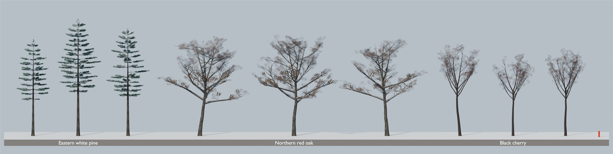

Each beside the model the game draws for it today. Today's sugar maple and quaking aspen are shown with their new winter crowns:

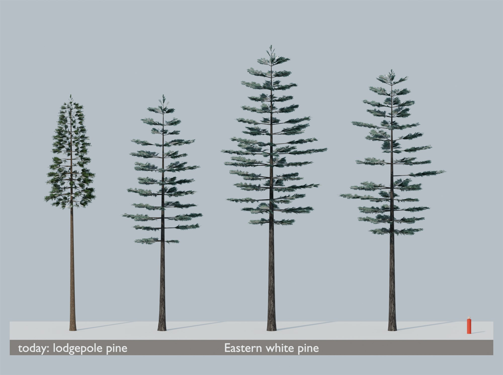

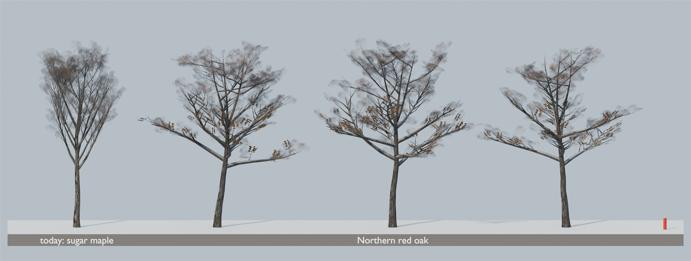

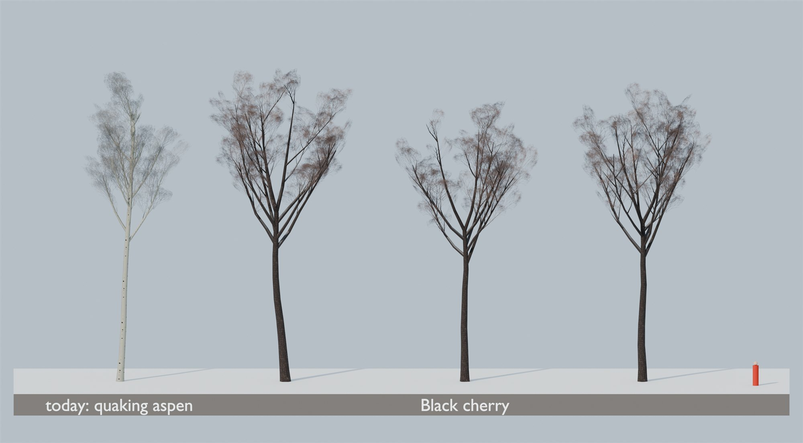

Seasons (for the season work to come), the full stand in winter and autumn, LODs and textures:

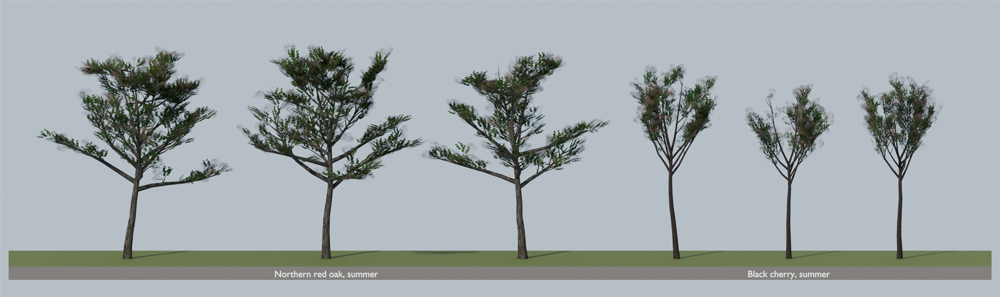

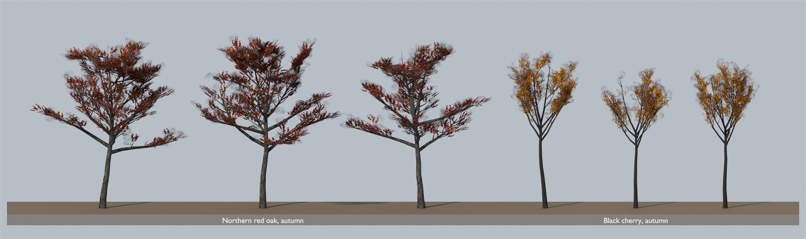

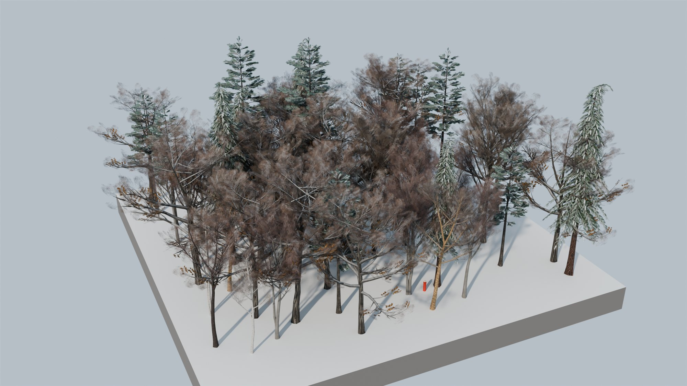

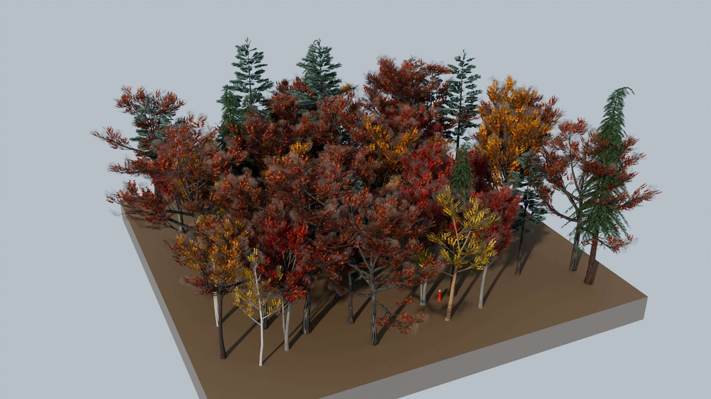

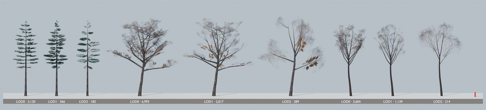

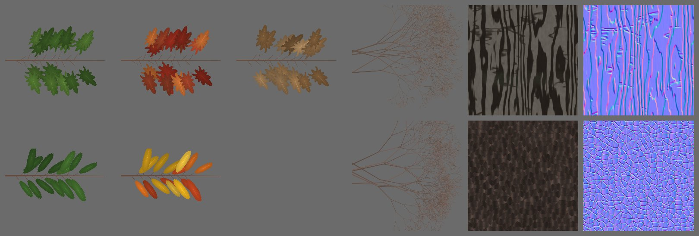
