# Task 09 phase 2: the New England models

**Audience:** the project owner. **Status:** 🟨 for your review. Nothing has been imported into Unity; that waits for your approval. **Date:** 2026-10-01. **Part of:** [task 09 phase 2](new-england-species-plan.md), step 2. The sorting (NE5) decided which species needed a model of their own; these are the three.

Three new models, built by the free Blender script ([`tools/assets/trees/`](../../tools/assets/trees/README.md)). Each has 3 variants and LOD0-2, and each is within the enforced triangle budgets:
- **Eastern white pine** (FIA 129), New England's signature tree. Lodgepole pine stands in for it today.
- **Northern red oak** (833), the largest species the library is missing in the whole US. Sugar maple stands in for it today.
- **Black cherry** (762), which also draws **sweet birch** (372), as you approved in NE5. Quaking aspen stands in for both today.

These are **Blender renders, not the game**. In Unity the tree shader adds wind, crown shading, per-tree colour jitter, impostors and the real snow material. The [audit](#the-audit-measured-the-way-the-game-draws-them) below measures them the way the game draws them.

**The fifteen existing trees are unchanged.** The script gained options for the new trees, all opt-in. I rebuilt every existing tree with the new code: all 203 mesh and texture hashes match the build from before. After you approve, the import (`TreeImport -treeModels`) touches only the new models, so every committed tree file stays byte-identical.

## What I'd like from you

Approve the three models as they are, or tell me what to change. After your approval I'll:
1. import only the new models into Unity;
2. switch them on in the species map, with the six shared species (NE5), and run every test;
3. re-run the species survey and update both plan docs with the new fidelity;
4. benchmark and screenshot Sugarloaf.

The import adds about 25 MB to Git LFS (the last batch of four added 32 MB). I'll report the measured figure in the PR.

## Each new tree beside the tree it replaces

In each image the left tree is today's stand-in, scaled to the new tree's height as the game scales it now. The new tree's three variants follow. All in winter, the season the game shows.

### Eastern white pine (FIA 129)

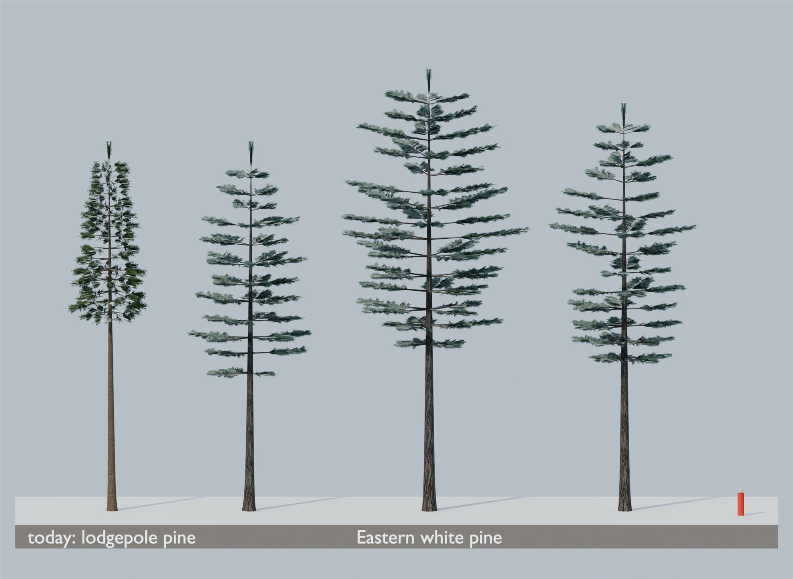

| Trait | How it's built | Result |
|---|---|---|
| Tall, with a long clear trunk | 24-32 m; the crown starts at 38% of the height | ✓ the tallest broad-crowned tree in the library |
| Few, long, horizontal limbs in tiers, with gaps between them | 4-5 limbs a whorl, whorls 1.15 m apart, no internodal branches, 18% of limbs missing, limb length varying ±35% | ✓ the tiers read from far off |
| Soft plumes of long needles toward the limb ends | A new `whitepine` tuft: long, slender needles in dense fans, from a third of the way out along each limb | ✓ |
| Blue-green, with a silvery sheen | `#3B5A4C`-`#527263`, with a fifth of the needles a pale stomatal grey-green | ✓ |
| Dark grey, deeply furrowed bark | The `furrowed` bark in dark grey (`#55504A`) | ✓ |
| Old trees go flat-topped and wind-swept | Only partly: the tallest variant's top rounds off a little (`roundTop`) | ✗ These read as middle-aged pines. A wind-swept veteran would need a new crown shape in the script. Say if you want it. |

### Northern red oak (FIA 833)

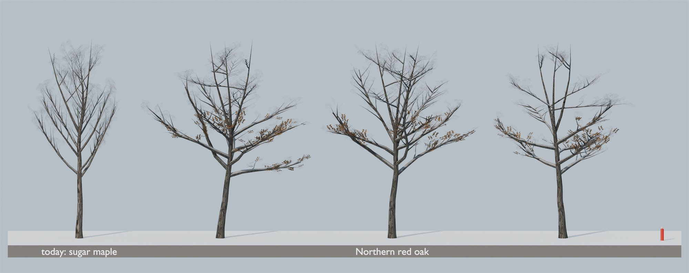

| Trait | How it's built | Result |
|---|---|---|
| Broad, rounded crown on a few heavy limbs | Spreading crown (radius 38% of height), 11-15 limbs leaving the trunk at 50-80°, limbs 1.4× as thick as a maple's | ✓ broader and heavier than the sugar maple it replaces |
| Crooked, zigzag limbs | Limbs turn 2.5× as much per segment as the other broadleaves' | ✓ |
| Ridged bark with flat, smooth tops ("ski tracks") | A new `oak` bark: long, irregular, flat-topped grey ridges, broken into plates, over softer brown furrows | ✓ see the close-up |
| Brown leaves kept through winter on young trees | 30% of the lower crown's leaf cards keep a dry brown leaf (beech keeps 70%), through the existing "kept leaves" season flag | ✓ a scatter, not a full coat. Mature canopy oaks drop most of theirs |
| Lobed leaves; russet-red in autumn | A new `oak` leaf: elongated, with pointed lobes along each side; autumn `#8E2A1C`-`#B8642E` | ✓ |

### Black cherry (FIA 762), and sweet birch (372)

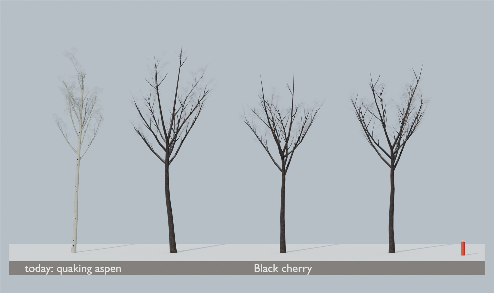

| Trait | How it's built | Result |
|---|---|---|
| Long clear trunk, narrow irregular crown | Crown starts at 42% of the height; irregular crown; 9-12 ascending limbs | ✓ |
| Dark, flaky bark ("burnt cornflakes") | A new `cherry` bark: small dark plates whose edges curl up, with reddish inner bark between them (`#453A35`) | ✓ the darkest bark in the library, like the real tree's, and close to sweet birch's near-black bark |
| Narrow, lance-shaped leaves; gold to orange in autumn | A new `cherry` leaf: a narrow toothed lance; autumn `#D9A21B`-`#B8431F` | ✓ |

## All three in winter

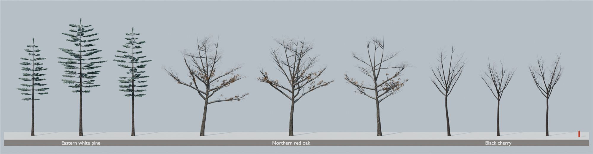

## A New England stand

Sixty trees from a camera about 125 m away, in a lower-slope New England mix by biomass (Gunstock and King Pine, NH): red oak 20, white pine 15, red maple 15, eastern hemlock 10 (drawn as western hemlock, NE5), sugar maple 10 (with white ash, NE5), yellow birch 8, beech 7, black cherry 6, paper birch 4.

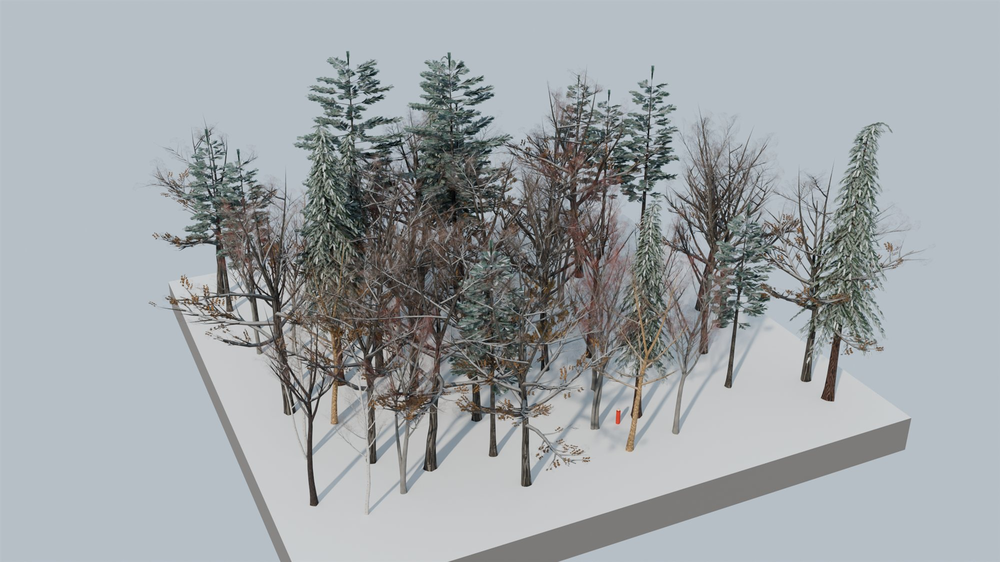

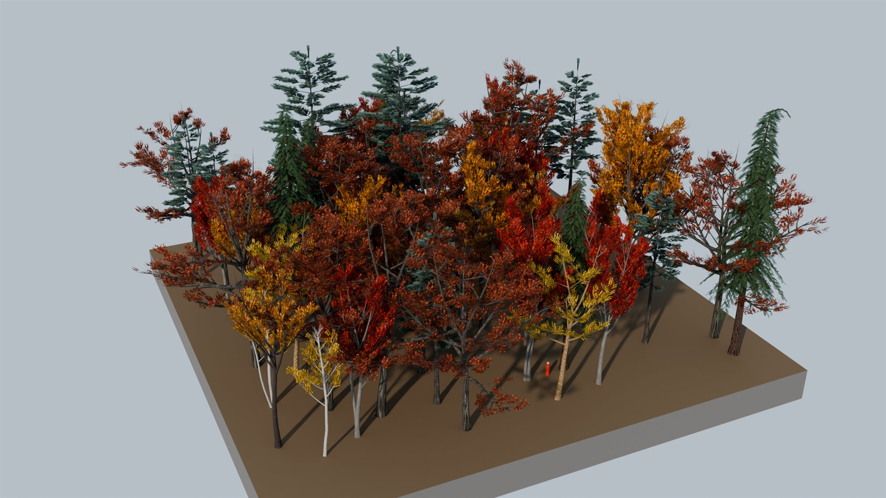

## Seasons

The broadleaves carry summer and autumn leaves for the season work to come (TR4, T9). Like the library's other broadleaves (maples, beech), their summer crowns are on the open side: a script-wide trait, not specific to these.

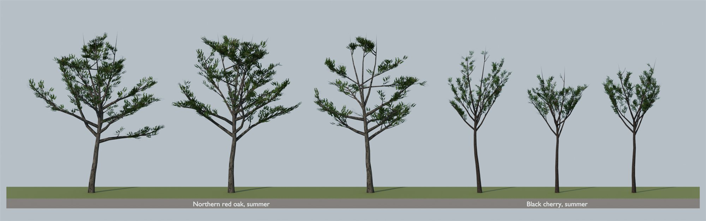

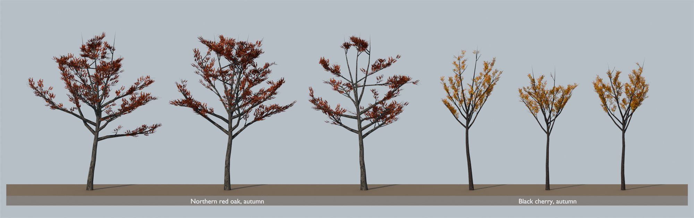

## Close-ups

| White pine | Red oak | Black cherry |
|---|---|---|
| 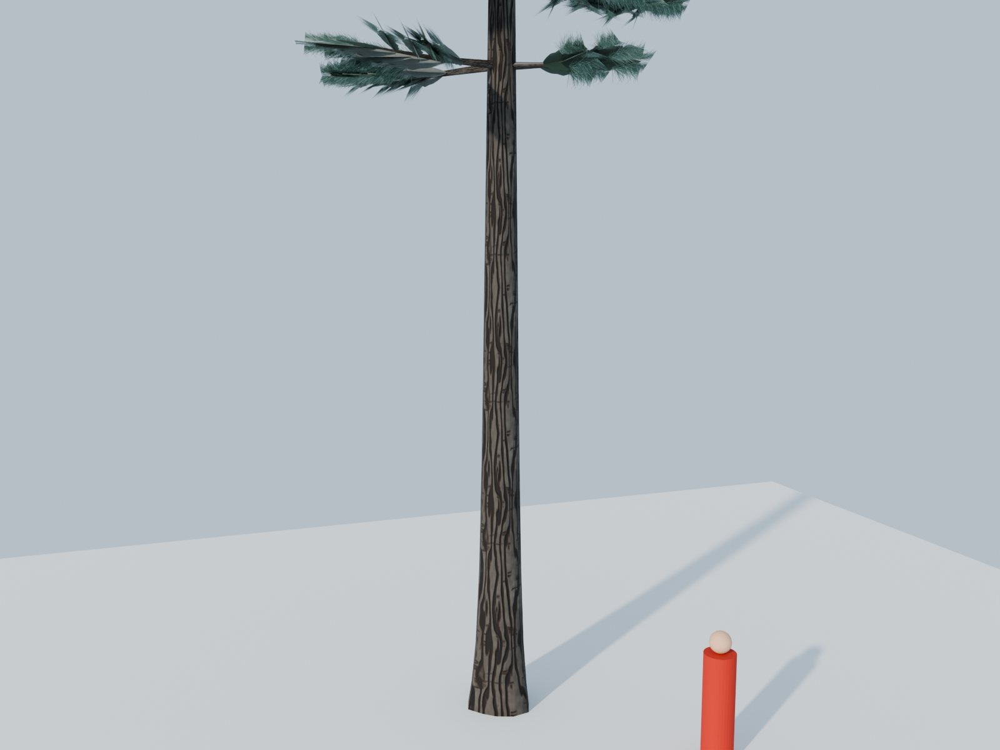 | 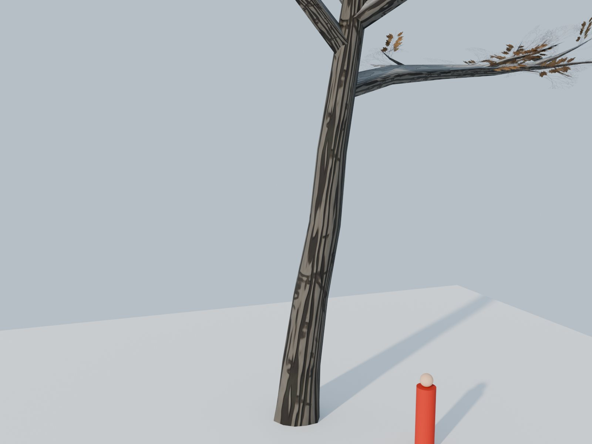 | 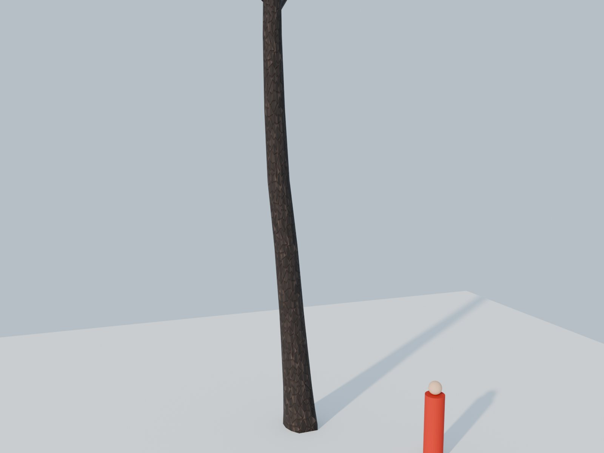 |

Textures (spray and branch cluster; leaves summer, autumn and kept; twigs; bark and its normal map):

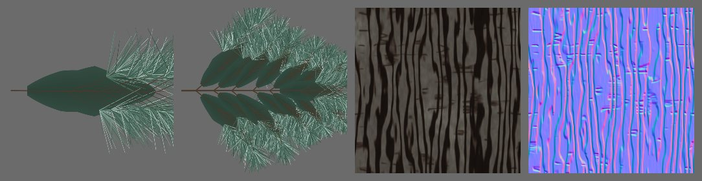

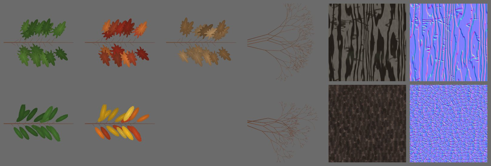

## Budgets and LODs

| Model | LOD0 triangles (v0, v1, v2) | LOD1 | LOD2 | Alpha-card area, LOD0 (m²) |
|---|---|---|---|---|
| Eastern white pine | 3,110 · 5,764 · 4,012 | 364-384 | 181-195 | 1,112-2,358 |
| Northern red oak | 8,630 · 8,710 · 6,229 | 1,628-2,108 | 265-289 | 1,766-2,753 |
| Black cherry | 3,787 · 3,382 · 4,054 | 1,037-1,164 | 214 | 754-986 |
| *Budget* | *≤ 10,000* | *≤ 2,500* | *≤ 500* | *existing trees: 90-2,950* |

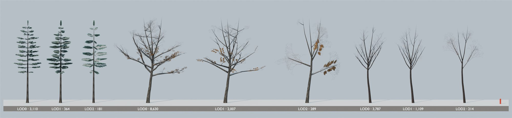

## The audit: measured the way the game draws them

I ran [`audit_trees.py`](../../tools/assets/trees/audit_trees.py) (the [task 09 audit](phase1-trees-audit.md)'s tool) on all 18 models. It caught two problems in the white pine, both now fixed:

1. **White pine held almost no snow.** In the game's shading its winter crown read at L\* 44, against 52-62 for every other conifer.
   - **Cause:** the game's snow lies heaviest along each spray's branch line, near the branch. A pine tuft's foliage started 40% of the way out, so that zone was mostly empty. Its upswept limbs and near-vertical crossed cards also faced the sky less than any other conifer's.
   - **Fix:** the white pine's tuft starts its foliage near the branch. Its limbs are near-horizontal (truer to the species too), and its crossed cards roll less.
   - **Now:** L\* 50.0, beside lodgepole pine's 52.1.
2. **White pine thickened at its LOD1 switch:** LOD1 covered up to 1.33× LOD0's crown. Narrower, flatter cluster cards bring it to 1.02-1.15, like Douglas-fir's 1.11-1.14.

| Model | Winter L\* (game shading) | LOD1 / LOD0 coverage | LOD2 / LOD0 | LOD0 until (at the model's own height) |
|---|---|---|---|---|
| Eastern white pine | 50.0 | 1.02-1.15 | 0.80-0.93 | 123-148 m |
| *Lodgepole pine, Douglas-fir* | *52.1, 58.8* | *0.84-0.88, 1.11-1.14* | *0.61-0.98* | |
| Northern red oak | 48.5 | 0.67-0.75 | 0.59-0.73 | 127-131 m |
| Black cherry | 33.1 | 0.75-0.81 | 0.59-0.71 | 103-117 m |
| *Sugar maple, red maple, beech* | *39.0, 41.1, 50.6* | *0.71-0.82* | *0.40-0.82* | |

- **LOD0 distances** use the game's LOD transitions since task 09's "LOD sooner" change (d3142d6: LOD0 to LOD1 at 0.35 of the screen).
- **Geometry:** no NaNs, degenerate faces or foliage below the ground. Every model stays inside the game's culling sphere (83-90% of its radius).
- **Wind data and UVs:** in range, like the existing trees.
- **Black cherry is the darkest tree in the library.** That's deliberate: the real tree's bark is near-black, and sweet birch, which it also draws, is darker still. I lightened it once (from L\* 31.5).

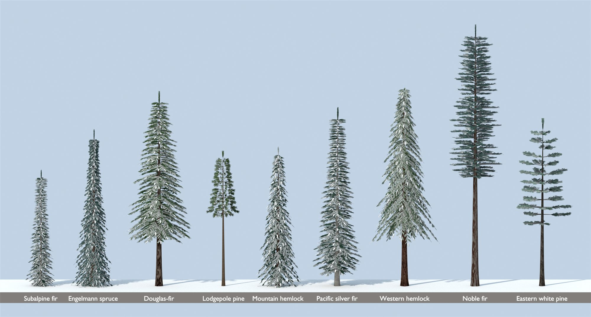

Before and after the snow fix (game shading: subalpine fir, lodgepole pine, white pine before; then lodgepole pine and white pine after):

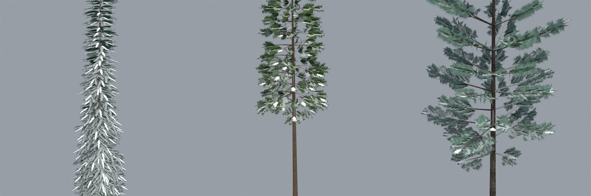

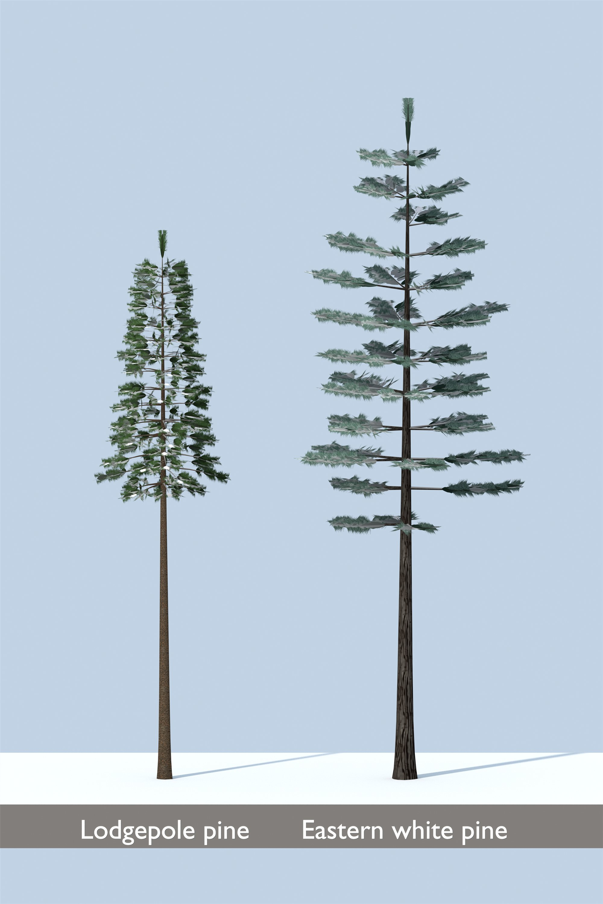

## What the script gained

All opt-in per species, and drawing the same random numbers as before:
- **Textures:** the `whitepine` tuft style; `oak` and `cherry` leaves; `oak` and `cherry` barks.
- **Conifers:** `skip` and `limbJitter` (an open, uneven crown), `lowerTaper`, `tuftStart`, `crossRoll` and `clusterRoll`.
- **Broadleaves:** `crook` (zigzag limbs), `limbs` (heavier limbs) and `keptShare` (how many leaves are kept in winter).
- **Review shots:** `ne-*` in [`render_preview.py`](../../tools/assets/trees/render_preview.py).

## Open, for later

- **A wind-swept, flat-topped old white pine** (see the table above): a new crown shape, if you want it.
- **Per-species tints** for shared species, such as red spruce's yellower green on the Engelmann spruce model: a shader input, not a new model.
- **Other oaks** (white, black, bur, chestnut) could follow the new red oak by genus instead of sugar maple, and other ashes sugar maple. That's a look-alike change for the task 09 forest thread, which owns those ranges.
