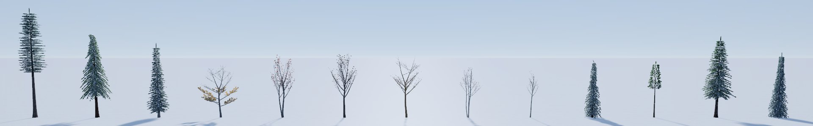
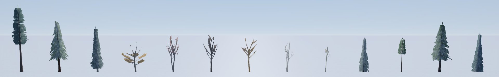
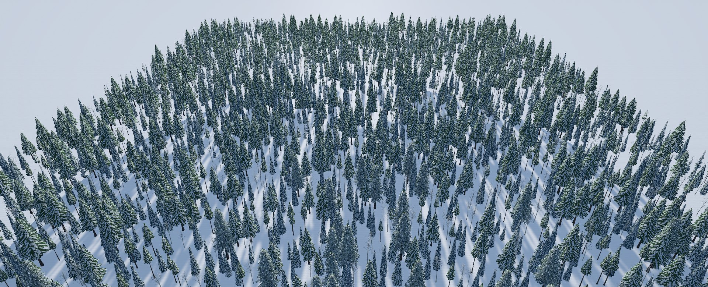
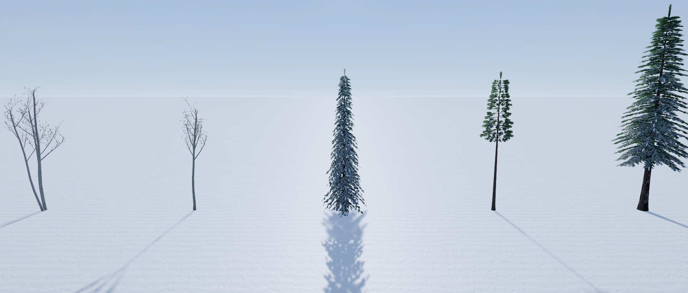

# Phase 2 · Tree audit: realism, performance, and the new models against the game's

**Audience:** the project owner. **Status:** 🟨 for your review; the fixes wait for your approval. **Date:** 2026-10-01. **Part of:** task 09 phase 2. The evergreens' spiky tops have [their own page and plan](phase2-evergreen-tops.md).

You asked to *"audit the design of all trees for realism, performance, and against current models in game already"*. This covers all 18 models: the 15 in the game and the 3 New England models [in review](phase2-ne-trees-review.md).

## Verdict

- **Realism: two problems run through the whole library, and both show in the game.**
  - **Evergreens end in a dark, flat fin** (7 of 10). Planned separately: [the tops plan](phase2-evergreen-tops.md).
  - **Winter hardwoods are skeletons.** A bare broadleaf crown shows its main limbs and almost none of the fine twigs that make a real winter hardwood stand read as a soft grey-brown haze. From 300 m the hardwoods nearly vanish. This matters most in New England, where hardwoods are half the forest.
- **Performance: measured in the game for the first time per model, and fine at every real site.**
  - **Since task 09's LOD change, every 5 km site fits the 20 ms budget.** Sugarloaf, the densest, is at 18.4 ms frame p95 (forest thread).
  - **Beech is the most expensive model:** a whole forest of it would take Sugarloaf's in-forest view to **23.6 ms** (GPU p95). The four heaviest conifers come to 19.9-20.4 ms; everything else 9.5-17.8 ms.
  - **What drives the cost:** triangles plus overdraw (a fit across the 14 models: R² 0.82-0.95).
  - **Draw calls** aren't a problem.
- **The three new models sit inside the existing ranges** on every measure. Predicted in-forest cost: white pine about 12 ms, red oak about 18, black cherry about 11. They share the library's two problems: the white pine has the fin, and the oak and cherry are winter skeletons. The fixes should cover them too.

## How it was measured

- **In the game.** A temporary build drew every one of Sugarloaf's 2.95 million trees as one model at a time: the same positions, heights and LOD choices, and krummholz left alone. It ran the benchmark's five views (RTX 3060 Ti, 1080p, GPU p95) once per model, 14 runs plus the real mix. The game's lineup photographed every model at every LOD. The hook was never committed.
- **On today's code,** with task 09's "LOD sooner" change (d3142d6). A first run without it measured 28-30 ms for the five heaviest models; the LOD change halved the number of LOD0 trees in view.
- **In Blender:** the [audit tool](../../tools/assets/trees/audit_trees.py), whose game-shading numbers match Unity's within ±0.03, across all 18 models.
- **The three new models** can't go into the game before you approve them, so their GPU cost is **predicted** from the fit. Its worst miss on the 14 measured models is 2.6 ms in-forest and 0.8-1.4 ms in the other views.

## Findings

### High

**H1. Evergreens end in a dark, flat fin.**
- **Which:** 7 of 10 evergreens: subalpine fir, Engelmann spruce, Douglas-fir, lodgepole pine, Pacific silver fir, noble fir and the new white pine.
- **What it is:** upright leader cards stand 1-2 m above the crown and hold no snow.
- **Plan:** [its own page](phase2-evergreen-tops.md), with a measured prototype that fixes it at about 10 triangles a tree.

**H2. Winter hardwood crowns are skeletons.**
- **Measured:**
  - **Twig textures:** the winter twig cards cover 4.7-6.8% of their texture at full resolution, against 18-41% for conifer sprays, and 0-0.4% at mip 4.
  - **Crowns:** from the side, a bare broadleaf crown covers 5-10% of its frame; a conifer crown covers 12-35%.
- **In the game:**
  - **Up close:** each hardwood is a set of bare limbs (first image).
  - **Impostors:** the far LOD keeps only the main limbs (second image).
  - **From 300 m:** the hardwoods among the conifers are faint vertical lines (third image).
  - **Sugarloaf's in-forest view:** the birches and maples read as white poles, not a crown ([tops page](phase2-evergreen-tops.md), first image).
- **Real trees:** a leafless northern hardwood crown is a dense mesh of fine twigs. At any distance it reads as a soft grey-brown or purplish haze. A winter hardwood slope in New England looks grey-brown, not like white snow with sticks in it.
- **Which:** all eight broadleaves: aspen, paper and yellow birch, sugar and red maple and beech in the game, plus the new red oak and black cherry. Six more species share their models (NE5).

### Medium

**M1. Beech is the most expensive model, and the new red oak has its broad shape.**
- **Measured:** a whole forest of beech would take Sugarloaf's in-forest view to 23.6 ms. It has the most card area per height² in the library (3.14, against 0.4-2.2), along with 7,911-9,509 LOD0 triangles and kept leaves.
- **Why it matters:** New England hillsides can be largely beech and oak; red oak is 22% of the forest at Gunstock and King Pine. Red oak is predicted at about 18 ms, cheaper than beech.
- **The fix belongs with H2:** while adding twigs, make beech cheaper (fewer, larger kept-leaf and twig cards) and keep red oak at or below the maples.
- **The heavy conifers** (Douglas-fir, Engelmann spruce, Pacific silver fir, western hemlock) come to 19.9-20.4 ms for a whole forest: at the budget, but no real site is all one of them (Crystal is 13.4 ms). Nothing needed now. If a denser site appears, fewer, larger sprays would cut their LOD0 triangles, as the task 09 audit did for silver fir.
- **Where the triangles go:** about 500 LOD0 trees, 0.2% of the 279,000 in view, carry 32-46% of the view's tree triangles; about 10,200 LOD2 trees carry another 25-41%.

**M2. Wide broadleaves cost the most in the overview, where the trees are all impostors.**
- **Why:** an impostor's quad is as wide as the crown.
- **Measured:** beech, with a crown 0.90× its height, costs 11.1 ms there; the conifers cost 6.3-7.0 ms. The new red oak (0.89) will cost the same as beech.
- **Verdict:** inside the budget, so low priority. Trimming impostor quads to the visible crown would be a renderer change.

**M3. Bare spikes at the tops of broadleaves.** The leaders taper to bare points above the twigs (maples, oak, cherry), clear in [the New England stand](phase2-ne-trees-review.md#a-new-england-stand). It belongs with H2's fix: end leaders inside the twig crown.

**M4. Up close, conifer sprays are flat, straight-edged cards** that look paper-cut from low angles (Sugarloaf's in-forest view). Bending each near spray along its length would soften it, at more LOD0 triangles. Lower priority than H1 and H2; a later option.

### Low, and what passed

- **Colour, snow and LOD coverage:** every model sits within the library's ranges (table below).
- **Triangle budgets:** every model passes.
- **Draw calls:** 282-495 for a one-model forest and 932-1,111 for Sugarloaf's mix, with the GPU the limit.
- **Variety:** three variants per model, plus per-tree rotation, scale and tint, is enough at game distances.
- **Outside the models: the plantation look.** Sugarloaf's in-forest view shows evenly spaced, similar-height conifers, which reads a little like a plantation. Each tree is 65-100% of its cell's dominant height, and the spacing is even by design. More height spread or some clumping in dense conifer stands would be a look change in placement: your call, and the forest thread's work if you want it.

## Every model

GPU p95 in ms, with **Sugarloaf drawn entirely as that model** (the real mix: 17.3 in-forest, 11.1 forest, 11.1 ringforest, 7.6 overview). "~" = predicted. Card area per height² is the overdraw measure; crown coverage is from the side.

| Model | LOD0 triangles | Card area / height² | Crown coverage | Winter L\* | LOD1 / LOD0 | In-forest | Forest | Ringforest | Overview | Issues |
|---|---|---|---|---|---|---|---|---|---|---|
| Subalpine fir | 4,398-5,550 | 1.68 | 0.29 | 61.8 | 0.92 | 15.6 | 10.6 | 10.6 | 6.6 | fin |
| Engelmann spruce | 7,342-9,890 | 1.73 | 0.35 | 56.9 | 0.89 | 20.4 | 12.5 | 12.0 | 6.5 | fin; heavy |
| Douglas-fir | 8,968-9,254 | 2.14 | 0.25 | 58.8 | 1.12 | 20.3 | 11.7 | 11.5 | 6.9 | fin; heavy |
| Lodgepole pine | 2,448-2,832 | 1.24 | 0.19 | 52.1 | 0.86 | 9.5 | 5.9 | 7.0 | 6.4 | fin |
| Mountain hemlock | 4,836-5,644 | 1.98 | 0.31 | 61.7 | 0.96 | 16.4 | 10.9 | 10.7 | 6.9 | nodding hook |
| Quaking aspen | 4,810-6,358 | 0.41 | 0.06 | 55.6 | 0.95 | 12.6 | 7.8 | 8.8 | 6.9 | skeleton |
| Paper birch | 4,923-7,527 | 0.69 | 0.07 | 60.3 | 0.85 | 16.0 | 9.8 | 10.7 | 7.7 | skeleton |
| Yellow birch | 4,683-6,515 | 0.88 | 0.06 | 51.8 | 0.74 | 14.2 | 9.0 | 10.6 | 8.6 | skeleton |
| Sugar maple | 6,725-7,320 | 0.97 | 0.08 | 39.0 | 0.73 | 16.9 | 9.8 | 11.1 | 8.7 | skeleton; bare spikes |
| Red maple | 6,123-7,547 | 1.16 | 0.08 | 41.1 | 0.77 | 17.8 | 10.2 | 11.2 | 8.5 | skeleton; bare spikes |
| American beech | 7,911-9,509 | 3.14 | 0.09 | 50.6 | 0.73 | 23.6 | 12.9 | 14.0 | 11.1 | skeleton; heaviest; wide |
| Pacific silver fir | 7,244-9,816 | 2.06 | 0.28 | 60.7 | 0.99 | 19.9 | 11.3 | 11.1 | 6.7 | fin; heavy |
| Western hemlock | 6,864-8,946 | 1.75 | 0.26 | 57.1 | 0.95 | 19.9 | 9.8 | 10.1 | 6.8 | heavy |
| Noble fir | 5,542-9,706 | 1.18 | 0.19 | 53.7 | 0.97 | 16.4 | 7.3 | 8.2 | 6.3 | fin |
| Krummholz | 1,668-2,788 | – | 0.29 | 61.7 | 0.90 | – | – | – | – | |
| **Eastern white pine** (new) | 3,110-5,764 | 2.16 | 0.12 | 50.0 | 1.08 | ~12 | ~7 | ~8 | ~7 | fin |
| **Northern red oak** (new) | 6,229-8,710 | 1.30 | 0.07 | 48.5 | 0.71 | ~18 | ~10 | ~11 | ~11 | skeleton; bare spikes; wide |
| **Black cherry** (new) | 3,382-4,054 | 0.53 | 0.05 | 33.1 | 0.78 | ~11 | ~7 | ~8 | ~9 | skeleton; bare spikes |

**What the fit says** (in-forest): GPU ms ≈ 3.0 + 1.08 × the view's tree triangles (millions) + 2.65 × overdraw (R² 0.88). A million triangles in that view costs about 1 ms. The forest view fits most closely (R² 0.95); ringforest 0.82.

## The new models against the game's

- **Look:** each new model's colour, snow and LOD coverage falls inside the range of the trees already in the game. White pine's winter L\* is 50.0 (lodgepole 52.1); oak's is 48.5 (beech 50.6); cherry's is 33.1, darker than the maples (39-41) as the real tree is.
- **Cost:** white pine and black cherry are among the cheapest models, with lodgepole pine and aspen. Red oak sits with the maples: cheaper than beech in-forest, as costly as beech in the overview.
- **Shared problems:** H1 (the white pine's fin) and H2 and M3 (oak's and cherry's winter skeletons and bare spikes). Fixing them in the script fixes the new and the old trees together.

## Plan (for your approval)

1. **Evergreen tops (H1):** [the tops plan](phase2-evergreen-tops.md), awaiting your decision.
2. **Winter hardwood crowns (H2, M3):** one change to the script for all eight broadleaves:
   - denser, finer twig cards in each species' twig colour, aiming for about 15-25% twig cover per card instead of 5-7%;
   - a "twig haze" card on LOD1-2 so mid-distance crowns and impostors keep the mass;
   - leaders that end inside the twig crown.

   **Measured before you see it:** crown coverage from the side, a 300 m stand in the game's shading, and the cost predicted from the fit. Most hardwoods are among the cheaper models today, so there's room. The targets: at most +2 ms for an all-hardwood in-forest view, and beech (M1) cheaper than today. Blender prototype first, then your photo review, as always.
3. **Heavy conifers (M1):** nothing now; every site fits since task 09's LOD change.
4. **One import for everything approved:**

   | Batch | Git LFS |
   |---|---|
   | Tops (six or seven conifers) | 50-59 MB |
   | Broadleaves (six) | 32 MB |
   | The three New England models | about 25 MB |
   | **Total** | **about 110-120 MB** |

   That's roughly 360-370 MB of the free 1 GB. Every untouched model keeps its files byte for byte.
5. **Later options:** bent near sprays (M4), impostor quads trimmed to the crown (M2, renderer), and a wind-swept old white pine.

## Decisions for you

1. Approve the hardwood-crown fix (2), with beech made cheaper, for a Blender prototype and photo review?
2. Combine everything you approve into one import (4)?
3. **The plantation look** (forest placement): ask the forest thread for more height spread or some clumping in dense conifer stands, or leave it as it is?
