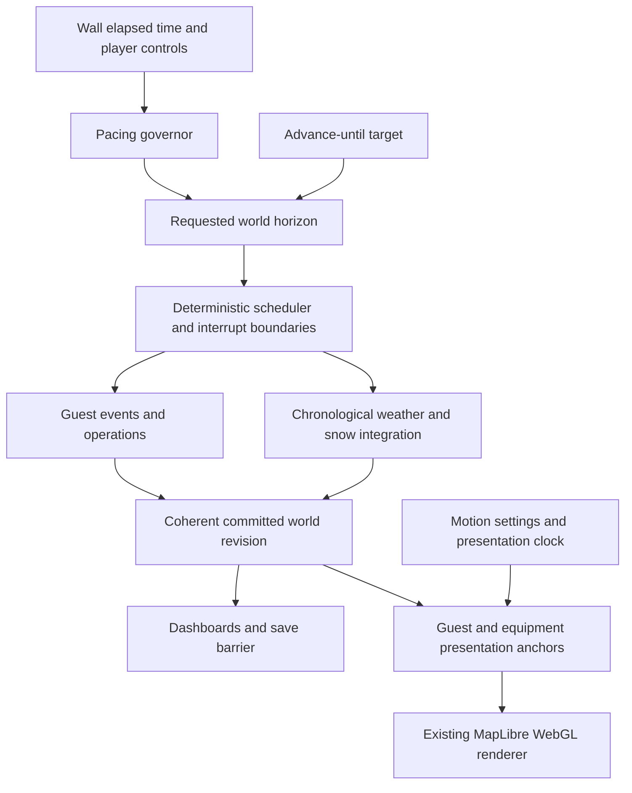

**Simulation time, guest presentation, and future operations — working design**

Archived planning draft, prepared September 8, 2026 against repository commit `9988f4f774de92103c497788a69cf777c147d4a3`. The user's revised dual-clock implementation request supersedes the assumptions and open questions below. See the [implementation record](../dual-clock-implementation.md) for current behavior and verification. This draft is retained as discussion history, not implementation guidance.

Source: the complete [Gemini planning conversation](https://docs.google.com/document/d/1dSYGK6h-RePZp-M-f8iwKFs0DX3SX8X7cydBPwmFmeA/edit), read through its final repeated PRD, and the local source files linked below. Assertions that Gemini made about implementation, verification, hardware performance, or approval are not evidence that those things occurred.

The companion [design questionnaire](simulation-design-questions.md) supplies decision IDs for resolving this draft.

**1. What we are designing**

Build a resort simulation with a real calendar, readable activity on the mountain, adjustable pacing, trustworthy fast-forward, and room for deeper operations. Preserve deterministic guests, real infrastructure capacity, chronological weather, and coherent saves. Make performance an acceptance condition throughout the work.

Established preferences:

- The source conversation prefers simulating every calendar day and advancing through quiet periods over making one visible day represent a week.
- The current request asks for substantial creative control over speed and agent rendering, future grooming and other operations, and strong performance.
- In this discussion, the user selected real simulated guests with representative motion between meaningful events and clearly explained approximations.
- Player speed controls are a small fixed set: **1x, 2x, 8x, and 64x**, tuned with the user. Do not expose freely editable speed presets by default.
- The user wants mountain activity at 1x to take about ten minutes, with a clean seconds/minutes relationship if useful. Whether that means the whole open-to-close day or an individual lift/run cycle is being clarified; do not set a production ratio yet.
- Following a guest offers an explicit whole-simulation slowdown; ordinary viewing reconciles motion at event boundaries.
- Target **30 FPS**, with **a few thousand guests visible on the mountain at once**. Minimum hardware, exact visible target, simultaneous simulated population, and desktop/browser priority remain open.
- Future grooming should support assigned equipment, routes, priorities, schedules, and automation rules, with observable job progress.

Proposed architecture: keep one authoritative world timeline for consequences and a separately controlled presentation clock for readable motion. Preserve actual individuals in the guest domain. The presentation clock never creates purchases, moves people through authoritative queues, or applies snow wear. Different numerical update frequencies are scheduling choices, not additional competing sources of truth.

**2. Review of Gemini's proposal**

| Proposal in the conversation | Assessment and treatment |
| --- | --- |
| Real days, quiet-period fast-forward, and operational interrupts | Keep. They serve the desired daily rhythm and seasonal longevity. |
| Separate readable motion from calendar pacing | Keep, with an explicit contract for what a visible guest represents and how transitions reconcile. |
| One micro-to-macro multiplier for all interactions | Replace. Time compression, population sampling, capacity, money, and spatial wear have different units and conservation requirements. |
| Wear or spending triggered by visible dots | Reject. Changing zoom, density, motion settings, rendering FPS, or visibility must not change resort outcomes. |
| Fixed 1/3/10/50 presets, a 45x baseline, and mandatory disappearance of dots | Replace the presets with the user's 1/2/8/64 choices. Baseline ratio and high-speed presentation are still being refined. |
| Switch from individuals to coarse equations automatically at high speed | Defer. This can change queues, party behavior, amenities, injuries, and reputation. First establish exact fast-forward using the existing event engine. |
| Canvas overlay as the necessary 2D solution | Do not adopt by default. The repo already has a 2D custom WebGL guest layer; 2D art does not imply Canvas2D rendering. |
| Three.js meshes and invented `src/core/...` integration points | Discard. Use the actual domain, adapter, worker, and React boundaries. |
| Universal ability cutoffs by slope percentage | Preserve existing guest suitability, risk, route, and injury logic until a deliberate gameplay change is approved. |
| Queue length divided by rated hourly capacity as an exact wait | At most a rough estimate. Actual service depends on dispatch, party seating, interruptions, and people ahead. Keep the queue ledger authoritative. |
| Multiply purchase probability by compression | Do not use. It can exceed one and make outcomes depend on update cadence. Keep current keyed event decisions; any future rate model needs explicit elapsed-time semantics. |
| Season-pass cash automatically amortized for speed consistency | Separate cash receipt from accounting recognition. Neither should be decided by playback speed. Existing ticket ledger behavior is the starting point. |
| Overnight work completed in one frame or an instant groomed mask | Replace with budgeted, cancellable advancement that preserves resource limits, incomplete jobs, weather, and interruptions. |
| Hard-coded wind/temperature/depth limits and a 45-minute delay | Unvalidated game-design examples. Use equipment and rule configuration; distinguish control hysteresis, minimum run times, and immediate protective shutdowns. |
| Mandatory new ribbon, camera snap, and modal interruption | Requires design decisions. Reuse existing UI surfaces and make camera movement a preference. |
| A roughly one-hour season as a guaranteed consequence of the design | Unsupported. The source's active-day and seasonal time budgets are internally inconsistent. Measure and playtest actual pacing. |

There is a fundamental limit: independent calendar speed, natural motion, exact individual location, and uninterrupted visible continuity cannot all be guaranteed simultaneously. For example, a five-minute lift ride at a 30x world rate finishes in ten wall seconds. Animating that ride at a 2x physical rate takes 150 wall seconds. Smooth interpolation cannot remove the 140-second discrepancy.

The selected real-guest approach therefore needs an explicit reconciliation policy: shorten or omit intermediate animation at event boundaries, slow the whole simulation for close following, or show a clearly timestamped replay. This is a product choice, not a hidden technical detail.

**3. What exists in the repo and where this fits**

| Area | Observed implementation | Planned integration |
| --- | --- | --- |
| Time model | [simulation types](../../src/types/simulation.ts), [time engine](../../time-engine/src/timeEngine.ts): version 3, four named rates of 30/60/240/960 simulated seconds per wall second; 43,200 seconds per composite week | Extend through a versioned calendar design and compatibility adapter. Preserve old meanings while old saves remain readable. |
| Game orchestration | [useGameSimulation](../../src/app/useGameSimulation.ts), [coordinator](../../src/app/continuousSimulationCoordinator.ts) | Establish one runtime owner for requested time, prepared work, committed time, pause, and cancellation. |
| Weather | [annualWeather](../../src/weather/annualWeather.ts), [weatherSession](../../src/weather/weatherSession.ts), [compositeWeek](../../src/weather/compositeWeek.ts) | Reuse pinned annual weather generation and local-time utilities. New mode consumes chronological hours directly. |
| Natural snow | [snowSimulation](../../src/snowSimulation.ts), [SnowStepClient](../../src/app/snowStepClient.ts) | Preserve hourly reference behavior; measure worker lifetime, copies, grid work, and rendering invalidation. |
| Guest simulation | [guest domain](../../src/guestSimulation/engine.ts), [event calendar](../../src/guestSimulation/eventCalendar.ts), [event phases](../../src/guestSimulation/eventPhases.ts) | Preserve individual guests, keyed randomness, parties, routes, queues, amenities, safety, and repeat memory. |
| Guest runtime | [useGuestSimulationRuntime](../../src/app/useGuestSimulationRuntime.ts), [worker engine](../../src/app/guestSimulationWorkerEngine.ts), [protocol](../../src/app/guestSimulationWorkerProtocol.ts) | Replace weekly runtime horizons with daily/session horizons; integrate future-effective commands and whole-world commit barriers. |
| Demand/economy | [weeklyDemand](../../src/guestSimulation/weeklyDemand.ts), [demand](../../src/guestSimulation/demand.ts), [ticketFinance](../../src/guestSimulation/ticketFinance.ts), [Phase 3 runtime](../../src/guestSimulation/phase3Runtime.ts) | Replace representative weekly scaling in the new calendar mode with actual daily realization and daily/weekly/seasonal rollups. |
| Guest graphics | [compact frame](../../src/guestSimulation/guestRenderFrame.ts), [guestGpuLayer](../../src/app/guestGpuLayer.ts), [guestLayers](../../src/app/guestLayers.ts) | Extend current 2D WebGL path with explicit presentation modes, cached geometry, and optional sprite/chevron art. |
| Guest environment | [conditions](../../src/guestSimulation/conditions.ts), [condition adapter](../../src/app/guestConditionAdapter.ts) | Supply real grooming and traffic state later through versioned conditions. Current descent grooming quality defaults to 0.5. |
| Snowmaking | [hydraulics](../../src/snowmakingHydraulics.ts), [network](../../src/snowmakingNetwork.ts), existing analysis worker and dashboard | Reuse design/capacity analysis. Continuous water depletion, snow production, and operating schedules are additional simulation features. |
| Controls and analysis | [GameToolbar](../../src/app/GameToolbar.tsx), [MountainDashboards](../../src/app/MountainDashboards.tsx), [GuestVibeCheck](../../src/app/GuestVibeCheck.tsx), [Settings](../../src/app/Settings.tsx), [renderProfile](../../src/app/renderProfile.ts) | Use existing time, settings, weather, and dashboard surfaces. Do not add permanent toolbar divisions or a new fixed gameplay panel by implication. |
| Persistence | [game save model](../../src/types/gameSave.ts), [save schema](../../src/gameSaveSchema.ts), [guest save barrier](../../src/app/guestSimulationSave.ts), [guest storage](../../src/guestSimulationStorageClient.ts) | Version compatibility explicitly; preserve terrain-first and sidecar-before-save ordering, revision checks, recovery, and paused restore. |

The present weather model already generates a full offline annual session. Gameplay selects a representative day's visible weather for each composite week while feeding all 168 source hours into snow physics during that 12-hour composite timeline. This is not simply a system that discards six days of weather. Moving to real days changes the alignment between displayed conditions, guest conditions, and accumulated snow.

The present game commits clock and snow in `useGameSimulation`, after which the guest hook advances its own worker toward that clock. Guest backlog is observable. A coherent guest save barrier exists, but continuous advancement is not yet a single all-system transaction. The new plan must strengthen that boundary before promising exact operational interrupts.

A full calendar represents 168 hours where a composite week currently represents 12 elapsed simulation hours. It also realizes daily guest rosters where gameplay currently realizes a representative weekly roster. This increases work; the CPU multiplier is not known because event-free hours need little guest processing and all weather hours already enter snow physics.

**4. Clock and pacing contract**

Use three named quantities with explicit units:

- Wall elapsed time: monotonic local elapsed time used for pacing and performance measurement.
- World elapsed seconds: authoritative monotonic simulation time. Calendar, visits, queues, lift travel, needs, purchases, weather, snow, and operational jobs use this timeline.
- Presentation elapsed seconds: display-only motion time. It may animate representative movement, effects, carriers, and equipment between authoritative anchors.

The macro clock is world time. The micro clock is presentation time in this recommendation. Guest AI remains authoritative on world time, avoiding two independently evolving versions of the same guest.

No arrow returns from rendered movement to authoritative money, queues, wear, or job completion.

Pacing examples, pending clarification of the user's ten-minute activity target:

| Desired wall duration of an eight-hour operating day | World seconds per wall second |
| --- | --- |
| 5 minutes | 96 |
| 10 minutes | 48 |
| 15 minutes | 32 |
| 20 minutes | 24 |
| 30 minutes | 16 |
| 60 minutes | 8 |

These are calculated examples, not selected defaults. Actual duration is `operating world seconds / requested rate`, excluding pauses and slowdowns. A phase-specific profile must show both operating-day and full-day estimates, so night pacing is not hidden.

The selected player presets multiply the eventual baseline world rate. If the target is an entire ten-minute operating day, the four operating-day wall durations are 10 minutes, 5 minutes, 75 seconds, and 9.375 seconds. If a clean 60:1 baseline and eight open hours are chosen instead, those durations become 8 minutes, 4 minutes, 60 seconds, and 7.5 seconds. These alternatives are conditional and do not settle the still-open meaning of the micro-clock target. Motion does not automatically multiply by 64; high-speed visual behavior is a separate pending choice.

Proposed creative controls:

- Fixed 1x, 2x, 8x, and 64x player presets with a clear indication of what 1x means. Keep baseline tuning in designer configuration unless the user later requests advanced player controls.
- A separate designer-configurable motion multiplier and optional motion cap; independent skier, carrier, and equipment tuning can stay out of ordinary player settings.
- Visual density, representation style, marker size, color mode, zoom behavior, and high-speed presentation chosen independently of authoritative population.
- Optional designer-tuned day/night/preparation profiles, with manual preset overrides and clear resume behavior. Exposing profile editing to players would be a separate UI choice.
- Pause, step to a meaningful event, advance to a chosen local time, next opening, next closing, next weekend, and an observed weather trigger.
- Preserve user-selected speed while exposing the actual sustainable rate if the machine cannot keep up. Never claim the requested rate was achieved merely because a button says so.

Playback rate controls wall time to reach a result. Scenario controls such as demand, operating hours, skier capability, and equipment performance change the result. Visual controls change only presentation. Keep these categories distinct in code and in settings.

**5. Real days, seasons, and weather**

Maintain a monotonic world epoch and derive resort-local dates, weekdays, phases, holidays, and display time using the existing timezone utilities. Do not store competing mutable local and UTC clocks. Define treatment of daylight-saving gaps/repeated hours, leap days, and cross-year weather availability before implementation.

Daily phase labels describe operations; they do not create separate clocks. Initial candidate phases are preparation, guest operations, closing/sweep, and overnight. Allow schedules per lift/facility/job and explicit night skiing later. Calendar winter/summer labels must not automatically erase guests, reset snow, or close a valid scheduled operation.

At each daily admission boundary, realize deterministic daily demand using actual weekday and configured market context. Finalize visits, purchases, party consequences, safety outcomes, and reputation with idempotent identifiers. Preserve lodging, repeat memory, active incidents, and unfinished jobs that cross midnight. Closing admission and finishing the last guest visit are separate events.

For new real-calendar play, remove the weekly representative factor from daily ledgers. Current `W=sum(daily demand)`, `N=min(10000, round(W/7))`, and `w=W/max(1,N)` remain meaningful only in legacy composite mode. Weekly results become sums/aggregations of actual daily results. Do not leave a sevenfold outcome multiplier active after daily simulation is introduced.

Keep weather package identity, seed, generator/configuration versions, and annual truth pinned. Read visible weather and simulation forcing from the same chronological source hour. Reuse the current sequential hourly snow model as the reference implementation; do not simultaneously replace meteorology, snow physics, and time semantics.

Forecasts remain forecasts. An advance-until-storm command can stop when simulated conditions first meet an observed trigger. It must not display a secretly known future date from the internal weather truth unless an omniscient sandbox option is deliberately chosen. At a weather-year boundary, prepare required data before committing beyond the available horizon. Missing data pauses progression with a recoverable state.

Summer needs a separate product decision: continuous calendar operations, deliberate planning turns, or a combination. A jump through summer must account for whatever snow, jobs, weather, and finances the chosen scope defines. The existing developer clock teleport is unsuitable for player fast-forward because it intentionally bypasses consumers and rebuilds guest context.

**6. Real guests and representative motion**

Each visible inspectable guest retains a stable domain ID. Its details come from a committed guest snapshot, not from the animation state. If the marker illustrates an interval rather than an exact position, the UI explains the presentation mode once and exposes authoritative status and time during inspection.

Candidate modes to prototype before locking the renderer design:

| Mode | What the player sees | Truth and continuity |
| --- | --- | --- |
| Exact | Current individual progress interpolated within valid authoritative movement segments | May move quickly at high world rates; state and location agree. |
| Readable representative | Actual guest identity with bounded, readable movement and reconciliation at semantic boundaries | Intermediate motion may be omitted or shortened. No unlimited accumulating lag. |
| Follow at slower world speed | Exact guest inspection with the whole resort slowed by an explicit player action/preference | Maintains causality; changes real time spent watching. |
| Flow view | Trail occupancy/flow and queue summaries, with optional selected-guest marker | Density is a presentation of actual state. No substitution of aggregate simulation. |
| Delayed replay, optional later | A past guest sequence with an explicit recorded time | Cannot issue retroactive commands against the replayed world. Requires a bounded history budget. |

The user selected readable real-guest motion with event-boundary reconciliation and an explicit follow mode that slows the whole simulation. Exact slowdown rate, animation transitions, and speed restoration on leaving follow mode remain open. Delayed replay is an optional future alternative, not the selected follow behavior. Avoid promising a real guest will smoothly finish every lap at arbitrary independent visual and calendar rates.

Publish semantic movement anchors, segment identity, start/end world ticks, status, revision, and presentation sequence as needed. The existing frame format may need a versioned companion stream; do not inflate every guest record to carry detailed history unnecessarily. Requests for a selected guest can return richer bounded data separately.

Reconciliation rules must cover arrival, queue entry, boarding, lift unload, trail junctions, facility entry/exit, injury, rescue, departure, closure, and topology deletion. Never interpolate straight across unrelated edges or through terrain after a reroute. Do not render a still-skiing version of someone whose current committed status is an incident. Prefer a short crossfade or snap when a legal connecting animation cannot fit the chosen budget. A selected guest remains identifiable when density is lowered or speed changes.

For carving, reuse actual routed geometry. Cache cumulative path distances, tangents, projected coordinates, and safe lateral envelopes by topology revision. A trail's nominal width alone does not prove a sinusoid stays inside an irregular polygon with holes and junctions. Use tapered offsets and verified corridor bounds; fall back to the valid route where width is unavailable. Offsets are cosmetic initially. Personal style can vary deterministically without modifying authoritative travel time or injury draws.

Offer dots, directional chevrons, or small 2D sprites as art choices. Keep status colors and clothing/ability colors independently selectable and legible. Lift carrier drawings need equipment-specific spacing and terminal behavior; a universal six-second visual chair interval would obscure infrastructure differences. Distinguish representative carrier occupancy from exact per-chair passenger accounting if the latter is not implemented.

**7. Fast-forward, pause, and interrupts**

Fast-forward first uses the same authoritative event model with fewer publications and larger event-free jumps. It is not a calendar teleport. A single enormous loop that blocks until morning is unacceptable.

Proposed runtime responsibilities:

1. Convert player pacing into a requested horizon, or accept a fixed advance-until target.
2. Determine the next relevant boundary: commands, guest events, weather forcing, environmental integration, daily transitions, scheduled jobs, resource limits, or interrupt conditions.
3. Advance in deterministic order within a bounded compute task. Yield only at a state that the runtime can safely resume.
4. Publish one coherent world revision after required systems have reached its time. Include actual committed time and backlog in telemetry.
5. At an interrupt, commit the triggering event and its defined immediate protective actions, then stop before later consequential work. Present the result without waiting for a dashboard polling interval.
6. On cancellation, keep the last valid committed state; invalidate the request generation and pending responses. Terminate workers owned by cancelled work while preserving explicitly shared runtime workers under their owner.

A cross-worker commit barrier needs real state isolation. Merely reporting the minimum of several timestamps cannot undo a worker that has already advanced beyond a newly found interrupt. Implement either prepared deltas with commit/discard, a bounded restorable working state, or a sequential scheduler that knows all relevant next-event boundaries before dependent advancement. Prefer extending the existing guest worker to own coupled guest/operations events, with explicit snow preparation at known boundaries, over creating many free-running clocks.

Same-time event ordering requires characterization first. Define protective closures, admission/boarding, resource allocation, movement completion, condition changes, and presentation publication explicitly. An alert uses the first qualifying world tick, with documented numerical resolution. If a resource can run out within a long interval, solve or conservatively subdivide that crossing; checking only the final state can miss it.

The current eight-millisecond budget is best effort and checks between complete guest timestamps. One timestamp may contain a large event burst, and subsequent sidecar advancement/frame building adds work. Measure these separately. If needed, continue an unpublished transaction across worker tasks while retaining deterministic internal order; do not expose half a boarding or financial transaction.

Alert policy should separate severity, automatic protective behavior, and presentation response. A machine can shut down safely even if the player has configured an informational notification. Rules can select pause, slow, notify, or suppress; unsafe persistent operation should not accidentally be implied by suppressing a toast. Actual failure gameplay remains a user decision.

Each alert needs a stable identity, source entity and revision, world time, reason, lifecycle, deduplication key, and typed resolution commands. Include cooldown, hysteresis, acknowledge/resolve state, recurrence, and summary suppression. Avoid alert storms. Camera focus should be optional. Store pending target and previous requested speed, but resume only according to the selected player policy.

For illustration, a 60:1 baseline at 64x advances 3,840 world seconds per wall second. A 500 ms dashboard refresh can span 32 world minutes. Interrupt detection must therefore occur inside authoritative advancement, independently of the dashboard cadence. Exact world-time stopping and responsive wall-time cancellation are separate acceptance criteria.

**8. Conservation and speed invariance**

Required invariant: the same initial state, weather truth, model/configuration versions, and commands at the same world ticks produce the same authoritative results regardless of wall-speed changes, rendering settings, viewport, publication cadence, and worker slice sizes. A player who acts at a different world time can legitimately produce a different outcome.

Protect these quantities explicitly:

- People: arrivals, current locations/states, services, lodging, departures, and rescues reconcile. Parties do not duplicate on mode changes.
- Capacity: seats, dispatch timing, loading rules, facility servers, parking spaces, and routing constraints remain actual constraints.
- Money: integer-cent transactions have stable IDs; cash is neither created by viewing a guest nor counted twice at day close.
- Water and snow: reservoir inflow/outflow and snowmaking water equivalent have explicit units; snow transport redistributes rather than deletes mass unless a defined loss applies.
- Job effort: completed area, travel, setup, fuel, labor, and equipment availability follow world time.
- Statistics: additive totals, weighted averages, quantiles, and snapshots are aggregated according to their mathematical meaning. Do not multiply queue waits or utilization percentages by a traffic factor.

If a later aggregate simulation is necessary, treat it as a separate approximation model with a version, eligibility rules, conservation properties, and measured error tolerances. It must retain joint information needed for parties, abilities, destinations, needs, and capacities; a scalar inflow/outflow balance alone cannot reproduce those behaviors. Switching models at the same world state should be controlled and tested. Prefer day/operation boundaries and preserve selected individuals, current queues, incidents, and unfinished visits. Do not dynamically alter simulation fidelity because the player zoomed out.

**9. Foundations for grooming and other operations**

Add a small dependency-neutral operation contract when the first real operation needs it. Proposed future modules belong near `src/operations/` and shared models, not under invented replacement `src/core` trees. These paths are proposals, not existing files.

The initial contract should express identity/version, owner equipment, job type, world schedule, target geometry/resource revision, prerequisites, reservations, progress, next event, interruption reason, and deterministic effects. Commands and events should use typed unions, not arbitrary string actions and unvalidated payloads.

Grooming expansion path, grounded in the user's selected assignment/scheduling approach:

- First stage: trail treatment orders with area, priority, schedule, machine availability, estimated productive rate, and incomplete progress.
- Second stage: travel/access routes, actual work strips, turning/setup time, slope/winch constraints, operating envelopes, fuel/shift limits, closures, and trail reservations.
- Third stage, if wanted: pushing snow piles, redistributing volume, multiple passes, detailed tracks, operator skill, equipment wear, and spatial traffic-driven moguls. Direct vehicle control is outside the selected scope unless separately requested.

From the first stage, fast-forward must not finish every order regardless of time. If a machine can productively treat two hectares per world hour and five hectares remain, a two-hour window cannot silently complete five hectares; travel/setup and other constraints may reduce progress further. The numbers here illustrate the contract and are not proposed equipment specifications.

A grooming completion produces an authoritative treatment/condition update at a defined time and area. The rendered snowcat consumes the job's progress but does not create completion by moving its icon. Partially treated trails and interrupted jobs survive saves. Trail deletion or terrain changes invalidate only affected plans through revisioned commands.

The current saved snow grid contains depth and a surface code. It does not encode sufficient snow density, liquid water, layered temperature, lateral transport, hardness, or mogul state for every future physical model. Keep scalar grooming/condition history separate initially. A richer snowpack requires its own data/migration design and measured spatial-resolution budget. Do not silently cram physical quantities into existing surface codes.

Snowmaking can later use the same scheduling/reservation vocabulary while retaining its hydraulic solver: solve rates when relevant configuration/forcing changes, integrate water use and production over world intervals, stop at depletion or control thresholds, and publish snow/resource effects. A hydraulic capacity result alone is not a continuous reservoir simulation.

Other compatible extensions include patrol dispatch, lift inspection/maintenance, opening checks, avalanche-control work, construction, staffing, and supply deliveries. Establish concrete seams for these features without implementing a generic plugin framework or claiming the features exist. Prioritize the first playable operation with the user.

**10. Performance plan and measured baseline**

Initial evidence from this review:

- Four focused test files passed: 34 tests covering the time engine, continuous coordinator, guest worker engine, and natural snow stepping.
- Ran `node --experimental-strip-types scripts/benchmarkPhase7Scaling.ts --preset standard --iterations 5` on Windows, Node 22.20.0, AMD Ryzen 5 5600X.
- These are deterministic headless kernels with five timed samples, not browser, Electron, GPU, full guest-day, or seasonal-throughput measurements. Five samples do not establish reliable tail-latency guarantees.

| Kernel | 10,000 entries, median ms | 50,000 entries, median ms |
| --- | --- | --- |
| Diagnostic compact publication slab | 0.6375 | 3.3784 |
| Viewport selection and deterministic sampling | 0.2568 | 0.6087 |
| Intrusive FIFO batch | 0.3353 | 0.8264 |
| Bounded route-cache query batch | 11.8859 | 122.3015 |

These batches do different amounts of work, so their timings are not interchangeable frame costs. They identify measurements worth extending. The publication benchmark uses the older 19-byte diagnostic slab; continuous gameplay uses a newer 16-byte frame.

Current code suggests the following profiling priorities, not proven bottlenecks:

| Candidate | Evidence in code | First measured optimization to consider |
| --- | --- | --- |
| Compact projection cost | `compactRenderProjection` sorts/materializes guests and itineraries; `getMetrics` also rebuilds guest arrays | Stable indexed hot state and incremental counters; retain rich immutable snapshots only where needed. |
| Frame transfer frequency | Every compact advance builds a full frame | Separate advancement from publication. Coalesce frames and publish by wall cadence or demand. |
| Geometry work | `pathProgressPosition` recalculates segment lengths per guest/frame conversion | Cache projected route geometry and cumulative distances by revision. |
| CPU hit testing | Renderer rebuilds screen-space index during draw | Measure visible-only construction, bounded updates, and exact selected/queried guest treatment; keep hits consistent with what is drawn. |
| GPU upload/allocation | Vertex arrays are rebuilt and `bufferData` uploads them | Reusable buffers and changed-range updates only if profiling shows a gain. |
| Snow worker churn | `SnowStepClient.run` starts and retires a worker and copies grid buffers per request | Measure persistent worker ownership, revisioned terrain caches, buffer reuse, and cancellation. |
| Snow per-cell work | Terrain retention and weather fields are calculated during hourly passes | Cache terrain-invariant fields; preserve sequential numerical behavior before considering coarser models. |
| React projections | Clock updates can trigger date/forecast/read-model work; rich guest state refreshes at bounded 500 ms intervals | Publish derived UI state at the rate it changes; cache forecast by issue/run identity. |
| Same-timestamp event bursts | Eight-ms budget is checked between full timestamps | Instrument maximum burst and sidecar/finalization cost; add resumable unpublished transactions if needed. |
| Long histories and saves | Rich histories, condition revisions, and replay/checkpoint reconstruction | Multi-day soak tests, bounded history/checkpoint cadence, and restore latency budgets. |

At 10,000 guests a 16-byte frame contains 160,000 bytes; 20 complete publications per wall second are 3.2 MB/s of payload before other work. At 50,000 that would be 16 MB/s. These are arithmetic estimates, not measured transfer bandwidth, and do not include GPU data, temporary arrays, summaries, or history. Render fewer frames during fast-forward without skipping authoritative events.

The current gameplay roster cap is 10,000. The 25,000/50,000 kernel fixtures do not prove those populations are supported by the complete gameplay runtime. A few thousand visible guests is a rendering target; daily attendance and simultaneously active simulated guests need separate limits and benchmarks.

Accepted headline target and provisional budgets to negotiate after hardware answers:

- A user-selected **30 FPS goal with a few thousand visible guests** at agreed hardware, map size, and resolution. Use 3,000 visible guests as a provisional benchmark fixture, not a confirmed maximum or minimum supported population.
- Measure total frame p50/p95/p99 and guest contribution separately. A 33.3 ms frame budget includes terrain, overlays, input, and React, not just guests. Set tail-latency thresholds separately; average 30 FPS can conceal disruptive stalls.
- Start with the existing 8 ms routine worker-task target; instrument all work outside it. Set long-task and interruption response budgets using measured tails.
- Candidate input/cancel response goal: under 100 ms in ordinary play and under 250 ms during long advancement, subject to prototype evidence and supported hardware.
- Track world-hours processed per wall second separately for empty nights, ordinary days, peak demand, storms, and topology edits. Set a season-duration target only after measuring actual full workloads.
- Set explicit incremental memory budgets for agents, geometry, weather/snow caches, history, and checkpoints. Count browser and worker allocations together.

Performance degradation order should be a deliberate policy: reduce decorative effects and dashboard refreshes, coalesce render publications, apply stable visible sampling if selected, then lower effective world rate while keeping authoritative outcomes. Never silently delete guest events, weaken conservation, or change demand as a graphics optimization. Selected guests and relevant incidents receive presentation priority.

Evaluate exact event-free skipping, route reuse, indexed state, and persistent cached work before SharedArrayBuffer, WASM, helper workers, or authoritative sharding. The latter require evidence and introduce deployment/ownership complexity. A fast worker with a saturated main-thread map is still a slow game.

**11. Benchmark and validation matrix**

Measure 1k, 10k, 25k, and 50k populations, distinguishing daily attendance, active simultaneous guests, and visible markers. Cross these with small/large topology, varying path geometry, snow grid sizes, ordinary/peak demand, empty overnight periods, bad weather, closures, and active amenities/incidents. Use representative fixture subsets rather than an uncontrolled combinatorial suite.

Capture desktop/browser, CPU/GPU/RAM, resolution/DPR, render profile, seed, model versions, commit SHA, workload, warmup, and sample count. Record guest events per second, same-tick burst cost, route-cache metrics, snapshot cost, frame bytes, GPU upload time, hit-index time, worker/main latency, simulation backlog, memory peak, and save/restore duration. Confirm aggregate telemetry percentiles are real rolling distributions: the present `workerP95Ms` field is assigned the current request's `cpuMs`, so it cannot establish p95 performance by itself.

Required behavioral tests before replacing the old paths:

- Chunk/rate invariance: one interval, many intervals, changing speeds, pause/resume, and irregular wall frames reach the same world result.
- Graphics invariance: marker style/count, zoom, minimized rendering, frame cadence, and visual speed do not affect simulation checksums.
- Boundary correctness: local days/DST/leap dates/weather-year transitions; last chair; last guest; overnight jobs; staggered facilities; simultaneous closure and boarding.
- Interrupt correctness: early stop within a requested interval, deduplication, cancel immediately before/after a trigger, repeated threshold crossings, and stable resume targets.
- Environmental integration: hourly sequential snow reference; partial intervals and resource exhaustion; authoritative condition changes reaching guests at their specified ticks.
- Persistence: old snapshots and old terrains, mid-queue/mid-job/current incident saves, mixed-revision rejection, corrupt sidecar recovery, unavailable weather, browser policy, and exact continuation where supported.
- Presentation: follow/pin continuity, route changes, deleted geometry, status changes, pause/discontinuity, style reload, layer order, exact hit priority, and reduced motion.
- Season soak: bounded memory, daily ledger conservation, return visitors/lodging, no duplicate arrivals, repeated close/open cycles, and checkpoint/restore cost.

Start with the smallest affected deterministic tests at each step, then matching workflows. Run the repository's required `npm run check` and matching deterministic browser workflows before benchmark commits, as AGENTS.md requires. Add a dedicated simulation browser workflow because the current feature workflow inventory does not establish a full real-day/interrupt/rendering scenario. Preserve failure propagation. Live-provider, GPU, and Electron release work stays separately identified and opt-in.

The aggregate check and browser suites were not run for this documentation-only review. The focused checks establish a limited current baseline; they do not validate the proposed implementation.

**12. Persistence and guidance conflict**

There is a concrete discrepancy to resolve before implementation: AGENTS.md says newly created saves remain schema 13 without explicit migration approval. The current writer constant in `src/gameSaveSchema.ts` is 16, `GameSave` accepts versions 1–16, and `time` is described as added in 16. This draft records both facts. It does not change the writer, downgrade saves, or assume a new schema has approval.

A real-calendar model changes the meaning of elapsed time and daily demand. It needs a versioned migration even if a top-level save number could technically stay unchanged. Do not reinterpret an old composite `elapsedSimSecond` as elapsed real-calendar seconds.

Recommended migration decision to discuss: preserve old sessions under their old rules until a documented transition boundary, with an explicit conversion to the new calendar. A composite week's snow may already include future source days relative to its displayed date; exact midweek reconstruction may be impossible without earlier state. Alternatives are a copied converted save with a clearly chosen anchor and preserved state, or limiting the first real-calendar release to new games. Pick one intentionally.

Define a world checkpoint manifest linking clock, guests, weather cursor, snow, operation jobs, rules/configuration, topology revisions, and storage hashes at the same committed tick. Retain old readers and fixture coverage. Graphics preferences may remain user settings; authoritative operational rules and model configuration must persist with the resort/run. Browser guest persistence is currently absent, so exact browser resume is a separate explicit scope choice.

Create no speculative save fields during the discovery phase. Approve the migration design, not merely a version number, before production implementation of the new calendar.

**13. Implementation sequence and exits**

| Stage | Bounded scope and likely files | Exit evidence |
| --- | --- | --- |
| A. Resolve design | This plan and questionnaire; choose pacing, guest reconciliation, performance target, migration, and first future operation | Decision record with accepted defaults and explicit deferrals. |
| B. Baseline and characterize | Existing time/guest/snow tests; worker/runtime/renderer profiling; new representative full-day benchmark fixtures | Deterministic baseline, hardware-specific costs, known missing coverage, and agreed budgets. |
| C. Presentation prototype | `guestGpuLayer`, compact presentation adapters, existing settings and guest inspector | User compares exact/readable/follow behavior at chosen speeds; no money/queue/condition changes from graphics settings. |
| D. Runtime ownership | Coordinator, game/guest hooks, worker protocol, snow client, save barrier | One committed world revision; pause/cancel/stale work/interrupt boundaries proven before calendar conversion. |
| E. Calendar and migration | Time model/engine, guest schedule/demand, weather adapter, save compatibility | Real consecutive days and nights, correct weekly totals, local-time boundaries, pinned weather, approved old-save behavior. |
| F. Exact fast-forward and monitoring | Scheduler and typed alerts; existing time and dashboard surfaces | Player advance-until targets stop correctly; sufficient operational telemetry; measured ordinary-day and seasonal throughput. |
| G. First operational extension | Minimal operation contract plus the selected grooming or snowmaking slice | A real scheduled job consumes world time/resources, changes conditions, can be interrupted, and saves/resumes. |
| H. Scale and polish | Only measured hot paths; user-selected art and density policies | Target hardware budgets, long-session stability, relevant browser workflows, required gate and benchmark record. |
| I. Optional aggregate model | Separate proposal only if exact simulation misses agreed throughput despite measured improvements | Explicit error/conservation/continuity criteria and user acceptance; no automatic model swap hidden in speed controls. |

Stages C and B may use a small reversible developer harness to settle visual taste and cost before committing to a frame format. They should not fork product state into a second game implementation. The actual calendar rollout follows runtime and compatibility design; a user should never receive a half-migrated season.

Keep commits narrow. Characterize behavior before moving ownership. Avoid mixing file movement with optimization. Only the integration owner changes `MapView.tsx`, `src/types.ts`, and `app.css`. Keep dependency-neutral models independent of React/Electron/MapLibre. Document architecture only after it lands; record benchmark gate results and immutable commit SHAs in the established refactor log when those commits occur.

**14. Decisions needed next**

The immediate design forks are Q01–Q16, Q27–Q35, Q49–Q56, and Q61–Q68 in the [questionnaire](simulation-design-questions.md). Answering every detail is unnecessary before the first prototype, but calendar semantics, guest truth/reconciliation, minimum hardware, and migration policy must be concrete before production implementation. The remaining questions turn desired creative control and future operations into explicit choices rather than implementation assumptions.
