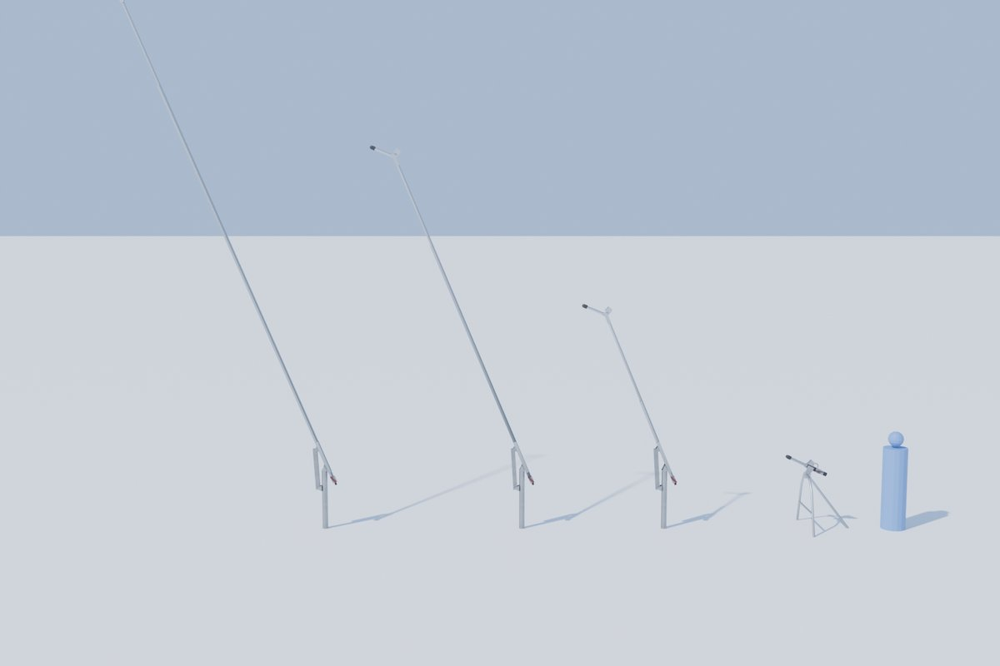
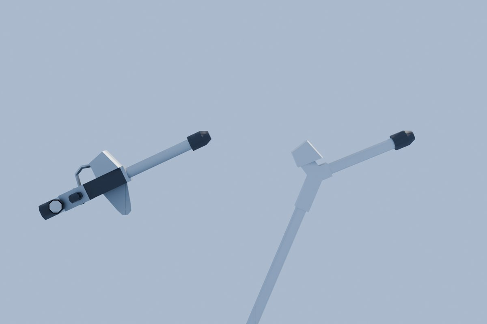
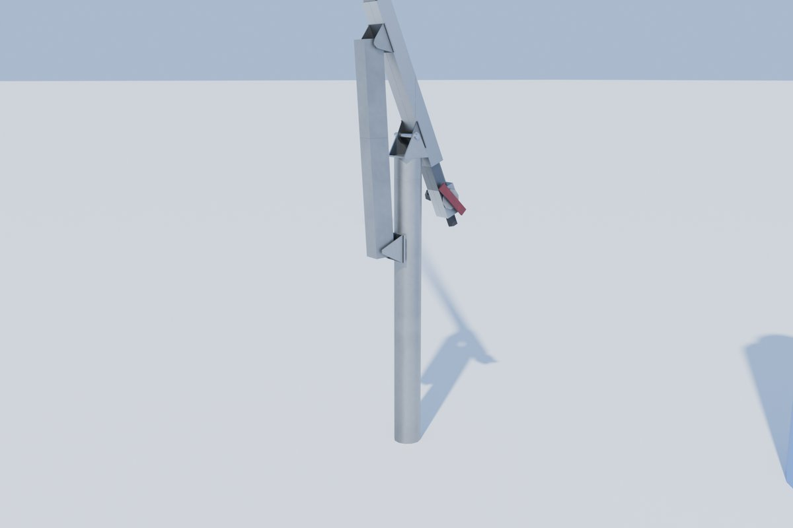
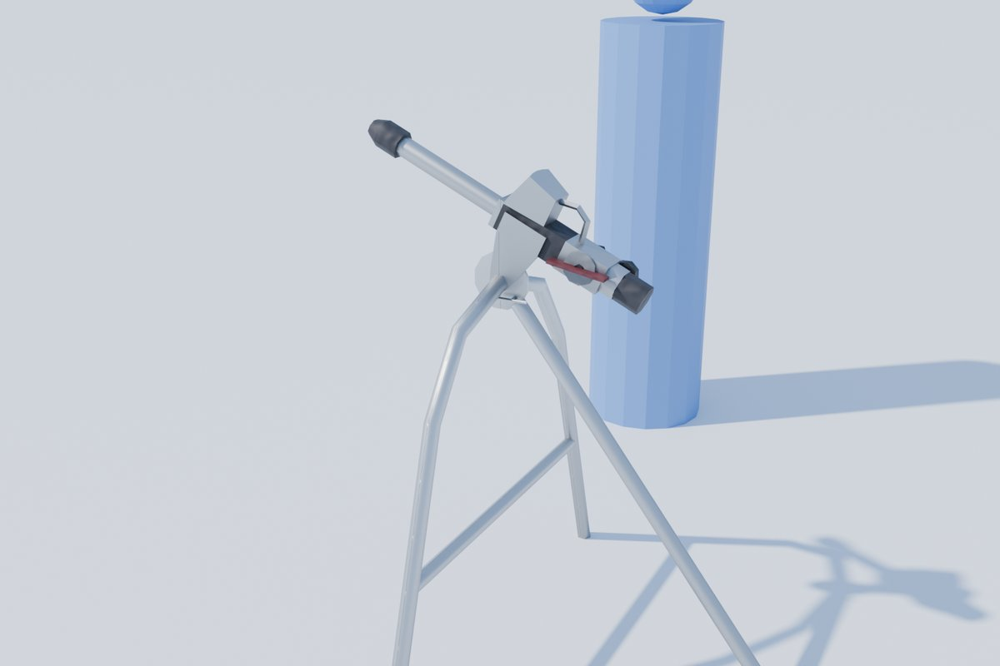
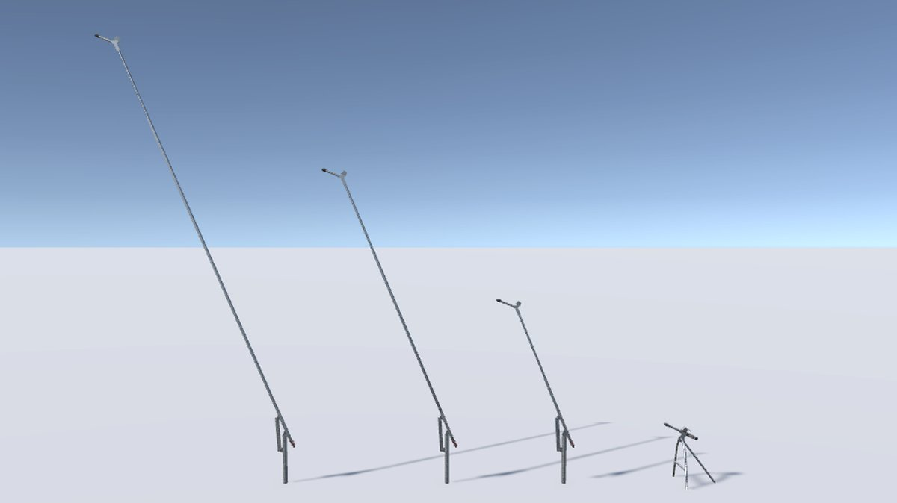

# Snow guns · SLE

**Audience:** the project owner and coding agents. **Status:** approved by the owner (review rounds below); in
this PR. **Date:** 2026-09-29. **Decisions:** LP16-LP19 in [phase0-decisions.md](phase0-decisions.md). Built with
the [lift asset pipeline](../../tools/assets/lifts/README.md).

**What it is:** the first snowmaking equipment, from a fictional maker code-named **SLE**. There are two guns: a
stick gun on a lance of 10, 20 or 30 ft of pipe, and a portable ground gun on a tripod. The owner's own 3D
reference model of a stick gun gave the layout and dimensions. The model stays local and unnamed; we measured it
and made our own design. The owner's close-up photos of a real unit gave the head's true size and the tripod.

## The guns

| Asset | Triangles (LOD0/1/2/3) | What it is |
|---|---|---|
| **Stick gun** (`sle_stick_gun_10`, `_20`, `_30`) | 598 / 154 / 38 / 8 | A base mast with the lance pinned on top and held by a stay; hose block, couplers and valve at the lance's foot; the head at its end |
| **Ground gun** (`sle_ground_gun`) | 534 / 156 / 30 / 12 | The head on a black valve body with the hose block, valve paddle, couplers and pressure gauge, on an aluminium tripod |

The game places hundreds of them, so they are small (LP19): LOD0 is a few hundred triangles and switches at
12 m; far out (LOD3) the stick gun is one bar.

## One head for both guns

Both guns carry the same head, sized from the owner's photos (the reference drew it small):
- a fan block whose 12-nozzle face is 100 × 100 mm, tapered back to 74 mm;
- a 2 in barrel, 305 mm long;
- a 74 mm nucleator cap with an octagonal nose to 44 mm.

The stick gun's head sits on a Y block at the lance's end, the one tower-specific part. The ground gun's sits on
its valve body. The generator keeps the head's dimensions in one place (LP16).

## The stick gun

- **Lance:** 10, 20 or 30 ft of 2 in pipe on a U-channel stiffener, one module building all three (the reference
  is the 20 ft one). The head rides on the pipe's end; the channel stops 5 ft short of it.
- **Base mast (LP17):** the reference's 5 ft post, a 4 in pipe standing 1.08 m above grade with 0.45 m in the
  ground. The lance is pinned between two ears on its base plate, 1.15 m up, and a stay runs from a clevis on the
  mast to tabs under the lance's sleeve. The asset's origin is on the mast's axis at grade.
- **Foot:** the hose block with a side coupler, a bottom coupler, and the valve with its maroon paddle.

## The ground gun

The owner photographed a real unit up close, and the ground gun follows those photos on the reference's layout:
the barrel and cap forward, the black valve body with the fan block on top, the hose block behind with its
valve, couplers and gauge. A tapered side plate hangs the gun on the tripod's pivot.

The **tripod** is aluminium, after the photos: an inverted-U arch across the gun whose apex tube is the elevation
pivot, a quadrant disc with a T-pin in its slot, a crossbar and a rear leg. The pivot is 1.0 m up.

## In Unity

- **Import:** `demo.bat` 22 builds the guns with the lifts and imports them. Each spec now names its maker and
  catalog entries; the rig carries them (`LiftRig.Maker`, `LiftRig.CatalogName`), so the Lab shows "SLE Stick
  gun, 20 ft lance".
- **Aim (LP18):** each gun has one hinged moving part, the lance or the ground gun's gun, tilted about X on its
  pivot. Turning the whole gun about +Y is the placement's yaw. The stick gun's stay rides with the lance, so its
  tilt stays within a few degrees.
- **Lift Lab** (`demo.bat` 23): key 7 shows the four guns side by side; key 8 builds a gun field of 500 guns
  along 20 trails (40 m apart, a gun every 30 m), every fifth a ground gun, each turned across its trail give or
  take 30° and aimed on its own hinge. The field is seeded, so every run is the same.
- **Tests:** the lift tests cover the guns (budgets, LOD distances, shadows, channels, naming), plus a check that
  each gun stands at grade and aims on a hinge about X above it, with the nozzle above and ahead.

## Budgets and performance

**Budgets (LP19):** LOD0 ≤600, LOD1 ≤160, LOD2 ≤40, LOD3 ≤12 triangles, switching at 12, 40, 150 and 600 m
(doubled on PC). Shadows come from LOD0-1 only.

**Performance:** the Lift Lab benchmark, the median of three release runs at 1920 × 1080 on the reference PC (an
NVIDIA GeForce RTX 3060 Ti, PC quality, lodBias 2). The gun field (key 8) has 500 guns along 20 trails.

| Scene | p50 | p95 | p99 | Batches | SetPass | Triangles |
|---|---|---|---|---|---|---|
| Empty (snow plane, sky) | 0.56 ms | 0.66 ms | 0.70 ms | 8 | 8 | 2,085 |
| Stress (20 lifts with towers, ~500 chairs) | 0.83 ms | 0.98 ms | 1.10 ms | 721 | 27 | 240,443 |
| **Gun field** (500 snow guns) | 0.68 ms | **0.84 ms** | 0.93 ms | 312 | 14 | 9,170 |

- The 500 guns cost 0.18 ms at p95 over the empty scene, against the 20 ms frame budget. Most are far from the
  camera and draw at LOD2 or LOD3, so the frame's triangles stay under 10,000.
- The three runs' p95 ranged from 0.84 to 0.85 ms.
- Each gun draws its body and its hinged part separately (312 batches). The game can merge or instance them
  along a trail later (future work, with the instanced chair path in Phase 3).

## Review record

The owner reviewed each round. Each row is a round and what came of it:

| Round | Owner direction | Result |
|---|---|---|
| 1 | Recreate the stick gun from the reference model | Gate 1 recreation; the head too small to see at the overview's scale |
| 2 | Audit it against the reference; split the loose ground gun out onto a tripod; make the lance 10, 20 or 30 ft | Silhouette audit (IoU about 0.96); ground gun on a tripod; three lance lengths from one module |
| 3 | The head looks small beside the figure; photos of people and of a real unit up close | Ground gun rebuilt at the photos' sizes; aluminium tripod after the photos |
| 4 | Sided details from the photos | The guns were mirror images of the reference (the valve on the wrong side); the mapping fixed |
| 5 | Put the photographed head on the stick gun too | Both guns share the photographed fan block |
| 6 | Heads should be very similar in scale (copy the ground gun's, the towers a bit different); the stick guns are missing their base masts | The stick gun takes the ground gun's head dimensions on its Y block; the mast stands on the ground |
| 7 | "Snowguns look good, please proceed" | Approved; imported into Unity with the Lab's gun field |

## Retrospective

- **Photos beat the reference for size.** The reference model gave a clean layout but drew the head and tripod
  at the wrong scale. The owner's close-ups of a real unit, with people for scale, fixed both in one round.
- **Check the ground line.** The reference drew its 5 ft mast almost entirely below its snow line, and the model
  followed it until the owner asked where the mast was. A glance at the photos' mast height before Gate 1 would
  have caught it. A silhouette audit can't: ours and the reference shared the mistake.
- **Check handedness with a sided detail.** Mapping the reference into our frame kept its hand only with a
  determinant of -1. The audit can't see a mirror; the valve paddle's side in a photo could.
- **One head, one place.** Keeping the head's dimensions in one generator block made "make them match" a small
  change for both guns.
