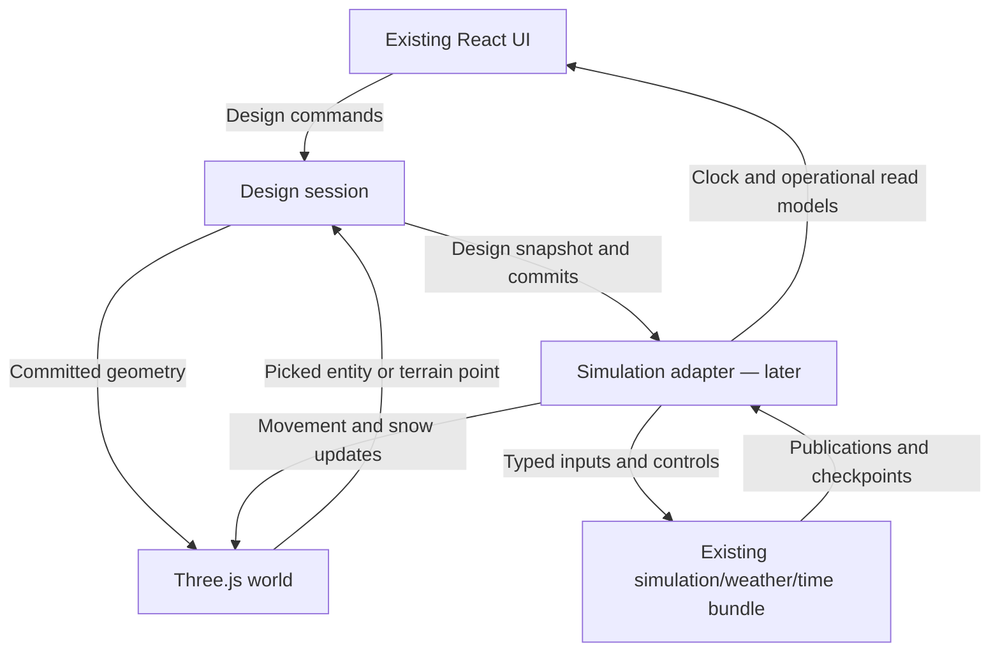

# Ski Area Design Challenge — Three.js design fork

**Revision:** 6 — orchestrator-selected models for high-quality work and efficient use of a ChatGPT Pro allowance; retains the approved product and all revision-4 correctness contracts.
**Date:** 2026-09-16.
**Purpose:** an executable phased plan for Codex. This is a planning deliverable; no implementation was performed.
**Source baseline:** [simulation branch at b915aef292da1bc31cd780b3555f3176a78ab5a7][source-01]. Review changes since this commit before implementation.

## 0. Start here

Keep this file at `docs/plans/threejs-migration.md` in the implementation fork. It is the canonical specification, not text to paste into every prompt. This revision optimizes how work is executed; no game implementation or account-setting change is included.

For a coding task, read applicable `AGENTS.md` guidance, this section, §10, the current progress record, and the active task's §7 row. Load only the relevant contracts through §10.2; expand context when a dependency or uncertainty requires it. Read §1–2 on first orientation or when their recorded version changes. Sections 4–6 and 9 retain the detailed requirements; task rows reference them instead of repeating them.

Use Sol Medium as the default orchestrator/reviewer. The orchestrator chooses the implementation model and reasoning effort for each task under §10.1, including whether to delegate or implement directly. Routine model selection and escalation do not require another user decision.

Start with P0-A. Complete one requested task through implementation, verification and handoff; do not spend a turn merely restating this plan. If the user authorizes a whole phase, continue its tasks in dependency order and stop at the phase exit. Do not begin later phases without that scope. This document alone does not authorize publishing or repository creation.

## 1. Approved product

Create a design-focused fork of the existing game:

- **MapLibre:** mountain location selection and the existing terrain-download workflow.
- **Three.js:** all mountain/world rendering after the downloaded package is ready.
- **React/HTML/CSS:** retain the current polished interface, components, styling and layout over the Three.js canvas.
- **First release:** select/download a mountain, build and edit lifts and trails using the existing node/path/junction system, inspect current design analysis, save and reload.
- **Next:** restore the remaining existing build features, including snowmaking and infrastructure.
- **Later:** connect the existing simulation, weather and time systems through a deliberately prepared adapter boundary.

The first release is a real editor with working saves. It has no running simulation, weather progression, guests or new economics. Its design data must remain suitable for the existing engine.

Target a visually striking **alpine diorama with map-like readability**. Terrain shape, ground-cover treatment and lighting take priority; lift/trail geometry follows. Individual trees, detailed people, photorealistic assets and first-person skiing are outside the initial scope.

The earlier draft’s canvas-UI rebuild, old-save compatibility program, tree/object emphasis and associated effort estimates are superseded.

### 1.1 Decisions that remain settled

React UI reuse, the existing node/network model, working fork saves, and a design-only first release remain required. P0 interaction evidence informs a minimal P1 session; its ports may evolve during P2/P3. Engine mappings and the real-engine proof begin in P6. Avoid repeated architecture debates unless source changes or a failed fixture expose a concrete conflict.

### 1.2 Review requirements carried forward

| Requirement | Canonical contract |
| --- | --- |
| R1 — Recoverable design/terrain saves | §5.1 |
| R2 — Authoritative, worker and renderer buffer ownership | §4.10 |
| R3 — All unpresented accepted edits survive stale jobs | §4.9 |
| R4 — Presentation failures cannot reverse commit success | §4.2 |
| R5 — Measure full confirmation cost and rare stalls | §4.11, §9.3 |
| R6 — Existing placement and anchoring behavior | §4.7 |
| Visual decision before P1; conditional mixed LOD | §4.5, P0 exit |

The source-based review verified the baseline on 2026-09-15. It established current storage/worker/publication behavior and identified risks for the future renderer; it did not establish measured Three.js performance. The phase exits and §9 still require that evidence.

## 2. Decision record

All product questions have answers. Exact hardware and representative fixture sizes can be recorded during P0 without reopening these choices.

| ID | Owner decision | Implementation consequence |
| --- | --- | --- |
| 01 | React UI is acceptable; “Three.js UI” referred to the updated interface | Reuse existing React DOM presentations. No canvas UI toolkit or UI rewrite. |
| 02 | First release is location selection, lifts and trails, retaining nodes | Nodes, paths, junctions and actual graph connectivity are first-release requirements. |
| 03 | Alpine diorama, visually stunning, with map qualities | Prioritize terrain/material composition and clear cartographic overlays; avoid object-detail scope. |
| 04 | Desktops with a GPU; efficiency matters | GPU world rendering, bounded CPU updates, explicit hardware measurements. Retain browser/Electron build paths. |
| 05 | A fork; upstream save compatibility is unnecessary; saves from day one | A distinct fork format/storage namespace; no legacy import or clock migration. First-release saves must remain useful in later fork releases. |
| 06 | “Mountain painter” means removing simulation from current scope | Port existing lift/trail-network design. No new freeform sculpting or painting product. |
| 07 | Costs are future scope; match current behavior | Preserve existing cost fields and TBD values. No new pricing or budget model. |
| 08 | Keep recommended current map bounds and scale approach | Reuse current terrain-package extents/build rules and measure small/typical/large fixtures. |
| 09 | Same zoom range as current game | Match usable ground scale and camera distances; no new close-up asset requirement. |
| 10 | Terrain shape and ground cover first; lifts/trails second | Establish these visual targets before adding decorative detail. |
| 11 | Standard input/accessibility support is acceptable | Keep native React/HTML form and keyboard behavior. No special hidden-input bridge needed. |
| 12 | Follow current time/edit behavior | No clocks run in the design release. On later integration, preserve current simulation rules, commit behavior and ordinary hidden-tab pausing. |
| 13 | Copy the polished current React interface | Reuse component structure and CSS; only adapt data/interaction dependencies and unavailable capabilities. |
| 14 | 2D means camera perpendicular to ground for overhead view | Reset viewing direction to local vertical. This does not require switching to an orthographic projection. |
| 15 | Remaining build features, then simulation | Construction parity precedes operational gameplay. |
| 16 | Desktop 60 FPS is desirable | Target 60 FPS on recorded GPU hardware with defined terrain/workload and frame-time measurements. |

**Practical default:** preserve existing UI divisions and positions. Leave future-only controls disabled or unavailable within their current owning surfaces, with brief explanations where needed. Do not run a hidden simulation to make the old UI props convenient, and do not display fabricated live metrics. This is a capability adaptation, not a redesign.

## 3. What can be reused, and what must change

| Existing area | Reuse | Required change |
| --- | --- | --- |
| App, setup and platform | React entrypoint, mountain search/selection, terrain preparation, browser/Electron bridges | Split selection from the Three.js gameplay host and use fork-specific persistence identity. |
| Polished interface | GameplayWorkspace, GameWindow, GameTabs, toolbox/inspectors, toolbar, menus and styles | Replace map-specific props/actions with small ports; make simulation-dependent information optional. |
| Terrain and cover | TerrainRecord, package validation, elevations, cover, imagery, contours, surroundings and analytical samplers | Build Three.js meshes/textures directly from package data; bypass MapLibre gameplay tile generation. |
| Lifts, trails and topology | Existing validation, lift specifications, trail geometry, nodes, paths, junctions and network construction | Replace MapLibre pointer/picking/preview adapters; retain domain geometry and IDs. |
| Construction authority | TerrainDocument, TopologyDocument and coherent commit coordination | Move ownership into a renderer-independent session; isolate presentation failures from accepted commands and required notifications. |
| Saves | Storage boundaries, terrain serialization and unsaved-work behavior | New fork envelope/namespace, immutable terrain generations and atomic save-reference publication. Remove simulation/weather prerequisites and verify recovery of complete design/terrain pairs. |
| Simulation bundle | Existing pure engines, worker protocol, prepared weather contracts and checkpoint/publication types | Provide a later adapter to the committed design session and Three.js presentation. Keep the bundle inactive in first-release gameplay. |

The core engine is already substantially separate from rendering. The remaining integration work is at the application boundary: `useResortSimulation.ts` still composes weather and legacy application hooks; `useDualClockRuntime.ts` uses requestAnimationFrame to schedule ordinary work; `MapView.tsx` gates several mutations and saves on weather readiness. Reusing those hooks unchanged would accidentally retain simulation dependencies in the editor.

Sources: [useResortSimulation.ts][source-02], [useDualClockRuntime.ts][source-03], [MapView.tsx][source-04].

## 4. First-release architecture

### 4.1 Application flow

1. Open the existing React menu/setup UI and select a mountain using MapLibre.
2. Download, prepare, validate and persist terrain/ground-cover assets using the existing data pipeline.
3. Create a design session and a valid initial fork save. A freshly created, still-empty mountain is saveable.
4. Dispose the MapLibre selection map and mount a Three.js world beneath the existing React gameplay interface.
5. Allow editing when the terrain, documents and renderer are ready. Weather preparation and simulation checkpoints are not prerequisites.
6. Load fork saves directly into the Three.js host. Do not briefly create a MapLibre gameplay map on load.

Retain the downloaded geographic/climate metadata and identifiers useful for future simulation. If weather-related data preparation is bundled into boot, separate its readiness from design readiness. Do not require weather generation or weather-provider calls to edit or save. A failed optional future-service request must not block the design workflow.

Keep loading, retry, cancellation, unsaved-work prompts and error handling in React. Failed scene setup preserves the downloaded package and the save. Returning to selection disposes the Three.js session resources. No MapLibre terrain rendering remains underneath the gameplay canvas.

### 4.2 Owners and dependency direction

Follow the repository’s existing direction: dependency-neutral models → pure domain logic → storage/protocol adapters → application orchestration/presentation.

| Owner | Responsibility |
| --- | --- |
| Design session | Committed terrain/design, stable identity, revisioned construction commits, derived network, save snapshots and lifecycle |
| Pure domain modules | Validation, quantities, analytical terrain sampling, topology/network semantics and construction analysis |
| Three.js renderer | Scene, camera, meshes/textures, preview geometry, graphical overlays and picking |
| React UI | Existing windows, forms, controls, readouts, selection presentation and keyboard behavior |
| Optional simulation adapter | Later initialization, accepted design updates, engine commands, publications, checkpoint coordination and disposal |
| Storage adapters | Fork saves, terrain packages, thumbnails and browser/Electron persistence |

Neither Three.js objects nor React state setters belong in saved/domain models. Simulation never receives a scene, camera, DOM node or MapLibre map.

Suggested new modules; names can be refined while preserving these owners:

- `src/app/DesignGameplayView.tsx`: React host composing session, existing UI and Three.js viewport.
- `src/app/session/`: committed design owner, narrow selectors/commands, capabilities and persistence coordination.
- `src/app/interaction/`: camera, picking, terrain sampling and tool-input ports.
- `src/app/three/`: scene lifecycle, terrain, materials, feature presentations and camera.
- `src/app/simulation/`: later adapter around the existing engine/worker, implemented in P6. No new engine adapter is required in first-release gameplay.
- Shared contracts beside their existing owning `src/types/` models.

These paths are proposals. Do not create a replacement generic “core” hierarchy or duplicate lift/trail/topology models.

Recommend a Three.js renderer owned by a small React host component. React Three Fiber is optional if it demonstrably simplifies lifecycle; it is not required for the existing React UI. Keep a single world render-loop owner. No new canvas UI library is needed.

Extract the session incrementally from existing ownership. P0 interaction experiments inform preview/input ports; P1 establishes persistence and committed transactions, not a frozen API for every future gesture. Refine those ports during P2/P3 without letting camera or pointer details enter domain/save models. Keep preview ownership and frame updates separate from accepted document mutations; do not add a generic event bus solely for a future simulation consumer.

**Commit success and presentation failure:** retain synchronous, coherent application of accepted terrain/topology state. Adapt publication so a later graphics failure cannot escape as a failed construction command. The current coordinator applies both documents before calling synchronous terrain and topology publishers; the terrain ports can throw before all consumers are notified. Rendering callbacks must enqueue bounded work, with fallible resource preparation/upload handled through renderer status. Ensure required dirty-state tracking and revision notifications complete even if another consumer fails. Once accepted, a construction exists exactly once and remains saveable; recovery rebuilds its presentation from committed data instead of retrying the construction. Validation failures before acceptance retain the existing review behavior. This requires narrow failure isolation, not a generic event bus. Sources: [commit coordinator][source-05], [terrain publication ports][source-06].

### 4.3 Preserve the node system as gameplay truth

The saved design must include lifts, trails, nodes, paths and junctions with stable IDs and existing relationships. A drawn lift/trail arrangement is not sufficient.

- Reuse `buildSkiNetwork` and current topology rules.
- Preserve lift terminal connectivity, trail direction, valid entrances/exits, path links, splits and junction semantics.
- Retain snapping, connection validation, edits/deletion and dependency cleanup.
- Derive network edges from committed models; do not infer connectivity from pixels, mesh intersections or proximity alone.
- Rebuilding the scene, changing materials, camera movement or save/load must not rename domain entities.
- Keep centerlines and trail footprints suitable for the existing engine’s validated route generation.
- Preserve needed lift/trail grading and cover clearing. Standalone terrain-sculpting tools are not added.

First-release proof: construct a lift, a descending trail and the required connecting nodes/paths; verify the resulting directed network and its persistence, including a split/junction and a disconnected-design validation case.

### 4.4 React UI reuse

Start with the actual current components and CSS, especially `GameplayWorkspace.tsx`, `MapGameDock.tsx`, `GameWindow.tsx`, `GameTabs.tsx`, `GameToolbar.tsx`, `ui.css` and `gameWindows.css`.

Preserve:

- Current toolbar/readout divisions, top-right utilities, bottom-right camera controls and viewport fitting.
- Toolbox tabs and the existing placement of contextual tool options.
- Lift/trail inspectors, profile/measurement presentations, pinned/draggable windows and selection behavior.
- Light/dark/system themes, current UI scaling, typography, icons, spacing, units and reduced-motion behavior.
- Native inputs, focus restoration, keyboard shortcuts, menus, scroll behavior and modal interaction.

Do not broadly restyle, consolidate duplicate controls or replace the window manager during the port. Capture the running UI before adapting it; some older documentation/test selectors describe a superseded layout.

Adapt feature read models rather than fabricating a `GameSimulationController`. Design quantities remain available; guest counts, live weather, clock and operational metrics are unavailable until simulation is attached. Preserve future feature slots within the familiar layout using capability flags.

### 4.5 World graphics

**Terrain first:** use the existing height grid and ground-cover data to create a well-composed, GPU-rendered alpine diorama. Favor coherent ground colors/material blending, readable contours, soft directional terrain shading and clean lift/trail overlays. Ground-cover classes can be represented by colors and textures; they do not require individual tree geometry.

- Construct chunked terrain meshes from package elevations. Begin with the simplest detail strategy that can meet the supported fixture, accuracy, frame-time and memory budgets; measure fixed-detail chunks before requiring mixed LOD. Use frustum culling and introduce LOD when measurements justify it.
- Preserve core/surround transitions and current build/sample extents. Avoid cracks, abrupt edge walls or unintentional holes.
- Use consistent color management and a restrained lighting/material setup; add optional effects only after basic terrain quality is good.
- Keep ground-cover classification and analytical overlays distinguishable from decorative shading.
- Render lifts, trails, nodes/paths, handles and selections cleanly at the current zoom range. Initial lift geometry need not include detailed animated machinery.
- Reuse current analysis and cover data; do not invent a weather/snow model to create visual snow. Any static visual treatment is a presentation choice.
- Defer individual trees, detailed buildings/people and photorealistic close-up assets.

**P0 visual decision:** record matching current-game and proposed-renderer views on representative terrain at the allowed near, typical and far camera scales, alongside a concrete alpine-diorama reference target. Assess terrain shape, ground-cover readability, construction/handle visibility and the preserved UI layout. Record whether the demonstrated visual approach warrants proceeding, or the bounded prototype work needed to resolve a specific deficiency. A technically functioning canvas alone does not pass this gate. Choose hardware, internal rendering resolution and workload before collecting acceptance measurements.

**Detail-strategy decision:** if fixed-detail chunks satisfy the full approved map/zoom envelope and measured budgets, record that evidence and mark mixed-LOD fixtures inapplicable. If mixed LOD is selected, implement and pass its transition, edge-stitching, deformation and picking fixtures before enabling full construction. Shared-edge, four-chunk and core/surround correctness remain mandatory for either strategy. Revisit the decision if later phases exceed the measured envelope; do not shrink the approved map scope to avoid these requirements.

Three.js WebGLRenderer uses WebGL2; verify the chosen version/toolchain and pin compatible dependencies. A GPU rendering target does not require moving deterministic domain analysis onto the GPU. [Three.js renderer documentation][source-07].

### 4.6 Coordinates, camera and picking

Use one geographic ↔ local-metre adapter. A suitable Three.js convention is x east, y elevation, z south. Document raster orientation and all model transforms. Domain distance/area/elevation calculations remain authoritative.

Match the current camera’s usable geographic scale and navigation feel. MapLibre “zoom” is not directly a Three.js camera distance; measure equivalent views at minimum, typical and maximum zoom.

The 2D control points the camera along local vertical for an overhead view of the mountain reference plane, rather than aligning to each sloping terrain face. A perspective camera can provide this behavior; true orthographic projection is not required. Restore the previous tilted view where consistent with current behavior.

Terrain picking uses the analytical heightfield contract in section 4.7, independently of rendered triangle density and LOD. Feature picking uses narrow candidate sets, screen-space handle/line tests and geometry intersection where appropriate. Coarse display LOD must not alter slope measurements, lengths, snapping or earthwork quantities.

For first-release feature hits preserve the applicable existing priority among lifts, trails and node/path handles; retain room for the complete category policy as features return. UI receives pointer/focus events before terrain tools. Avoid click-through and dragging the camera while scrolling or manipulating a window.

### 4.7 Terrain intersection and continuous tool input

**Baseline:** intersect camera rays with the authoritative 2.5D heightfield using accelerated grid traversal. Do not recursively intersect every rendered terrain chunk/triangle for each pointer event. This does not forbid Three.js Raycaster: it can construct a camera ray and dispatch specialized intersections, and remains useful for bounded non-terrain candidates. [Raycaster documentation][source-08].

Required algorithm and sampling contract:

1. Transform the ray into the documented local/grid coordinates and clip it against valid terrain extents and conservative elevation bounds. Handle upward, outside, near-horizontal and vertical rays explicitly.
2. Use chunk/tile min–max elevation bounds to reject intervals, then traverse candidate grid cells front to back with a DDA-style traversal. Bounds must conservatively include both source grids and the feathered surface where they overlap. Add hierarchy depth only as measurements justify it; never scan the entire heightfield on each hover.
3. Solve the nearest positive intersection against the same height function used by current map input. The current core and surround use bilinear sampling, with a smooth feather between them. A bilinear patch is not identical to two mesh triangles; the feathered region is not a single bilinear patch. Preserve those semantics, nodata handling and overlapping extents. Retain each domain analysis's existing sampling rules separately rather than changing its numerical reference to match a new renderer.
4. For bilinear cells in an affine grid frame, a ray/patch solution can be solved within the cell interval. Feather/transition regions require conservative subdivision/root isolation against the actual sampler. Account for multiple roots and grazing/tangent contacts; an endpoint sign-change test alone can miss a hit. Document any coordinate approximation and bound its error.
5. Do not substitute fixed-step ray marching with a large step: it can miss narrow terrain features. Return an explicit miss/pending result when appropriate, not a guessed ground point. Define world-space and projected-pixel tolerances in P0 and verify at the closest supported zoom.
6. Invalidate picking bounds for edited terrain and their ancestors. Tag results with the terrain and camera revisions used, so delayed work cannot apply a stale hit to a different surface.

The existing [terrain sampler][source-09] is the reference behavior; extract a pure, record-bound height evaluator from its global MapLibre adapter as needed. Prefer a height-only query on the hot path; slope/aspect evaluation is separate unless the tool actually needs it. Do not switch analytical surface definitions as a performance shortcut.

**Visual agreement:** independent picking alone does not fix a coarse mesh floating above/below the analytical surface. Meet a stated projected-error tolerance around an active stroke/selected handle. Fixed-detail chunks may satisfy it directly. If using LOD, refine or pin the interaction neighborhood for the gesture and transition outside it without moving the authoritative point. Visible brush rings, handles and draped trail geometry sample the same surface. Background LOD can remain coarser where that strategy is used.

**Input scheduling:** queue pointer samples; coalesce hover to the latest sample and process it in the world frame owner. Active painting must preserve the stroke shape, not discard all intermediate samples. Use bounded, distance-based resampling of the captured pointer stream, preserving corners and node snaps; process it without a React state update per sample. Associate samples with the applicable camera state, or preserve the current tool's camera-lock policy during a captured stroke. Pointer capture, cancellation and final pointer-up processing must not lose or accidentally commit a stroke.

**Interaction baseline:** preserve the source behavior during the port. P0 records a per-tool table of gesture, candidate search, distance limits, hit priority, camera locking, pointer capture and cancellation. The inspected baseline includes:

| Workflow | Current behavior to preserve |
| --- | --- |
| Lift placement | First click anchors a terminal, mouse movement previews the other terminal, second click enters review |
| Trail head/tail anchoring | `ANCHOR_PICK_M = 60` world-metre search, with existing direction, target eligibility and connected-footprint rules |
| Node/path trail anchoring | Existing 60-metre trail-anchor search and current topology validation |
| Trail painting | Existing captured paint/erase workflow; preserve stroke shape, finish/cancel behavior and supported undo |

Sources: [lift input][source-10], [trail input][source-11], [node/path input][source-12].

**Snapping:** screen-space feature hits/handles and world-distance anchor eligibility are separate contracts. Do not describe the current anchor search as a CSS-pixel tolerance or silently replace it. Screen-space targeting and lift-endpoint dragging may be evaluated as explicitly identified interaction changes; they are not required parity behavior. Establish the existing workflows first and document any intentional change, its rationale and near/far-zoom results before adopting it. Pointer-capture verification can use the existing trail-paint gesture. Measure picking, stroke resampling and snapping together under dense-node and grazing-ray workloads. Verify valid endpoints, wrong-direction candidates, disconnected footprints and cancellation as well as visible alignment.

### 4.8 React/world overlay synchronization

Three kinds of presentation have different timing needs:

| Presentation | Owner and update policy |
| --- | --- |
| Toolbox, floating inspectors, menus and status UI | Existing React screen-space layout. No world projection or per-frame camera subscription. |
| Node handles, brush rings, selection outlines and construction previews | Three.js world/overlay geometry, with screen-readable size where needed. Share the world camera and frame. |
| Any necessary HTML label/tooltip anchored to a world point | React owns mounting/content; a small overlay registry owns only transform/visibility through element refs. Do not route camera coordinates through React state every frame. |

For each world frame: activate a coherent scene revision; advance camera controls; update camera/object matrices; resolve current pointer/preview work and refresh any matrices it changes; project registered world anchors using those same matrices and the canvas CSS rectangle; write their DOM transforms/visibility; render the world. Both use the same camera, viewport and presentation revision before the browser can paint. Recompute when the camera, anchor, terrain or viewport changes, even if the pointer is stationary.

Maintain one owner for these steps. Account for canvas offsets, CSS scaling, device pixel ratio, resizing, clipping, points behind the camera and terrain occlusion. Batch layout reads before transform writes; cache measured label sizes and keep the registry bounded. React must not also write the imperative wrapper's transform. A separate inner element can retain React-owned styles/content.

Use layout effects for mount/resize measurements only when needed; they are not a substitute for a frame coordinator and can block painting. [React documentation][source-13]. Hide newly mounted anchored labels until their first valid placement. If a renderer is on demand, camera/anchor/UI-layout invalidation must schedule a synchronized frame.

This avoids introducing an application-level extra frame of lag; it does not guarantee browser compositor behavior without measurement. P0/P2 must demonstrate camera orbit, zoom, resize and rapid pointer motion with anchored labels/handles and verify no systematic one-frame trailing. Preserve ordinary GameWindow behavior without adding world synchronization to it.

### 4.9 Terrain deformation, normals and chunk consistency

Prove the renderer's deformation pipeline in P2 before porting the full grading-dependent construction flow in P3. Reuse grade calculations, but implement their Three.js publication path explicitly.

1. **Separate preview and commit.** Preview work owns a generation/base terrain revision and staged patches. Cancellation discards uncommitted preview results. Superseding a render-preparation job must retain the pending presentation work for already accepted edits. An accepted grade still uses the existing coherent terrain/topology transaction; GPU meshes never become the authoritative terrain.
2. **Carry changed samples.** The existing terrain-grade result already includes `patchIndices` and `patchHeights`. Derive affected rows/chunks from that sparse patch instead of comparing every terrain cell on each update. Add base/new revision and dirty-region provenance to renderer publications where needed. The current publication supplies a whole record, revision and edit kind, not a delta history. Retain cumulative unpresented dependencies as described below; a full package replacement or unavailable provenance uses a distinct full rebuild path. [Terrain grade engine][source-14].
3. **Expand the dependency region.** Changed samples affect neighboring interpolated cells and derivative stencils. Include the required halo for normals, boundary vertices, contours, terrain-bound overlays and picking min–max bounds. Include neighboring chunks that share affected samples and all resident LODs if LOD is used. Derive halo width from the actual sampler/normal method, not an arbitrary one-cell assumption.
4. **Update stable resources.** Keep topology/UV/index buffers stable when possible. Prepare affected position/normal arrays in bounded work, then update the relevant BufferAttribute ranges and mark them for upload. Set the intended dynamic usage before first upload. A range count is in array components, not vertex records; verify the chosen Three.js API. Use chunk replacement only when topology/LOD changes justify it. [BufferAttribute documentation][source-15].
5. **Keep shared borders identical.** Derive border positions and shading normals from the same global height function and derivative stencil, including neighbor samples. Recomputing each chunk's vertex normals independently cannot guarantee a seamless border. If mixed LOD is used, define its edge stitching explicitly. Skirts may hide distant background seams but must not conceal inaccurate active-edit surfaces. Refresh any skirt/transition vertices and geomorph data after a grade.
6. **Catch up from the presented revision.** Track committed revision, last successfully presented revision and the union of all unpresented dirty regions plus dependent assets. Build replacement work against the latest committed snapshot using that union. A newer job supersedes computation, not accepted changes: if r1 changes region A and r2 changes B before r1 displays, the replacement must cover A and B. A cover revision following a grade must retain pending height/normal work. Asset-specific revisions are optional if cumulative invalidation is correct. If provenance is missing, rebuild from the complete committed snapshot.
7. **Activate coherent presentations.** Refresh bounds, picking hierarchy, draped feature geometry, cover and affected overlays under the target presentation revision. Stage work within the measured memory budget and swap the complete affected group at a frame boundary. Do not show half the neighboring chunks at an old height. Recheck session generation, target revision and dependencies before activation; reject stale responses while retaining their uncovered dirty work. Clear only invalidations proven covered by a successful activation, preserving newer edits even when they overlap the same region. A failed upload leaves the pending set intact. Never label an incomplete presentation as the latest revision.
8. **Handle temporary renderer lag.** The committed document may advance before its GPU presentation is ready. Keep camera/React responsive, show updating state in the existing tool surface, and defer terrain-dependent gestures against an incoherent affected region. Do not accept hits from an outdated heightfield or use a stale thumbnail as proof of the latest design. Design persistence can save committed data independently; preview capture waits for the matching display revision or reports its separate failure.
9. **Recover cleanly.** Rebuild from the committed package after context recreation; never roll back accepted infrastructure because an upload failed. Preserve grade-review behavior for analysis failure and best-effort cover behavior after a valid commit.

P2 exit fixtures include a grade inside one chunk, across a shared edge, across a four-chunk corner and near the core/surround feather; add mixed-LOD boundaries when that strategy is used. Verify heights, shading normals, contours, picking and save/reload. Cancel an uncommitted preview and confirm it never reappears. Delay render preparation, commit grades in different regions, and complete jobs out of order; repeat with a grade immediately followed by cover clearing and with overlapping dirty regions. All accepted changes must appear in the final terrain/cover, picking bounds, overlays and matching thumbnail. Inject a presentation failure after acceptance: the design exists exactly once, saves correctly and reappears after renderer recovery. Measure preparation, upload cost, peak memory and frame tails. Small edits must not trigger whole-mountain renderer normal recalculation or geometry allocation; existing full-package domain preparation is measured separately under section 4.11.

### 4.10 Terrain buffer ownership

The first release already uses transfer-sensitive workers. `TerrainGradeAdapter.run()` transfers `request.heights.buffer`; current MapView callers supply `cached.heights.slice()` or `Float32Array.from(record.sampleHeights)`. TerrainDocument freezes a record shell without deep-copying its large payloads. Preserve that ownership distinction during extraction. Sources: [grading adapter][source-16], [copied worker input][source-17].

| Payload | Owner and lifetime |
| --- | --- |
| Authoritative heights, cover and other committed source arrays | Session-owned, immutable for the lifetime of snapshots/readers; never transferred or modified in place |
| Worker request arrays | Dedicated disposable copies initially; transfer only after no session, sampler, save or renderer retains ownership |
| Worker results | Request/generation-bound outputs; validate before adopting and retain while any accepted snapshot or presentation uses them |
| Renderer staging and displayed arrays | Renderer-owned resources, separate from authoritative inputs; release only after preparation/display consumers finish |

A transferred ArrayBuffer becomes detached from its sending owner; readonly TypeScript annotations do not prevent this. Preserve copied grading inputs initially. Cancellation must never destroy the only authoritative copy. Optimize copies only after defining an equally safe ownership contract and measuring need; include simultaneous old/new snapshots, worker buffers and staged geometry in peak-memory measurements. [Transfer semantics][source-18].

P1/P2 verification starts, cancels and restarts grading while sampling and saving the same committed terrain, and rebuilds the renderer during pending work. Source arrays retain their lengths and contents, saves remain coherent, and stale outputs cannot mutate the session.

### 4.11 Complete grading and confirmation cost

A sparse GPU update does not imply sparse CPU work. The current `applyTerrainGradeToRecord()` copies the full height array, converts contours, builds a manifest and validates the package synchronously in the confirmation path. Manifest/validation work also traverses other payloads, including unchanged cover and imagery when present. The grading worker separately copies full grids and regenerates contours. Sources: [grade commit][source-19], [manifest/validation][source-20], [confirmation caller][source-21].

Measure worker-input preparation, analysis, result handling, record construction, checksums/validation, document publication and GPU activation separately. In P0 record the current confirmation cost; in P2/P3 record the integrated path. Set numeric limits for the longest uninterrupted application-thread work, confirm-to-visible latency and peak memory before declaring acceptance. Report rare event stalls separately from steady frame percentiles.

If a stage exceeds its budget, move preparation/validation off-thread or reuse verified metadata for unchanged immutable assets as appropriate. Preserve all validation guarantees, explicit buffer ownership and a final base-revision check before the short authoritative commit. Do not rewrite the whole terrain engine solely because its asymptotic cost is visible in source. Verify a small grade on the large fixture while navigating, including simultaneous old/new terrain and staging allocations.

## 5. Saves from day one

### 5.1 Fork format and isolation

No upstream GameSave compatibility or import is required. Introduce a clearly identified fork save format, for example a distinct format discriminator with schema version 1, and a separate browser/Electron storage namespace.

Reuse existing domain entity types and terrain-package serialization where useful. Do not label a design-only save as upstream schema 17: that path currently expects a valid simulation checkpoint. Do not bypass checkpoint validation with fake data.

The first fork save includes:

- Save identity, name and timestamps.
- Logical terrain-package identity, exact immutable stored generation and validation metadata sufficient to restore that generation’s edited terrain and cover.
- Site bounds/location and camera state.
- Lifts, trails, nodes, paths, junctions and their stable relationships.
- Committed design revision and required authoring metadata, including existing economics/TBD values.
- Other construction fields as their owning phases land.

**Recovery strategy:** use immutable terrain generations plus atomic publication of the design’s exact terrain reference. Terrain-first writes alone are insufficient: existing storage overwrites terrain at `record.key` separately from the design save. A failed design write can therefore leave the previous design pointing to newer terrain. Desktop replacement of individual asset files is also not a transaction over the complete design/terrain pair. Reuse serializers and the browser/Electron boundaries, but implement the fork’s recovery protocol explicitly. Sources: [terrain storage][source-22], [game-save storage][source-23], [desktop terrain writes][source-24].

Required save transaction:

1. Serialize save attempts for the same save. Capture design, terrain generation/content, camera and revisions from one committed snapshot before asynchronous writes. Hold its source arrays unchanged for the operation.
2. Write changed terrain into a new immutable generation and verify its assets. Reuse the referenced generation when terrain is unchanged. The logical mountain identity and domain entity IDs remain stable; generation identifiers belong to storage. Never overwrite assets reachable from a valid save while preparing its successor.
3. Write the complete design save manifest referencing exactly that verified generation. Publish its authoritative head atomically, keeping the prior complete pair recoverable until publication succeeds. In the browser, use an IndexedDB transaction for the authoritative save records/head. On desktop, stage the manifest/head and use atomic replacement supported and tested on target platforms; do not remove the previous authoritative file before replacing it. Define recovery after interruption at each publication step.
4. Treat summaries/indexes and thumbnails as recoverable secondary data. Their failure must not turn an already published coherent save into an apparent failed domain write. Refresh or reconstruct them from committed manifests; report preview failure separately.
5. Acknowledge only the snapshot/revisions actually saved. Edits accepted during saving remain dirty; a failed save must not mark the design clean. Retry starts from a coherent snapshot and cannot race an older save attempt.
6. Clean up unreferenced staged generations only after checking all retained save/in-flight references. Retain enough prior state for the recovery protocol and bound orphan retention; a user-facing save-history feature is outside this requirement.

P1 must inject failure after terrain persistence but before design publication, interrupt desktop asset/manifest publication, fail secondary index/preview writes, and edit during a pending save. Reload recovers a complete old or new design/terrain pair, never a mixture. Verify through the real browser and Electron adapters/preload boundary.

Isolate fork save indexes, previews and mutable terrain packages from the upstream game. A separate format name alone does not prevent shared storage keys or Electron application directories from overwriting originals.

The owner’s fork/no-backward-compatibility instruction supersedes upstream old-save obligations for this product. Update fork guidance and applicable tests to reflect that decision. Keep unrelated invariants and useful domain fixtures; do not weaken general validation or failure propagation.

### 5.2 User-visible behavior

- New mountain creation, manual save, load/continue and unsaved-work handling work in the first usable build.
- Save an empty mountain, then save and restore a connected lift/trail network.
- Preserve current preview capture behavior; hide/restore transient construction overlays with finally-safe cleanup.
- Capture failure is distinct from design persistence failure. After the authoritative save head commits, secondary index/preview failures report their own recoverable status.
- Editing/saving works without a simulation worker or a prepared weather run.
- An original-game save receives a clear unsupported-format result; no conversion project is part of this plan.

“No upstream compatibility” does not mean discarding designs made in this fork. Future construction/simulation releases must load the first-release fork saves through explicit, tested evolution.

### 5.3 Later simulation persistence

Keep first-release saves design-only. Document a future optional, versioned simulation attachment rather than adding a mandatory empty checkpoint now.

When implemented, the attachment must bind the existing engine checkpoint to the design/terrain identity and its weather run/package. It carries the seed, engine/configuration version, clocks and prepared-weather position through existing contracts where possible.

Loading a design-only fork save in a simulation-capable release offers initialization of a new run. It does not invent historical snow, guest activity or revenue. Loading a simulation-enabled save restores a coherent run paused, following current engine behavior.

Future saves use a barrier across accepted design revision, the exact immutable terrain generation and engine checkpoint, then publish through the same recoverable save protocol as section 5.1. Failed or unsupported simulation hydration must not silently discard the attached state and overwrite the save as a fresh run.

## 6. Make future simulation integration straightforward

### 6.1 Integration topology

The design session is the shared authority boundary. Three.js and simulation are consumers of its committed data; React sends user commands.



The later adapter is a small composition layer, not a replacement engine or a generic plugin platform. These boundaries should limit the eventual integration to operational configuration, lifecycle, publications and dynamic presentation modules. Compatibility remains to be verified in P6; this plan does not promise a zero-refactor or drop-in integration before that proof exists.

### 6.2 Preserve these boundaries in the first release

| Provision | Concrete first-release work | Why it matters later |
| --- | --- | --- |
| Committed design snapshot | Retain terrain, lifts/trails/nodes/paths/junctions, derived network and stable identity as required by editing and saving | A later engine adapter can consume domain data rather than reconstructing a scene. |
| Existing revisioned transactions | Keep accepted changes distinct from previews; expose the notifications needed by the renderer and save state | A later simulation consumer can subscribe at the same committed boundary. No simulation-specific subscription API/event bus is required now. |
| Capability boundary | Runtime is absent; UI distinguishes design data from unavailable operational state | Attaching simulation does not require a UI rewrite. |
| Renderer resource ownership | Keep terrain and feature presentation modules behind the world owner; document a later home for dynamic layers | Guest/flow/snow layers can be added without making meshes authoritative. No placeholder frame protocol is required now. |
| Persistence extension design | Record how a future checkpoint binds to a fork design save | Avoid making simulation mandatory for v1 saves. |

Defer `canonicalResortSimulationInput` mappings, simulation serialization fixtures, worker lifecycle extraction and the real-engine proof to P6. First-release network/save fixtures exercise actual editor behavior. Preserve the existing engine source/tests, but add no new simulation harness as a P1–P4 gate.

Do not ship simulated placeholder guests or fake weather. First-release gameplay must not start simulation/weather workers or timers. Keep existing engine source and tests available; avoid gratuitous engine moves, rewrites or deletions.

### 6.3 P6 reference: reuse actual contracts

When P6 starts, recheck the then-current `ResortSimulationInput` and `DualInitialization` types in `src/dualClock/model.ts`, the dependency-neutral types in `src/types/dualClock.ts`, and the existing worker command/publication types. The following inventory records the reviewed baseline; it does not mandate new engine dependencies in P1.

Current initialization needs more than geometry: terrain, seed, start/timezone, initial snow, prepared weather hours and resort input. Resort input includes edges, trails, portal, demand, ticket price and amenities. Keep operational configuration with the later simulation adapter, not in Three.js or invented v1 UI.

Reuse `buildSkiNetwork`, `canonicalResortSimulationInput` and `resortRevision` as appropriate. Do not copy current default business values into a second model. If application placement of a pure helper prevents headless reuse, move only that helper to the correct dependency layer with characterization coverage.

**Revision distinction:** the current worker’s `committedRevision` is populated from the engine clock revision. `resortRevision` is a design-content hash. Neither should be assumed equal to a new session’s monotonically increasing design revision. The adapter must track their relationship explicitly, including terrain identity and session generation.

Sources: [model.ts][source-25], [resortSimulationInput.ts][source-26], [revision.ts][source-27], [worker][source-28].

### 6.4 Later adapter lifecycle

Design around a narrow set of operations, extending existing types instead of creating parallel protocols:

1. **Attach:** initialize the engine/worker from a committed design and supplied operational/weather inputs; retain readiness/error state.
2. **Update design:** accept only committed revisions. Serialize updates at the existing safe control boundaries and wait for acknowledgment.
3. **Send control:** forward play, pause, speed, advance, cancel, resume, selection and follow using existing semantics.
4. **Subscribe:** expose separate movement/geometry, snow and slower UI read-model channels.
5. **Checkpoint:** obtain a coherent checkpoint bound to the acknowledged design/terrain state.
6. **Dispose:** cancel preparation/work, unsubscribe, terminate owned resources and invalidate pending responses.

Implement this adapter in P6, beginning with the proof in section 6.6 and then production attachment. Until then, implement only session boundaries required by current editor/save/renderer consumers.

If an engine update fails after a construction commit, the accepted design remains authoritative. Mark simulation as needing resynchronization and block inconsistent simulation saves/advancement until recovered. Do not silently roll back construction or continue with mismatched state.

Preserve the current time/weather model when attaching it. Do not re-create separate advancing clocks for UI and renderer, and do not change rates or macro/micro relationships during the graphics port.

### 6.5 Publication and performance rules for the later phase

- Simulation owns time and results. The renderer owns interpolation and GPU presentation; camera FPS does not determine simulation outcomes.
- Remove the scheduling dependence on a map/render callback behind an injected scheduler/runtime service while preserving ordinary hidden-tab pause and existing cancellation/weather gates.
- Reuse the persistent worker; send geometry on change, movement at a bounded cadence, snow updates independently and UI summaries only as needed.
- Preserve validated route-based movement through bends, holes and topology changes. Drawing, hits and follow use the same displayed position.
- Keep macro/micro clocks and individual/aggregate representations distinct.
- Retain generations, request identities and revision checks. Coalesce only replaceable complete visual samples, never control acknowledgments or dependent patches.
- If directly consuming transferred movement buffers, keep them until rendering/interpolation no longer references them. Current decoding copies data before recycling; skipping that copy changes the lifetime contract.
- Snow patches need grid/base/new revision tracking and full resynchronization when a base is missing.
- Use persistent GPU buffers/textures and batched guest rendering. No thousands of React state updates per frame.
- Do not introduce WASM, SharedArrayBuffer, a new physics engine or a distributed simulation architecture without measured need.

### 6.6 P6 integration proof, before live simulation presentation

At the start of P6, use a design produced by the released editor and the real existing engine with deterministic weather fixtures. Establish the adapter contract before implementing live operational presentation; this proof is not a first-release gate.

- Build/save/load a small connected lift/trail/node design through the new session.
- Convert the restored design into current engine input; provide existing test fixtures for prepared weather and valid operational initialization.
- Initialize the engine without React, MapLibre or Three.js, advance it and obtain a valid publication/checkpoint.
- Exercise a committed network edit and verify the adapter maps the new revision and accepts coherent output.
- Confirm invalid/disconnected topology produces existing validation behavior rather than invented connections.
- Prove a normal design session loads, edits and saves while no simulation runtime is attached.

This proof turns the preserved architectural boundaries into verified compatibility. Then complete worker lifecycle, live presentation, weather preparation and operational UI within P6. First-release simulation absence is tested independently in P1–P4 without initializing the engine.

## 7. Phased implementation

Execute task IDs in order within each phase. A row is a bounded outcome, not a license to omit its referenced contracts. Split a row further only when ownership boundaries or a concrete blocker require it; keep related implementation and verification together. The source paths in §10.2 are entry points, not exhaustive edit lists. Use §9 for applicable evidence and §10.3 for gate cadence.

### P0 — Baseline and terrain interaction prototype

| Task | Complete outcome |
| --- | --- |
| P0-A — Baseline | Inspect changes since the pinned SHA and repository guidance. Capture current UI/camera/tool behavior and gate status. Select small/typical/large packages, target hardware, internal resolution and workloads. Profile current grade-confirmation stages. Record reused component/source entry points and fixture locations. |
| P0-B — Terrain and gestures | Prototype a real package under the existing React shell: cover/terrain treatment, camera/overhead view, analytical picking, current lift placement, captured/resampled trail painting, anchoring and cancellation. Demonstrate synchronized world handles/needed DOM labels. Pin compatible dependencies. |
| P0-C — Decisions | Measure picking, overlays, surface error and resource use. Choose fixed-detail or LOD with evidence. Compare matching current/proposed views to the art target. Set numeric limits for interaction, frame/confirmation latency, projected error and memory. Record deformation/cumulative invalidation, buffer ownership, save publication and unavailable-UI approaches; bound P1. |

**Exit:** a runnable comparison and current placement/paint/snap/cancel demonstrations, with recorded visual and detail-strategy decisions. Resolve a specific visual/technical deficiency through bounded P0 follow-up before P1. Re-estimate remaining work from evidence. Do not freeze a generic session API, add simulation work or substitute new gestures for the baseline.

### P1 — Minimal design persistence and document transactions

**Depends on P0 exit.**

| Task | Complete outcome |
| --- | --- |
| P1-A — Session | Extract committed ownership, narrow read/command ports, capabilities and save snapshots. Retain domain models, atomic terrain/topology behavior and revisions. Isolate presentation failures and establish buffer ownership. Remove simulation/weather prerequisites from design boot/edit/save; retain engine source/tests. |
| P1-B — Recoverable storage | Implement §5.1 through browser/Electron adapters: fork isolation, immutable terrain generations, atomic design-reference publication, serialized saves and correct acknowledgment of saved revisions. Save/load empty and domain-authored connected designs. |
| P1-C — Failure evidence | Verify interrupted/failed writes, secondary index/preview failures, edits during saving, intact arrays during worker cancellation, nonmutating previews, and accepted commits surviving a failing presentation consumer. Use headless document and adapter fixtures without initializing the engine. |

**Exit:** coherent recoverable saves and a renderer-independent owner with correct commit/notification and buffer lifetimes. APIs may evolve with real tools. No release contains disposable designs.

### P2 — Three.js host, UI synchronization and terrain deformation

**Depends on P1 exit.**

| Task | Complete outcome |
| --- | --- |
| P2-A — Host and interface | Implement selection→Three.js handoff, direct fork-save loading, terrain/surround/cover/imagery, boundaries and essential analysis overlays. Connect the chosen camera/picking strategy, initial feature presentations and existing React windows/toolbars through session ports. Preserve theme/scale/focus; adapt unavailable capabilities. |
| P2-B — Deformation | Implement §4.9 with existing grade results: stable uploads, shared normals/borders, applicable LOD treatment, cumulative dirty dependencies, picking bounds and coherent activation. Implement frame synchronization and explicit source/staging ownership. Measure the full preparation/confirmation path. |
| P2-C — Recovery and races | Exercise all applicable §4.9–4.10 fixtures: delayed/out-of-order/overlapping edits, grade→cover, cancellation, display failure and context recovery. Verify matching thumbnails, retained accepted changes, intact buffers, disposal and resource/memory behavior. |

**Exit:** select/download/save/enter/inspect/navigate/reload works with no active gameplay MapLibre map. Existing gestures and labels remain stable; boundary grading and recovery pass. Record why mixed-LOD fixtures apply or are inapplicable before P3 construction.

### P3 — Complete lift/trail/node editing

**Depends on P2 exit.**

| Task | Complete outcome |
| --- | --- |
| P3-A — Construction tools | Port lift placement/review and trail painting/editing using the real input/preview adapters. Retain measurements, profiles, costs/TBD fields, supported undo, validation and cancel/review/confirm behavior. Document intentional gesture changes separately. |
| P3-B — Network and terrain | Restore nodes, paths, junctions, direction, snapping, edits/deletion and cleanup. Connect grading/cover clearing to the verified presentation path. Test stale/double confirmation and failure behavior, including split/junction and disconnected cases. |
| P3-C — Complete workflow | Finish save/load, unsaved prompts and revision-matched previews. Build a connected lift/descent, revise/delete/cancel and reload identical connectivity/measurements. Measure a small grade on the large fixture while navigating; fix measured latency/memory failures without weakening validation. |

**Exit:** useful saved construction with stable IDs, correct near/far anchoring, and evidence against P0 budgets. Delayed rendering/saving preserves accepted edits and later dirty state.

### P4 — First-release visual polish and verification

**Depends on P3. First release ships after this phase.**

**P4-A:** polish terrain/cover/lighting, then features/handles/overlays; preserve camera reach and React layout. Run the integrated §9 matrix on P0 fixtures, including offline reload, empty/complex designs, interruption recovery, simulation absence, rare stalls and long-session resources. Run required deterministic/browser checks and explicit GPU/Electron release checks; resolve measured failures. Record visual acceptance, scope, known limits and release SHA. No new engine proof is a gate.

**Exit:** choose a mountain, build/save useful connected lift/trail designs, and reload them in an attractive responsive Three.js scene. Unsupported construction and operational capabilities remain clearly unavailable.

### P5 — Remaining current construction features

**Depends on the released first-design slice.**

**P5-A:** restore snowmaking nodes/guns/pipes/pumps and hydraulic/network analysis with their UI, IDs, revisions and save migrations. **P5-B:** restore roads/buildings/lakes/dams/ponds, remaining grading/earthwork/cover/analysis, relevant panels/dashboards and full category-hit/overlay policy. Use existing data and required feature geometry; retain accepted infrastructure and record later engine inputs.

**Exit:** current construction functionality/usability with tested v1 fork-save evolution, operating entirely as an editor. No new simulation adapter yet.

### P6 — Attach existing simulation, weather and time

**Depends on P5 exit.**

**P6-A:** recheck actual engine contracts; map a released-editor save and pass the real-engine proof in §6.6 before live presentation. **P6-B:** implement §6 lifecycle, worker/scheduler/weather integration, acknowledgment and resynchronization, operational configuration/UI, movement/queues/aggregate flow/snow, follow/selection and current cancellation/preset behavior. **P6-C:** implement the optional simulation save attachment and coherent checkpoint barrier; verify earlier design-only saves, paused restoration, publication lifetimes, unchanged clock/weather semantics and results independent of render cadence.

**Exit:** current simulation operates through the proven boundary. Document necessary contract/migration changes; no unrelated editor/UI rewrite.

### P7 — Full current-game parity and final hardening

**Depends on P6 exit.**

**P7-A:** finish operational dashboards/settings/edge states; measure the full world/simulation workload and long-session/checkpoint recovery. Complete browser/Electron, GPU and save-evolution checks. Remove obsolete gameplay MapLibre adapters only after replacements pass; retain selection and useful supported harnesses. Update landed architecture, fork guidance, parity matrix and benchmarks.

**Exit:** current game functionality restored with accepted fork-format differences. New economics, unrestricted sculpting and detailed-object simulation remain separate scope.

## 8. Capability matrix

| Capability | First release, P0–P4 | P5 | P6–P7 |
| --- | --- | --- | --- |
| MapLibre location selection/download | Complete | Retained | Retained |
| Three.js terrain/cover/camera | Complete and polished | Extend affected geometry | Add live conditions |
| Current React layout/style | Reused for supported capabilities | Restore build panels | Restore operational panels |
| Lifts/trails/nodes/paths/junctions | Complete connected design workflow | Retained | Consumed by simulation |
| Required lift/trail grading and clearing | Included | Full current construction workflows | Simulation receives accepted changes |
| Fork saves/load/continue | Required from first usable build | Evolve v1 saves | Add coherent optional simulation state |
| Upstream save import | Outside scope | Outside scope | Outside scope |
| Snowmaking/infrastructure | Disabled/unavailable | Current build/analysis parity | Existing operational effects |
| Weather/time/guest engine | Inactive; existing source/tests retained, no new engine harness | Inactive | Adapter proof, then existing engine attached |
| Moving guests, snow wear, live weather | Future | Future | Current behavior restored |
| Costs | Match existing fields/TBD | Match existing behavior | No new pricing model implied |
| Trees/detailed objects/first-person realism | Outside initial scope | Only feature representation needed | Separate art scope if requested |

## 9. Invariants and verification

### 9.1 Construction/input invariants

Preserve relevant AGENTS.md rules:

- Exactly one active tool owns cursor, drag, pointer capture and double-click behavior.
- Tool switching cancels the previous tool synchronously; cleanup restores prior state once.
- React modals/inputs and existing Escape behavior take precedence over terrain gestures.
- Reject stale analysis, stale revision confirmation and duplicate confirmation.
- Terrain/topology commits stay coherent; preview state cannot mutate saves. Once accepted, a command is not reported as failed because a presentation consumer throws; required notifications and dirty-state tracking still complete.
- Grade failure retains review state. Best-effort cover failure does not roll back already committed infrastructure.
- Scene/camera changes never change domain IDs, analytical terrain or network connectivity. Authoritative source arrays are never transferred/detached or mutated by display/worker consumers. Stale presentation jobs cannot discard pending work for accepted edits.

As remaining features return, restore full existing hit priority and analytical overlay ordering while respecting physical 3D occlusion. Do not select a hidden object through the mountain just to preserve category priority.

### 9.2 Tests that establish the first release

| Area | Evidence required |
| --- | --- |
| UI reuse | Current screenshots and real pointer/keyboard workflows at recorded viewport/theme/scale; disabled future controls do not disturb layout |
| Terrain picking | Nearest hits/misses for vertical, grazing and outside rays; bilinear/feather/nodata behavior; stable hits under the chosen detail strategy and across LOD transitions when used; measured pointer/stroke workloads |
| Overlay timing | World handles/labels agree with the rendered camera during orbit/zoom/resize; no systematic extra-frame lag; ordinary windows retain existing behavior |
| Terrain deformation | Grades inside/across chunks, core/surround and any implemented mixed LOD; border heights/normals, picking bounds and contours; cumulative dirty regions; delayed/out-of-order multi-edit and grade→cover completion; coherent activation; cancelled previews disappear while accepted changes persist |
| Node network | Directed connectivity, lift terminal links, trail splits/junctions, snapping, deletion and unchanged IDs across save/load |
| Construction | Current click–move–click and anchor-search baseline at near/far zoom; valid/wrong-direction/disconnected cases; create/edit/cancel/confirm flows; stale results; tool ownership; cover/grade failure semantics; accepted commit remains successful after a display failure |
| Saves | Empty/built round trips; isolated namespace; immutable terrain generations; atomic save publication; interrupted writes recover a complete old/new pair; secondary-data failures; serialized saves and correct dirty state for later edits; unsaved prompts; offline reload |
| Terrain buffers | Start/cancel/restart workers while sampling/saving; renderer rebuild during pending work; authoritative array lengths/contents stay intact and no stale output mutates the session |
| Confirmation latency | Small grade on the large fixture during navigation; per-stage timings, longest application-thread interruption, confirm-to-visible latency and simultaneous source/worker/staging peak memory against P0 budgets |
| P0 decisions | Matching current/proposed views and concrete art target; recorded visual decision; measured detail strategy with reasons for LOD fixture applicability |
| Simulation absence | No simulation/weather worker or advancement timer in ordinary design runtime; edit/save independent of those services |
| Future integration provisions | Domain data/IDs, ordinary revisioned commits and simulation-free saving remain intact; actual engine mapping/proof is a P6 gate |
| Lifecycle | Repeated selection/game/load/menu and cancelled scene preparation release resources and ignore stale completions |

Reuse domain tests and adapt relevant Playwright workflows: construction-save, lift preview/presentation, trail painting/presentation, node/path controller, floating windows, dock coordination, settings/map context and save loading. Current documentation reports stale broader-browser selectors; repair intended interactions rather than hiding failures.

Use `npm ci`, `npm run check`, `npm run check:e2e-harness` and the appropriate `npm run test:e2e` workflows. Update fork capability expectations deliberately: a removed first-release simulation UI should not be tested as shipped. Preserve existing engine domain tests when retaining those modules; add the new adapter proof in P6. Keep live-provider, GPU and Electron checks separately identified.

### 9.3 Performance target

**Owner goal: 60 FPS on a desktop with a GPU.** Exact device/scene limits are recorded in P0; this plan does not claim measured Three.js performance.

Proposed acceptance measurements:

- Approximately 60 FPS at 1920×1080 on the selected target GPU, with CSS viewport, internal rendering resolution, DPR, quality tier and display refresh recorded. Fix hardware/workload and numeric acceptance limits in P0 before collecting acceptance results.
- Suggested p95 frame interval ≤20 ms and p99 ≤33.3 ms after warmup, for a defined camera/editing workload.
- Camera and brush feedback remain responsive while analysis runs; target ordinary input response below 100 ms and record tails.
- Record small/typical/large terrain packages and lift/trail/node counts. Do not use an empty scene as the release benchmark.
- Track CPU frame work, GPU draw time where measurable, draw calls, uploaded bytes, resource counts, main/worker memory and load time.
- Separately record heightfield queries per frame/cells visited, complete stroke-resampling cost, world-label layout/projection work and grade patch preparation/upload cost. Include grazing rays, dense snapping candidates, camera motion with labels and grades crossing chunk boundaries; no full-resolution terrain mesh scan may hide in these hot paths.
- Record grade-confirmation stages from section 4.11, longest uninterrupted application-thread time, confirm-to-visible latency, save-event stalls and peak memory while old/new snapshots, workers and staged GPU data coexist. Judge these event windows separately: global p95/p99 can hide rare large stalls. P0 supplies numeric limits, and P2–P4 must report actual results against them.
- Repeated loads and extended editing should plateau after warmup; define numeric resource tolerance from baseline measurements.
- In P6, remeasure with live simulation. A fast design scene is not evidence for future guest/snow performance.

Keep terrain and overlays resident on the GPU; update affected chunks/ranges after edits instead of rebuilding the scene every frame. Avoid full document copies or React rerenders on each pointer move. Use workers for expensive analysis/geometry preparation where useful.

If needed, reduce optional visual effects or display LOD while preserving analytical resolution and input responsiveness. Moving domain calculations onto the GPU is not a first-release requirement. Keep deterministic simulation outcomes independent of graphics quality later.

The original repository’s synthetic guest benchmark is a separate workload and is not a release benchmark for this fork.

## 10. Execution policy for quality and usage value

### 10.1 Orchestrator-owned model and effort selection

This is a project recommendation, not a measured cost forecast. Pro usage depends on model, reasoning, context, tools and task complexity; prompt length alone does not determine consumption. Check the account's usage dashboard for the actual allowance and resets. Pro tier and available controls vary. Standard speed is the default here: faster speed options can consume the allowance faster. [Official usage guidance][source-29].

**Default lead: GPT-5.6 Sol, Medium reasoning, standard speed.** The user authorizes the orchestrator to choose available worker/reviewer models and reasoning effort within the requested implementation scope, without asking for approval for each assignment or escalation. The orchestrator owns task boundaries, architectural decisions, integration, review and acceptance. The settings below are starting points, not fixed assignments or a requirement to use every model.

| Work | Recommended starting setting, if available |
| --- | --- |
| Task definition, architecture, integration and review | Sol Medium; increase effort for difficult unresolved decisions or findings |
| Main implementation with settled contracts: React integration, tool adapters, feature ports, ordinary rendering and associated tests | GPT-5.6 Terra Medium; High when substantial reasoning across components is needed |
| Tightly specified, repeatable supporting work: simple bindings, mechanical component changes, documentation or fixtures with independently specified expected behavior | GPT-5.6 Luna Medium; High selectively. Choose Terra if the task requires broader judgment or uncertain integration |
| Terrain intersection math, save atomicity, worker-buffer ownership, asynchronous terrain revisions, P6 engine boundaries or a difficult unresolved bug | Sol Medium/High, including direct implementation by the orchestrator; GPT-6 Astra Medium/High when the difficulty or remaining risk warrants it |
| Focused adversarial review of a critical boundary | Sol Medium/High by default; Astra for unresolved architectural, numerical or concurrency risk |

Choose for expected usage per accepted, tested task, including context, implementation, review and rework. These pairings have not been benchmarked on this repository. Start with the lowest effort likely to meet the task's requirements; higher effort uses more tokens and does not establish equivalence between different models. Maximum/Extra High/Ultra is not the default. [Model guidance][source-30].

Apply the following routing rules:

1. **Assess the task once.** Use uncertainty, affected contracts, failure consequences and available verification to select the model. Do not send the entire migration to Luna with the assumption that Sol will catch every defect later. Give difficult core logic a capable implementer from the outset.
2. **Keep one active implementation owner.** Default to the Sol orchestrator plus one bounded worker at a time; reuse that worker while its context remains useful. The orchestrator may implement small changes directly when handoff and review would add more work than they save. Avoid automatic reviewer teams, nested delegation and full-history context copies. A separate focused review is allowed when its expected value justifies the extra work.
3. **Delegate a complete outcome.** Send the task ID, relevant plan sections and invariants, source entry points, file ownership, acceptance checks and done condition. The worker implements, verifies and self-reviews, then returns the changed files/diff reference, actual test evidence and unresolved concerns. Do not have both agents independently rediscover the entire repository.
4. **Review evidence and integration.** The orchestrator inspects the actual diff, affected callers and failure-path checks before accepting delegated work. A worker's summary or passing type check alone is insufficient. For save recovery, terrain ownership/revisions, picking and P6 integration, include the focused adversarial pass required by §10.3. Verify fixes against concrete findings instead of restarting a full review after each edit.
5. **Escalate on evidence.** Repeated unsuccessful fixes, unclear ownership or architecture, a failing invariant, or unexplained performance failure require root-cause investigation and reconsideration of model/effort. Choose a stronger model or implement directly when that is likely to resolve the uncertainty; do not repeat weak attempts merely to keep using a cheaper model. Routine successful tasks return to the normal starting setting.
6. **Respect actual controls.** Configure model and effort through the available client or delegation controls; naming a model in a prompt does not switch it. If a requested setting is unavailable, select the closest suitable available option and record the limitation. If model switching/delegation is unavailable, continue with the current agent when capable, without claiming a switch or independent review occurred. Do not make model switching itself a prerequisite to completing authorized work.

### 10.2 Read only the context needed for the active task

Always load applicable repository instructions, §9.1 invariants, current status/diff and the active §7 task. Use this map to add contracts and source entry points; follow actual dependencies when they require more context.

| Active work | Plan contracts | Source entry points at the reviewed baseline |
| --- | --- | --- |
| P0-A baseline | §1–2 once; interaction baseline in §4.7; §4.11, §9.3 | `AGENTS.md`, current gate scripts, `App.tsx`, `MapView.tsx`, relevant input/grade code and fixtures |
| P0-B prototype | §4.4–4.8, §4.10, applicable §9.2–9.3 | `resortProtocols.ts`, terrain model, existing shell/camera/tool adapters |
| P0-C decisions | §4.5; §4.9–4.11/5.1 for the approaches to record | P0 artifacts, measured paths and relevant document/storage contracts |
| Session/transactions | §4.1–4.3, §4.10, §6.2 | `committedDocumentTransaction.ts`, `terrainDocument.ts`, `topologyDocument.ts`, callers in `MapView.tsx` |
| Persistence | §4.2, §4.10, §5, relevant §9.2 rows | `gameSaveClient.ts`, `terrainStorageClient.ts`, `electron/ipcTerrainStorage.ts`, preload/IPC contracts |
| World/input/UI | §4.4–4.8, §9.3 | `GameplayWorkspace.tsx`, `GameWindow.tsx`, `MapGameDock.tsx`, current camera/tool adapters and styles |
| Deformation/lifecycle | §4.2, §4.9–4.11, §9.3 | Terrain document, grade engine/client/commit, terrain package and presentation owner |
| Lifts/trails/topology | §4.3, §4.7, relevant terrain/save contracts | `useLiftController.ts`, `useTrailController.ts`, `useTrailMapInput.ts`, `useNodePathController.ts`, `network.ts`, `topology.ts` |
| P5/P6/P7 | Active phase; §6 and §5.3 when integrating simulation | Owning feature modules; `dualClock/model.ts`, worker/protocol, movement/snow publications when applicable |
| Release verification | §8–9, relevant retained contracts | Current tests, fixture/benchmark artifacts and release diff |

Most named UI files are under `src/app/`; resolve exact paths with `rg --files`. Find this plan's headings with `rg -n '^(##|###) ' docs/plans/threejs-migration.md`, then read relevant ranges. This is a starting map, not a restriction on needed investigation. Record a compact source map during P0-A so subsequent tasks use current paths. Search symbols and read bounded source ranges before opening large files. Batch independent searches; save complete logs locally and return failures plus relevant excerpts. Avoid rereading historical reviews, downloading unchanged source repeatedly, or loading the P6 internals during routine P1–P4 work. Never omit a caller, invariant or test needed to establish correctness merely to meet a context target.

### 10.3 Implement, verify, review, stop

1. The orchestrator forms a brief task packet: ID/outcome, relevant contracts, likely files, regression risks, verification and done condition. Choose the implementation model/effort and delegation or direct implementation under §10.1; record a short rationale without asking the user to choose again. Use the settled plan; reopen a decision only for new evidence. A small task does not need another planning-only turn.
2. The selected implementation owner completes the bounded change and its verification. The orchestrator owns final integration and acceptance. Preserve user work, platform bridges and dependency direction; one owner edits `MapView.tsx`, shared types and `app.css` at a time. Keep unrelated cleanup/optimization out. Add characterization coverage before moving behavior as repository guidance requires.
3. During iteration, run the smallest meaningful checks for the changed behavior. Reuse fixtures. Reuse an installed dependency environment when valid; run `npm ci` for setup or a changed/missing dependency graph. At benchmark commits run the required aggregate gate and matching deterministic workflow, as AGENTS.md requires. Keep §9 release/GPU/Electron gates. This cadence does not waive any required gate.
4. Record commands, exit status, fixture/hardware and the exact tested code state. Reuse evidence only when relevant code, dependencies, fixtures and environment remain unchanged; rerun affected checks after fixes and mandatory gates at their required boundary. Put full logs/screenshots in artifacts; keep the chat summary concise. Never mark an unavailable GPU/Electron check as passed.
5. The implementer self-reviews the diff for the task's concrete risks. For delegated work, the orchestrator then reviews the actual diff and integration evidence under §10.1. Give save/recovery, terrain ownership/revision, numerical picking and P6 integration boundaries a focused adversarial pass; the orchestrator decides whether a separate reviewer is warranted. Prefer one substantive acceptance review followed by verification of fixes; repeat only for remaining findings or changed contracts. Reports need evidence, failure scenario and severity, not speculative architecture redesign. Release checks remain mandatory.
6. If repeated fixes do not resolve the same failure, reproduce it and investigate the root cause; expand context or reconsider model/effort under §10.1 before another guess. Do not keep retrying an identical command without new evidence. Escalate a real product decision/blocker to the user when needed, not routine implementation or model choices.
7. When the task's outcome and required gates pass and no known material defect remains, stop optional polish, benchmarking and review. Record the next task. For an authorized phase, continue its next task until the phase exit is satisfied.

Keep one working session while the same task benefits from its context. At a completed boundary, a fresh task can start from the durable progress record; do not restart after every edit or carry an entire historical conversation into every phase. A shorter final answer alone is not a usage strategy. Clear task context and explicit verification align with [official Codex best practices][source-31].

### 10.4 Durable progress and reusable prompt

Maintain one concise `docs/plans/threejs-progress.md` during implementation, creating it in P0-A. This plan remains the contract; the progress file stores current state, not a second specification. Aim for a page of active context with links to older evidence. Update existing architecture/benchmark records only at their required milestones and only for landed behavior.

```text
Plan revision; branch; base/current SHA; dirty work to preserve:
Completed/current task; next task:
Actual implementer/reviewer models and effort (when known); brief routing/escalation reason:
Changed contracts/decisions (link canonical section):
Current source/fixture entry points:
Checks: command → result → tested SHA or working-tree identity → artifact:
Visual/detail choice; measured performance/confirmation/memory (when relevant):
Open findings, unavailable checks and exact reproduction:
Next task's done condition:
```

First implementation request, after placing this plan in the fork:

> Execute P0-A of docs/plans/threejs-migration.md revision 6. Follow applicable AGENTS.md, §0 and §10. Act as orchestrator: choose the implementation model and reasoning effort under §10.1, delegate when useful or implement directly, and review the actual result. Do not ask me to choose models for routine assignments. Establish the baseline and create the concise progress record with actual evidence and the P0-B handoff. Preserve user work. Complete this task; do not replan the entire migration or begin P1.

Reusable subsequent request:

> Execute TASK_ID from docs/plans/threejs-migration.md. Read the progress record, current diff, task row and relevant contracts through §10.2. As orchestrator, choose models, reasoning effort and delegation under §10.1 without asking me to select them; implement directly when appropriate. Complete, verify and review the bounded outcome under §10.3. Preserve the approved UI/product and all applicable invariants. Update progress with actual results, model choices and the next task. Report changes, checks and remaining risks briefly.

Replace TASK_ID with the next ready task; a whole-phase request may authorize its ordered tasks. Keep summaries proportional to risk. Never fabricate token counts, percentage savings, FPS improvements, model switches or test results. Evaluate efficiency using observed allowance use when available, retries, material review findings and completed accepted outcomes, while preserving correctness. Adjust future routing from that evidence; no separate model benchmark project is required.

## 11. Additional source references

The review was source-based; no application build, UI screenshot capture or performance test was run for this document.

- [Repository guidance][source-32] and [current architecture][source-33].
- [GameplayWorkspace][source-34], [gameWindows.css][source-35], [GameWindow][source-36].
- [Terrain model][source-37], [terrain ingestion][source-38], [local terrain rendering/sampling][source-09].
- [Network][source-39], [topology][source-40], [nodes][source-41], [document transactions][source-05].
- [Current save client][source-23], [save contracts][source-42], [economics/TBD contract][source-43].
- [Dual-clock implementation record][source-44], [worker protocol][source-45], [neutral simulation types][source-46].
- [Movement publication][source-47], [snow publication][source-48], [existing guest GPU layer][source-49].

<!-- Source definitions: resolve only the sources needed by the active task. -->
[source-01]: https://github.com/ljs294/ski-area-design-challenge/tree/b915aef292da1bc31cd780b3555f3176a78ab5a7
[source-02]: https://github.com/ljs294/ski-area-design-challenge/blob/b915aef292da1bc31cd780b3555f3176a78ab5a7/src/app/useResortSimulation.ts
[source-03]: https://github.com/ljs294/ski-area-design-challenge/blob/b915aef292da1bc31cd780b3555f3176a78ab5a7/src/app/useDualClockRuntime.ts
[source-04]: https://github.com/ljs294/ski-area-design-challenge/blob/b915aef292da1bc31cd780b3555f3176a78ab5a7/src/app/MapView.tsx
[source-05]: https://github.com/ljs294/ski-area-design-challenge/blob/b915aef292da1bc31cd780b3555f3176a78ab5a7/src/app/committedDocumentTransaction.ts
[source-06]: https://github.com/ljs294/ski-area-design-challenge/blob/b915aef292da1bc31cd780b3555f3176a78ab5a7/src/app/terrainDocument.ts
[source-07]: https://threejs.org/docs/pages/WebGLRenderer.html
[source-08]: https://threejs.org/docs/pages/Raycaster.html
[source-09]: https://github.com/ljs294/ski-area-design-challenge/blob/b915aef292da1bc31cd780b3555f3176a78ab5a7/src/app/resortProtocols.ts
[source-10]: https://github.com/ljs294/ski-area-design-challenge/blob/b915aef292da1bc31cd780b3555f3176a78ab5a7/src/app/useLiftController.ts
[source-11]: https://github.com/ljs294/ski-area-design-challenge/blob/b915aef292da1bc31cd780b3555f3176a78ab5a7/src/app/useTrailMapInput.ts
[source-12]: https://github.com/ljs294/ski-area-design-challenge/blob/b915aef292da1bc31cd780b3555f3176a78ab5a7/src/app/useNodePathController.ts
[source-13]: https://react.dev/reference/react/useLayoutEffect
[source-14]: https://github.com/ljs294/ski-area-design-challenge/blob/b915aef292da1bc31cd780b3555f3176a78ab5a7/src/app/terrainGradeEngine.ts
[source-15]: https://threejs.org/docs/pages/BufferAttribute.html
[source-16]: https://github.com/ljs294/ski-area-design-challenge/blob/b915aef292da1bc31cd780b3555f3176a78ab5a7/src/app/terrainGradeClient.ts
[source-17]: https://github.com/ljs294/ski-area-design-challenge/blob/b915aef292da1bc31cd780b3555f3176a78ab5a7/src/app/MapView.tsx#L656
[source-18]: https://developer.mozilla.org/en-US/docs/Web/API/Web_Workers_API/Transferable_objects
[source-19]: https://github.com/ljs294/ski-area-design-challenge/blob/b915aef292da1bc31cd780b3555f3176a78ab5a7/src/app/terrainGradeCommit.ts
[source-20]: https://github.com/ljs294/ski-area-design-challenge/blob/b915aef292da1bc31cd780b3555f3176a78ab5a7/src/terrainPackage.ts
[source-21]: https://github.com/ljs294/ski-area-design-challenge/blob/b915aef292da1bc31cd780b3555f3176a78ab5a7/src/app/useTrailController.ts
[source-22]: https://github.com/ljs294/ski-area-design-challenge/blob/b915aef292da1bc31cd780b3555f3176a78ab5a7/src/terrainStorageClient.ts
[source-23]: https://github.com/ljs294/ski-area-design-challenge/blob/b915aef292da1bc31cd780b3555f3176a78ab5a7/src/gameSaveClient.ts
[source-24]: https://github.com/ljs294/ski-area-design-challenge/blob/b915aef292da1bc31cd780b3555f3176a78ab5a7/electron/ipcTerrainStorage.ts
[source-25]: https://github.com/ljs294/ski-area-design-challenge/blob/b915aef292da1bc31cd780b3555f3176a78ab5a7/src/dualClock/model.ts
[source-26]: https://github.com/ljs294/ski-area-design-challenge/blob/b915aef292da1bc31cd780b3555f3176a78ab5a7/src/app/resortSimulationInput.ts
[source-27]: https://github.com/ljs294/ski-area-design-challenge/blob/b915aef292da1bc31cd780b3555f3176a78ab5a7/src/dualClock/revision.ts
[source-28]: https://github.com/ljs294/ski-area-design-challenge/blob/b915aef292da1bc31cd780b3555f3176a78ab5a7/src/app/dualClock.worker.ts
[source-29]: https://learn.chatgpt.com/docs/pricing
[source-30]: https://learn.chatgpt.com/docs/models
[source-31]: https://learn.chatgpt.com/guides/best-practices
[source-32]: https://github.com/ljs294/ski-area-design-challenge/blob/b915aef292da1bc31cd780b3555f3176a78ab5a7/AGENTS.md
[source-33]: https://github.com/ljs294/ski-area-design-challenge/blob/b915aef292da1bc31cd780b3555f3176a78ab5a7/docs/architecture.md
[source-34]: https://github.com/ljs294/ski-area-design-challenge/blob/b915aef292da1bc31cd780b3555f3176a78ab5a7/src/app/GameplayWorkspace.tsx
[source-35]: https://github.com/ljs294/ski-area-design-challenge/blob/b915aef292da1bc31cd780b3555f3176a78ab5a7/src/app/gameWindows.css
[source-36]: https://github.com/ljs294/ski-area-design-challenge/blob/b915aef292da1bc31cd780b3555f3176a78ab5a7/src/app/GameWindow.tsx
[source-37]: https://github.com/ljs294/ski-area-design-challenge/blob/b915aef292da1bc31cd780b3555f3176a78ab5a7/src/types/terrain.ts
[source-38]: https://github.com/ljs294/ski-area-design-challenge/blob/b915aef292da1bc31cd780b3555f3176a78ab5a7/src/terrainIngest.ts
[source-39]: https://github.com/ljs294/ski-area-design-challenge/blob/b915aef292da1bc31cd780b3555f3176a78ab5a7/src/network.ts
[source-40]: https://github.com/ljs294/ski-area-design-challenge/blob/b915aef292da1bc31cd780b3555f3176a78ab5a7/src/topology.ts
[source-41]: https://github.com/ljs294/ski-area-design-challenge/blob/b915aef292da1bc31cd780b3555f3176a78ab5a7/src/skiNodes.ts
[source-42]: https://github.com/ljs294/ski-area-design-challenge/blob/b915aef292da1bc31cd780b3555f3176a78ab5a7/src/types/gameSave.ts
[source-43]: https://github.com/ljs294/ski-area-design-challenge/blob/b915aef292da1bc31cd780b3555f3176a78ab5a7/src/types/economics.ts
[source-44]: https://github.com/ljs294/ski-area-design-challenge/blob/b915aef292da1bc31cd780b3555f3176a78ab5a7/docs/dual-clock-implementation.md
[source-45]: https://github.com/ljs294/ski-area-design-challenge/blob/b915aef292da1bc31cd780b3555f3176a78ab5a7/src/app/dualClockProtocol.ts
[source-46]: https://github.com/ljs294/ski-area-design-challenge/blob/b915aef292da1bc31cd780b3555f3176a78ab5a7/src/types/dualClock.ts
[source-47]: https://github.com/ljs294/ski-area-design-challenge/blob/b915aef292da1bc31cd780b3555f3176a78ab5a7/src/app/dualMovementPublication.ts
[source-48]: https://github.com/ljs294/ski-area-design-challenge/blob/b915aef292da1bc31cd780b3555f3176a78ab5a7/src/app/dualSnowPublication.ts
[source-49]: https://github.com/ljs294/ski-area-design-challenge/blob/b915aef292da1bc31cd780b3555f3176a78ab5a7/src/app/guestGpuLayer.ts

